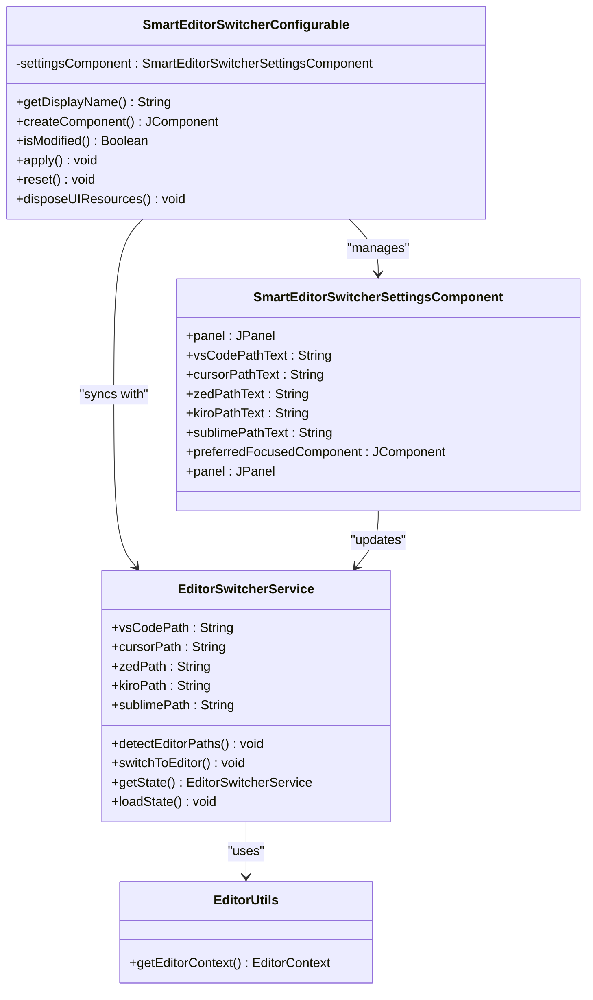
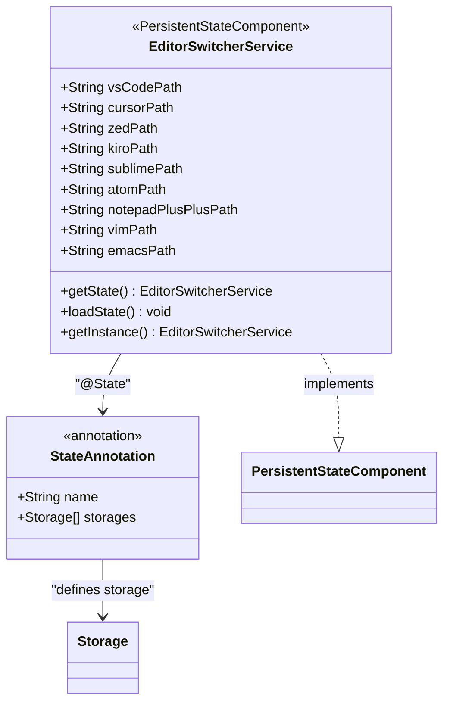
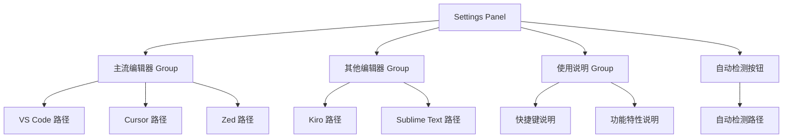
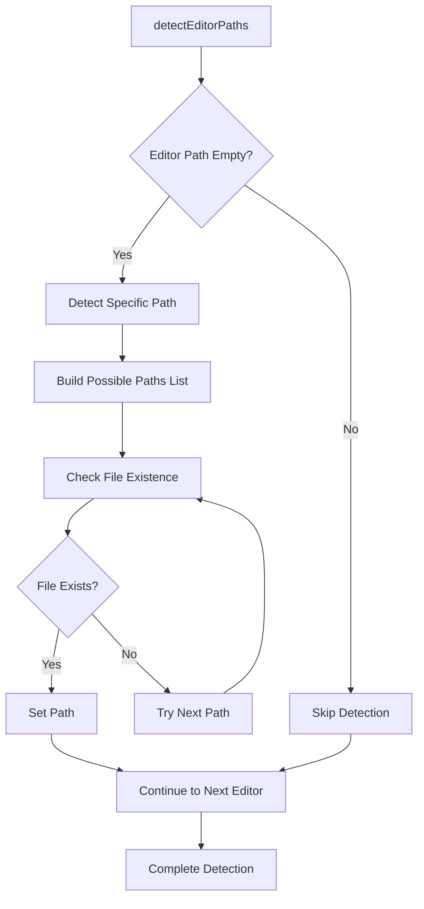
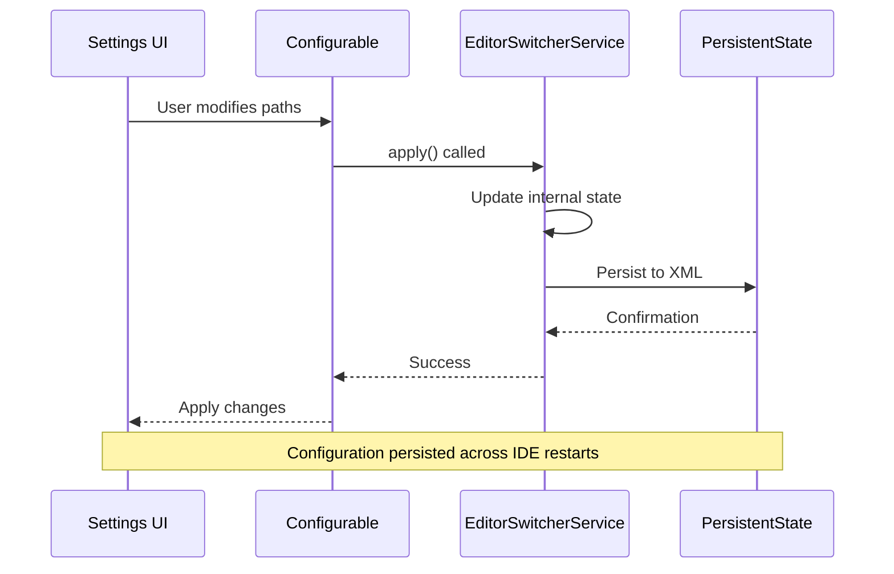

# Configuration Management

<cite>
**Referenced Files in This Document**
- [SmartEditorSwitcherConfigurable.kt](file://src/main/kotlin/io/yanxxcloud/editorswitcher/settings/SmartEditorSwitcherConfigurable.kt)
- [SmartEditorSwitcherSettingsComponent.kt](file://src/main/kotlin/io/yanxxcloud/editorswitcher/settings/SmartEditorSwitcherSettingsComponent.kt)
- [EditorSwitcherService.kt](file://src/main/kotlin/io/yanxxcloud/editorswitcher/services/EditorSwitcherService.kt)
- [EditorUtils.kt](file://src/main/kotlin/io/yanxxcloud/editorswitcher/utils/EditorUtils.kt)
- [plugin.xml](file://src/main/resources/META-INF/plugin.xml)
- [EditorSwitcherConfigAction.kt](file://src/main/kotlin/com/example/editorswitcher/actions/EditorSwitcherConfigAction.kt)
- [EditorSwitcherStatusBarWidget.kt](file://src/main/kotlin/io/yanxxcloud/editorswitcher/ui/EditorSwitcherStatusBarWidget.kt)
- [EditorSwitcherStatusBarWidgetFactory.kt](file://src/main/kotlin/io/yanxxcloud/editorswitcher/ui/EditorSwitcherStatusBarWidgetFactory.kt)
- [EditorSwitcherActionGroup.kt](file://src/main/kotlin/io/yanxxcloud/editorswitcher/ui/EditorSwitcherActionGroup.kt)
</cite>

## Table of Contents
1. [Introduction](#introduction)
2. [Configuration Architecture Overview](#configuration-architecture-overview)
3. [PersistentStateComponent Implementation](#persistentstatecomponent-implementation)
4. [Settings Panel UI Implementation](#settings-panel-ui-implementation)
5. [Data Model and Validation](#data-model-and-validation)
6. [Auto-Detection Mechanism](#auto-detection-mechanism)
7. [Service Layer Integration](#service-layer-integration)
8. [User Experience Design](#user-experience-design)
9. [Platform-Specific Configuration](#platform-specific-configuration)
10. [Troubleshooting Guide](#troubleshooting-guide)
11. [Best Practices](#best-practices)
12. [Conclusion](#conclusion)

## Introduction

The Smart Editor Switcher plugin implements a sophisticated configuration management system built on IntelliJ Platform's PersistentStateComponent pattern. This system enables users to define and manage executable paths for multiple code editors while providing intelligent auto-detection capabilities and robust validation mechanisms. The configuration system seamlessly integrates with IntelliJ IDEA's settings framework, offering both programmatic access through the service layer and user-friendly GUI components.

The configuration architecture follows a layered approach where the UI layer (SmartEditorSwitcherSettingsComponent) manages user interactions, the service layer (EditorSwitcherService) handles business logic and persistence, and the data model ensures type safety and validation. This design provides excellent separation of concerns while maintaining data consistency across IDE sessions.

## Configuration Architecture Overview

The configuration system is built around two primary components that work together to provide a seamless user experience:



**Diagram sources**
- [SmartEditorSwitcherConfigurable.kt](file://src/main/kotlin/io/yanxxcloud/editorswitcher/settings/SmartEditorSwitcherConfigurable.kt#L7-L55)
- [SmartEditorSwitcherSettingsComponent.kt](file://src/main/kotlin/io/yanxxcloud/editorswitcher/settings/SmartEditorSwitcherSettingsComponent.kt#L11-L164)
- [EditorSwitcherService.kt](file://src/main/kotlin/io/yanxxcloud/editorswitcher/services/EditorSwitcherService.kt#L12-L267)
- [EditorUtils.kt](file://src/main/kotlin/io/yanxxcloud/editorswitcher/utils/EditorUtils.kt#L7-L44)

The architecture implements a three-tier configuration model:

1. **Presentation Layer**: Handles user interface interactions and form validation
2. **Service Layer**: Manages business logic, persistence, and auto-detection
3. **Data Layer**: Provides persistent storage through IntelliJ's state management

**Section sources**
- [SmartEditorSwitcherConfigurable.kt](file://src/main/kotlin/io/yanxxcloud/editorswitcher/settings/SmartEditorSwitcherConfigurable.kt#L7-L55)
- [SmartEditorSwitcherSettingsComponent.kt](file://src/main/kotlin/io/yanxxcloud/editorswitcher/settings/SmartEditorSwitcherSettingsComponent.kt#L11-L164)
- [EditorSwitcherService.kt](file://src/main/kotlin/io/yanxxcloud/editorswitcher/services/EditorSwitcherService.kt#L12-L267)

## PersistentStateComponent Implementation

The configuration system leverages IntelliJ Platform's PersistentStateComponent pattern to ensure settings persist across IDE restarts. The EditorSwitcherService class serves as the primary state management component:



**Diagram sources**
- [EditorSwitcherService.kt](file://src/main/kotlin/io/yanxxcloud/editorswitcher/services/EditorSwitcherService.kt#L12-L267)

The service defines nine editor paths with empty string defaults, ensuring graceful degradation when paths are not configured. The state management follows IntelliJ's serialization patterns, storing configurations in the `SmartEditorSwitcher.xml` file within the IDE's configuration directory.

**Section sources**
- [EditorSwitcherService.kt](file://src/main/kotlin/io/yanxxcloud/editorswitcher/services/EditorSwitcherService.kt#L12-L267)

## Settings Panel UI Implementation

The SmartEditorSwitcherSettingsComponent creates a comprehensive user interface for configuring editor paths through IntelliJ's DSL builder framework. The UI provides dedicated input fields for each supported editor with intuitive labeling and helpful tooltips.

### Form Layout and Organization

The settings panel organizes editors into logical groups:



**Diagram sources**
- [SmartEditorSwitcherSettingsComponent.kt](file://src/main/kotlin/io/yanxxcloud/editorswitcher/settings/SmartEditorSwitcherSettingsComponent.kt#L110-L164)

### Input Field Implementation

Each editor path field utilizes TextFieldWithBrowseButton components that provide:

- **File Browser Integration**: Click-to-browse functionality with platform-appropriate file choosers
- **Real-time Validation**: Immediate feedback on path validity
- **Placeholder Text**: Clear indication of expected input format
- **Focus Management**: Logical tab order and initial focus placement

The browse functionality uses FileChooserDescriptor with specific configurations for each editor type, ensuring users select appropriate executable files rather than directories.

**Section sources**
- [SmartEditorSwitcherSettingsComponent.kt](file://src/main/kotlin/io/yanxxcloud/editorswitcher/settings/SmartEditorSwitcherSettingsComponent.kt#L110-L164)

## Data Model and Validation

The configuration system implements a robust data model with comprehensive validation rules and error handling mechanisms.

### Configuration State Model

```mermaid
erDiagram
EditorSwitcherService {
string vsCodePath
string cursorPath
string zedPath
string kiroPath
string sublimePath
string atomPath
string notepadPlusPlusPath
string vimPath
string emacsPath
}
SmartEditorSwitcherSettingsComponent {
TextFieldWithBrowseButton vsCodePathField
TextFieldWithBrowseButton cursorPathField
TextFieldWithBrowseButton zedPathField
TextFieldWithBrowseButton kiroPathField
TextFieldWithBrowseButton sublimePathField
}
EditorUtils {
EditorContext project
EditorContext file
EditorContext filePath
EditorContext projectPath
int line
int column
}
EditorSwitcherService ||--|| SmartEditorSwitcherSettingsComponent : "synchronizes with"
EditorUtils --> EditorSwitcherService : "provides context"
```

**Diagram sources**
- [EditorSwitcherService.kt](file://src/main/kotlin/io/yanxxcloud/editorswitcher/services/EditorSwitcherService.kt#L12-L267)
- [SmartEditorSwitcherSettingsComponent.kt](file://src/main/kotlin/io/yanxxcloud/editorswitcher/settings/SmartEditorSwitcherSettingsComponent.kt#L11-L164)
- [EditorUtils.kt](file://src/main/kotlin/io/yanxxcloud/editorswitcher/utils/EditorUtils.kt#L7-L44)

### Validation Rules

The system implements multiple validation layers:

1. **Path Existence Validation**: Checks if specified executables exist on the filesystem
2. **Permission Validation**: Verifies executable permissions
3. **Format Validation**: Ensures proper path formatting for different operating systems
4. **Fallback Mechanism**: Graceful handling of missing or invalid paths

### Error Handling Strategy

The configuration system employs a multi-tier error handling approach:

- **UI-Level Validation**: Real-time feedback during user input
- **Service-Level Validation**: Business logic validation before execution
- **Runtime Error Handling**: Graceful degradation when paths become invalid
- **Logging Integration**: Comprehensive logging for troubleshooting

**Section sources**
- [EditorSwitcherService.kt](file://src/main/kotlin/io/yanxxcloud/editorswitcher/services/EditorSwitcherService.kt#L40-L85)
- [EditorUtils.kt](file://src/main/kotlin/io/yanxxcloud/editorswitcher/utils/EditorUtils.kt#L7-L44)

## Auto-Detection Mechanism

The auto-detection system provides intelligent path discovery across multiple platforms and installation scenarios.

### Detection Algorithm



**Diagram sources**
- [EditorSwitcherService.kt](file://src/main/kotlin/io/yanxxcloud/editorswitcher/services/EditorSwitcherService.kt#L170-L267)

### Platform-Specific Path Discovery

The detection system accounts for platform differences in executable locations:

| Editor | macOS Path | Linux Path | Windows Path |
|--------|------------|------------|--------------|
| VS Code | `/Applications/Visual Studio Code.app/Contents/Resources/app/bin/code` | `/usr/local/bin/code` | `C:\Program Files\Microsoft VS Code\bin\code.cmd` |
| Cursor | `/Applications/Cursor.app/Contents/Resources/app/bin/cursor` | `/usr/local/bin/cursor` | `C:\Program Files\Cursor\Cursor.exe` |
| Zed | `/Applications/Zed.app/Contents/MacOS/zed` | `/usr/local/bin/zed` | `C:\Program Files\Zed\zed.exe` |
| Kiro | `/Applications/Kiro.app/Contents/MacOS/Kiro` | `/usr/local/bin/kiro` | `C:\Program Files\Kiro\Kiro.exe` |
| Sublime | `/Applications/Sublime Text.app/Contents/SharedSupport/bin/subl` | `/usr/local/bin/subl` | `C:\Program Files\Sublime Text\subl.exe` |

### Detection Priority and Fallbacks

The auto-detection algorithm follows a priority-based approach:

1. **Standard Installation Locations**: Primary paths for each platform
2. **Alternative Installation Locations**: Secondary paths for common alternative installations
3. **Environment Variables**: Paths discovered through system PATH
4. **Empty String Fallback**: Graceful handling when no suitable path is found

**Section sources**
- [EditorSwitcherService.kt](file://src/main/kotlin/io/yanxxcloud/editorswitcher/services/EditorSwitcherService.kt#L170-L267)

## Service Layer Integration

The service layer provides the core functionality for configuration management and editor switching operations.

### Configuration Synchronization



**Diagram sources**
- [SmartEditorSwitcherConfigurable.kt](file://src/main/kotlin/io/yanxxcloud/editorswitcher/settings/SmartEditorSwitcherConfigurable.kt#L25-L45)
- [EditorSwitcherService.kt](file://src/main/kotlin/io/yanxxcloud/editorswitcher/services/EditorSwitcherService.kt#L12-L267)

### Service Access Pattern

The service implements a singleton pattern with IntelliJ's service management system, ensuring thread-safe access across the IDE:

- **Instance Retrieval**: `EditorSwitcherService.getInstance()` provides centralized access
- **State Management**: Automatic persistence through PersistentStateComponent
- **Lifecycle Management**: Proper initialization and cleanup through IntelliJ's lifecycle

### Editor Switching Integration

The service coordinates with the UI components to provide seamless editor switching:

- **Context Extraction**: Uses EditorUtils to gather current file and project context
- **Command Construction**: Builds platform-appropriate command lines for each editor
- **Process Execution**: Launches external editors with proper argument passing
- **Error Reporting**: Comprehensive logging for troubleshooting

**Section sources**
- [EditorSwitcherService.kt](file://src/main/kotlin/io/yanxxcloud/editorswitcher/services/EditorSwitcherService.kt#L12-L267)
- [EditorUtils.kt](file://src/main/kotlin/io/yanxxcloud/editorswitcher/utils/EditorUtils.kt#L7-L44)

## User Experience Design

The configuration system prioritizes usability through thoughtful UI design and intuitive interaction patterns.

### Form Layout Principles

The settings panel follows established UI design principles:

- **Logical Grouping**: Related editors are grouped together for easy navigation
- **Consistent Labeling**: Standardized naming conventions across all input fields
- **Helpful Comments**: Descriptive tooltips explain the purpose of each field
- **Visual Hierarchy**: Important information is emphasized through typography and spacing

### Real-time Feedback Mechanisms

The system provides immediate feedback through:

- **Instant Validation**: Path validation occurs as users type or select files
- **Visual Indicators**: Clear visual cues for valid and invalid configurations
- **Error Messages**: Helpful error messages guide users toward correct solutions
- **Progress Indication**: Auto-detection provides visual feedback during path discovery

### Accessibility Considerations

The UI design incorporates accessibility best practices:

- **Keyboard Navigation**: Full keyboard support for all interactive elements
- **Screen Reader Compatibility**: Proper labeling and semantic markup
- **High Contrast Support**: Visual design works with various display settings
- **Focus Management**: Logical focus order and clear focus indicators

**Section sources**
- [SmartEditorSwitcherSettingsComponent.kt](file://src/main/kotlin/io/yanxxcloud/editorswitcher/settings/SmartEditorSwitcherSettingsComponent.kt#L110-L164)

## Platform-Specific Configuration

The configuration system handles the complexities of cross-platform development through careful path management and platform-specific adaptations.

### Operating System Adaptations

```mermaid
flowchart TD
A[Path Configuration] --> B{Operating System}
B --> |macOS| C[Bundle Executables]
B --> |Linux| D[Standard Binaries]
B --> |Windows| E[Executable Files]
C --> F[.app Bundle Structure]
D --> G[PATH Environment Variable]
E --> H[Registry Locations]
F --> I[Contents/MacOS/executable]
G --> J[/usr/local/bin/executable]
H --> K[C:\Program Files\Editor\executable.exe]
```

**Diagram sources**
- [EditorSwitcherService.kt](file://src/main/kotlin/io/yanxxcloud/editorswitcher/services/EditorSwitcherService.kt#L170-L267)

### Cross-Platform Path Handling

The system addresses platform-specific challenges:

- **Path Separators**: Automatic conversion between forward and backward slashes
- **Executable Extensions**: Platform-appropriate file extensions (.exe, .app, etc.)
- **Home Directory References**: Proper expansion of ~ and %USERPROFILE% tokens
- **Case Sensitivity**: Consistent handling across case-sensitive and insensitive filesystems

### Installation Location Variations

Different platforms and installation methods require specialized handling:

- **Package Managers**: Homebrew, apt, yum, chocolatey, etc.
- **Portable Installations**: Self-contained applications without system-wide installation
- **Development Installations**: Source-built or custom-compiled versions
- **Enterprise Deployments**: Corporate-managed installations with custom paths

**Section sources**
- [EditorSwitcherService.kt](file://src/main/kotlin/io/yanxxcloud/editorswitcher/services/EditorSwitcherService.kt#L170-L267)

## Troubleshooting Guide

This section addresses common configuration issues and provides systematic approaches to resolution.

### Common Configuration Issues

| Issue | Symptoms | Solution |
|-------|----------|----------|
| Permission Denied | Cannot execute editor | Check file permissions, run as administrator (Windows) |
| Incorrect Binary Location | Editor launches but doesn't open files | Verify executable path, check for symbolic links |
| Auto-detection Failure | Paths remain empty after detection | Manually specify paths, check installation locations |
| Path Not Found | Editor selection unavailable | Verify path exists, check for typos |
| Invalid Arguments | Editor opens but ignores file arguments | Review command construction for each editor |

### Diagnostic Procedures

1. **Path Verification**: Confirm executable exists at specified location
2. **Permission Checking**: Verify execute permissions on target binaries
3. **Command Line Testing**: Test commands manually in terminal
4. **Log Analysis**: Review IntelliJ logs for detailed error information
5. **Environment Inspection**: Check PATH variables and environment settings

### Recovery Strategies

When configuration becomes corrupted or invalid:

- **Reset to Defaults**: Clear all paths and re-run auto-detection
- **Manual Restoration**: Restore from backup configuration files
- **Fresh Installation**: Reinstall problematic editors and reconfigure
- **Plugin Reset**: Disable and re-enable the plugin to clear cached state

**Section sources**
- [EditorSwitcherService.kt](file://src/main/kotlin/io/yanxxcloud/editorswitcher/services/EditorSwitcherService.kt#L40-L85)

## Best Practices

Effective configuration management requires adherence to established patterns and preventive measures.

### Setting Correct Executable Paths

Follow these guidelines for optimal configuration:

- **Use Absolute Paths**: Avoid relative paths that may break across sessions
- **Verify Executability**: Test paths manually before saving configurations
- **Consider Aliases**: Use shell aliases or symlinks for frequently accessed editors
- **Document Custom Locations**: Keep notes on non-standard installation paths
- **Regular Validation**: Periodically verify path validity after system updates

### Maintenance Recommendations

- **Update Regularly**: Check for new editor versions and update paths accordingly
- **Backup Configuration**: Export settings periodically to prevent data loss
- **Monitor Performance**: Watch for slow response times indicating path issues
- **Security Considerations**: Ensure executable paths haven't been compromised
- **Cross-Platform Testing**: Verify configurations work across different machines

### Development Guidelines

For developers extending the configuration system:

- **Follow Naming Conventions**: Use consistent naming for new editor types
- **Implement Validation**: Add appropriate validation for new path types
- **Maintain Backward Compatibility**: Ensure new features don't break existing configurations
- **Document Assumptions**: Clearly document platform-specific requirements
- **Test Thoroughly**: Validate configurations across multiple environments

## Conclusion

The Smart Editor Switcher's configuration management system demonstrates sophisticated engineering principles applied to IDE plugin development. Through careful implementation of IntelliJ Platform patterns, the system provides reliable persistence, intuitive user interfaces, and robust error handling.

The architecture successfully balances user experience with technical complexity, offering both manual configuration options and intelligent auto-detection capabilities. The modular design ensures maintainability while the comprehensive validation system prevents common configuration errors.

Key strengths of the implementation include:

- **Seamless Persistence**: Automatic state management through PersistentStateComponent
- **Intuitive UI**: Well-designed forms with real-time feedback
- **Cross-Platform Support**: Comprehensive path detection across operating systems
- **Graceful Degradation**: Robust fallback mechanisms for missing configurations
- **Extensible Design**: Clean separation of concerns enabling easy feature additions

The configuration system serves as an excellent example of how to leverage IntelliJ Platform capabilities to create powerful, user-friendly functionality that enhances developer productivity while maintaining reliability and maintainability.