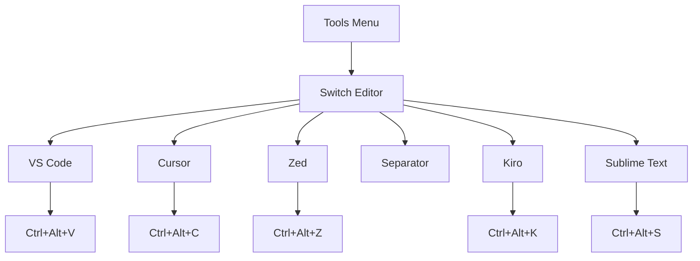
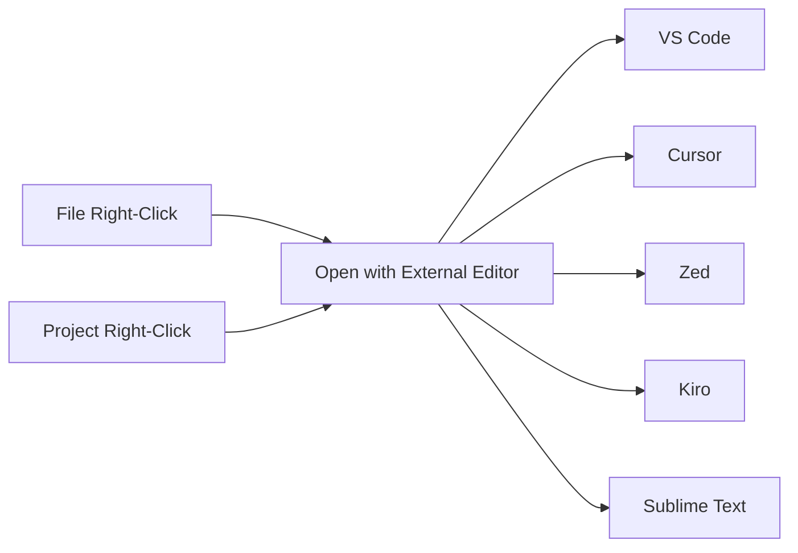
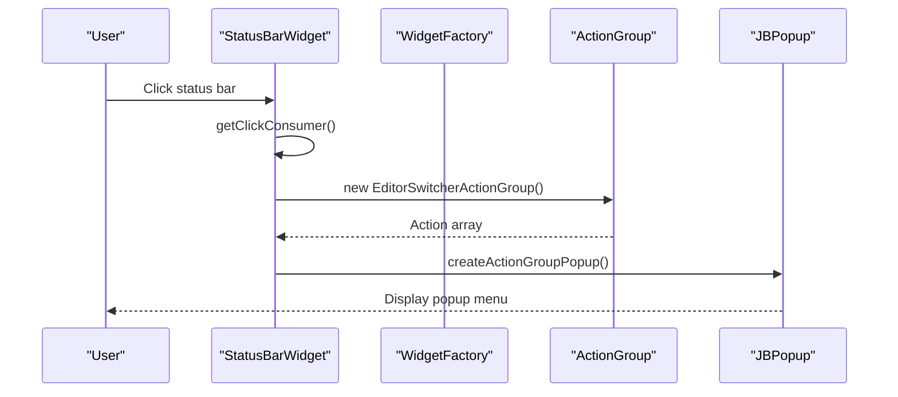

# Access Methods

<cite>
**Referenced Files in This Document**
- [plugin.xml](file://src/main/resources/META-INF/plugin.xml)
- [EditorSwitcherActionGroup.kt](file://src/main/kotlin/io/yanxxcloud/editorswitcher/ui/EditorSwitcherActionGroup.kt)
- [EditorSwitcherStatusBarWidget.kt](file://src/main/kotlin/io/yanxxcloud/editorswitcher/ui/EditorSwitcherStatusBarWidget.kt)
- [EditorSwitcherStatusBarWidgetFactory.kt](file://src/main/kotlin/io/yanxxcloud/editorswitcher/ui/EditorSwitcherStatusBarWidgetFactory.kt)
- [SwitchToVSCodeAction.kt](file://src/main/kotlin/io/yanxxcloud/editorswitcher/actions/SwitchToVSCodeAction.kt)
- [SwitchToCursorAction.kt](file://src/main/kotlin/io/yanxxcloud/editorswitcher/actions/SwitchToCursorAction.kt)
- [SwitchToZedAction.kt](file://src/main/kotlin/io/yanxxcloud/editorswitcher/actions/SwitchToZedAction.kt)
- [SwitchToKiroAction.kt](file://src/main/kotlin/io/yanxxcloud/editorswitcher/actions/SwitchToKiroAction.kt)
- [SwitchToSublimeAction.kt](file://src/main/kotlin/io/yanxxcloud/editorswitcher/actions/SwitchToSublimeAction.kt)
- [EditorSwitcherService.kt](file://src/main/kotlin/io/yanxxcloud/editorswitcher/services/EditorSwitcherService.kt)
- [EditorUtils.kt](file://src/main/kotlin/io/yanxxcloud/editorswitcher/utils/EditorUtils.kt)
- [SmartEditorSwitcherConfigurable.kt](file://src/main/kotlin/io/yanxxcloud/editorswitcher/settings/SmartEditorSwitcherConfigurable.kt)
- [SmartEditorSwitcherSettingsComponent.kt](file://src/main/kotlin/io/yanxxcloud/editorswitcher/settings/SmartEditorSwitcherSettingsComponent.kt)
</cite>

## Table of Contents
1. [Introduction](#introduction)
2. [Keyboard Shortcuts](#keyboard-shortcuts)
3. [Tools Menu Integration](#tools-menu-integration)
4. [Right-Click Context Menu](#right-click-context-menu)
5. [Status Bar Widget](#status-bar-widget)
6. [EditorSwitcherActionGroup Architecture](#editorswitcheractiongroup-architecture)
7. [Plugin.xml Configuration](#pluginxml-configuration)
8. [Accessibility Considerations](#accessibility-considerations)
9. [Customization Options](#customization-options)
10. [Troubleshooting Guide](#troubleshooting-guide)
11. [Conclusion](#conclusion)

## Introduction

The Smart Editor Switcher plugin provides multiple intuitive access methods for seamless switching between JetBrains IDEs and external editors. Users can trigger editor switching through keyboard shortcuts, the Tools menu, right-click context menus, or the status bar widget. This comprehensive access system ensures flexibility and accessibility for different workflow preferences.

The plugin supports nine major editors including VS Code, Cursor, Zed, Kiro, Sublime Text, Atom, Notepad++, Vim, and Emacs, each accessible through dedicated action classes that integrate seamlessly with IntelliJ Platform's action system.

## Keyboard Shortcuts

The plugin defines five primary keyboard shortcuts for quick editor switching, each mapped to specific actions in the plugin.xml configuration.

### Available Keyboard Shortcuts

| Shortcut | Target Editor | Action ID |
|----------|---------------|-----------|
| `Ctrl+Alt+V` | VS Code | `SmartEditorSwitcher.SwitchToVSCode` |
| `Ctrl+Alt+C` | Cursor | `SmartEditorSwitcher.SwitchToCursor` |
| `Ctrl+Alt+Z` | Zed | `SmartEditorSwitcher.SwitchToZed` |
| `Ctrl+Alt+K` | Kiro | `SmartEditorSwitcher.SwitchToKiro` |
| `Ctrl+Alt+S` | Sublime Text | `SmartEditorSwitcher.SwitchToSublime` |

### Implementation Details

Each keyboard shortcut is defined in the plugin.xml file using the `<keyboard-shortcut>` element within the corresponding action definition. The shortcuts utilize the default keymap (`$default`) and combine `Ctrl` and `Alt` modifiers with single letters representing each editor.

The action classes inherit from `AnAction` and implement the `actionPerformed()` method to handle the actual editor switching logic. Each action retrieves the current editor context using `EditorUtils.getEditorContext()` and delegates to the `EditorSwitcherService` for the actual switching operation.

**Section sources**
- [plugin.xml](file://src/main/resources/META-INF/plugin.xml#L47-L82)
- [SwitchToVSCodeAction.kt](file://src/main/kotlin/io/yanxxcloud/editorswitcher/actions/SwitchToVSCodeAction.kt#L10-L45)
- [EditorUtils.kt](file://src/main/kotlin/io/yanxxcloud/editorswitcher/utils/EditorUtils.kt#L15-L44)

## Tools Menu Integration

The plugin integrates with the IntelliJ IDEA Tools menu through a hierarchical action group structure. The main group appears under the Tools menu with the text "Switch Editor" and serves as a centralized hub for all editor switching operations.

### Menu Structure

**Diagram sources**
- [plugin.xml](file://src/main/resources/META-INF/plugin.xml#L47-L82)
- [EditorSwitcherActionGroup.kt](file://src/main/kotlin/io/yanxxcloud/editorswitcher/ui/EditorSwitcherActionGroup.kt#L8-L35)

### Group Configuration

The action group is configured in plugin.xml with the ID `SmartEditorSwitcher.MainGroup` and added to the ToolsMenu group with `anchor="last"` to place it at the end of the menu. This ensures easy access while maintaining menu organization.

**Section sources**
- [plugin.xml](file://src/main/resources/META-INF/plugin.xml#L42-L46)

## Right-Click Context Menu

The plugin provides right-click context menu integration for both file and project view contexts, enabling quick editor switching directly from the file explorer.

### Context Menu Integration Points

The plugin registers two groups for context menu integration:
- `EditorPopupMenu` - For individual file right-click actions
- `ProjectViewPopupMenu` - For project-level right-click actions

### Menu Organization

Both context menus include the same set of editor switching options arranged in the same order as the Tools menu. This consistency ensures predictable user experience across different interface elements.

**Diagram sources**
- [plugin.xml](file://src/main/resources/META-INF/plugin.xml#L84-L92)

**Section sources**
- [plugin.xml](file://src/main/resources/META-INF/plugin.xml#L84-L92)

## Status Bar Widget

The status bar widget provides the most convenient access method, allowing users to click a compact icon to open a popup menu with all available editor options.

### Widget Architecture

The status bar widget consists of three main components:

1. **EditorSwitcherStatusBarWidgetFactory** - Creates and manages widget instances
2. **EditorSwitcherStatusBarWidget** - Handles UI presentation and user interactions
3. **EditorSwitcherActionGroup** - Provides the popup menu structure

### Widget Implementation

The widget inherits from `EditorBasedWidget` and implements `StatusBarWidget.MultipleTextValuesPresentation` to provide dynamic text content. It displays "编辑器切换" (Editor Switcher) as the selected value and "点击切换编辑器" (Click to switch editor) as the tooltip.

### Popup Menu Creation

When users click the status bar widget, it creates a popup menu using `JBPopupFactory`. The popup is populated with the `EditorSwitcherActionGroup` containing all available editor actions.

**Diagram sources**
- [EditorSwitcherStatusBarWidget.kt](file://src/main/kotlin/io/yanxxcloud/editorswitcher/ui/EditorSwitcherStatusBarWidget.kt#L25-L45)
- [EditorSwitcherActionGroup.kt](file://src/main/kotlin/io/yanxxcloud/editorswitcher/ui/EditorSwitcherActionGroup.kt#L8-L35)

### Event Handling

The widget handles mouse clicks through the `getClickConsumer()` method, which creates and displays the popup menu in the best position for the current context.

**Section sources**
- [EditorSwitcherStatusBarWidget.kt](file://src/main/kotlin/io/yanxxcloud/editorswitcher/ui/EditorSwitcherStatusBarWidget.kt#L10-L55)
- [EditorSwitcherStatusBarWidgetFactory.kt](file://src/main/kotlin/io/yanxxcloud/editorswitcher/ui/EditorSwitcherStatusBarWidgetFactory.kt#L8-L24)

## EditorSwitcherActionGroup Architecture

The `EditorSwitcherActionGroup` serves as the central coordinator for organizing menu entries and providing a unified interface for accessing all editor switching actions.

### Action Group Structure

The action group creates and configures individual action instances with appropriate presentation text and descriptions. Each action represents a specific editor and is instantiated dynamically when the group's `getChildren()` method is called.

### Action Configuration

Each action in the group receives customized presentation data:
- **VS Code**: "📘 VS Code" with description "切换到 VS Code"
- **Cursor**: "🎯 Cursor" with description "切换到 Cursor"
- **Zed**: "⚡ Zed" with description "切换到 Zed"
- **Kiro**: "🚀 Kiro" with description "切换到 Kiro 编辑器"
- **Sublime Text**: "🎨 Sublime Text" with description "切换到 Sublime Text"

### Separator Implementation

The group includes a separator between the main editors and the additional editors to visually organize the menu structure.

**Section sources**
- [EditorSwitcherActionGroup.kt](file://src/main/kotlin/io/yanxxcloud/editorswitcher/ui/EditorSwitcherActionGroup.kt#L8-L35)

## Plugin.xml Configuration

The plugin.xml file serves as the central configuration hub for defining all access methods, actions, and UI components.

### Action Definitions

Each editor switching action is defined with specific attributes:
- **ID**: Unique identifier for the action
- **Class**: Fully qualified class name implementing the action
- **Text**: Display text shown in menus
- **Description**: Tooltip and help text
- **Keyboard shortcuts**: Keystroke combinations

### Extension Points

The plugin registers several extension points:
- **Application Configurable**: Integrates with Settings/Tools
- **Application Service**: Registers the main service component
- **Status Bar Widget Factory**: Enables status bar integration

### Group References

The context menu group references the main action group using the `<reference>` element, ensuring consistent behavior across different UI contexts.

**Section sources**
- [plugin.xml](file://src/main/resources/META-INF/plugin.xml#L47-L92)

## Accessibility Considerations

The plugin incorporates several accessibility features to ensure usability for all users:

### Keyboard Navigation
- Full keyboard shortcut support for all actions
- Logical tab order in configuration dialogs
- Screen reader compatibility through proper labeling

### Visual Design
- Clear iconography with descriptive text
- Consistent visual hierarchy across all UI elements
- Proper contrast ratios for text and icons

### Error Handling
- Descriptive error messages for missing editor paths
- Graceful degradation when editors are not available
- User-friendly dialog presentations

### Configuration Accessibility
The settings component provides accessible form controls with proper labeling and validation feedback.

## Customization Options

### Keyboard Shortcut Rebinding
Users can customize keyboard shortcuts through IntelliJ's standard keymap configuration system. The plugin registers its shortcuts in the default keymap, allowing users to redefine them according to their preferences.

### Status Bar Widget Visibility
While the status bar widget cannot be disabled through the plugin's settings, users can hide it by removing the widget from their status bar configuration in IntelliJ IDEA's appearance settings.

### Editor Path Configuration
Users can manually configure editor paths through the Settings/Tools interface or use the automatic detection feature to locate installed editors.

### Custom Editor Support
Advanced users can extend the plugin by adding new editor types through the `EditorType` enum and corresponding action classes.

**Section sources**
- [SmartEditorSwitcherSettingsComponent.kt](file://src/main/kotlin/io/yanxxcloud/editorswitcher/settings/SmartEditorSwitcherSettingsComponent.kt#L140-L164)

## Troubleshooting Guide

### Missing Menu Items

**Symptoms**: Editor switching options not appearing in Tools menu or context menus
**Causes**: 
- Plugin not properly installed or enabled
- Corrupted plugin.xml configuration
- IDE cache issues

**Solutions**:
1. Verify plugin installation in Settings → Plugins
2. Restart IDE to refresh menu caches
3. Check plugin logs for errors
4. Reinstall the plugin if necessary

### Non-Responsive UI Elements

**Symptoms**: Status bar widget not responding to clicks, keyboard shortcuts not working
**Causes**:
- Conflicting keyboard shortcuts
- Disabled plugin functionality
- Insufficient permissions

**Solutions**:
1. Check keymap conflicts in Settings → Keymap
2. Verify plugin is enabled in Settings → Plugins
3. Run IDE as administrator if permission-related
4. Reset keymap to defaults if conflicts detected

### Editor Path Issues

**Symptoms**: "Editor path not configured" errors despite having the editor installed
**Causes**:
- Incorrect path configuration
- Automatic detection failure
- Editor not in standard installation location

**Solutions**:
1. Manually configure the correct editor path
2. Use the "自动检测路径" (Auto Detect Paths) button
3. Verify editor executable permissions
4. Check editor installation location

### Performance Issues

**Symptoms**: Slow response when switching editors
**Causes**:
- Large project files
- Network-mounted file systems
- Insufficient system resources

**Solutions**:
1. Close unnecessary projects
2. Move project to local storage
3. Increase IDE heap size
4. Optimize editor startup parameters

**Section sources**
- [EditorSwitcherService.kt](file://src/main/kotlin/io/yanxxcloud/editorswitcher/services/EditorSwitcherService.kt#L35-L50)
- [SmartEditorSwitcherConfigurable.kt](file://src/main/kotlin/io/yanxxcloud/editorswitcher/settings/SmartEditorSwitcherConfigurable.kt#L20-L55)

## Conclusion

The Smart Editor Switcher plugin provides a comprehensive and flexible access system that accommodates various user preferences and workflow patterns. Through its multi-modal approach combining keyboard shortcuts, menu integration, context menus, and status bar widgets, users can efficiently switch between editors without disrupting their development flow.

The plugin's architecture demonstrates excellent separation of concerns, with dedicated action classes handling specific editor integrations, a centralized action group managing menu organization, and robust service layer handling cross-platform compatibility and process management.

The extensive customization options and accessibility features ensure that the plugin remains usable across diverse development environments and user capabilities. The troubleshooting guide addresses common issues while the configuration system provides flexibility for advanced users.

This access method design serves as an excellent example of how to effectively integrate third-party applications with IDEs while maintaining usability, performance, and accessibility standards.