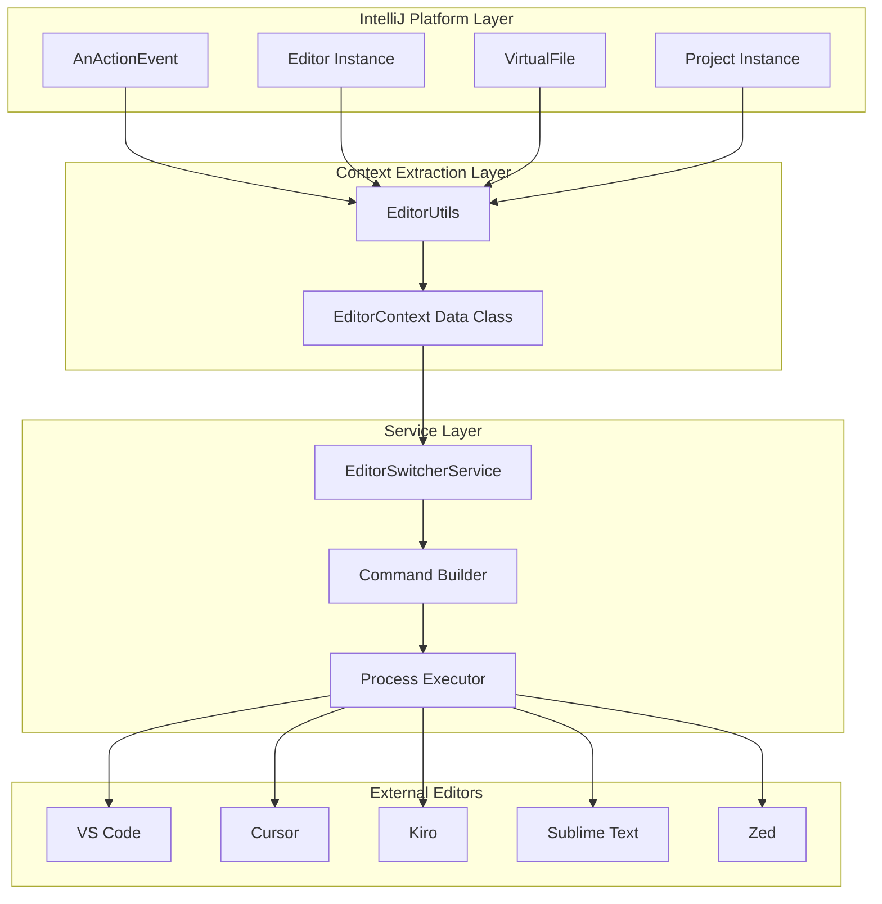
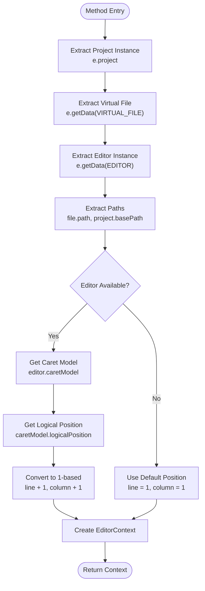
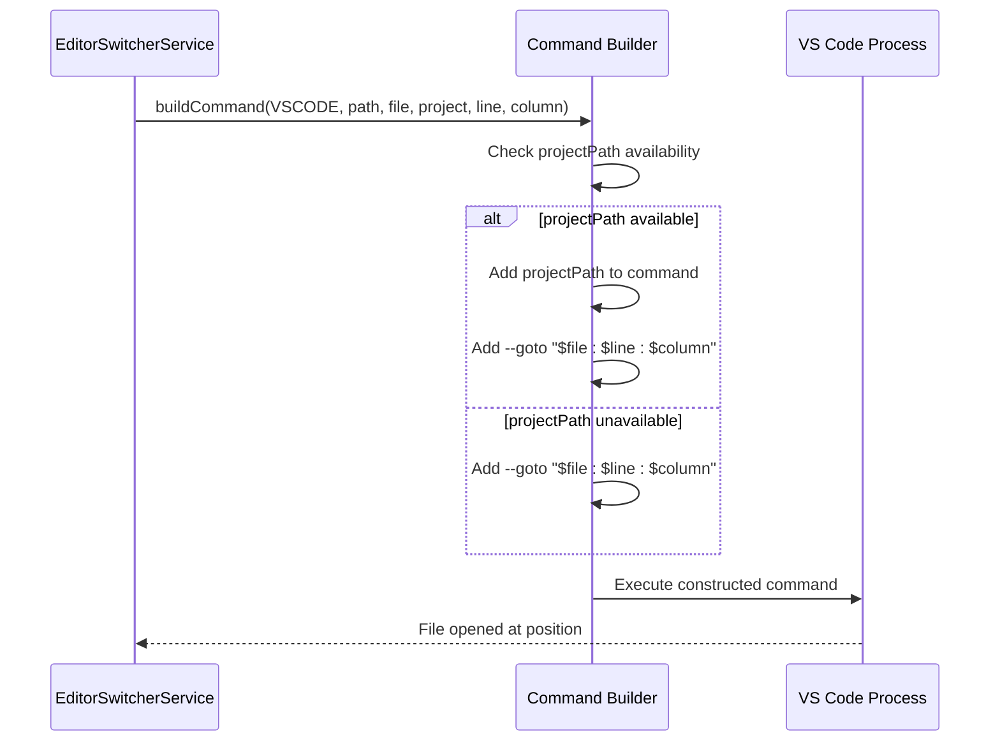
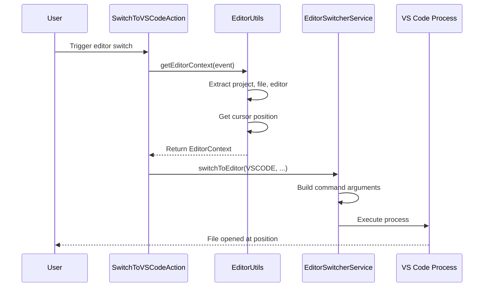

# Context Preservation

<cite>
**Referenced Files in This Document**
- [EditorUtils.kt](file://src/main/kotlin/io/yanxxcloud/editorswitcher/utils/EditorUtils.kt)
- [EditorSwitcherService.kt](file://src/main/kotlin/io/yanxxcloud/editorswitcher/services/EditorSwitcherService.kt)
- [SwitchToCursorAction.kt](file://src/main/kotlin/io/yanxxcloud/editorswitcher/actions/SwitchToCursorAction.kt)
- [SwitchToVSCodeAction.kt](file://src/main/kotlin/io/yanxxcloud/editorswitcher/actions/SwitchToVSCodeAction.kt)
- [SwitchToKiroAction.kt](file://src/main/kotlin/io/yanxxcloud/editorswitcher/actions/SwitchToKiroAction.kt)
- [SwitchToSublimeAction.kt](file://src/main/kotlin/io/yanxxcloud/editorswitcher/actions/SwitchToSublimeAction.kt)
- [SwitchToZedAction.kt](file://src/main/kotlin/io/yanxxcloud/editorswitcher/actions/SwitchToZedAction.kt)
- [plugin.xml](file://src/main/resources/META-INF/plugin.xml)
- [SmartEditorSwitcherConfigurable.kt](file://src/main/kotlin/io/yanxxcloud/editorswitcher/settings/SmartEditorSwitcherConfigurable.kt)
</cite>

## Table of Contents
1. [Introduction](#introduction)
2. [Context Preservation Architecture](#context-preservation-architecture)
3. [EditorUtils Core Functionality](#editorutils-core-functionality)
4. [Context Extraction Process](#context-extraction-process)
5. [Command-Line Argument Construction](#command-line-argument-construction)
6. [Edge Case Handling](#edge-case-handling)
7. [Performance Considerations](#performance-considerations)
8. [Troubleshooting Guide](#troubleshooting-guide)
9. [Integration Examples](#integration-examples)
10. [Conclusion](#conclusion)

## Introduction

The Smart Editor Switcher plugin implements sophisticated context preservation functionality that enables seamless transitions between JetBrains IDEs and external editors while maintaining precise cursor positions and project context. This system leverages IntelliJ Platform APIs to extract critical IDE context information and embed it into command-line arguments for accurate file and line navigation in target editors.

The context preservation system operates through a two-tier architecture: **EditorUtils** for context extraction and **EditorSwitcherService** for command construction and execution. This design ensures minimal UI thread blocking while providing robust error handling and edge case management.

## Context Preservation Architecture

The context preservation functionality follows a modular architecture designed for extensibility and reliability:



**Diagram sources**
- [EditorUtils.kt](file://src/main/kotlin/io/yanxxcloud/editorswitcher/utils/EditorUtils.kt#L1-L45)
- [EditorSwitcherService.kt](file://src/main/kotlin/io/yanxxcloud/editorswitcher/services/EditorSwitcherService.kt#L1-L268)

## EditorUtils Core Functionality

The EditorUtils object serves as the central component for context extraction, utilizing IntelliJ Platform APIs to gather essential IDE information:

### Data Structure Definition

The `EditorContext` data class encapsulates all critical context information:

| Field | Type | Description | Purpose |
|-------|------|-------------|---------|
| `project` | `Project?` | Current project instance | Provides project-level context |
| `file` | `VirtualFile?` | Current file being edited | References the active file |
| `filePath` | `String?` | Absolute file path | Enables file opening in external editors |
| `projectPath` | `String?` | Project base directory path | Maintains project context |
| `line` | `Int` | Current line number (1-based) | Precise cursor positioning |
| `column` | `Int` | Current column number (1-based) | Fine-grained cursor positioning |

### Context Extraction Method

The `getEditorContext()` method orchestrates the extraction process:



**Diagram sources**
- [EditorUtils.kt](file://src/main/kotlin/io/yanxxcloud/editorswitcher/utils/EditorUtils.kt#L18-L44)

**Section sources**
- [EditorUtils.kt](file://src/main/kotlin/io/yanxxcloud/editorswitcher/utils/EditorUtils.kt#L1-L45)

## Context Extraction Process

### IntelliJ Platform API Integration

The context extraction process leverages specific IntelliJ Platform APIs:

#### Project Context Retrieval
- **API**: `AnActionEvent.project`
- **Purpose**: Establishes the current project context for file resolution
- **Null Safety**: Handles scenarios where actions are performed outside projects

#### File Context Retrieval  
- **API**: `CommonDataKeys.VIRTUAL_FILE`
- **Purpose**: Obtains the currently edited file reference
- **VirtualFile Properties**: Provides path, type, and metadata access

#### Editor Context Retrieval
- **API**: `CommonDataKeys.EDITOR`
- **Purpose**: Accesses the active editor instance for cursor position
- **Capability**: Determines whether line/column navigation is supported

### Cursor Position Extraction

The most critical aspect of context preservation involves precise cursor position retrieval:

#### Logical Position Conversion
The system converts internal zero-based positions to human-friendly 1-based coordinates:

```kotlin
// Zero-based to 1-based conversion
val logicalPosition = caretModel.logicalPosition
Pair(logicalPosition.line + 1, logicalPosition.column + 1)
```

#### Edge Case Management
When no editor is available (e.g., in non-text files), the system defaults to position (1,1):

```kotlin
val (line, column) = if (editor != null) {
    val caretModel = editor.caretModel
    val logicalPosition = caretModel.logicalPosition
    Pair(logicalPosition.line + 1, logicalPosition.column + 1)
} else {
    Pair(1, 1)
}
```

**Section sources**
- [EditorUtils.kt](file://src/main/kotlin/io/yanxxcloud/editorswitcher/utils/EditorUtils.kt#L18-L44)

## Command-Line Argument Construction

The EditorSwitcherService constructs platform-specific command-line arguments for each supported editor type:

### Editor-Specific Command Patterns

Each editor type receives tailored command construction based on its argument parsing capabilities:

#### VS Code Command Construction


**Diagram sources**
- [EditorSwitcherService.kt](file://src/main/kotlin/io/yanxxcloud/editorswitcher/services/EditorSwitcherService.kt#L75-L85)

#### Kiro Command Construction
Kiro supports explicit line and column parameters:
- **Format**: `editorPath projectPath filePath --line line --column column`
- **Advantage**: Native support for precise positioning

#### Sublime Text Command Construction
- **Format**: `editorPath projectPath filePath:line:column`
- **Approach**: Single argument containing position information

#### Notepad++ Command Construction
- **Format**: `editorPath -nline -ccolumn file`
- **Parameters**: `-n` for line, `-c` for column

### Command Building Strategy

The command building process follows a consistent pattern across all editor types:

1. **Path Validation**: Ensures executable paths are available
2. **Parameter Ordering**: Maintains logical argument sequence
3. **Conditional Arguments**: Adds project context only when available
4. **Position Encoding**: Formats cursor position according to editor requirements

**Section sources**
- [EditorSwitcherService.kt](file://src/main/kotlin/io/yanxxcloud/editorswitcher/services/EditorSwitcherService.kt#L64-L267)

## Edge Case Handling

The context preservation system implements comprehensive edge case handling to ensure robust operation across diverse scenarios:

### Unsaved File Handling
When working with unsaved files, the system gracefully handles the absence of physical file paths:

#### Null File Path Management
- **Detection**: Checks `file?.path` for null values
- **Fallback**: Uses empty string for unsupported editors
- **Validation**: Prevents null pointer exceptions in command construction

### Non-Text File Support
For non-text files (binary, images, etc.) where cursor positioning isn't applicable:

#### Editor Availability Check
```kotlin
val (line, column) = if (editor != null) {
    // Extract cursor position
} else {
    // Default to safe position
    Pair(1, 1)
}
```

#### Graceful Degradation
- **Default Position**: Sets cursor to line 1, column 1
- **Context Preservation**: Maintains file and project context
- **User Feedback**: Provides clear error messages for configuration issues

### Missing Editor Paths
The system implements automatic detection and manual configuration fallback:

#### Automatic Path Detection
- **Platform-Specific Paths**: Searches common installation locations
- **Cross-Platform Support**: Handles Windows, macOS, and Linux paths
- **Environment Variables**: Respects user-defined installations

#### Manual Configuration
- **Settings Interface**: Provides GUI for path specification
- **Validation**: Ensures executable accessibility
- **Persistence**: Stores configurations in XML storage

### Process Execution Errors
Robust error handling prevents system failures:

#### Exception Management
```kotlin
try {
    val command = buildCommand(editorType, editorPath, filePath, projectPath, line, column)
    val processBuilder = ProcessBuilder(command)
    processBuilder.start()
} catch (e: Exception) {
    thisLogger().error("Failed to switch to $editorType", e)
}
```

**Section sources**
- [EditorSwitcherService.kt](file://src/main/kotlin/io/yanxxcloud/editorswitcher/services/EditorSwitcherService.kt#L48-L62)
- [SwitchToCursorAction.kt](file://src/main/kotlin/io/yanxxcloud/editorswitcher/actions/SwitchToCursorAction.kt#L12-L25)

## Performance Considerations

The context preservation system is designed for optimal performance with minimal UI thread impact:

### Fast Context Extraction
- **Minimal API Calls**: Uses efficient IntelliJ Platform API access patterns
- **Lazy Evaluation**: Defers expensive operations until necessary
- **Cached References**: Reuses extracted context within action execution

### UI Thread Optimization
- **Non-blocking Operations**: Context extraction occurs on the event dispatch thread
- **Immediate Feedback**: Actions provide instant visual feedback
- **Background Processing**: Path detection runs asynchronously when needed

### Memory Efficiency
- **Immutable Data Classes**: Uses Kotlin data classes for context storage
- **Reference Sharing**: Leverages shared project and file references
- **Garbage Collection Friendly**: Minimizes temporary object creation

### Scalability Factors
- **Action-Based Architecture**: Each editor type uses separate action classes
- **Service Layer Separation**: Isolates context extraction from command execution
- **Extensible Design**: Easy addition of new editor types

## Troubleshooting Guide

Common issues and their solutions for context preservation functionality:

### Incorrect Line Numbers
**Symptoms**: Cursor appears at wrong position in external editor
**Causes**: 
- Zero-based vs. one-based coordinate systems
- Editor-specific position interpretation differences

**Solutions**:
1. Verify coordinate conversion in EditorUtils
2. Check editor's position argument format
3. Test with different editor types

### Missing File Paths
**Symptoms**: External editor opens but shows no file
**Causes**:
- Unsavable files (console windows, etc.)
- File system permissions
- Network-mounted file systems

**Solutions**:
1. Verify file is saved and accessible
2. Check file system permissions
3. Use project-relative paths when available

### Null Pointer Exceptions
**Symptoms**: Plugin crashes during context extraction
**Causes**:
- Accessing editor when no editor is open
- Project instance is null
- Virtual file reference is invalid

**Solutions**:
1. Add null checks in context extraction
2. Validate editor availability before accessing caret model
3. Implement graceful degradation for missing contexts

### Configuration Issues
**Symptoms**: "Editor path not configured" errors
**Causes**:
- Missing editor installation
- Incorrect path specification
- Auto-detection failures

**Solutions**:
1. Run auto-detection manually
2. Verify editor installation paths
3. Configure paths through settings interface

### Process Execution Failures
**Symptoms**: Commands fail to execute or external editors don't launch
**Causes**:
- Invalid executable paths
- Permission restrictions
- Command syntax errors

**Solutions**:
1. Verify executable accessibility
2. Check command syntax for target editor
3. Review plugin logs for detailed error information

**Section sources**
- [EditorSwitcherService.kt](file://src/main/kotlin/io/yanxxcloud/editorswitcher/services/EditorSwitcherService.kt#L48-L62)
- [SwitchToCursorAction.kt](file://src/main/kotlin/io/yanxxcloud/editorswitcher/actions/SwitchToCursorAction.kt#L12-L25)

## Integration Examples

### Basic Editor Switching Workflow



**Diagram sources**
- [SwitchToVSCodeAction.kt](file://src/main/kotlin/io/yanxxcloud/editorswitcher/actions/SwitchToVSCodeAction.kt#L12-L40)
- [EditorUtils.kt](file://src/main/kotlin/io/yanxxcloud/editorswitcher/utils/EditorUtils.kt#L18-L44)

### Multi-Editor Support Implementation

The plugin supports nine different editors through a unified interface:

| Editor | Path Detection | Position Arguments | Special Features |
|--------|---------------|-------------------|------------------|
| VS Code | `/usr/local/bin/code` | `--goto file:line:column` | Workspace support |
| Cursor | `/usr/local/bin/cursor` | `--goto file:line:column` | AI-powered editing |
| Kiro | `/usr/local/bin/kiro` | `--line line --column column` | Native precision |
| Sublime | `/usr/local/bin/subl` | `file:line:column` | Lightweight startup |
| Atom | `/usr/local/bin/atom` | `file:line:column` | Cross-platform |
| Zed | `/usr/local/bin/zed` | `file:line:column` | Modern interface |
| Notepad++ | `C:\Program Files\Notepad++\notepad++.exe` | `-n line -c column` | Windows native |
| Vim | `/usr/bin/vim` | `+line file` | Terminal integration |
| Emacs | `/usr/bin/emacs` | `+line:column file` | Emacs standards |

### Custom Editor Extension

Adding support for a new editor type involves:

1. **Enum Addition**: Define new `EditorType` constant
2. **Path Detection**: Implement detection method
3. **Command Construction**: Add argument formatting logic
4. **Action Implementation**: Create dedicated action class

**Section sources**
- [EditorSwitcherService.kt](file://src/main/kotlin/io/yanxxcloud/editorswitcher/services/EditorSwitcherService.kt#L268-L268)
- [SwitchToVSCodeAction.kt](file://src/main/kotlin/io/yanxxcloud/editorswitcher/actions/SwitchToVSCodeAction.kt#L12-L40)

## Conclusion

The Smart Editor Switcher's context preservation functionality represents a sophisticated solution for seamless IDE-to-editor transitions. Through careful integration with IntelliJ Platform APIs, robust error handling, and platform-specific command construction, the system maintains precise cursor positions while preserving project context across diverse external editors.

Key strengths of the implementation include:

- **Reliability**: Comprehensive edge case handling ensures consistent operation
- **Performance**: Minimal UI thread impact through efficient API usage
- **Extensibility**: Modular design facilitates easy addition of new editor types
- **User Experience**: Seamless integration with existing IntelliJ Platform workflows

The system's architecture demonstrates best practices for IntelliJ Platform plugin development, particularly in context preservation and cross-platform compatibility. Future enhancements could include additional editor types, improved error reporting, and enhanced performance monitoring.