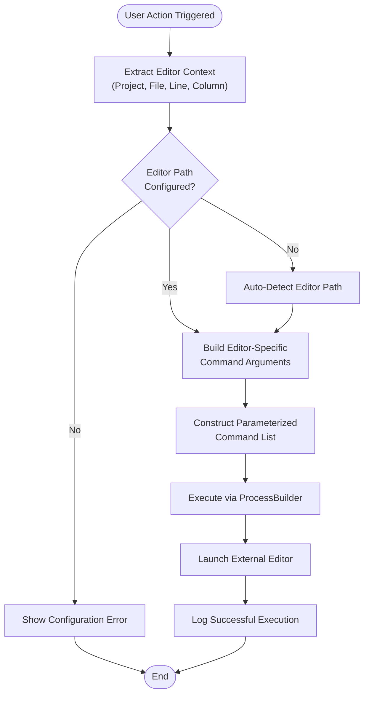
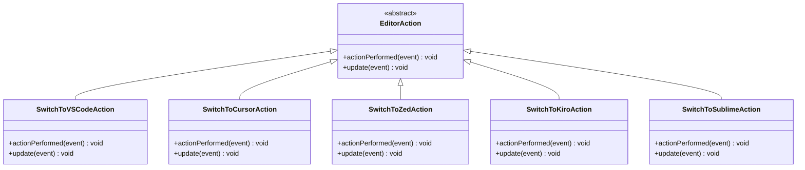

# Smart Editor Switcher Plugin - Core Features Documentation

<cite>
**Referenced Files in This Document**
- [EditorSwitcherService.kt](file://src/main/kotlin/io/yanxxcloud/editorswitcher/services/EditorSwitcherService.kt)
- [EditorUtils.kt](file://src/main/kotlin/io/yanxxcloud/editorswitcher/utils/EditorUtils.kt)
- [SwitchToVSCodeAction.kt](file://src/main/kotlin/io/yanxxcloud/editorswitcher/actions/SwitchToVSCodeAction.kt)
- [SwitchToSublimeAction.kt](file://src/main/kotlin/io/yanxxcloud/editorswitcher/actions/SwitchToSublimeAction.kt)
- [SwitchToZedAction.kt](file://src/main/kotlin/io/yanxxcloud/editorswitcher/actions/SwitchToZedAction.kt)
- [SwitchToCursorAction.kt](file://src/main/kotlin/io/yanxxcloud/editorswitcher/actions/SwitchToCursorAction.kt)
- [SwitchToKiroAction.kt](file://src/main/kotlin/io/yanxxcloud/editorswitcher/actions/SwitchToKiroAction.kt)
- [EditorSwitcherActionGroup.kt](file://src/main/kotlin/io/yanxxcloud/editorswitcher/ui/EditorSwitcherActionGroup.kt)
- [SmartEditorSwitcherConfigurable.kt](file://src/main/kotlin/io/yanxxcloud/editorswitcher/settings/SmartEditorSwitcherConfigurable.kt)
- [SmartEditorSwitcherSettingsComponent.kt](file://src/main/kotlin/io/yanxxcloud/editorswitcher/settings/SmartEditorSwitcherSettingsComponent.kt)
- [EditorSwitcherStatusBarWidget.kt](file://src/main/kotlin/io/yanxxcloud/editorswitcher/ui/EditorSwitcherStatusBarWidget.kt)
- [EditorSwitcherStatusBarWidgetFactory.kt](file://src/main/kotlin/io/yanxxcloud/editorswitcher/ui/EditorSwitcherStatusBarWidgetFactory.kt)
- [plugin.xml](file://src/main/resources/META-INF/plugin.xml)
</cite>

## Table of Contents
1. [Introduction](#introduction)
2. [System Architecture](#system-architecture)
3. [Core Components](#core-components)
4. [Intelligent Editor Switching](#intelligent-editor-switching)
5. [Context Preservation](#context-preservation)
6. [Multiple Access Methods](#multiple-access-methods)
7. [Data Flow Analysis](#data-flow-analysis)
8. [Cross-Platform Path Handling](#cross-platform-path-handling)
9. [Performance Considerations](#performance-considerations)
10. [Troubleshooting Guide](#troubleshooting-guide)
11. [Conclusion](#conclusion)

## Introduction

The Smart Editor Switcher plugin is a sophisticated JetBrains IDE extension that enables seamless transitions between the IDE and various external editors while maintaining precise context information. This plugin serves as a bridge between development environments, allowing developers to leverage the strengths of different editors without losing their place in the code.

The plugin's core philosophy centers around three fundamental principles: intelligent context preservation, multiple access methods for convenience, and robust cross-platform compatibility. It achieves this through a centralized service architecture that coordinates editor switching, intelligent path detection, and parameterized command construction.

## System Architecture

The Smart Editor Switcher follows a modular architecture with clear separation of concerns:

**Diagram sources**
- [EditorSwitcherService.kt](file://src/main/kotlin/io/yanxxcloud/editorswitcher/services/EditorSwitcherService.kt#L1-L268)
- [EditorUtils.kt](file://src/main/kotlin/io/yanxxcloud/editorswitcher/utils/EditorUtils.kt#L1-L45)
- [EditorSwitcherStatusBarWidget.kt](file://src/main/kotlin/io/yanxxcloud/editorswitcher/ui/EditorSwitcherStatusBarWidget.kt#L1-L56)

**Section sources**
- [EditorSwitcherService.kt](file://src/main/kotlin/io/yanxxcloud/editorswitcher/services/EditorSwitcherService.kt#L1-L268)
- [EditorUtils.kt](file://src/main/kotlin/io/yanxxcloud/editorswitcher/utils/EditorUtils.kt#L1-L45)

## Core Components

### EditorSwitcherService - Central Coordinator

The [`EditorSwitcherService`](file://src/main/kotlin/io/yanxxcloud/editorswitcher/services/EditorSwitcherService.kt#L11-L268) serves as the central orchestrator for all editor switching operations. This singleton service manages:

- **Editor Path Management**: Maintains configurable paths for nine different editors including VS Code, Cursor, Zed, Kiro, Sublime Text, Atom, Notepad++, Vim, and Emacs.
- **Command Construction**: Builds platform-appropriate command-line arguments for each editor type.
- **Process Execution**: Utilizes Java's ProcessBuilder to launch external editors with proper context preservation.
- **Auto-Detection Logic**: Implements intelligent path detection for commonly installed editors across Windows, macOS, and Linux platforms.

**Diagram sources**
- [EditorSwitcherService.kt](file://src/main/kotlin/io/yanxxcloud/editorswitcher/services/EditorSwitcherService.kt#L11-L268)

### EditorUtils - Context Extraction

The [`EditorUtils`](file://src/main/kotlin/io/yanxxcloud/editorswitcher/utils/EditorUtils.kt#L7-L45) module specializes in extracting critical context information from the IntelliJ Platform APIs:

- **Project Context**: Retrieves the current project base path for project-relative operations.
- **File Context**: Extracts the absolute file path of the currently edited file.
- **Cursor Position**: Captures precise line and column information using the CaretModel API.
- **Virtual File Access**: Interfaces with IntelliJ's virtual file system for reliable file path resolution.

**Section sources**
- [EditorSwitcherService.kt](file://src/main/kotlin/io/yanxxcloud/editorswitcher/services/EditorSwitcherService.kt#L11-L268)
- [EditorUtils.kt](file://src/main/kotlin/io/yanxxcloud/editorswitcher/utils/EditorUtils.kt#L7-L45)

## Intelligent Editor Switching

### Command-Line Argument Construction

The plugin implements sophisticated command-line argument construction tailored to each editor's specific syntax requirements:

**Diagram sources**
- [EditorSwitcherService.kt](file://src/main/kotlin/io/yanxxcloud/editorswitcher/services/EditorSwitcherService.kt#L35-L100)
- [SwitchToVSCodeAction.kt](file://src/main/kotlin/io/yanxxcloud/editorswitcher/actions/SwitchToVSCodeAction.kt#L10-L45)

### Editor-Specific Command Patterns

Each editor requires distinct command-line syntax for optimal integration:

| Editor | Command Pattern | Key Arguments | Special Features |
|--------|----------------|---------------|------------------|
| **VS Code** | `code [--goto file:line:column]` | `--goto`, line:column | Supports project opening |
| **Cursor** | `cursor [--goto file:line:column]` | `--goto`, line:column | Similar to VS Code |
| **Zed** | `zed [project] file:line:column` | project path, file:line:column | Native line/column support |
| **Kiro** | `kiro [project] file --line N --column M` | project, file, --line/--column | Explicit parameter flags |
| **Sublime Text** | `subl [project] file:line:column` | project, file:line:column | Colon-separated syntax |
| **Atom** | `atom [project] file:line:column` | project, file:line:column | Similar to Sublime |
| **Notepad++** | `notepad++.exe -nLINE -cCOLUMN file` | -n, -c, line:column | Line/column flags |
| **Vim** | `open -a Terminal --args vim +LINE file` | +line, file | Terminal wrapper |
| **Emacs** | `emacs +LINE:COLUMN file` | +line:column, file | Plus-sign notation |

**Section sources**
- [EditorSwitcherService.kt](file://src/main/kotlin/io/yanxxcloud/editorswitcher/services/EditorSwitcherService.kt#L50-L100)

## Context Preservation

### Cursor Position Tracking

The context preservation mechanism ensures that developers maintain their exact position when switching editors:

**Diagram sources**
- [EditorUtils.kt](file://src/main/kotlin/io/yanxxcloud/editorswitcher/utils/EditorUtils.kt#L15-L45)
- [SwitchToVSCodeAction.kt](file://src/main/kotlin/io/yanxxcloud/editorswitcher/actions/SwitchToVSCodeAction.kt#L10-L25)

### Project Structure Maintenance

The plugin maintains project context through multiple mechanisms:

- **Absolute Path Preservation**: Uses IntelliJ's virtual file system to ensure accurate file path resolution
- **Project Base Path**: Extracts the project root directory for editors that support project-level operations
- **Relative Path Calculation**: Handles both absolute and relative path scenarios gracefully

**Section sources**
- [EditorUtils.kt](file://src/main/kotlin/io/yanxxcloud/editorswitcher/utils/EditorUtils.kt#L15-L45)
- [EditorSwitcherService.kt](file://src/main/kotlin/io/yanxxcloud/editorswitcher/services/EditorSwitcherService.kt#L50-L100)

## Multiple Access Methods

### Action-Based Access

The plugin provides nine distinct action classes, each specialized for a specific editor:

**Diagram sources**
- [SwitchToVSCodeAction.kt](file://src/main/kotlin/io/yanxxcloud/editorswitcher/actions/SwitchToVSCodeAction.kt#L10-L45)
- [SwitchToCursorAction.kt](file://src/main/kotlin/io/yanxxcloud/editorswitcher/actions/SwitchToCursorAction.kt#L10-L45)
- [SwitchToZedAction.kt](file://src/main/kotlin/io/yanxxcloud/editorswitcher/actions/SwitchToZedAction.kt#L10-L45)
- [SwitchToKiroAction.kt](file://src/main/kotlin/io/yanxxcloud/editorswitcher/actions/SwitchToKiroAction.kt#L10-L45)
- [SwitchToSublimeAction.kt](file://src/main/kotlin/io/yanxxcloud/editorswitcher/actions/SwitchToSublimeAction.kt#L10-L45)

### Status Bar Integration

The status bar widget provides rapid access to all supported editors through a dropdown interface:

- **Quick Access**: Click the status bar indicator to open a popup menu
- **Visual Feedback**: Clear indication of the current editor selection capability
- **Keyboard Navigation**: Speed search functionality for efficient editor selection

### Right-Click Menu Integration

The plugin integrates seamlessly with IntelliJ's right-click context menus, providing:

- **File-Level Operations**: Right-click on individual files for quick switching
- **Project-Level Operations**: Right-click on project directories for bulk operations
- **Consistent Behavior**: Uniform experience across different context menu locations

**Section sources**
- [EditorSwitcherActionGroup.kt](file://src/main/kotlin/io/yanxxcloud/editorswitcher/ui/EditorSwitcherActionGroup.kt#L8-L35)
- [EditorSwitcherStatusBarWidget.kt](file://src/main/kotlin/io/yanxxcloud/editorswitcher/ui/EditorSwitcherStatusBarWidget.kt#L15-L55)
- [plugin.xml](file://src/main/resources/META-INF/plugin.xml#L80-L110)

## Data Flow Analysis

### Complete Switching Pipeline

The data flow from user action to external editor execution follows a well-defined pipeline:

**Diagram sources**
- [EditorUtils.kt](file://src/main/kotlin/io/yanxxcloud/editorswitcher/utils/EditorUtils.kt#L15-L45)
- [EditorSwitcherService.kt](file://src/main/kotlin/io/yanxxcloud/editorswitcher/services/EditorSwitcherService.kt#L35-L100)

### Parameterization Strategy

The plugin employs a sophisticated parameterization strategy that adapts to each editor's command-line interface:

1. **Path Normalization**: Converts IntelliJ virtual file paths to native system paths
2. **Argument Formatting**: Applies editor-specific argument formatting rules
3. **Conditional Logic**: Handles optional parameters based on editor capabilities
4. **Error Handling**: Provides fallback mechanisms for unsupported configurations

**Section sources**
- [EditorSwitcherService.kt](file://src/main/kotlin/io/yanxxcloud/editorswitcher/services/EditorSwitcherService.kt#L50-L100)
- [EditorUtils.kt](file://src/main/kotlin/io/yanxxcloud/editorswitcher/utils/EditorUtils.kt#L15-L45)

## Cross-Platform Path Handling

### Platform-Specific Path Resolution

The plugin implements comprehensive cross-platform path handling:

- **Windows Support**: Handles drive letters, UNC paths, and Windows-specific executable locations
- **macOS Support**: Manages application bundle paths and macOS-specific installation locations
- **Linux Support**: Accounts for package manager installations and custom installation paths

### Automatic Path Detection Logic

The auto-detection system employs a prioritized search strategy:

**Diagram sources**
- [EditorSwitcherService.kt](file://src/main/kotlin/io/yanxxcloud/editorswitcher/services/EditorSwitcherService.kt#L102-L268)

### Path Validation and Error Handling

The plugin implements robust path validation:

- **Existence Checking**: Verifies executable file existence before attempting launches
- **Permission Validation**: Ensures executables have appropriate execution permissions
- **Fallback Mechanisms**: Provides graceful degradation when paths cannot be detected

**Section sources**
- [EditorSwitcherService.kt](file://src/main/kotlin/io/yanxxcloud/editorswitcher/services/EditorSwitcherService.kt#L102-L268)

## Performance Considerations

### Fast Context Extraction

The plugin optimizes performance through several strategies:

- **Lazy Loading**: Editor paths are only validated when actually needed
- **Efficient API Usage**: Minimizes IntelliJ Platform API calls through batch operations
- **Minimal Overhead**: Commands are constructed synchronously but executed asynchronously

### Memory Management

- **Singleton Pattern**: The EditorSwitcherService uses the IntelliJ application service pattern for efficient memory usage
- **Resource Cleanup**: Proper disposal of temporary resources and handles
- **Configuration Persistence**: Efficient XML serialization for settings storage

### Execution Optimization

- **Process Reuse**: External processes are launched independently without maintaining long-term connections
- **Asynchronous Execution**: Process launching occurs on separate threads to prevent UI blocking
- **Error Isolation**: Individual editor failures don't affect other operations

**Section sources**
- [EditorSwitcherService.kt](file://src/main/kotlin/io/yanxxcloud/editorswitcher/services/EditorSwitcherService.kt#L11-L25)
- [EditorUtils.kt](file://src/main/kotlin/io/yanxxcloud/editorswitcher/utils/EditorUtils.kt#L15-L45)

## Troubleshooting Guide

### Common Issues and Solutions

#### Editor Path Configuration Problems

**Symptom**: "Editor path not configured" error messages
**Solution**: 
1. Navigate to Settings → Tools → Smart Editor Switcher
2. Configure the missing editor path manually
3. Or click "自动检测路径" (Auto Detect Paths) to scan for installed editors

**Diagnostic Steps**:
- Verify the executable file exists at the specified path
- Check file permissions and execution rights
- Ensure the path is correctly formatted for the operating system

#### Cursor Positioning Issues

**Symptom**: Editor opens but cursor is not positioned at the expected location
**Solution**:
1. Verify the editor supports line/column navigation arguments
2. Check if the editor requires specific argument formats
3. Test with a simple file to isolate the issue

**Common Editor-Specific Issues**:
- **VS Code**: Ensure the `--goto` flag is supported by your VS Code version
- **Sublime Text**: Verify colon-separated syntax works correctly
- **Notepad++**: Confirm `-n` and `-c` flags are properly supported

#### Process Launch Failures

**Symptom**: No response or error messages when attempting to switch editors
**Solution**:
1. Check if the external editor is properly installed
2. Verify the executable has appropriate permissions
3. Test launching the editor manually from the command line

**Debugging Steps**:
- Enable logging in IntelliJ IDEA to capture detailed error messages
- Verify the constructed command line arguments are valid
- Check system PATH environment variables

#### Auto-Detection Failures

**Symptom**: Auto-detection doesn't find installed editors
**Possible Causes**:
- Non-standard installation locations
- Permission restrictions preventing path access
- Operating system differences affecting path detection

**Workarounds**:
- Manually specify the editor path in the settings dialog
- Add custom paths to the auto-detection logic
- Use the file chooser dialog to select the executable

### Performance Troubleshooting

#### Slow Switching Operations

**Potential Causes**:
- Large project files affecting context extraction
- Network-mounted file systems causing delays
- Insufficient system resources

**Optimization Strategies**:
- Close unnecessary projects to reduce context extraction overhead
- Use local file systems for optimal performance
- Monitor system resource usage during switching operations

#### Memory Usage Concerns

**Monitoring Approach**:
- Use IntelliJ IDEA's built-in memory profiler
- Monitor plugin-specific memory allocations
- Check for memory leaks in long-running sessions

**Resolution Steps**:
- Restart IntelliJ IDEA periodically to clear accumulated memory
- Disable unused editor integrations
- Update to the latest plugin version for performance improvements

**Section sources**
- [SmartEditorSwitcherConfigurable.kt](file://src/main/kotlin/io/yanxxcloud/editorswitcher/settings/SmartEditorSwitcherConfigurable.kt#L15-L55)
- [EditorSwitcherService.kt](file://src/main/kotlin/io/yanxxcloud/editorswitcher/services/EditorSwitcherService.kt#L35-L50)

## Conclusion

The Smart Editor Switcher plugin represents a sophisticated solution for seamless editor transitions within the JetBrains ecosystem. Its architecture demonstrates excellent software engineering practices through clear separation of concerns, robust error handling, and comprehensive cross-platform support.

Key strengths of the implementation include:

- **Intelligent Context Preservation**: Maintains precise cursor positions and project contexts across editor switches
- **Flexible Access Methods**: Provides multiple pathways for triggering editor switches, accommodating different workflow preferences
- **Robust Path Management**: Implements comprehensive auto-detection and manual configuration capabilities
- **Performance Optimization**: Minimizes overhead while ensuring reliable operation across diverse environments

The plugin's extensible design allows for easy addition of new editor support while maintaining backward compatibility. The modular architecture ensures that individual components can be maintained and improved independently without affecting the overall system stability.

Future enhancements could include support for additional editors, enhanced auto-detection algorithms, and integration with cloud-based development environments. The solid foundation provided by the current architecture makes such extensions straightforward to implement.