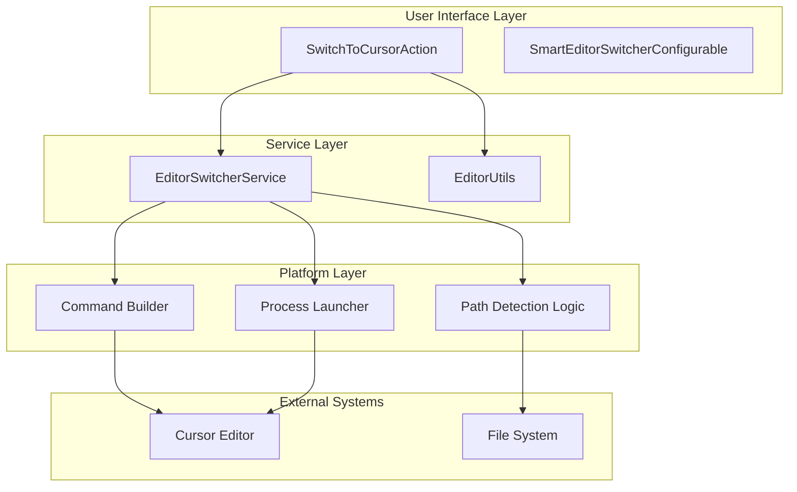
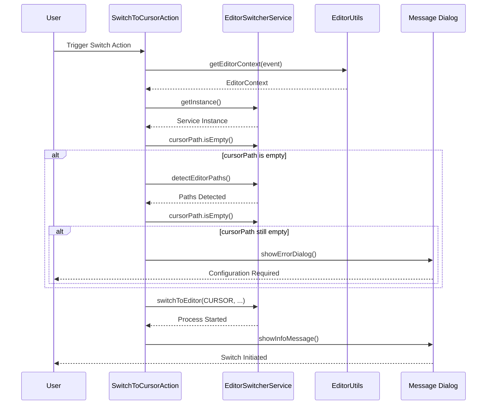
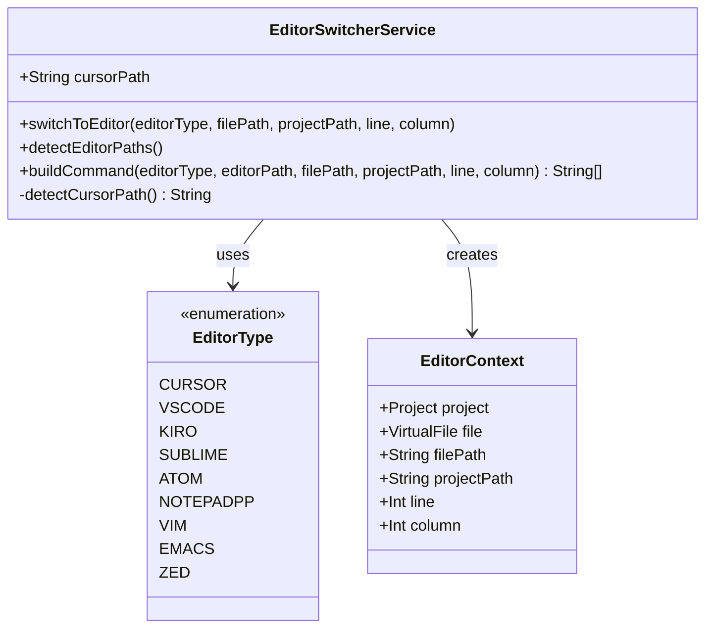
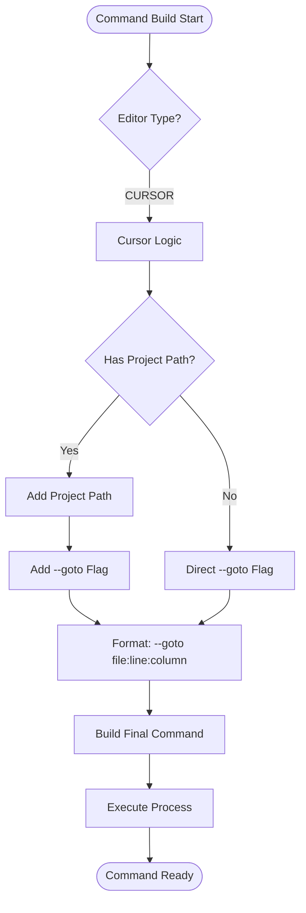
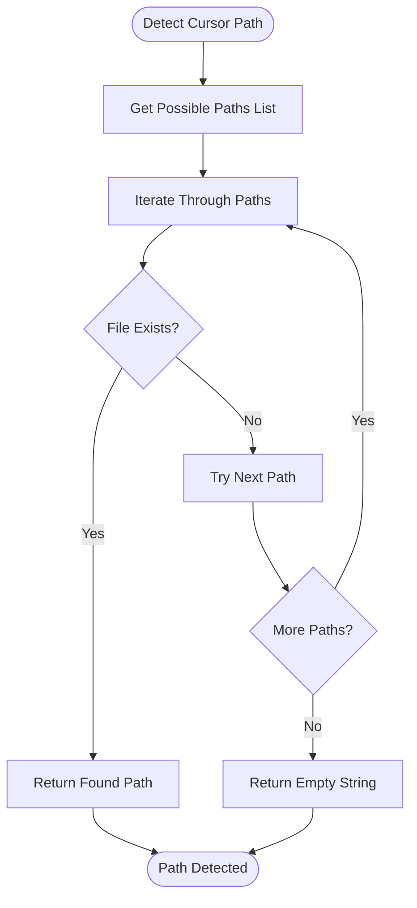
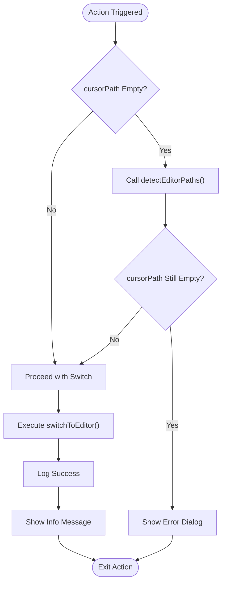

# Cursor Integration

<cite>
**Referenced Files in This Document**
- [SwitchToCursorAction.kt](file://src/main/kotlin/io/yanxxcloud/editorswitcher/actions/SwitchToCursorAction.kt)
- [EditorSwitcherService.kt](file://src/main/kotlin/io/yanxxcloud/editorswitcher/services/EditorSwitcherService.kt)
- [EditorUtils.kt](file://src/main/kotlin/io/yanxxcloud/editorswitcher/utils/EditorUtils.kt)
- [plugin.xml](file://src/main/resources/META-INF/plugin.xml)
- [SmartEditorSwitcherConfigurable.kt](file://src/main/kotlin/io/yanxxcloud/editorswitcher/settings/SmartEditorSwitcherConfigurable.kt)
- [SwitchToVSCodeAction.kt](file://src/main/kotlin/io/yanxxcloud/editorswitcher/actions/SwitchToVSCodeAction.kt)
</cite>

## Table of Contents
1. [Introduction](#introduction)
2. [Architecture Overview](#architecture-overview)
3. [Core Components](#core-components)
4. [Cursor Launch Mechanism](#cursor-launch-mechanism)
5. [Installation Path Detection](#installation-path-detection)
6. [Command Building and Navigation](#command-building-and-navigation)
7. [Error Handling and Fallbacks](#error-handling-and-fallbacks)
8. [Configuration Management](#configuration-management)
9. [Practical Usage Examples](#practical-usage-examples)
10. [Troubleshooting Guide](#troubleshooting-guide)
11. [Best Practices](#best-practices)

## Introduction

The Cursor integration in the Smart Editor Switcher plugin provides seamless switching capabilities between JetBrains IDEs and the Cursor AI-powered code editor. This integration leverages sophisticated path detection mechanisms, intelligent command building, and robust error handling to ensure reliable editor launches with precise file and cursor position context.

Cursor, developed by the team behind VS Code, offers advanced AI-assisted coding features while maintaining compatibility with existing development workflows. The integration preserves project context, file paths, and cursor positions during the switch operation, providing a smooth transition experience.

## Architecture Overview

The Cursor integration follows a layered architecture pattern that separates concerns between user interface, service orchestration, and platform-specific operations.

**Diagram sources**
- [SwitchToCursorAction.kt](file://src/main/kotlin/io/yanxxcloud/editorswitcher/actions/SwitchToCursorAction.kt#L1-L46)
- [EditorSwitcherService.kt](file://src/main/kotlin/io/yanxxcloud/editorswitcher/services/EditorSwitcherService.kt#L1-L268)

## Core Components

### SwitchToCursorAction

The primary action handler that orchestrates the Cursor switching process. This component serves as the entry point for user interactions and manages the complete workflow from context extraction to service invocation.

**Diagram sources**
- [SwitchToCursorAction.kt](file://src/main/kotlin/io/yanxxcloud/editorswitcher/actions/SwitchToCursorAction.kt#L10-L40)
- [EditorSwitcherService.kt](file://src/main/kotlin/io/yanxxcloud/editorswitcher/services/EditorSwitcherService.kt#L35-L50)

**Section sources**
- [SwitchToCursorAction.kt](file://src/main/kotlin/io/yanxxcloud/editorswitcher/actions/SwitchToCursorAction.kt#L1-L46)

### EditorSwitcherService

The central service responsible for managing editor configurations, path detection, and command execution. This service maintains state for all supported editors and provides unified interfaces for launching different editors.

**Diagram sources**
- [EditorSwitcherService.kt](file://src/main/kotlin/io/yanxxcloud/editorswitcher/services/EditorSwitcherService.kt#L250-L268)
- [EditorUtils.kt](file://src/main/kotlin/io/yanxxcloud/editorswitcher/utils/EditorUtils.kt#L8-L18)

**Section sources**
- [EditorSwitcherService.kt](file://src/main/kotlin/io/yanxxcloud/editorswitcher/services/EditorSwitcherService.kt#L1-L268)

### EditorUtils

Provides utility functions for extracting editor context information including file paths, project paths, and cursor positions from IntelliJ IDEA events.

**Section sources**
- [EditorUtils.kt](file://src/main/kotlin/io/yanxxcloud/editorswitcher/utils/EditorUtils.kt#L1-L45)

## Cursor Launch Mechanism

The Cursor launch mechanism utilizes the `--goto` flag to enable precise navigation to specific file locations with line and column information. This approach mirrors the VS Code integration pattern, ensuring consistent behavior across similar editors.

### Command Construction Process

The `buildCommand()` method constructs the appropriate command line arguments for launching Cursor with the desired file and cursor position context:

**Diagram sources**
- [EditorSwitcherService.kt](file://src/main/kotlin/io/yanxxcloud/editorswitcher/services/EditorSwitcherService.kt#L64-L140)

### VS Code Style Navigation

The Cursor integration implements the same `--goto` flag pattern used by VS Code, enabling navigation to specific file locations with precision:

- **Format**: `--goto file:line:column`
- **Example**: `--goto /path/to/file.py:42:15`
- **Behavior**: Opens file at specified line and column position

This approach ensures compatibility with existing editor protocols and provides consistent user experience across different code editors.

**Section sources**
- [EditorSwitcherService.kt](file://src/main/kotlin/io/yanxxcloud/editorswitcher/services/EditorSwitcherService.kt#L123-L137)

## Installation Path Detection

The automatic path detection system employs a systematic approach to locate Cursor installations across different operating systems and user configurations.

### Supported Installation Paths

The detection logic examines multiple potential installation locations based on operating system conventions:

| Operating System | Installation Path Pattern |
|------------------|---------------------------|
| **macOS** | `/Applications/Cursor.app/Contents/Resources/app/bin/cursor` |
| **Linux** | `/usr/local/bin/cursor`, `/opt/cursor/cursor` |
| **Windows** | `C:\Program Files\Cursor\Cursor.exe` |
| **Windows (User)** | `%USERPROFILE%\AppData\Local\Programs\cursor\Cursor.exe` |

### Detection Algorithm

**Diagram sources**
- [EditorSwitcherService.kt](file://src/main/kotlin/io/yanxxcloud/editorswitcher/services/EditorSwitcherService.kt#L230-L240)

### Auto-Detection Logic

The `detectCursorPath()` method implements a prioritized search strategy:

1. **Primary Locations**: Standard installation directories
2. **Alternative Locations**: User-specific installation paths
3. **Fallback**: Empty string if no installation found
4. **Integration**: Called automatically when `cursorPath` is empty

**Section sources**
- [EditorSwitcherService.kt](file://src/main/kotlin/io/yanxxcloud/editorswitcher/services/EditorSwitcherService.kt#L230-L240)

## Command Building and Navigation

The command building system adapts to Cursor's specific argument requirements while maintaining consistency with other editor integrations.

### Argument Format Specifications

| Scenario | Command Structure | Example |
|----------|-------------------|---------|
| **With Project Path** | `cursor projectPath --goto file:line:column` | `cursor /project --goto main.py:42:15` |
| **Without Project Path** | `cursor --goto file:line:column` | `cursor --goto main.py:42:15` |

### Process Execution

The service creates a `ProcessBuilder` instance with the constructed command and executes it asynchronously. This approach ensures that the IDE remains responsive while the external editor launches.

**Section sources**
- [EditorSwitcherService.kt](file://src/main/kotlin/io/yanxxcloud/editorswitcher/services/EditorSwitcherService.kt#L35-L50)

## Error Handling and Fallbacks

The integration implements comprehensive error handling to manage various failure scenarios gracefully.

### Configuration Validation

**Diagram sources**
- [SwitchToCursorAction.kt](file://src/main/kotlin/io/yanxxcloud/editorswitcher/actions/SwitchToCursorAction.kt#L12-L28)

### Error Scenarios

The system handles several distinct error conditions:

1. **Missing Installation**: No Cursor executable found in detected paths
2. **Invalid Path**: Configured path does not correspond to a valid executable
3. **Permission Issues**: Insufficient permissions to execute the Cursor binary
4. **Process Launch Failure**: Unable to start the external process

### Fallback Mechanisms

When the initial path detection fails, the system attempts automatic re-detection before reporting configuration errors to the user.

**Section sources**
- [SwitchToCursorAction.kt](file://src/main/kotlin/io/yanxxcloud/editorswitcher/actions/SwitchToCursorAction.kt#L12-L28)
- [EditorSwitcherService.kt](file://src/main/kotlin/io/yanxxcloud/editorswitcher/services/EditorSwitcherService.kt#L35-L50)

## Configuration Management

The configuration system provides flexible management of editor paths through both manual configuration and automatic detection.

### Settings Interface

The `SmartEditorSwitcherConfigurable` class provides a user-friendly interface for configuring Cursor paths alongside other supported editors. Users can manually specify the Cursor executable path or rely on automatic detection.

### Persistent Storage

Configuration data is persisted using IntelliJ's persistent state mechanism, ensuring that user preferences survive IDE restarts and updates.

**Section sources**
- [SmartEditorSwitcherConfigurable.kt](file://src/main/kotlin/io/yanxxcloud/editorswitcher/settings/SmartEditorSwitcherConfigurable.kt#L1-L56)

## Practical Usage Examples

### Basic Switch Operation

When a user triggers the Cursor switch action, the following sequence occurs:

1. **Context Extraction**: Current file, project, and cursor position are captured
2. **Path Validation**: Cursor executable path is verified or auto-detected
3. **Command Construction**: Appropriate command line arguments are built
4. **Process Launch**: Cursor is launched with the specified context
5. **User Feedback**: Success notification with position information

### Advanced Scenarios

#### Working with Remote Projects
- **Project Path**: Network-mounted project directory
- **File Path**: Relative path within the project
- **Cursor Position**: Precise line and column coordinates

#### Multi-Language Projects
- **File Types**: Python, JavaScript, TypeScript, etc.
- **Navigation**: Line and column preservation across different languages
- **Syntax Highlighting**: Full syntax support in Cursor

**Section sources**
- [SwitchToCursorAction.kt](file://src/main/kotlin/io/yanxxcloud/editorswitcher/actions/SwitchToCursorAction.kt#L10-L40)

## Troubleshooting Guide

### Common Issues and Solutions

#### Issue: "Cursor 路径未配置" Error
**Cause**: Cursor executable not found in configured or detected paths
**Solution**: 
1. Verify Cursor installation
2. Configure path manually in Settings → Tools → Smart Editor Switcher
3. Use "自动检测路径" button to refresh detection

#### Issue: Incorrect File Opening
**Cause**: Path resolution issues or incorrect file references
**Solution**:
1. Check file existence in the specified location
2. Verify project path configuration
3. Test with simpler file paths

#### Issue: Launch Failures
**Cause**: Permission restrictions or corrupted installation
**Solution**:
1. Run IDE with appropriate permissions
2. Reinstall Cursor if necessary
3. Check antivirus software blocking

### Diagnostic Steps

1. **Verify Installation**: Confirm Cursor is properly installed
2. **Test Path**: Manually execute the detected path from terminal
3. **Check Permissions**: Ensure executable permissions are set
4. **Review Logs**: Examine IDE logs for detailed error messages

### Recovery Procedures

When encountering persistent issues:

1. **Reset Configuration**: Clear stored paths and re-detect
2. **Manual Configuration**: Specify exact path to Cursor executable
3. **Environment Check**: Verify system PATH and environment variables
4. **Plugin Update**: Ensure latest plugin version is installed

## Best Practices

### Configuration Guidelines

1. **Path Specification**: Use absolute paths for reliability
2. **Permission Management**: Ensure executables have appropriate permissions
3. **Testing**: Verify configurations work across different projects
4. **Documentation**: Document custom paths for team environments

### Performance Optimization

1. **Lazy Detection**: Paths are detected only when needed
2. **Caching**: Successfully detected paths are cached for future use
3. **Async Operations**: Process launching is performed asynchronously
4. **Resource Management**: Proper cleanup of temporary resources

### Security Considerations

1. **Path Validation**: Verify executable paths before launching
2. **Input Sanitization**: Clean file paths and arguments
3. **Permission Checks**: Respect system permission boundaries
4. **Logging**: Minimal logging of sensitive path information

### Maintenance Recommendations

1. **Regular Updates**: Keep both Cursor and the plugin updated
2. **Configuration Backup**: Export settings before major updates
3. **Monitoring**: Watch for compatibility issues with new releases
4. **Documentation**: Maintain internal documentation for team members