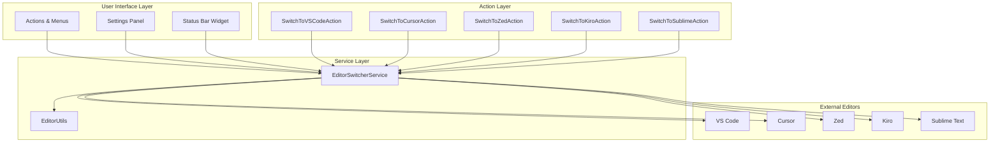
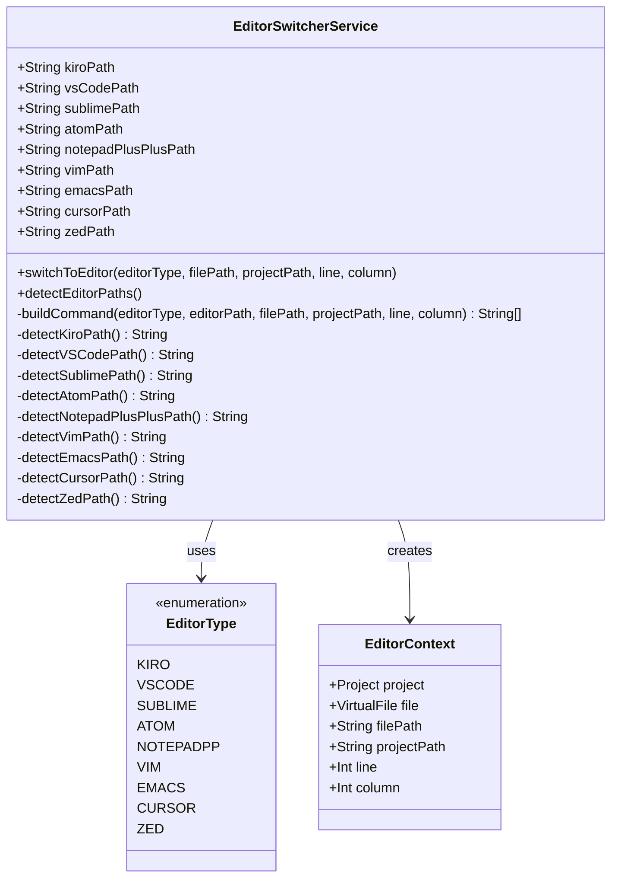
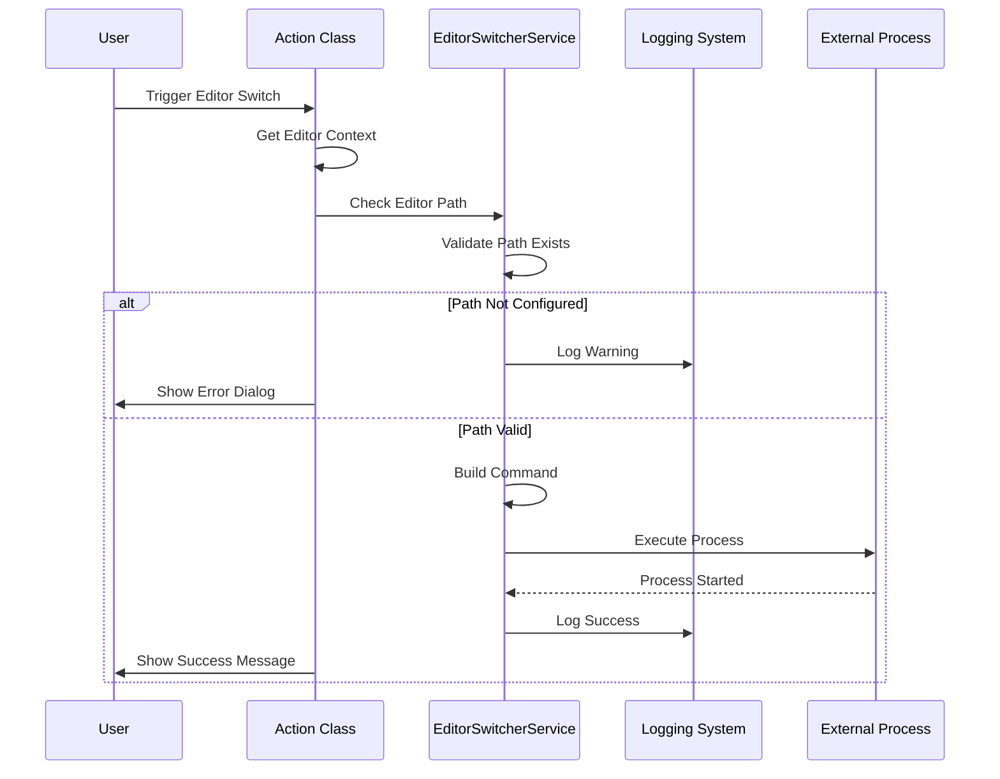
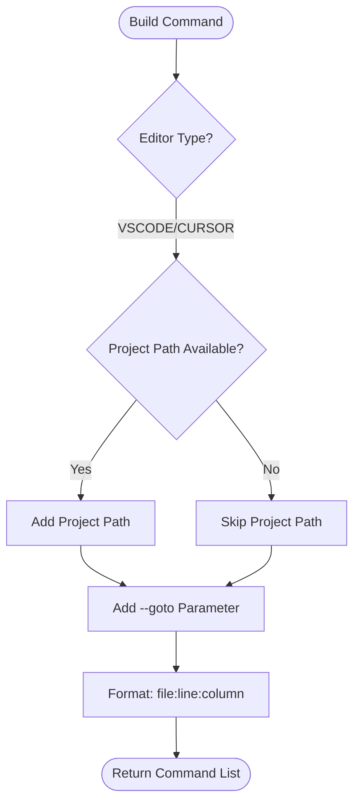
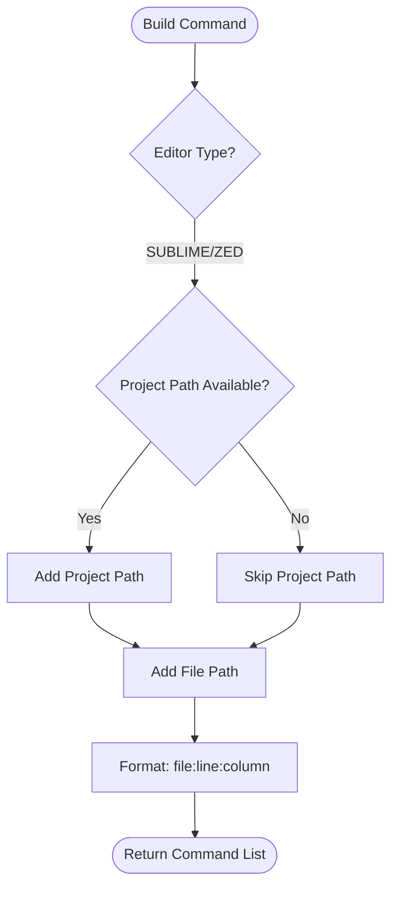
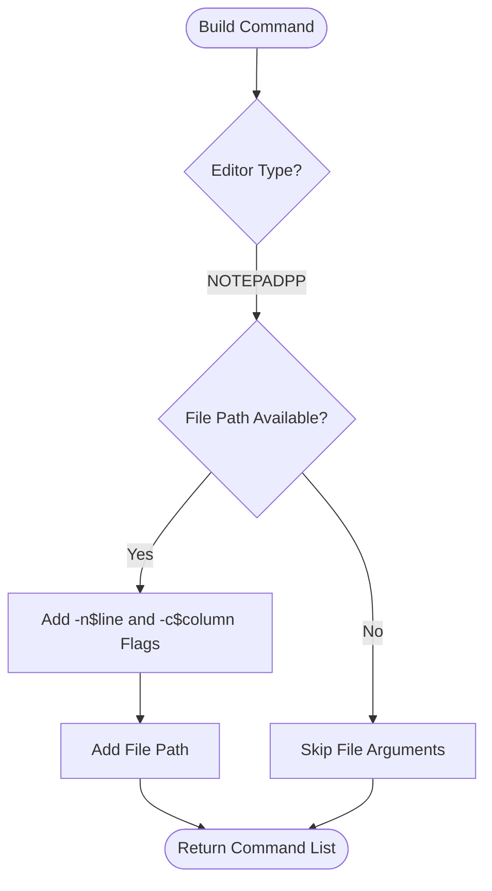
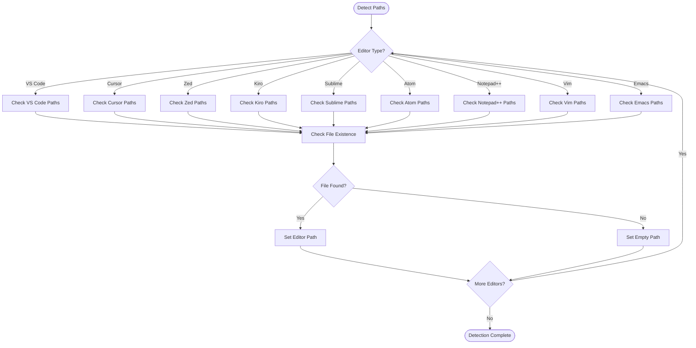
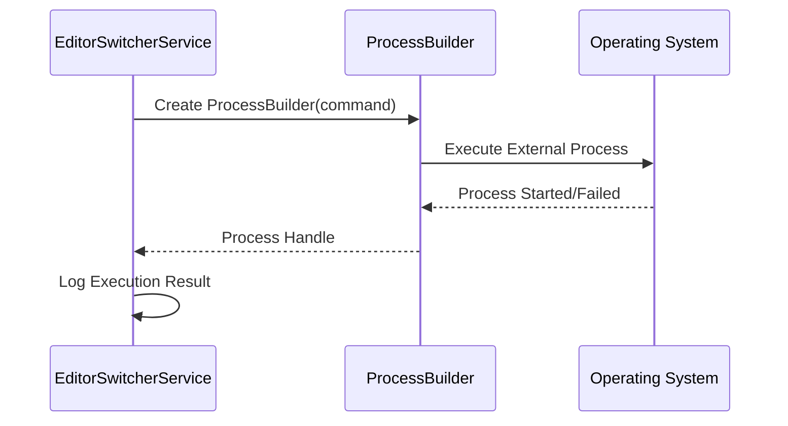
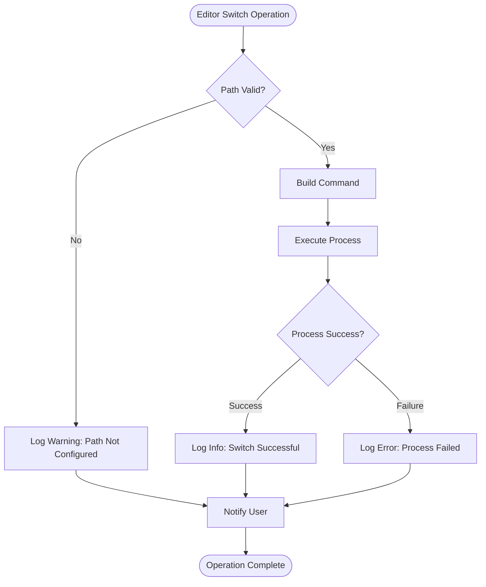
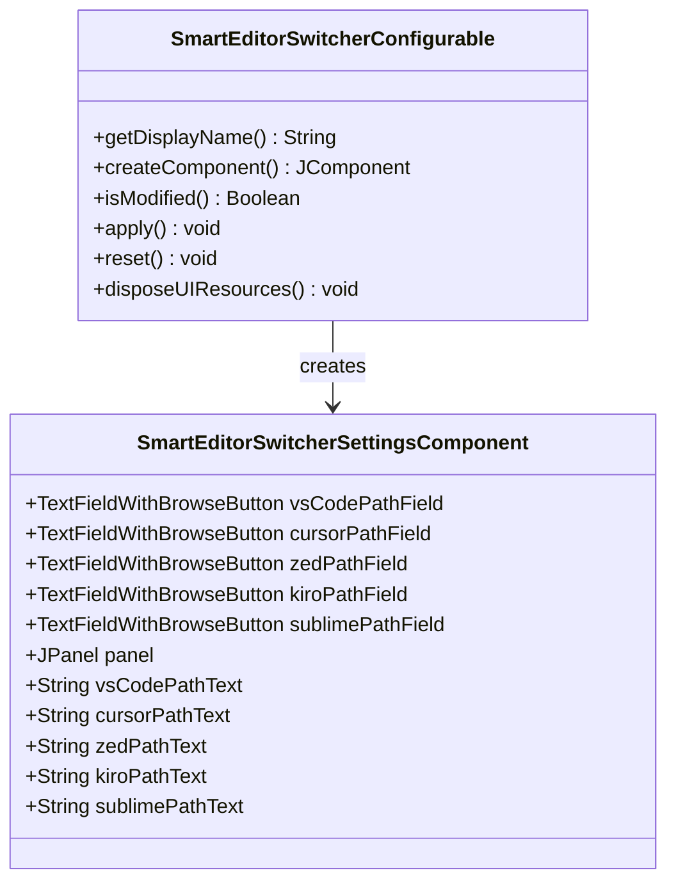

# Editor Switching

<cite>
**Referenced Files in This Document**
- [EditorSwitcherService.kt](file://src/main/kotlin/io/yanxxcloud/editorswitcher/services/EditorSwitcherService.kt)
- [SwitchToVSCodeAction.kt](file://src/main/kotlin/io/yanxxcloud/editorswitcher/actions/SwitchToVSCodeAction.kt)
- [SwitchToCursorAction.kt](file://src/main/kotlin/io/yanxxcloud/editorswitcher/actions/SwitchToCursorAction.kt)
- [SwitchToZedAction.kt](file://src/main/kotlin/io/yanxxcloud/editorswitcher/actions/SwitchToZedAction.kt)
- [SwitchToKiroAction.kt](file://src/main/kotlin/io/yanxxcloud/editorswitcher/actions/SwitchToKiroAction.kt)
- [SwitchToSublimeAction.kt](file://src/main/kotlin/io/yanxxcloud/editorswitcher/actions/SwitchToSublimeAction.kt)
- [EditorUtils.kt](file://src/main/kotlin/io/yanxxcloud/editorswitcher/utils/EditorUtils.kt)
- [SmartEditorSwitcherConfigurable.kt](file://src/main/kotlin/io/yanxxcloud/editorswitcher/settings/SmartEditorSwitcherConfigurable.kt)
- [SmartEditorSwitcherSettingsComponent.kt](file://src/main/kotlin/io/yanxxcloud/editorswitcher/settings/SmartEditorSwitcherSettingsComponent.kt)
- [plugin.xml](file://src/main/resources/META-INF/plugin.xml)
</cite>

## Table of Contents
1. [Introduction](#introduction)
2. [Architecture Overview](#architecture-overview)
3. [Core Components](#core-components)
4. [Editor Type Management](#editor-type-management)
5. [Command Building System](#command-building-system)
6. [Path Detection and Validation](#path-detection-and-validation)
7. [Cross-Platform Considerations](#cross-platform-considerations)
8. [Error Handling and Logging](#error-handling-and-logging)
9. [Configuration Management](#configuration-management)
10. [Troubleshooting Guide](#troubleshooting-guide)
11. [Conclusion](#conclusion)

## Introduction

The Smart Editor Switcher plugin provides intelligent switching capabilities between JetBrains IDEs and external editors. It orchestrates seamless transitions while maintaining cursor position, project context, and file navigation information. The plugin supports nine major editors including VS Code, Cursor, Zed, Kiro, Sublime Text, Atom, Notepad++, Vim, and Emacs.

The system operates through a centralized service that validates editor configurations, constructs platform-specific command-line arguments, and handles cross-platform execution. Each editor action follows a consistent pattern while accommodating unique CLI syntax requirements.

## Architecture Overview

The editor switching feature follows a layered architecture with clear separation of concerns:

**Diagram sources**
- [EditorSwitcherService.kt](file://src/main/kotlin/io/yanxxcloud/editorswitcher/services/EditorSwitcherService.kt#L1-L268)
- [SwitchToVSCodeAction.kt](file://src/main/kotlin/io/yanxxcloud/editorswitcher/actions/SwitchToVSCodeAction.kt#L1-L46)
- [SmartEditorSwitcherConfigurable.kt](file://src/main/kotlin/io/yanxxcloud/editorswitcher/settings/SmartEditorSwitcherConfigurable.kt#L1-L56)

## Core Components

### EditorSwitcherService

The central orchestrator manages all editor switching operations. It maintains configuration state, validates paths, builds commands, and executes external processes.

**Diagram sources**
- [EditorSwitcherService.kt](file://src/main/kotlin/io/yanxxcloud/editorswitcher/services/EditorSwitcherService.kt#L10-L268)
- [EditorUtils.kt](file://src/main/kotlin/io/yanxxcloud/editorswitcher/utils/EditorUtils.kt#L8-L44)

**Section sources**
- [EditorSwitcherService.kt](file://src/main/kotlin/io/yanxxcloud/editorswitcher/services/EditorSwitcherService.kt#L1-L268)

### Action Classes

Each editor has a dedicated action class that handles user interaction and delegates to the central service:

**Diagram sources**
- [SwitchToVSCodeAction.kt](file://src/main/kotlin/io/yanxxcloud/editorswitcher/actions/SwitchToVSCodeAction.kt#L10-L45)
- [EditorSwitcherService.kt](file://src/main/kotlin/io/yanxxcloud/editorswitcher/services/EditorSwitcherService.kt#L38-L62)

**Section sources**
- [SwitchToVSCodeAction.kt](file://src/main/kotlin/io/yanxxcloud/editorswitcher/actions/SwitchToVSCodeAction.kt#L1-L46)
- [SwitchToCursorAction.kt](file://src/main/kotlin/io/yanxxcloud/editorswitcher/actions/SwitchToCursorAction.kt#L1-L46)
- [SwitchToZedAction.kt](file://src/main/kotlin/io/yanxxcloud/editorswitcher/actions/SwitchToZedAction.kt#L1-L46)
- [SwitchToKiroAction.kt](file://src/main/kotlin/io/yanxxcloud/editorswitcher/actions/SwitchToKiroAction.kt#L1-L46)
- [SwitchToSublimeAction.kt](file://src/main/kotlin/io/yanxxcloud/editorswitcher/actions/SwitchToSublimeAction.kt#L1-L46)

## Editor Type Management

The plugin defines a comprehensive enumeration of supported editors, each with specific CLI requirements:

| Editor | Enum Value | Primary CLI Argument | Line Navigation | Column Support |
|--------|------------|---------------------|-----------------|----------------|
| VS Code | VSCODE | `--goto` | Yes (`file:line:column`) | Yes |
| Cursor | CURSOR | `--goto` | Yes (`file:line:column`) | Yes |
| Zed | ZED | Direct argument | Yes (`file:line:column`) | Yes |
| Kiro | KIRO | `--line`, `--column` | Yes | Yes |
| Sublime Text | SUBLIME | Direct argument | Yes (`file:line:column`) | Yes |
| Atom | ATOM | Direct argument | Yes (`file:line:column`) | Yes |
| Notepad++ | NOTEPADPP | `-n`, `-c` flags | Yes | Yes |
| Vim | VIM | Terminal wrapper | Yes (`+$line`) | No |
| Emacs | EMACS | Direct argument | Yes (`+$line:$column`) | Yes |

**Section sources**
- [EditorSwitcherService.kt](file://src/main/kotlin/io/yanxxcloud/editorswitcher/services/EditorSwitcherService.kt#L265-L267)

## Command Building System

The `buildCommand()` method constructs platform-specific command-line arguments for each editor type. The system handles various CLI syntax patterns:

### VS Code and Cursor Implementation

Both editors use the `--goto` parameter for line navigation:

**Diagram sources**
- [EditorSwitcherService.kt](file://src/main/kotlin/io/yanxxcloud/editorswitcher/services/EditorSwitcherService.kt#L74-L85)

### Sublime Text and Zed Implementation

These editors accept file paths with embedded line and column information:

**Diagram sources**
- [EditorSwitcherService.kt](file://src/main/kotlin/io/yanxxcloud/editorswitcher/services/EditorSwitcherService.kt#L87-L93)

### Notepad++ Implementation

Uses separate flags for line and column numbers:

**Diagram sources**
- [EditorSwitcherService.kt](file://src/main/kotlin/io/yanxxcloud/editorswitcher/services/EditorSwitcherService.kt#L95-L98)

**Section sources**
- [EditorSwitcherService.kt](file://src/main/kotlin/io/yanxxcloud/editorswitcher/services/EditorSwitcherService.kt#L64-L135)

## Path Detection and Validation

The service implements automatic path detection for all supported editors across multiple platforms:

### Detection Strategy

**Diagram sources**
- [EditorSwitcherService.kt](file://src/main/kotlin/io/yanxxcloud/editorswitcher/services/EditorSwitcherService.kt#L137-L267)

### Platform-Specific Path Patterns

| Editor | macOS Path | Linux Path | Windows Path |
|--------|------------|------------|--------------|
| VS Code | `/Applications/Visual Studio Code.app/Contents/Resources/app/bin/code` | `/usr/local/bin/code` | `C:\Program Files\Microsoft VS Code\bin\code.cmd` |
| Cursor | `/Applications/Cursor.app/Contents/Resources/app/bin/cursor` | `/usr/local/bin/cursor` | `C:\Program Files\Cursor\Cursor.exe` |
| Zed | `/Applications/Zed.app/Contents/MacOS/zed` | `/usr/local/bin/zed` | `C:\Program Files\Zed\zed.exe` |
| Kiro | `/Applications/Kiro.app/Contents/MacOS/Kiro` | `/usr/local/bin/kiro` | `C:\Program Files\Kiro\Kiro.exe` |
| Sublime | `/Applications/Sublime Text.app/Contents/SharedSupport/bin/subl` | `/usr/local/bin/subl` | `C:\Program Files\Sublime Text\subl.exe` |
| Atom | `/Applications/Atom.app/Contents/Resources/app/atom.sh` | `/usr/local/bin/atom` | `C:\Program Files\Atom\atom.exe` |
| Notepad++ | N/A | N/A | `C:\Program Files\Notepad++\notepad++.exe` |
| Vim | `/usr/bin/vim` | `/usr/local/bin/vim` | `C:\Program Files\Vim\vim90\vim.exe` |
| Emacs | `/Applications/Emacs.app/Contents/MacOS/Emacs` | `/usr/local/bin/emacs` | `C:\Program Files\Emacs\bin\emacs.exe` |

**Section sources**
- [EditorSwitcherService.kt](file://src/main/kotlin/io/yanxxcloud/editorswitcher/services/EditorSwitcherService.kt#L137-L267)

## Cross-Platform Considerations

### Path Resolution

The plugin handles cross-platform path resolution through several mechanisms:

1. **Environment Variables**: Windows paths support `%USERNAME%` expansion
2. **File Existence Checking**: Uses `java.io.File.exists()` for reliable path validation
3. **Default Install Locations**: Provides comprehensive fallback paths for each platform
4. **Permission Handling**: Relies on system process execution permissions

### Process Execution

The system uses Java's `ProcessBuilder` for cross-platform process execution:

**Diagram sources**
- [EditorSwitcherService.kt](file://src/main/kotlin/io/yanxxcloud/editorswitcher/services/EditorSwitcherService.kt#L54-L58)

**Section sources**
- [EditorSwitcherService.kt](file://src/main/kotlin/io/yanxxcloud/editorswitcher/services/EditorSwitcherService.kt#L137-L267)

## Error Handling and Logging

The plugin implements comprehensive error handling and logging:

### Logging Strategy

**Diagram sources**
- [EditorSwitcherService.kt](file://src/main/kotlin/io/yanxxcloud/editorswitcher/services/EditorSwitcherService.kt#L50-L60)

### Error Scenarios

| Scenario | Logging Level | User Notification | Recovery Action |
|----------|---------------|-------------------|-----------------|
| Missing Editor Path | WARN | Error Dialog | Auto-detect paths |
| Process Execution Failure | ERROR | Error Dialog | Manual path configuration |
| Invalid File Path | INFO | Success (partial) | Continue with available data |
| Permission Denied | ERROR | Error Dialog | Check file permissions |

**Section sources**
- [EditorSwitcherService.kt](file://src/main/kotlin/io/yanxxcloud/editorswitcher/services/EditorSwitcherService.kt#L50-L60)
- [SwitchToVSCodeAction.kt](file://src/main/kotlin/io/yanxxcloud/editorswitcher/actions/SwitchToVSCodeAction.kt#L15-L25)

## Configuration Management

### Settings Interface

The plugin provides a comprehensive settings interface for managing editor paths:

**Diagram sources**
- [SmartEditorSwitcherConfigurable.kt](file://src/main/kotlin/io/yanxxcloud/editorswitcher/settings/SmartEditorSwitcherConfigurable.kt#L7-L56)
- [SmartEditorSwitcherSettingsComponent.kt](file://src/main/kotlin/io/yanxxcloud/editorswitcher/settings/SmartEditorSwitcherSettingsComponent.kt#L11-L165)

### Configuration Persistence

The settings are automatically persisted using IntelliJ's persistence framework:

- **Storage Location**: `SmartEditorSwitcher.xml` in IDE configuration directory
- **State Management**: Implements `PersistentStateComponent` interface
- **Automatic Saving**: Changes are saved automatically when modified

**Section sources**
- [SmartEditorSwitcherConfigurable.kt](file://src/main/kotlin/io/yanxxcloud/editorswitcher/settings/SmartEditorSwitcherConfigurable.kt#L1-L56)
- [SmartEditorSwitcherSettingsComponent.kt](file://src/main/kotlin/io/yanxxcloud/editorswitcher/settings/SmartEditorSwitcherSettingsComponent.kt#L1-L165)

## Troubleshooting Guide

### Common Issues and Solutions

#### 1. Editor Path Not Configured

**Symptoms**: Warning messages about unconfigured editor paths
**Cause**: Editor executable not found or path not set
**Solution**: 
- Use the "Auto-detect paths" button in settings
- Manually browse to the editor executable
- Verify the editor is properly installed

#### 2. Process Execution Failures

**Symptoms**: Error dialogs stating "Failed to switch to editor"
**Cause**: 
- Incorrect executable path
- Missing permissions
- Corrupted installation

**Solution**:
- Verify the executable path is correct
- Check file permissions
- Reinstall the editor if necessary

#### 3. Incorrect Line/Column Positioning

**Symptoms**: Editor opens but cursor is not at expected position
**Cause**: 
- Editor doesn't support line/column arguments
- Malformed command construction

**Solution**:
- Check if the editor supports line/column navigation
- Verify command syntax in logs
- Report issue if editor should support positioning

#### 4. Cross-Platform Path Issues

**Symptoms**: Editor fails to start on specific platforms
**Cause**: 
- Incorrect path separators
- Environment variable expansion issues

**Solution**:
- Use forward slashes for paths
- Verify environment variables are expanded correctly
- Test path validity manually

### Diagnostic Information

Enable detailed logging to diagnose issues:

1. **Check Plugin Logs**: View IntelliJ's log files for error messages
2. **Verify Paths**: Confirm executables exist at configured locations
3. **Test Commands**: Manually execute generated commands in terminal
4. **Review Permissions**: Ensure editor executables have execute permissions

### Performance Considerations

- **Path Detection**: Occurs once during initialization
- **Command Building**: Minimal overhead for each switch operation
- **Process Execution**: Asynchronous to prevent UI blocking
- **Memory Usage**: Low footprint with minimal state storage

**Section sources**
- [EditorSwitcherService.kt](file://src/main/kotlin/io/yanxxcloud/editorswitcher/services/EditorSwitcherService.kt#L50-L60)
- [SmartEditorSwitcherSettingsComponent.kt](file://src/main/kotlin/io/yanxxcloud/editorswitcher/settings/SmartEditorSwitcherSettingsComponent.kt#L144-L164)

## Conclusion

The Smart Editor Switcher plugin provides a robust and extensible solution for seamless editor transitions. Its centralized service architecture ensures consistent behavior across all supported editors while accommodating unique CLI requirements. The comprehensive error handling, cross-platform support, and automated path detection make it a reliable tool for developers working across multiple development environments.

Key strengths include:
- **Unified Interface**: Consistent API across all editor types
- **Intelligent Path Detection**: Automatic discovery of installed editors
- **Cross-Platform Compatibility**: Support for Windows, macOS, and Linux
- **Extensible Architecture**: Easy addition of new editor types
- **Robust Error Handling**: Comprehensive logging and user feedback

The plugin serves as an excellent example of how to integrate external applications with IDEs while maintaining user productivity and system reliability.