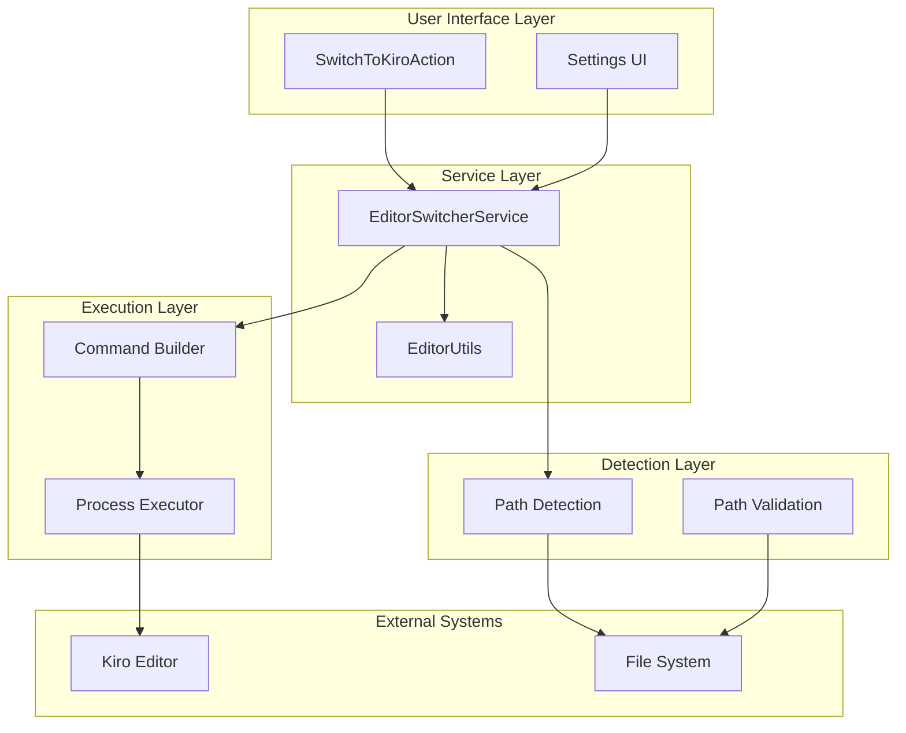
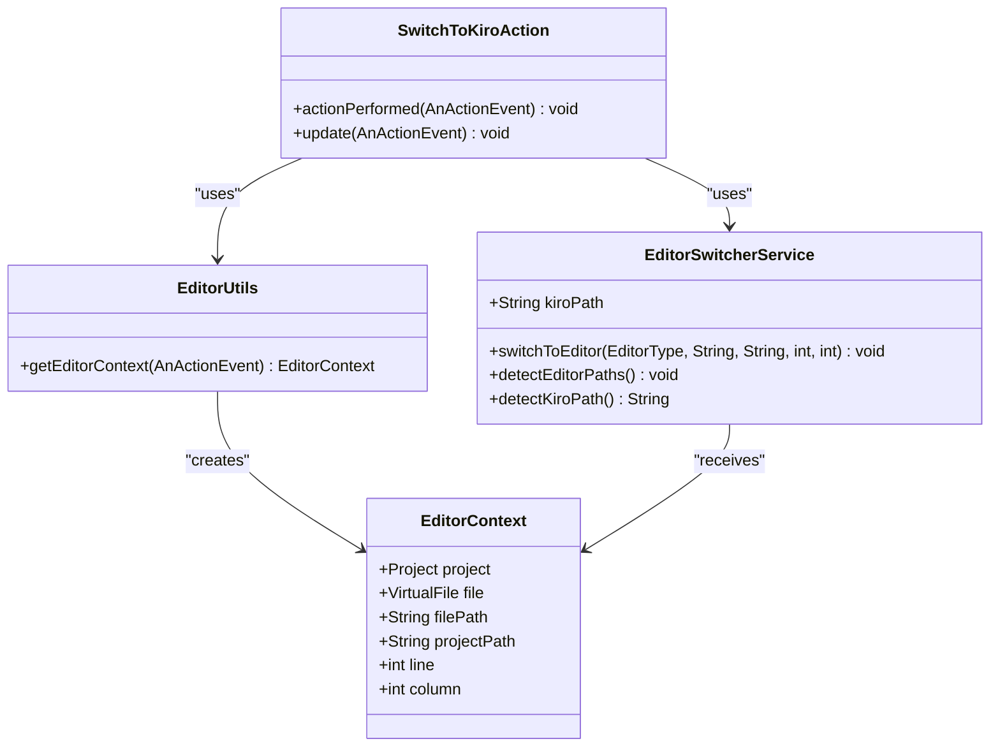
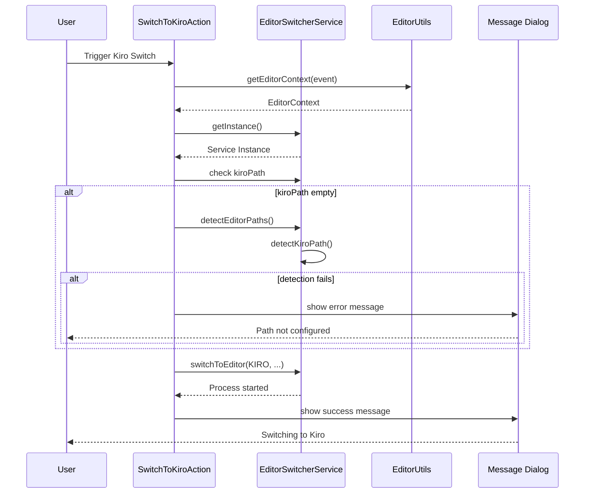
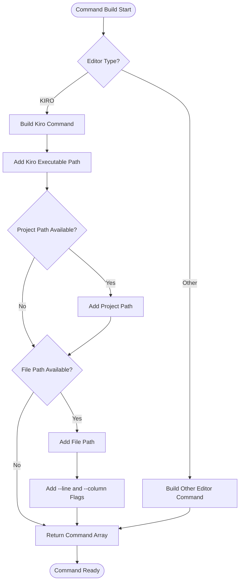
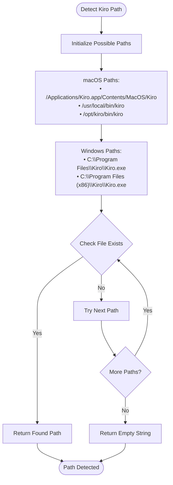
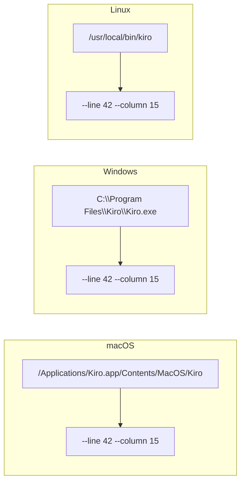
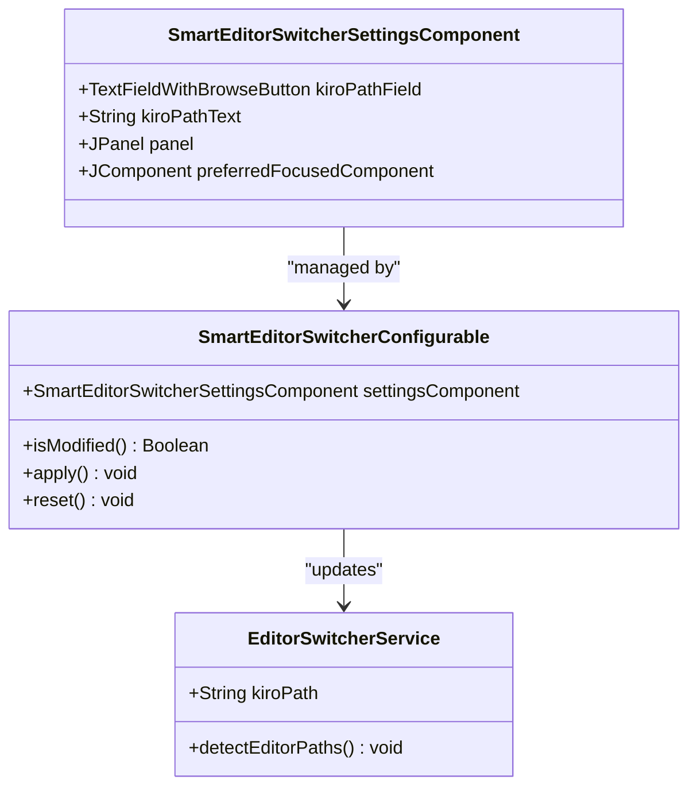
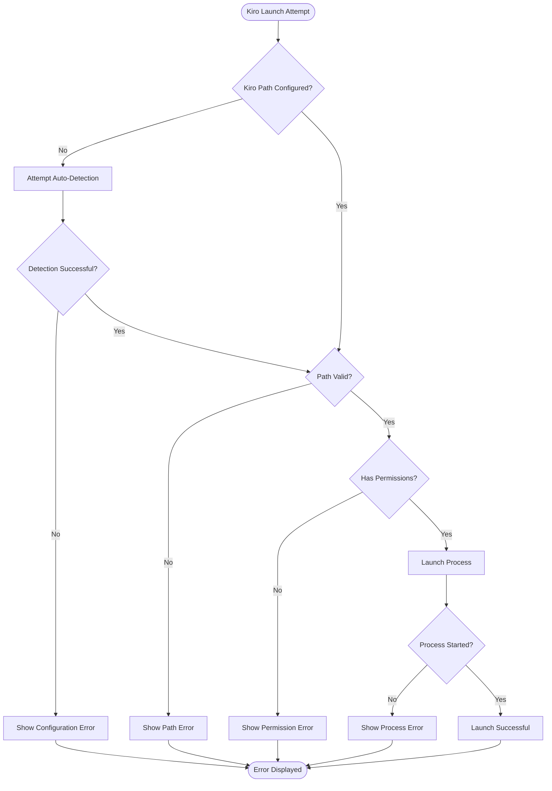

# Kiro Integration

<cite>
**Referenced Files in This Document**
- [SwitchToKiroAction.kt](file://src/main/kotlin/io/yanxxcloud/editorswitcher/actions/SwitchToKiroAction.kt)
- [EditorSwitcherService.kt](file://src/main/kotlin/io/yanxxcloud/editorswitcher/services/EditorSwitcherService.kt)
- [EditorUtils.kt](file://src/main/kotlin/io/yanxxcloud/editorswitcher/utils/EditorUtils.kt)
- [plugin.xml](file://src/main/resources/META-INF/plugin.xml)
- [SmartEditorSwitcherConfigurable.kt](file://src/main/kotlin/io/yanxxcloud/editorswitcher/settings/SmartEditorSwitcherConfigurable.kt)
- [SmartEditorSwitcherSettingsComponent.kt](file://src/main/kotlin/io/yanxxcloud/editorswitcher/settings/SmartEditorSwitcherSettingsComponent.kt)
- [README.md](file://README.md)
- [INSTALL.md](file://INSTALL.md)
</cite>

## Table of Contents
1. [Introduction](#introduction)
2. [Architecture Overview](#architecture-overview)
3. [Core Components](#core-components)
4. [Kiro Action Implementation](#kiro-action-implementation)
5. [Command Building Mechanism](#command-building-mechanism)
6. [Path Detection System](#path-detection-system)
7. [Platform-Specific Considerations](#platform-specific-considerations)
8. [Configuration Management](#configuration-management)
9. [Error Handling and Troubleshooting](#error-handling-and-troubleshooting)
10. [Integration Examples](#integration-examples)
11. [Best Practices](#best-practices)

## Introduction

The Kiro editor integration in the Smart Editor Switcher plugin provides seamless switching capabilities between JetBrains IDEs and the Kiro AI-driven editor. This integration maintains precise cursor positioning, project context, and supports intelligent path detection across multiple platforms.

Kiro represents a modern AI-powered editing experience that combines traditional text editing with advanced AI assistance. The integration ensures that users can leverage Kiro's capabilities while maintaining their development workflow within the JetBrains ecosystem.

## Architecture Overview

The Kiro integration follows a layered architecture pattern with clear separation of concerns:



**Diagram sources**
- [SwitchToKiroAction.kt](file://src/main/kotlin/io/yanxxcloud/editorswitcher/actions/SwitchToKiroAction.kt#L9-L45)
- [EditorSwitcherService.kt](file://src/main/kotlin/io/yanxxcloud/editorswitcher/services/EditorSwitcherService.kt#L13-L267)

## Core Components

### SwitchToKiroAction

The primary action class that handles user interactions and coordinates the switching process:



**Diagram sources**
- [SwitchToKiroAction.kt](file://src/main/kotlin/io/yanxxcloud/editorswitcher/actions/SwitchToKiroAction.kt#L9-L45)
- [EditorSwitcherService.kt](file://src/main/kotlin/io/yanxxcloud/editorswitcher/services/EditorSwitcherService.kt#L13-L267)
- [EditorUtils.kt](file://src/main/kotlin/io/yanxxcloud/editorswitcher/utils/EditorUtils.kt#L8-L44)

**Section sources**
- [SwitchToKiroAction.kt](file://src/main/kotlin/io/yanxxcloud/editorswitcher/actions/SwitchToKiroAction.kt#L9-L45)
- [EditorSwitcherService.kt](file://src/main/kotlin/io/yanxxcloud/editorswitcher/services/EditorSwitcherService.kt#L13-L267)

## Kiro Action Implementation

### Action Execution Flow

The `SwitchToKiroAction` implements a sophisticated workflow that ensures reliable Kiro launching:



**Diagram sources**
- [SwitchToKiroAction.kt](file://src/main/kotlin/io/yanxxcloud/editorswitcher/actions/SwitchToKiroAction.kt#L11-L40)

### Context Extraction Process

The action extracts comprehensive context information from the current IDE state:

| Context Element | Source | Purpose |
|----------------|--------|---------|
| **Project** | `AnActionEvent.project` | Provides IDE project context |
| **File** | `CommonDataKeys.VIRTUAL_FILE` | Current file being edited |
| **File Path** | `VirtualFile.path` | Absolute path to the current file |
| **Project Path** | `Project.basePath` | Root directory of the project |
| **Line Number** | `CaretModel.logicalPosition` | Current cursor line (1-based) |
| **Column Position** | `CaretModel.logicalPosition` | Current cursor column (1-based) |

**Section sources**
- [SwitchToKiroAction.kt](file://src/main/kotlin/io/yanxxcloud/editorswitcher/actions/SwitchToKiroAction.kt#L11-L40)
- [EditorUtils.kt](file://src/main/kotlin/io/yanxxcloud/editorswitcher/utils/EditorUtils.kt#L17-L44)

## Command Building Mechanism

### buildCommand() Implementation

The `buildCommand()` method constructs the precise command array for launching Kiro with full context preservation:



**Diagram sources**
- [EditorSwitcherService.kt](file://src/main/kotlin/io/yanxxcloud/editorswitcher/services/EditorSwitcherService.kt#L60-L85)

### Kiro Command Structure

For Kiro, the command array follows this structure:

| Component | Description | Example |
|-----------|-------------|---------|
| **Executable** | Kiro binary path | `/Applications/Kiro.app/Contents/MacOS/Kiro` |
| **Project Path** | Working directory | `/Users/developer/projects/myapp` |
| **File Path** | Target file | `/Users/developer/projects/myapp/src/main.js` |
| **Line Flag** | Line positioning | `--line 42` |
| **Column Flag** | Column positioning | `--column 15` |

The command construction ensures that Kiro receives precise location information for optimal user experience.

**Section sources**
- [EditorSwitcherService.kt](file://src/main/kotlin/io/yanxxcloud/editorswitcher/services/EditorSwitcherService.kt#L60-L85)

## Path Detection System

### Automatic Path Detection

The `detectKiroPath()` method implements intelligent path detection across multiple platforms:



**Diagram sources**
- [EditorSwitcherService.kt](file://src/main/kotlin/io/yanxxcloud/editorswitcher/services/EditorSwitcherService.kt#L170-L178)

### Supported Installation Paths

| Platform | Path Pattern | Description |
|----------|--------------|-------------|
| **macOS** | `/Applications/Kiro.app/Contents/MacOS/Kiro` | Standard macOS application bundle |
| **macOS** | `/usr/local/bin/kiro` | Homebrew installation |
| **macOS** | `/opt/kiro/bin/kiro` | Manual installation |
| **Windows** | `C:\Program Files\Kiro\Kiro.exe` | Standard Windows installation |
| **Windows** | `C:\Program Files (x86)\Kiro\Kiro.exe` | 32-bit Windows installation |

**Section sources**
- [EditorSwitcherService.kt](file://src/main/kotlin/io/yanxxcloud/editorswitcher/services/EditorSwitcherService.kt#L170-L178)

## Platform-Specific Considerations

### Cross-Platform Command Execution

The integration handles platform differences through careful command construction:



### Argument Formatting Differences

Different platforms may require specific argument formatting:

| Aspect | macOS/Linux | Windows |
|--------|-------------|---------|
| **Path Separators** | Forward slash (`/`) | Backslash (`\`) |
| **Quoting** | Generally not needed | May require quoting for paths with spaces |
| **Environment Variables** | `$PATH` resolution | `%PATH%` resolution |
| **Shell Execution** | Direct execution | Shell wrapper required |

**Section sources**
- [EditorSwitcherService.kt](file://src/main/kotlin/io/yanxxcloud/editorswitcher/services/EditorSwitcherService.kt#L60-L85)

## Configuration Management

### Settings Interface

The configuration system provides intuitive controls for Kiro path management:



**Diagram sources**
- [SmartEditorSwitcherSettingsComponent.kt](file://src/main/kotlin/io/yanxxcloud/editorswitcher/settings/SmartEditorSwitcherSettingsComponent.kt#L10-L164)
- [SmartEditorSwitcherConfigurable.kt](file://src/main/kotlin/io/yanxxcloud/editorswitcher/settings/SmartEditorSwitcherConfigurable.kt#L6-L55)

### Configuration Options

| Setting | Purpose | Validation |
|---------|---------|------------|
| **Kiro Path Field** | Manual path specification | File existence check |
| **Browse Button** | File chooser dialog | OS-native file selection |
| **Auto-Detect Button** | Automatic path discovery | System path scanning |
| **Validation Feedback** | Real-time path verification | Instant feedback on validity |

**Section sources**
- [SmartEditorSwitcherSettingsComponent.kt](file://src/main/kotlin/io/yanxxcloud/editorswitcher/settings/SmartEditorSwitcherSettingsComponent.kt#L75-L95)
- [SmartEditorSwitcherConfigurable.kt](file://src/main/kotlin/io/yanxxcloud/editorswitcher/settings/SmartEditorSwitcherConfigurable.kt#L20-L55)

## Error Handling and Troubleshooting

### Common Issues and Solutions

The integration provides comprehensive error handling for various failure scenarios:



**Diagram sources**
- [SwitchToKiroAction.kt](file://src/main/kotlin/io/yanxxcloud/editorswitcher/actions/SwitchToKiroAction.kt#L15-L25)

### Error Messaging System

| Error Type | Message Content | Resolution Steps |
|------------|----------------|------------------|
| **Path Not Configured** | "Kiro 编辑器路径未配置。请在 Settings > Tools > Smart Editor Switcher 中配置路径。" | Configure path manually or use auto-detection |
| **Path Not Found** | "指定的 Kiro 路径不存在" | Verify executable file exists at specified location |
| **Permission Denied** | "无法执行 Kiro 可执行文件" | Check file permissions and execute rights |
| **Process Failed** | "启动 Kiro 失败" | Check system resources and process limits |

### Troubleshooting Checklist

1. **Verify Installation**: Confirm Kiro is properly installed
2. **Check Path Configuration**: Validate the configured executable path
3. **Test Permissions**: Ensure IDE has execute permissions
4. **Validate Arguments**: Check command-line arguments format
5. **Monitor Logs**: Review IDE logs for detailed error information

**Section sources**
- [SwitchToKiroAction.kt](file://src/main/kotlin/io/yanxxcloud/editorswitcher/actions/SwitchToKiroAction.kt#L15-L25)
- [EditorSwitcherService.kt](file://src/main/kotlin/io/yanxxcloud/editorswitcher/services/EditorSwitcherService.kt#L50-L60)

## Integration Examples

### Basic Usage Scenario

When a user switches to Kiro from the JetBrains IDE:

1. **Context Extraction**: The system captures current file, project, and cursor position
2. **Path Validation**: Checks if Kiro executable is configured
3. **Command Construction**: Builds precise command with line/column positioning
4. **Process Execution**: Launches Kiro with full context preservation
5. **User Feedback**: Provides success confirmation with location details

### Advanced Configuration Example

For users who prefer manual path configuration:

```kotlin
// Manual configuration example
val service = EditorSwitcherService.getInstance()
service.kiroPath = "/custom/path/to/kiro"
service.switchToEditor(
    EditorType.KIRO, 
    "/project/file.js", 
    "/project/root", 
    42, 
    15
)
```

### Automated Setup Example

For new installations with auto-detection:

```kotlin
// Auto-detection example
val service = EditorSwitcherService.getInstance()
service.detectEditorPaths()
if (service.kiroPath.isNotEmpty()) {
    service.switchToEditor(EditorType.KIRO, filePath, projectPath)
}
```

**Section sources**
- [SwitchToKiroAction.kt](file://src/main/kotlin/io/yanxxcloud/editorswitcher/actions/SwitchToKiroAction.kt#L26-L35)
- [EditorSwitcherService.kt](file://src/main/kotlin/io/yanxxcloud/editorswitcher/services/EditorSwitcherService.kt#L38-L45)

## Best Practices

### Development Guidelines

1. **Path Validation**: Always validate executable paths before attempting launches
2. **Error Handling**: Implement comprehensive error handling for all failure scenarios
3. **Platform Compatibility**: Test across all supported platforms
4. **Performance**: Minimize startup time through efficient path detection
5. **User Experience**: Provide clear feedback for all operations

### Configuration Recommendations

1. **Manual Configuration**: Prefer manual path setting for production environments
2. **Auto-Detection**: Use auto-detection for development and testing
3. **Backup Paths**: Maintain fallback paths for different installation scenarios
4. **Documentation**: Keep configuration documentation updated with installation changes

### Maintenance Considerations

1. **Version Updates**: Monitor Kiro version changes affecting command-line interface
2. **Path Changes**: Adapt to new installation patterns and conventions
3. **Platform Updates**: Test with new operating system versions
4. **Performance Monitoring**: Track launch performance and user satisfaction metrics

The Kiro integration demonstrates sophisticated engineering principles applied to real-world development challenges, providing users with seamless cross-editor experiences while maintaining precision and reliability.