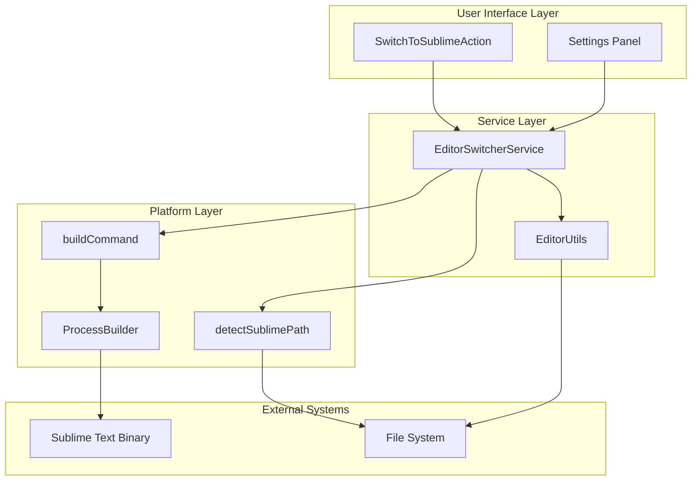
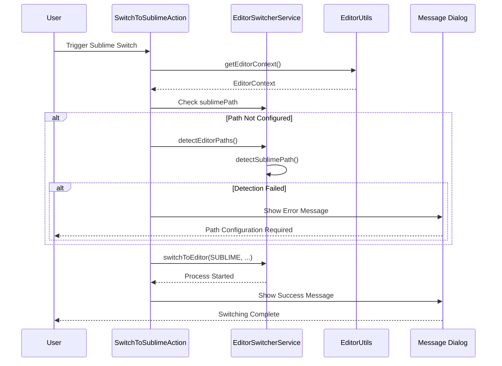
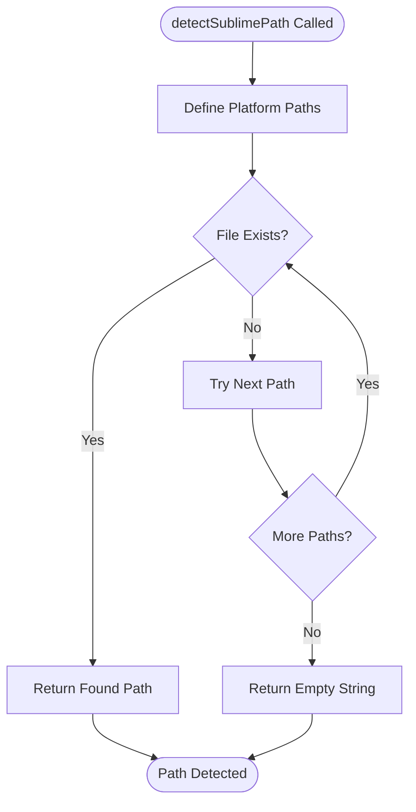
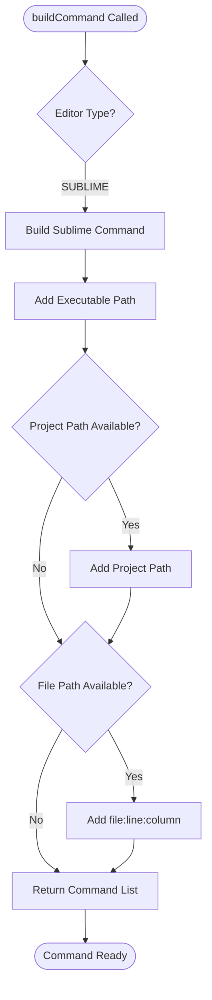
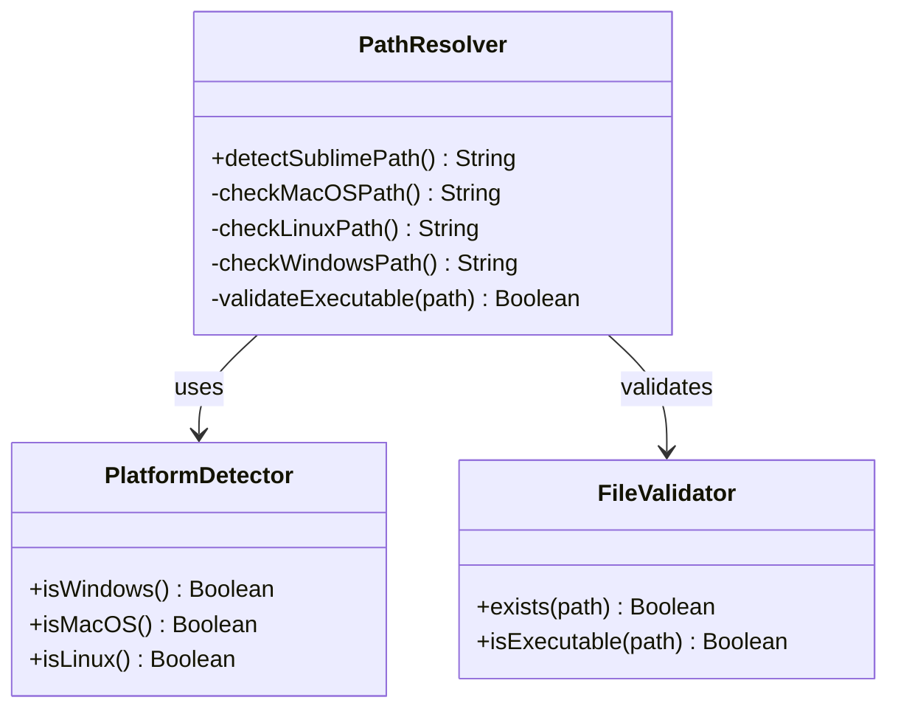
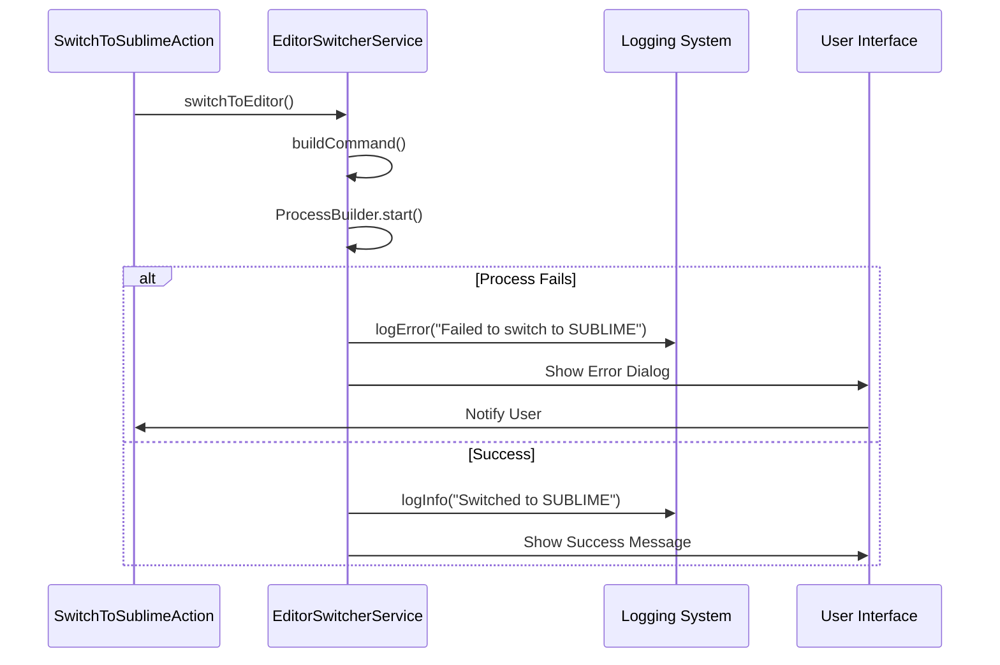
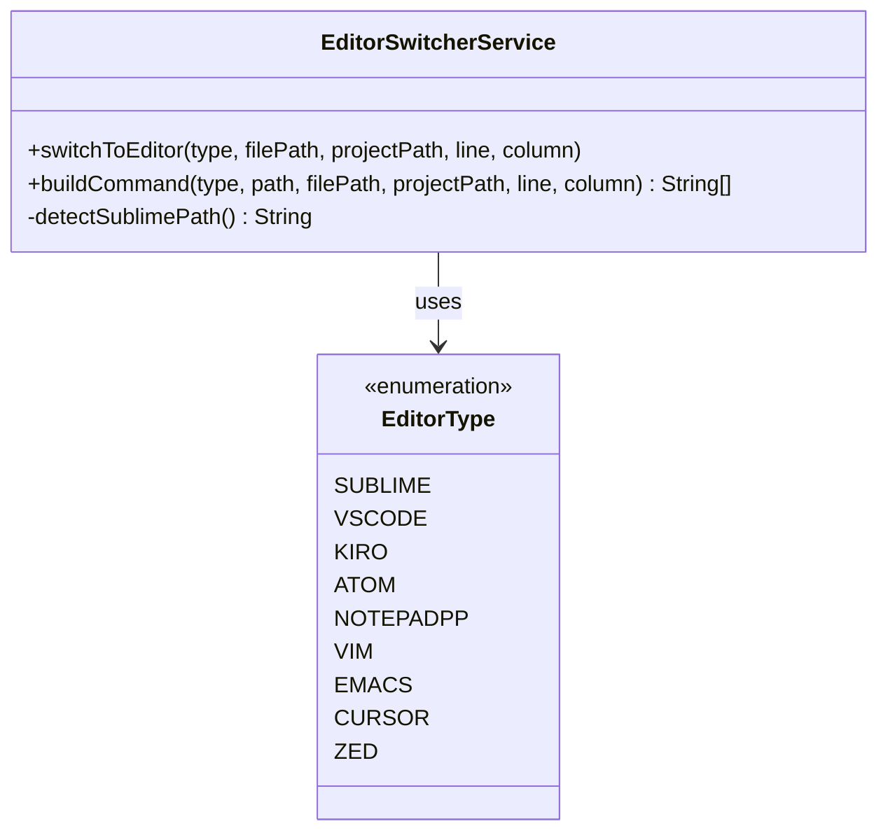

# Sublime Text Integration

<cite>
**Referenced Files in This Document**
- [SwitchToSublimeAction.kt](file://src/main/kotlin/io/yanxxcloud/editorswitcher/actions/SwitchToSublimeAction.kt)
- [EditorSwitcherService.kt](file://src/main/kotlin/io/yanxxcloud/editorswitcher/services/EditorSwitcherService.kt)
- [EditorUtils.kt](file://src/main/kotlin/io/yanxxcloud/editorswitcher/utils/EditorUtils.kt)
- [plugin.xml](file://src/main/resources/META-INF/plugin.xml)
- [CustomEditorConfig.kt](file://src/main/kotlin/io/yanxxcloud/editorswitcher/model/CustomEditorConfig.kt)
</cite>

## Table of Contents
1. [Introduction](#introduction)
2. [Architecture Overview](#architecture-overview)
3. [Core Components](#core-components)
4. [Sublime Text Path Detection](#sublime-text-path-detection)
5. [Command Building Logic](#command-building-logic)
6. [Platform-Specific Implementation](#platform-specific-implementation)
7. [Error Handling and Validation](#error-handling-and-validation)
8. [Integration Patterns](#integration-patterns)
9. [Troubleshooting Guide](#troubleshooting-guide)
10. [Best Practices](#best-practices)

## Introduction

The Smart Editor Switcher plugin provides seamless integration with Sublime Text, enabling developers to switch between JetBrains IDEs and Sublime Text while maintaining precise cursor positioning and project context. This integration leverages Sublime Text's native command-line interface, which accepts file paths with line and column coordinates in a straightforward format.

Sublime Text's simplicity makes it an ideal target for editor switching - the plugin can pass file:line:column combinations directly as a single argument, eliminating the need for complex command construction. This approach ensures reliable file opening with exact cursor positioning across all supported platforms.

## Architecture Overview

The Sublime Text integration follows a layered architecture pattern that separates concerns between user interface, service logic, and platform-specific operations.

**Diagram sources**
- [SwitchToSublimeAction.kt](file://src/main/kotlin/io/yanxxcloud/editorswitcher/actions/SwitchToSublimeAction.kt#L10-L45)
- [EditorSwitcherService.kt](file://src/main/kotlin/io/yanxxcloud/editorswitcher/services/EditorSwitcherService.kt#L35-L85)

## Core Components

### SwitchToSublimeAction

The primary action handler that orchestrates the Sublime Text switching process. This component serves as the entry point for user interactions and manages the complete workflow from context extraction to process execution.

**Diagram sources**
- [SwitchToSublimeAction.kt](file://src/main/kotlin/io/yanxxcloud/editorswitcher/actions/SwitchToSublimeAction.kt#L10-L45)

**Section sources**
- [SwitchToSublimeAction.kt](file://src/main/kotlin/io/yanxxcloud/editorswitcher/actions/SwitchToSublimeAction.kt#L1-L46)

### EditorSwitcherService

The central service that manages editor configurations, path detection, and command execution. This service maintains the core logic for building commands and handling process execution.

**Section sources**
- [EditorSwitcherService.kt](file://src/main/kotlin/io/yanxxcloud/editorswitcher/services/EditorSwitcherService.kt#L35-L85)

### EditorUtils

Provides context extraction functionality, capturing current file, project, and cursor position information necessary for accurate editor switching.

**Section sources**
- [EditorUtils.kt](file://src/main/kotlin/io/yanxxcloud/editorswitcher/utils/EditorUtils.kt#L10-L45)

## Sublime Text Path Detection

The plugin implements intelligent path detection for Sublime Text across multiple platforms, automatically locating the executable in common installation locations.

### Platform-Specific Paths

The detection mechanism searches for Sublime Text binaries in standard installation locations:

| Platform | Path Pattern | Example |
|----------|-------------|---------|
| macOS | `/Applications/Sublime Text.app/Contents/SharedSupport/bin/subl` | Native macOS installation |
| Linux | `/usr/local/bin/subl` | Package manager installations |
| Linux | `/opt/sublime_text/sublime_text` | Manual installations |
| Windows | `C:\Program Files\Sublime Text\subl.exe` | Standard Windows installation |
| Windows | `C:\Program Files (x86)\Sublime Text\subl.exe` | 32-bit installations |

### Detection Algorithm

**Diagram sources**
- [EditorSwitcherService.kt](file://src/main/kotlin/io/yanxxcloud/editorswitcher/services/EditorSwitcherService.kt#L200-L212)

**Section sources**
- [EditorSwitcherService.kt](file://src/main/kotlin/io/yanxxcloud/editorswitcher/services/EditorSwitcherService.kt#L200-L212)

## Command Building Logic

Sublime Text's command-line interface accepts a unique file specification format that simplifies the command construction process. The plugin leverages this simplicity to create efficient and reliable commands.

### Sublime Text Command Format

Sublime Text supports passing file paths with line and column information using the format: `file_path:line:column`. This single-argument approach eliminates the need for complex quoting or escaping mechanisms.

### Command Construction Process

**Diagram sources**
- [EditorSwitcherService.kt](file://src/main/kotlin/io/yanxxcloud/editorswitcher/services/EditorSwitcherService.kt#L87-L120)

### Command Examples

The following examples demonstrate how the plugin constructs commands for different scenarios:

| Scenario | Command Structure | Example Output |
|----------|------------------|----------------|
| Single File | `[executable, file:line:column]` | `["/usr/bin/subl", "/path/to/file.py:42:15"]` |
| Project + File | `[executable, project, file:line:column]` | `["/usr/bin/subl", "/project/path", "/project/file.py:42:15"]` |
| No File Context | `[executable, project]` | `["/usr/bin/subl", "/project/path"]` |

**Section sources**
- [EditorSwitcherService.kt](file://src/main/kotlin/io/yanxxcloud/editorswitcher/services/EditorSwitcherService.kt#L105-L110)

## Platform-Specific Implementation

The plugin handles platform differences transparently, ensuring consistent behavior across operating systems while respecting each platform's conventions.

### Binary Naming Conventions

Different platforms use distinct executable names:

- **macOS/Linux**: `subl` (symlink or direct executable)
- **Windows**: `subl.exe` (executable with extension)

### Path Resolution Strategy

The plugin employs a robust path resolution strategy that accounts for various installation scenarios:

**Diagram sources**
- [EditorSwitcherService.kt](file://src/main/kotlin/io/yanxxcloud/editorswitcher/services/EditorSwitcherService.kt#L200-L212)

**Section sources**
- [EditorSwitcherService.kt](file://src/main/kotlin/io/yanxxcloud/editorswitcher/services/EditorSwitcherService.kt#L200-L212)

## Error Handling and Validation

The plugin implements comprehensive error handling to manage common failure scenarios gracefully and provide meaningful feedback to users.

### Error Scenarios

| Error Type | Cause | Handling Strategy |
|------------|-------|------------------|
| Path Not Found | Sublime Text not installed or path not configured | Auto-detection followed by user notification |
| Process Execution Failure | Binary inaccessible or invalid arguments | Detailed logging and user feedback |
| Invalid File Path | Specified file doesn't exist | Graceful degradation with project context |
| Permission Denied | Insufficient permissions to execute binary | Clear error messaging |

### Error Recovery Flow

**Diagram sources**
- [EditorSwitcherService.kt](file://src/main/kotlin/io/yanxxcloud/editorswitcher/services/EditorSwitcherService.kt#L55-L65)
- [SwitchToSublimeAction.kt](file://src/main/kotlin/io/yanxxcloud/editorswitcher/actions/SwitchToSublimeAction.kt#L15-L25)

**Section sources**
- [EditorSwitcherService.kt](file://src/main/kotlin/io/yanxxcloud/editorswitcher/services/EditorSwitcherService.kt#L55-L65)
- [SwitchToSublimeAction.kt](file://src/main/kotlin/io/yanxxcloud/editorswitcher/actions/SwitchToSublimeAction.kt#L15-L25)

## Integration Patterns

The Sublime Text integration demonstrates several key patterns that enhance maintainability and extensibility.

### Service-Oriented Architecture

The plugin follows a service-oriented pattern where responsibilities are clearly separated:

- **Action Layer**: Handles user interactions and UI feedback
- **Service Layer**: Manages business logic and cross-cutting concerns
- **Utility Layer**: Provides reusable functionality for context extraction

### Template-Based Command Generation

The command building process uses a template-based approach that can be easily extended for new editors:

**Diagram sources**
- [EditorSwitcherService.kt](file://src/main/kotlin/io/yanxxcloud/editorswitcher/services/EditorSwitcherService.kt#L450-L462)

**Section sources**
- [EditorSwitcherService.kt](file://src/main/kotlin/io/yanxxcloud/editorswitcher/services/EditorSwitcherService.kt#L450-L462)

## Troubleshooting Guide

This section addresses common issues users may encounter when using the Sublime Text integration.

### Path Resolution Issues

**Problem**: "Sublime Text 路径未配置" error message appears.

**Causes and Solutions**:
1. **Sublime Text Not Installed**: Verify Sublime Text is installed on your system
2. **Installation Location**: Check if Sublime Text is installed in a non-standard location
3. **Permissions**: Ensure the executable has proper permissions

**Resolution Steps**:
1. Navigate to Settings → Tools → Smart Editor Switcher
2. Click "自动检测路径" (Auto Detect Paths)
3. If automatic detection fails, manually configure the path in the settings panel

### Malformed Command Arguments

**Problem**: Process execution fails with command line errors.

**Common Causes**:
- Invalid file path format
- Missing required arguments
- Platform-specific path separators

**Debugging Approach**:
1. Enable debug logging in the plugin settings
2. Check the IDE's event log for detailed error messages
3. Verify file paths are properly escaped for the target platform

### Performance Issues

**Problem**: Delayed response when switching to Sublime Text.

**Optimization Strategies**:
- Ensure Sublime Text executable is not resource-intensive on startup
- Verify file system accessibility for project and file paths
- Consider disabling unnecessary plugins during editor switching

**Section sources**
- [SwitchToSublimeAction.kt](file://src/main/kotlin/io/yanxxcloud/editorswitcher/actions/SwitchToSublimeAction.kt#L15-L25)

## Best Practices

### Configuration Management

1. **Use Auto-Detection**: Rely on the automatic path detection feature for initial setup
2. **Manual Override**: Configure paths manually only when auto-detection fails
3. **Validation**: Regularly verify configured paths are accessible and functional

### Error Prevention

1. **Path Validation**: Always validate file and project paths before attempting to switch
2. **Graceful Degradation**: Handle missing files or inaccessible paths gracefully
3. **User Feedback**: Provide clear, actionable error messages for troubleshooting

### Performance Optimization

1. **Lazy Initialization**: Paths are detected only when needed
2. **Caching**: Successfully detected paths are cached for subsequent operations
3. **Minimal Dependencies**: The integration has minimal overhead on the main thread

### Extensibility Considerations

1. **Template System**: Leverage the template-based command system for future editor support
2. **Configuration Model**: Use the CustomEditorConfig model for adding new editors
3. **Logging**: Implement comprehensive logging for debugging and monitoring

The Sublime Text integration exemplifies how simple command-line interfaces can be effectively leveraged for IDE integration, providing users with reliable, fast, and intuitive editor switching capabilities while maintaining the precision of cursor positioning and project context.