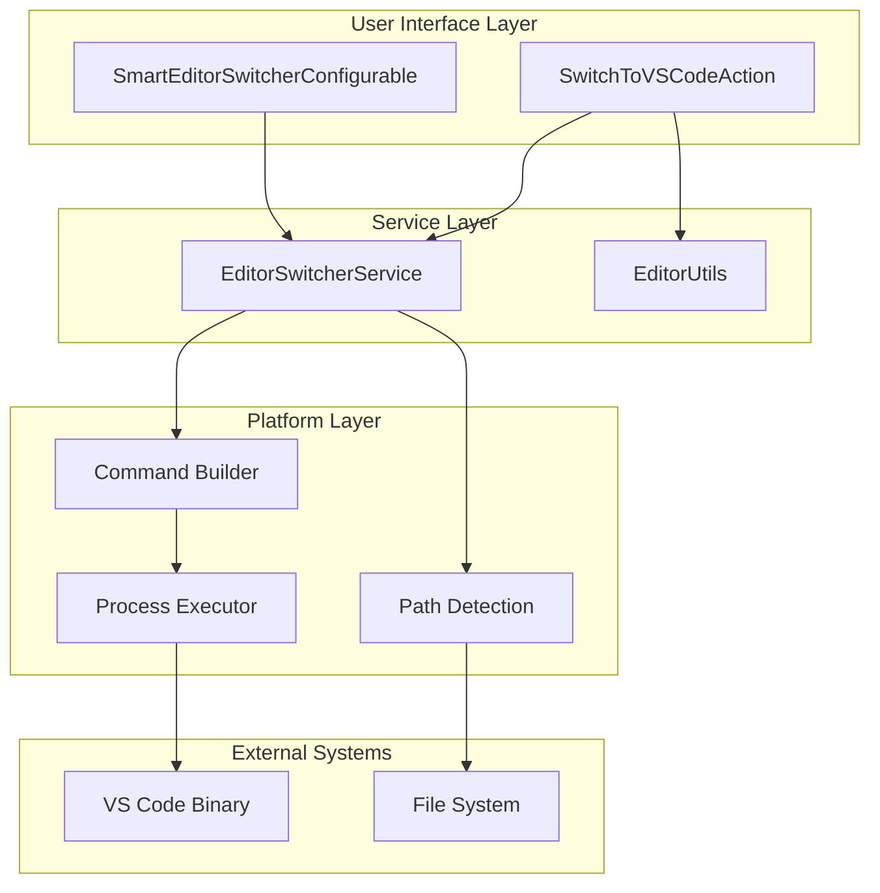
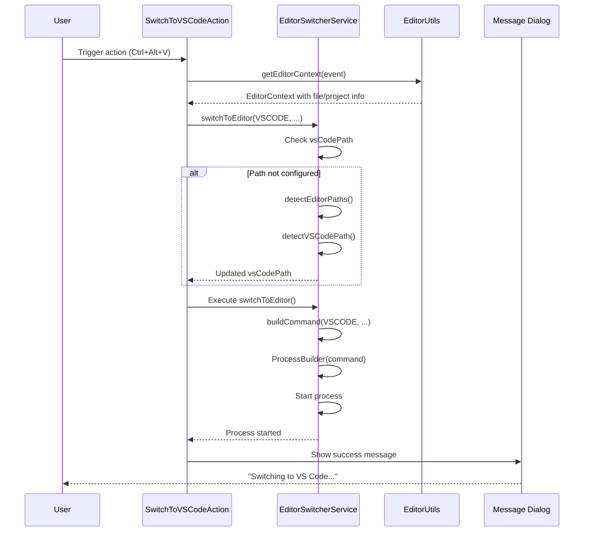
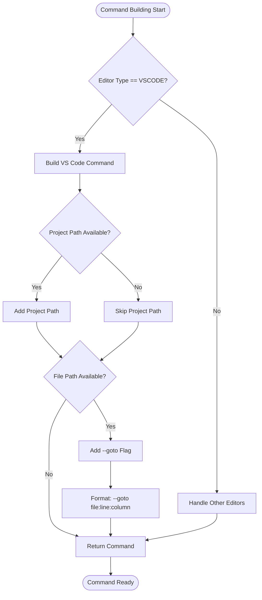
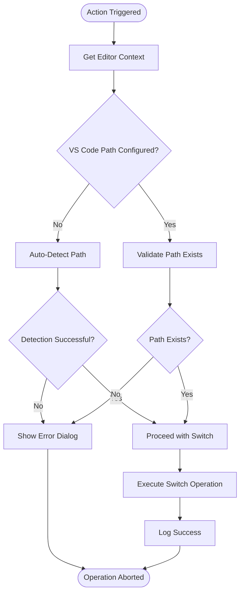
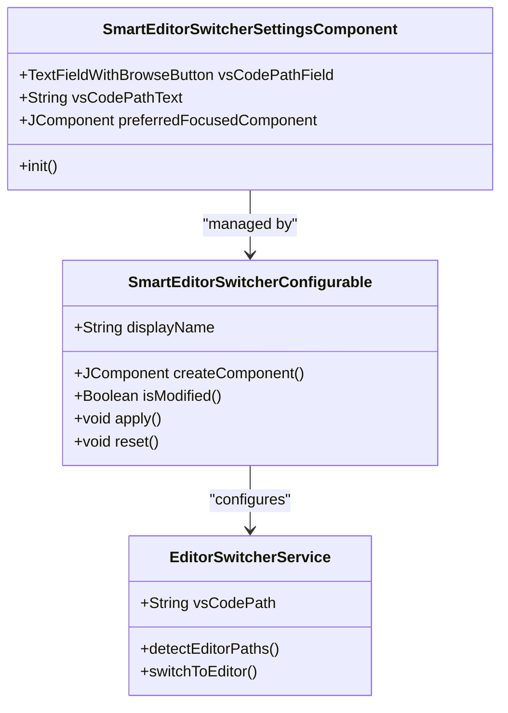

# VS Code Integration

<cite>
**Referenced Files in This Document**
- [SwitchToVSCodeAction.kt](file://src/main/kotlin/io/yanxxcloud/editorswitcher/actions/SwitchToVSCodeAction.kt)
- [EditorSwitcherService.kt](file://src/main/kotlin/io/yanxxcloud/editorswitcher/services/EditorSwitcherService.kt)
- [EditorUtils.kt](file://src/main/kotlin/io/yanxxcloud/editorswitcher/utils/EditorUtils.kt)
- [plugin.xml](file://src/main/resources/META-INF/plugin.xml)
- [SmartEditorSwitcherConfigurable.kt](file://src/main/kotlin/io/yanxxcloud/editorswitcher/settings/SmartEditorSwitcherConfigurable.kt)
- [SmartEditorSwitcherSettingsComponent.kt](file://src/main/kotlin/io/yanxxcloud/editorswitcher/settings/SmartEditorSwitcherSettingsComponent.kt)
- [README.md](file://README.md)
- [INSTALL.md](file://INSTALL.md)
</cite>

## Table of Contents
1. [Introduction](#introduction)
2. [Architecture Overview](#architecture-overview)
3. [Core Components](#core-components)
4. [VS Code Action Implementation](#vs-code-action-implementation)
5. [Command Construction and Execution](#command-construction-and-execution)
6. [Platform-Specific Path Detection](#platform-specific-path-detection)
7. [Error Handling and Validation](#error-handling-and-validation)
8. [Cross-Platform Considerations](#cross-platform-considerations)
9. [Configuration Management](#configuration-management)
10. [Troubleshooting Guide](#troubleshooting-guide)
11. [Best Practices](#best-practices)

## Introduction

The Smart Editor Switcher plugin provides seamless integration with Visual Studio Code (VS Code) through a sophisticated action system that enables developers to switch between JetBrains IDEs and VS Code while maintaining cursor position, file context, and project information. The VS Code integration is built around the `SwitchToVSCodeAction` class, which orchestrates the entire switching process through the `EditorSwitcherService`.

This integration supports intelligent path detection across multiple platforms, automatic command construction with proper goto syntax, and comprehensive error handling to ensure reliable operation in diverse development environments.

## Architecture Overview

The VS Code integration follows a layered architecture pattern with clear separation of concerns:



**Diagram sources**
- [SwitchToVSCodeAction.kt](file://src/main/kotlin/io/yanxxcloud/editorswitcher/actions/SwitchToVSCodeAction.kt#L1-L46)
- [EditorSwitcherService.kt](file://src/main/kotlin/io/yanxxcloud/editorswitcher/services/EditorSwitcherService.kt#L1-L268)

## Core Components

### SwitchToVSCodeAction

The `SwitchToVSCodeAction` serves as the primary entry point for VS Code switching operations. This action extends IntelliJ's `AnAction` class and provides the user interface interaction logic.

Key responsibilities:
- Retrieves editor context information using `EditorUtils`
- Validates VS Code path configuration
- Handles user feedback through message dialogs
- Coordinates with `EditorSwitcherService` for actual switching

### EditorSwitcherService

The service acts as the central coordinator for all editor switching operations, including VS Code integration. It maintains editor path configurations and provides the core switching logic.

Core functionality:
- Manages editor path detection and storage
- Constructs platform-appropriate commands
- Executes external processes for editor launching
- Provides centralized error handling

### EditorUtils

Provides utility functions for extracting editor context information, including file paths, project paths, and cursor positions.

**Section sources**
- [SwitchToVSCodeAction.kt](file://src/main/kotlin/io/yanxxcloud/editorswitcher/actions/SwitchToVSCodeAction.kt#L1-L46)
- [EditorSwitcherService.kt](file://src/main/kotlin/io/yanxxcloud/editorswitcher/services/EditorSwitcherService.kt#L1-L268)
- [EditorUtils.kt](file://src/main/kotlin/io/yanxxcloud/editorswitcher/utils/EditorUtils.kt#L1-L45)

## VS Code Action Implementation

The `SwitchToVSCodeAction` implements a two-phase approach for VS Code switching:



**Diagram sources**
- [SwitchToVSCodeAction.kt](file://src/main/kotlin/io/yanxxcloud/editorswitcher/actions/SwitchToVSCodeAction.kt#L8-L35)
- [EditorSwitcherService.kt](file://src/main/kotlin/io/yanxxcloud/editorswitcher/services/EditorSwitcherService.kt#L35-L55)

The action implementation follows these critical steps:

1. **Context Extraction**: Uses `EditorUtils.getEditorContext()` to extract current file, project, and cursor position information
2. **Path Validation**: Checks if VS Code path is configured, triggering auto-detection if necessary
3. **Error Handling**: Displays appropriate error messages if VS Code path cannot be determined
4. **Service Coordination**: Delegates the actual switching operation to `EditorSwitcherService`
5. **User Feedback**: Provides immediate feedback about the switching operation

**Section sources**
- [SwitchToVSCodeAction.kt](file://src/main/kotlin/io/yanxxcloud/editorswitcher/actions/SwitchToVSCodeAction.kt#L8-L35)

## Command Construction and Execution

The `buildCommand()` method in `EditorSwitcherService` constructs the appropriate command-line arguments for VS Code based on the current context:



**Diagram sources**
- [EditorSwitcherService.kt](file://src/main/kotlin/io/yanxxcloud/editorswitcher/services/EditorSwitcherService.kt#L57-L140)

### VS Code Specific Command Construction

For VS Code, the command construction follows this pattern:

- **Basic Command**: `["/path/to/code", "--goto", "file:line:column"]`
- **With Project Context**: `["/path/to/code", "/path/to/project", "--goto", "file:line:column"]`

The `--goto` flag is specifically designed to:
- Navigate directly to the target file
- Position the cursor at the specified line and column
- Open the file in the existing VS Code window when possible

**Section sources**
- [EditorSwitcherService.kt](file://src/main/kotlin/io/yanxxcloud/editorswitcher/services/EditorSwitcherService.kt#L57-L140)

## Platform-Specific Path Detection

The plugin implements comprehensive path detection for VS Code across multiple operating systems:

### macOS Detection Paths

```kotlin
private fun detectVSCodePath(): String {
    val possiblePaths = listOf(
        "/Applications/Visual Studio Code.app/Contents/Resources/app/bin/code",
        "/usr/local/bin/code",
        "/opt/visual-studio-code/bin/code"
    )
    return possiblePaths.firstOrNull { File(it).exists() } ?: ""
}
```

### Windows Detection Paths

```kotlin
private fun detectVSCodePath(): String {
    val possiblePaths = listOf(
        "C:\\Program Files\\Microsoft VS Code\\bin\\code.cmd",
        "C:\\Program Files (x86)\\Microsoft VS Code\\bin\\code.cmd"
    )
    return possiblePaths.firstOrNull { File(it).exists() } ?: ""
}
```

### Linux Detection Paths

```kotlin
private fun detectVSCodePath(): String {
    val possiblePaths = listOf(
        "/usr/local/bin/code",
        "/opt/visual-studio-code/bin/code"
    )
    return possiblePaths.firstOrNull { File(it).exists() } ?: ""
}
```

The detection algorithm follows a priority-based approach:
1. **Standard installation paths** for each platform
2. **Alternative locations** commonly used by users
3. **Fallback empty string** if no valid path is found

**Section sources**
- [EditorSwitcherService.kt](file://src/main/kotlin/io/yanxxcloud/editorswitcher/services/EditorSwitcherService.kt#L181-L190)

## Error Handling and Validation

The VS Code integration implements robust error handling at multiple levels:

### Path Validation



**Diagram sources**
- [SwitchToVSCodeAction.kt](file://src/main/kotlin/io/yanxxcloud/editorswitcher/actions/SwitchToVSCodeAction.kt#L10-L25)

### Error Scenarios and Handling

1. **Missing VS Code Path**: Displays dialog prompting user to configure path in settings
2. **Invalid Path**: Attempts auto-detection before failing gracefully
3. **Process Launch Failure**: Logs error details and continues operation
4. **Permission Issues**: Reports failure to user with appropriate messaging

### Logging and Diagnostics

The service provides comprehensive logging for troubleshooting:
- Successful command execution with parameters
- Path detection results
- Error conditions with stack traces
- Performance metrics for command execution

**Section sources**
- [SwitchToVSCodeAction.kt](file://src/main/kotlin/io/yanxxcloud/editorswitcher/actions/SwitchToVSCodeAction.kt#L10-L25)
- [EditorSwitcherService.kt](file://src/main/kotlin/io/yanxxcloud/editorswitcher/services/EditorSwitcherService.kt#L45-L55)

## Cross-Platform Considerations

### Path Resolution Strategies

The plugin handles cross-platform path differences through several mechanisms:

#### Absolute vs Relative Paths
- **Unix-like systems**: Uses forward slashes (`/`) for all paths
- **Windows**: Handles both forward and backward slash variations
- **Environment Variables**: Resolves `%USERNAME%` in Windows paths

#### Binary Executables
- **macOS**: Targets `.app/Contents/Resources/app/bin/code` for proper sandbox support
- **Windows**: Uses `.cmd` extension for proper executable resolution
- **Linux**: Relies on standard `/usr/bin` locations

#### File Permissions
- **Executable Flags**: Ensures detected binaries have execute permissions
- **Directory Access**: Validates read/write access to parent directories
- **User Context**: Operates within user's privilege boundaries

### Command Line Argument Formatting

Different platforms require specific argument formatting:

| Platform | Binary Extension | Working Directory | Argument Separator |
|----------|------------------|-------------------|-------------------|
| macOS | `.app` bundle | Bundle Resources | Space-separated |
| Windows | `.cmd` | Program Files | Space-separated |
| Linux | No extension | Standard bin | Space-separated |

**Section sources**
- [EditorSwitcherService.kt](file://src/main/kotlin/io/yanxxcloud/editorswitcher/services/EditorSwitcherService.kt#L181-L190)

## Configuration Management

### Settings Interface

The plugin provides a comprehensive settings interface for VS Code configuration:



**Diagram sources**
- [SmartEditorSwitcherSettingsComponent.kt](file://src/main/kotlin/io/yanxxcloud/editorswitcher/settings/SmartEditorSwitcherSettingsComponent.kt#L1-L62)
- [SmartEditorSwitcherConfigurable.kt](file://src/main/kotlin/io/yanxxcloud/editorswitcher/settings/SmartEditorSwitcherConfigurable.kt#L1-L56)

### Configuration Options

1. **Manual Path Entry**: Users can manually specify VS Code executable path
2. **Automatic Detection**: Click "Auto-detect paths" button to scan for VS Code installations
3. **Browse Dialog**: File chooser dialog for selecting VS Code executable
4. **Validation**: Real-time validation of entered paths

### Persistent Storage

Configuration data is stored in:
- **XML persistence**: `SmartEditorSwitcher.xml` in IDE configuration directory
- **Runtime caching**: Active service instance maintains current settings
- **Default fallbacks**: Built-in detection paths serve as defaults

**Section sources**
- [SmartEditorSwitcherSettingsComponent.kt](file://src/main/kotlin/io/yanxxcloud/editorswitcher/settings/SmartEditorSwitcherSettingsComponent.kt#L1-L62)
- [SmartEditorSwitcherConfigurable.kt](file://src/main/kotlin/io/yanxxcloud/editorswitcher/settings/SmartEditorSwitcherConfigurable.kt#L1-L56)

## Troubleshooting Guide

### Common Issues and Solutions

#### VS Code Path Not Found

**Symptoms**: Error dialog stating "VS Code 路径未配置" (VS Code path not configured)

**Causes**:
- VS Code not installed on the system
- Non-standard installation location
- Incorrect manual path configuration

**Solutions**:
1. Verify VS Code installation using system package manager
2. Use "Auto-detect paths" feature in settings
3. Manually browse to VS Code executable
4. Check installation path in VS Code preferences

#### Process Launch Failures

**Symptoms**: VS Code opens but doesn't navigate to the specified file

**Causes**:
- Incorrect goto syntax
- VS Code version compatibility issues
- Workspace locking or corruption

**Solutions**:
1. Verify VS Code version supports `--goto` flag
2. Restart VS Code to clear workspace state
3. Check command syntax in logs
4. Test with simpler file paths

#### Permission Errors

**Symptoms**: "Failed to switch to VS Code" error message

**Causes**:
- Insufficient file permissions
- Antivirus blocking execution
- Sandboxing restrictions

**Solutions**:
1. Run IDE with elevated privileges
2. Add IDE to antivirus exceptions
3. Check file permissions on VS Code executable
4. Verify user has execute permissions

### Diagnostic Information

Enable detailed logging to diagnose issues:
- Check IDE log files for error messages
- Review service logs for command execution details
- Monitor process execution in system task manager
- Validate path resolution results

### Environment-Specific Issues

#### macOS Specific
- **Sandbox Restrictions**: Some VS Code installations may be sandboxed
- **Gatekeeper**: May require manual approval in Security & Privacy settings
- **Bundle Structure**: Ensure using the correct app bundle path

#### Windows Specific
- **Antivirus Interference**: Some security software blocks external process launches
- **Path Length Limits**: Very long paths may exceed Windows limits
- **Execution Policy**: PowerShell execution policy may block script execution

#### Linux Specific
- **Desktop Environment**: Different DEs may handle external applications differently
- **Package Managers**: Snap or Flatpak installations may have different paths
- **Permissions**: Ensure executable bit is set on VS Code binary

**Section sources**
- [SwitchToVSCodeAction.kt](file://src/main/kotlin/io/yanxxcloud/editorswitcher/actions/SwitchToVSCodeAction.kt#L15-L25)
- [EditorSwitcherService.kt](file://src/main/kotlin/io/yanxxcloud/editorswitcher/services/EditorSwitcherService.kt#L45-L55)

## Best Practices

### Development Guidelines

1. **Path Validation**: Always validate paths before attempting to execute
2. **Graceful Degradation**: Provide meaningful fallbacks when paths are unavailable
3. **User Feedback**: Offer clear, actionable error messages
4. **Logging**: Implement comprehensive logging for troubleshooting
5. **Testing**: Test across all supported platforms regularly

### Performance Optimization

1. **Lazy Loading**: Detect paths only when needed
2. **Caching**: Cache detection results to avoid repeated filesystem scans
3. **Async Operations**: Perform path detection asynchronously when possible
4. **Resource Cleanup**: Properly dispose of resources after operations

### Security Considerations

1. **Input Validation**: Sanitize all user-provided paths
2. **Privilege Escalation**: Avoid unnecessary elevation of privileges
3. **Path Traversal**: Prevent malicious path manipulation
4. **Process Isolation**: Ensure external processes run securely

### Maintenance Recommendations

1. **Version Compatibility**: Regularly test with new VS Code releases
2. **Platform Updates**: Adapt to OS-specific changes promptly
3. **Documentation**: Keep configuration guides updated
4. **Community Feedback**: Monitor user-reported issues and improvements

The VS Code integration in the Smart Editor Switcher plugin demonstrates sophisticated cross-platform development with robust error handling, comprehensive path detection, and user-friendly configuration management. Its modular architecture ensures maintainability while providing reliable functionality across diverse development environments.