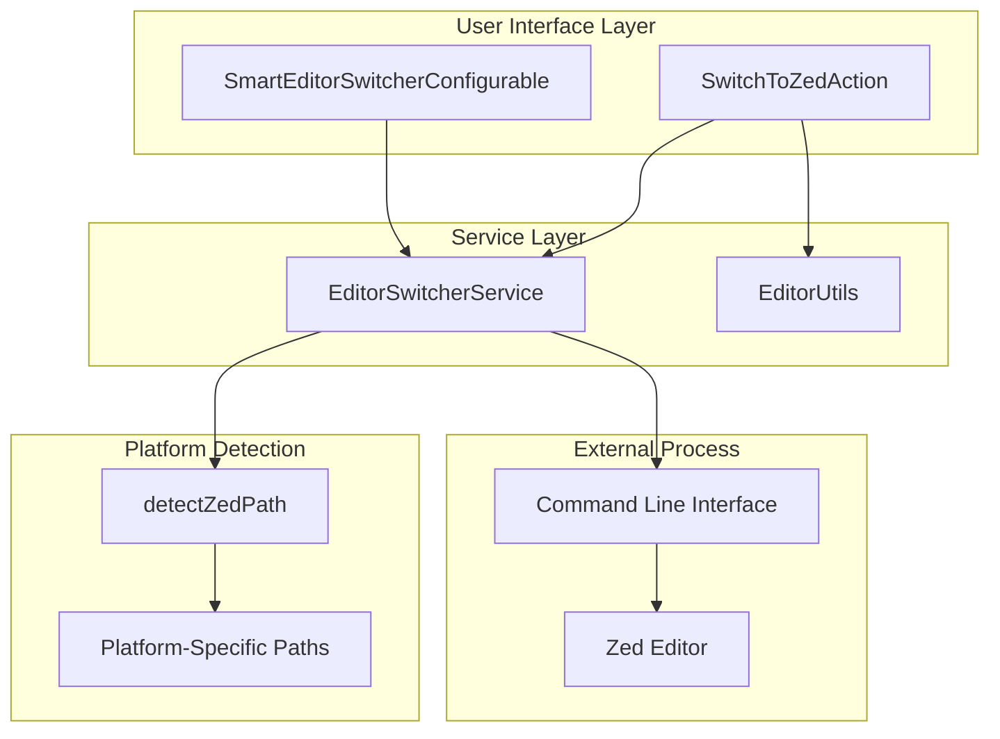
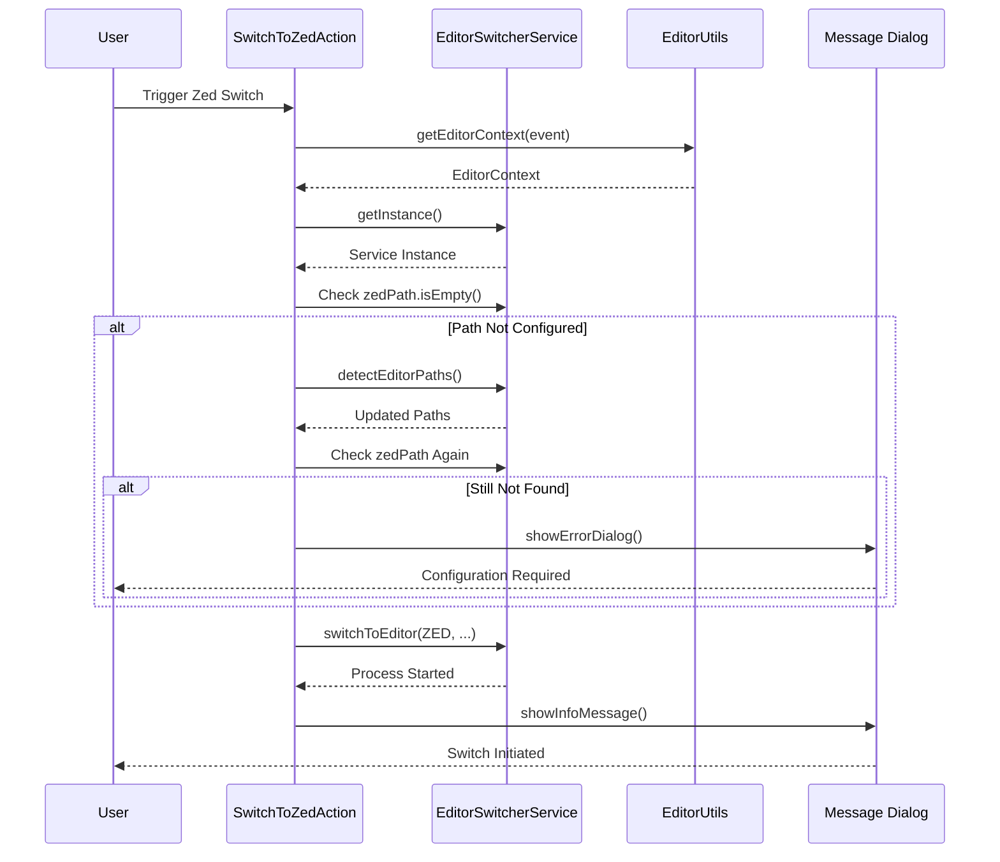
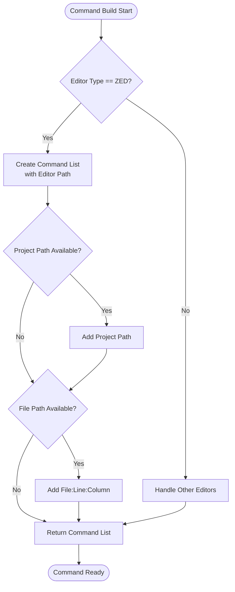
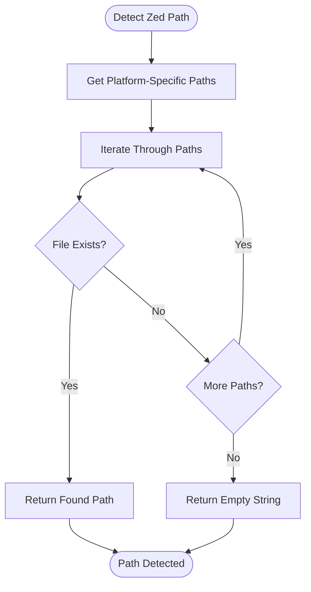

# Zed Integration

<cite>
**Referenced Files in This Document**
- [SwitchToZedAction.kt](file://src/main/kotlin/io/yanxxcloud/editorswitcher/actions/SwitchToZedAction.kt)
- [EditorSwitcherService.kt](file://src/main/kotlin/io/yanxxcloud/editorswitcher/services/EditorSwitcherService.kt)
- [EditorUtils.kt](file://src/main/kotlin/io/yanxxcloud/editorswitcher/utils/EditorUtils.kt)
- [plugin.xml](file://src/main/resources/META-INF/plugin.xml)
- [SmartEditorSwitcherConfigurable.kt](file://src/main/kotlin/io/yanxxcloud/editorswitcher/settings/SmartEditorSwitcherConfigurable.kt)
</cite>

## Table of Contents
1. [Introduction](#introduction)
2. [Architecture Overview](#architecture-overview)
3. [Core Components](#core-components)
4. [Zed Action Implementation](#zed-action-implementation)
5. [Command Building Process](#command-building-process)
6. [Platform-Specific Path Detection](#platform-specific-path-detection)
7. [Error Handling and Troubleshooting](#error-handling-and-troubleshooting)
8. [Integration Benefits](#integration-benefits)
9. [Configuration and Setup](#configuration-and-setup)
10. [Troubleshooting Guide](#troubleshooting-guide)

## Introduction

The Zed integration within the Smart Editor Switcher plugin provides seamless switching capabilities between JetBrains IDEs and the high-performance Zed code editor. Zed stands out for its simplicity and efficiency, offering a streamlined approach to file editing with minimal overhead compared to traditional desktop applications.

This integration leverages Zed's native command-line interface, which accepts direct file:line:column notation without requiring special flags or complex argument parsing. The implementation demonstrates the plugin's ability to handle diverse editor interfaces while maintaining consistent functionality across different platforms.

## Architecture Overview

The Zed integration follows the established architecture pattern used throughout the Smart Editor Switcher plugin, utilizing a service-oriented approach with dedicated action classes and utility functions.

**Diagram sources**
- [SwitchToZedAction.kt](file://src/main/kotlin/io/yanxxcloud/editorswitcher/actions/SwitchToZedAction.kt#L1-L46)
- [EditorSwitcherService.kt](file://src/main/kotlin/io/yanxxcloud/editorswitcher/services/EditorSwitcherService.kt#L1-L268)

## Core Components

### SwitchToZedAction

The [`SwitchToZedAction`](file://src/main/kotlin/io/yanxxcloud/editorswitcher/actions/SwitchToZedAction.kt#L10-L45) serves as the primary entry point for Zed integration, extending the IntelliJ Platform's `AnAction` base class to integrate seamlessly with the IDE's action system.

Key responsibilities include:
- Retrieving editor context information using [`EditorUtils.getEditorContext()`](file://src/main/kotlin/io/yanxxcloud/editorswitcher/utils/EditorUtils.kt#L15-L44)
- Validating Zed installation path configuration
- Coordinating with the [`EditorSwitcherService`](file://src/main/kotlin/io/yanxxcloud/editorswitcher/services/EditorSwitcherService.kt#L15-L267) for actual editor launching
- Providing user feedback through message dialogs

### EditorSwitcherService

The [`EditorSwitcherService`](file://src/main/kotlin/io/yanxxcloud/editorswitcher/services/EditorSwitcherService.kt#L15-L267) acts as the central orchestrator for all editor switching operations, including specialized handling for Zed's unique command-line interface.

**Section sources**
- [SwitchToZedAction.kt](file://src/main/kotlin/io/yanxxcloud/editorswitcher/actions/SwitchToZedAction.kt#L1-L46)
- [EditorSwitcherService.kt](file://src/main/kotlin/io/yanxxcloud/editorswitcher/services/EditorSwitcherService.kt#L1-L268)

## Zed Action Implementation

### Initialization and Validation

The Zed action begins by establishing the editor context, capturing essential information about the current file, project, and cursor position. This context is crucial for maintaining precision during the switch operation.

**Diagram sources**
- [SwitchToZedAction.kt](file://src/main/kotlin/io/yanxxcloud/editorswitcher/actions/SwitchToZedAction.kt#L12-L35)
- [EditorUtils.kt](file://src/main/kotlin/io/yanxxcloud/editorswitcher/utils/EditorUtils.kt#L15-L44)

### Error Handling Mechanism

The implementation includes robust error handling to guide users through configuration issues. When Zed is not properly configured, the system provides clear messaging directing users to the appropriate configuration settings.

**Section sources**
- [SwitchToZedAction.kt](file://src/main/kotlin/io/yanxxcloud/editorswitcher/actions/SwitchToZedAction.kt#L15-L25)

## Command Building Process

### Zed-Specific Command Construction

The [`buildCommand`](file://src/main/kotlin/io/yanxxcloud/editorswitcher/services/EditorSwitcherService.kt#L67-L130) method handles the construction of Zed-specific commands, leveraging the editor's straightforward CLI interface.

**Diagram sources**
- [EditorSwitcherService.kt](file://src/main/kotlin/io/yanxxcloud/editorswitcher/services/EditorSwitcherService.kt#L118-L125)

### Command Format Specification

Zed's CLI interface accepts a simple yet powerful command format:
- **Basic Usage**: `{editor_path} {project_path} {file_path}:{line}:{column}`
- **File-only Usage**: `{editor_path} {file_path}:{line}:{column}`

This approach eliminates the need for complex flag parsing or argument validation, making the integration exceptionally reliable and fast.

**Section sources**
- [EditorSwitcherService.kt](file://src/main/kotlin/io/yanxxcloud/editorswitcher/services/EditorSwitcherService.kt#L118-L125)

## Platform-Specific Path Detection

### Automatic Path Discovery

The [`detectZedPath`](file://src/main/kotlin/io/yanxxcloud/editorswitcher/services/EditorSwitcherService.kt#L253-L267) method implements intelligent path detection for multiple operating systems:

| Platform | Primary Location | Fallback Locations |
|----------|------------------|-------------------|
| **macOS** | `/Applications/Zed.app/Contents/MacOS/zed` | `/usr/local/bin/zed`, `/opt/zed/zed` |
| **Windows** | `C:\Program Files\Zed\zed.exe` | `%USERPROFILE%\AppData\Local\Programs\Zed\zed.exe` |
| **Linux** | `/usr/local/bin/zed` | `/opt/zed/zed` |

### Detection Algorithm

The path detection follows a prioritized approach:
1. **Primary Installation Path**: Standard installation location for the detected OS
2. **Alternative Binaries**: System-wide installation paths
3. **Fallback Detection**: User-specific installation locations
4. **Empty String**: Indicates unsuccessful detection

**Diagram sources**
- [EditorSwitcherService.kt](file://src/main/kotlin/io/yanxxcloud/editorswitcher/services/EditorSwitcherService.kt#L253-L267)

**Section sources**
- [EditorSwitcherService.kt](file://src/main/kotlin/io/yanxxcloud/editorswitcher/services/EditorSwitcherService.kt#L253-L267)

## Error Handling and Troubleshooting

### Configuration Issues

When Zed is not properly configured, the system provides clear guidance through multiple layers of error handling:

1. **Initial Validation**: Checks if `zedPath` is empty
2. **Automatic Detection**: Attempts to automatically discover the installation
3. **User Notification**: Provides specific error messages with configuration guidance
4. **Graceful Degradation**: Prevents crashes while informing users of the issue

### Common Error Scenarios

| Scenario | Symptoms | Resolution |
|----------|----------|------------|
| **Missing Installation** | Error dialog appears | Install Zed from [https://zed.dev](https://zed.dev) |
| **Path Not Configured** | "Zed 路径未配置" message | Configure path in Settings → Tools → Smart Editor Switcher |
| **Permission Issues** | Process fails to start | Verify executable permissions on Zed binary |
| **Invalid File Path** | Editor opens but file not found | Check file accessibility and path validity |

### Debugging Information

The service logs detailed information about command execution, including:
- Executable path being used
- Full command string being executed
- Execution timing and success status
- Error details for troubleshooting

**Section sources**
- [SwitchToZedAction.kt](file://src/main/kotlin/io/yanxxcloud/editorswitcher/actions/SwitchToZedAction.kt#L15-L25)
- [EditorSwitcherService.kt](file://src/main/kotlin/io/yanxxcloud/editorswitcher/services/EditorSwitcherService.kt#L45-L55)

## Integration Benefits

### Simplicity Advantage

Zed's integration benefits from several key advantages:

1. **Minimal Configuration**: No special flags or complex argument parsing required
2. **Fast Launch**: Direct binary execution without wrapper processes
3. **Reliable Positioning**: Consistent file:line:column format across platforms
4. **Clean Integration**: No temporary files or complex state management

### Comparison with Other Editors

| Feature | Zed | VS Code | Sublime Text | Vim |
|---------|-----|---------|--------------|-----|
| **CLI Arguments** | `file:line:column` | `--goto file:line:column` | `file:line:column` | `+line file` |
| **Path Detection** | Simple binary check | Multiple executable locations | App bundle detection | Shell integration |
| **Error Handling** | Built-in validation | Extension-based | Manual configuration | Environment-dependent |
| **Performance** | Native binary | Electron-based | C++ executable | Terminal integration |

### User Experience Benefits

- **Predictable Behavior**: Consistent command format across all supported editors
- **Immediate Feedback**: Clear error messages guide users to resolution
- **Seamless Context Transfer**: Maintains cursor position and file context
- **Cross-Platform Compatibility**: Works identically on macOS, Windows, and Linux

## Configuration and Setup

### Manual Configuration

Users can manually configure the Zed path through the plugin settings interface:

1. Navigate to **Settings → Tools → Smart Editor Switcher**
2. Locate the Zed path field
3. Enter the full path to the Zed executable
4. Click "Apply" to save configuration

### Auto-Detection Process

The auto-detection feature automatically discovers Zed installations:

1. **System Scan**: Searches predefined installation locations
2. **Path Validation**: Verifies executable accessibility
3. **Configuration Update**: Updates the stored path automatically
4. **User Notification**: Reports successful detection or failure

### Configuration Persistence

All editor configurations are persisted in the IDE's persistent storage system, ensuring:
- Settings survive IDE restarts
- Configurations transfer between projects
- User preferences maintained across sessions

**Section sources**
- [SmartEditorSwitcherConfigurable.kt](file://src/main/kotlin/io/yanxxcloud/editorswitcher/settings/SmartEditorSwitcherConfigurable.kt#L15-L55)

## Troubleshooting Guide

### Launch Issues

#### Problem: Zed Doesn't Start After Switch
**Symptoms**: Action executes but Zed doesn't open
**Diagnosis Steps**:
1. Verify Zed is installed and accessible
2. Check the configured path in plugin settings
3. Test the path manually in terminal/command prompt
4. Review IDE logs for execution errors

**Solutions**:
- Reconfigure the path using auto-detection
- Verify executable permissions
- Check antivirus software blocking execution
- Ensure Zed is compatible with your system architecture

#### Problem: Incorrect Cursor Positioning
**Symptoms**: Zed opens but cursor is not at expected location
**Diagnosis Steps**:
1. Verify file exists at the reported path
2. Check line and column values in context
3. Test with a simple file to isolate the issue
4. Review command format in debug logs

**Solutions**:
- Confirm file accessibility and modification time
- Verify Zed version supports file:line:column format
- Check for file encoding issues affecting line counting
- Test with different file types and sizes

### Path Configuration Issues

#### Problem: Auto-Detection Fails
**Symptoms**: "Zed 路径未配置" message despite installation
**Diagnosis Steps**:
1. Verify Zed is installed in standard locations
2. Check user permissions for installation directories
3. Test manual path specification
4. Review system PATH environment variables

**Solutions**:
- Specify path manually in settings
- Add installation directory to system PATH
- Use absolute path to executable
- Contact support if installation is in unusual location

### Performance Considerations

#### Slow Switch Operations
**Symptoms**: Delayed response when switching to Zed
**Optimization Strategies**:
- Ensure Zed executable is not compressed or network-mounted
- Verify sufficient system resources
- Check for antivirus interference
- Monitor disk I/O performance

#### Memory Usage
**Monitoring Approach**:
- Track Zed process memory consumption
- Monitor IDE performance during switches
- Check for memory leaks in long-running sessions
- Optimize file caching strategies

### Advanced Debugging

For complex issues, enable detailed logging:
1. Access IDE logs through Help → Show Log in Finder/Explorer
2. Filter for "EditorSwitcherService" entries
3. Review command execution traces
4. Monitor process creation and termination events

**Section sources**
- [EditorSwitcherService.kt](file://src/main/kotlin/io/yanxxcloud/editorswitcher/services/EditorSwitcherService.kt#L45-L55)
- [SwitchToZedAction.kt](file://src/main/kotlin/io/yanxxcloud/editorswitcher/actions/SwitchToZedAction.kt#L15-L25)