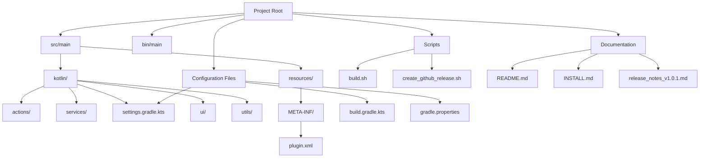
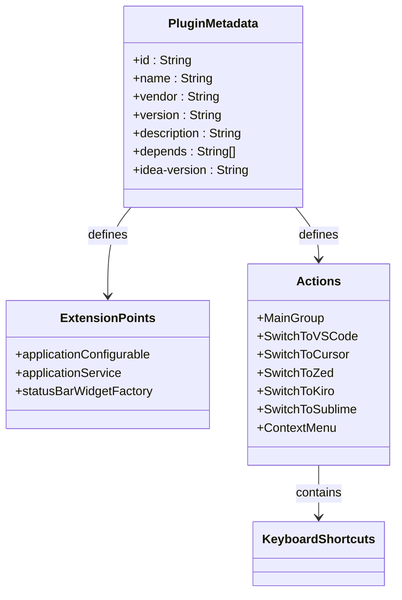
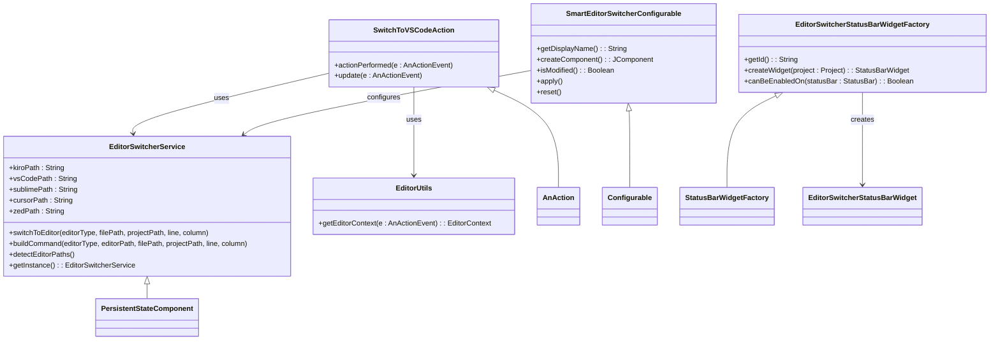
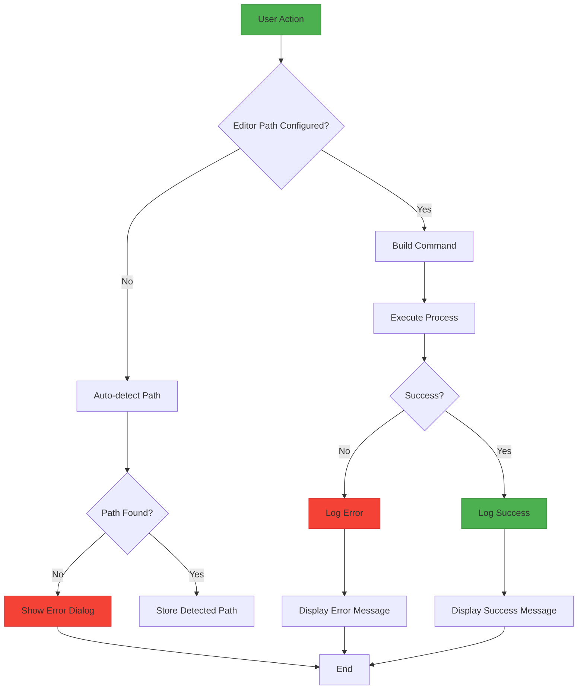

# Development Guide

<cite>
**Referenced Files in This Document**   
- [build.gradle.kts](file://build.gradle.kts)
- [gradle.properties](file://gradle.properties)
- [settings.gradle.kts](file://settings.gradle.kts)
- [plugin.xml](file://src/main/resources/META-INF/plugin.xml)
- [EditorSwitcherService.kt](file://src/main/kotlin/io/yanxxcloud/editorswitcher/services/EditorSwitcherService.kt)
- [SwitchToVSCodeAction.kt](file://src/main/kotlin/io/yanxxcloud/editorswitcher/actions/SwitchToVSCodeAction.kt)
- [EditorUtils.kt](file://src/main/kotlin/io/yanxxcloud/editorswitcher/utils/EditorUtils.kt)
- [SmartEditorSwitcherConfigurable.kt](file://src/main/kotlin/io/yanxxcloud/editorswitcher/settings/SmartEditorSwitcherConfigurable.kt)
- [create_github_release.sh](file://create_github_release.sh)
- [build.sh](file://build.sh)
- [README.md](file://README.md)
- [INSTALL.md](file://INSTALL.md)
- [release_notes_v1.0.1.md](file://release_notes_v1.0.1.md)
</cite>

## Table of Contents
1. [Introduction](#introduction)
2. [Project Structure](#project-structure)
3. [Development Environment Setup](#development-environment-setup)
4. [Build and Run Processes](#build-and-run-processes)
5. [Testing Procedures](#testing-procedures)
6. [Debugging Techniques](#debugging-techniques)
7. [Version Management](#version-management)
8. [Plugin Metadata Configuration](#plugin-metadata-configuration)
9. [Core Components Analysis](#core-components-analysis)
10. [Feature Implementation Guide](#feature-implementation-guide)
11. [Code Quality and Best Practices](#code-quality-and-best-practices)
12. [Contribution Workflow](#contribution-workflow)

## Introduction
The Smart Editor Switcher plugin is a professional JetBrains IDE extension that enables seamless transitions between JetBrains IDEs and other mainstream code editors. This development guide provides comprehensive instructions for contributing to the ide_jumper plugin, covering setup, development, testing, and release processes. The plugin supports intelligent cursor positioning, project context preservation, and one-click switching to various editors including VS Code, Cursor, Zed, Kiro, and Sublime Text through keyboard shortcuts and status bar integration.

**Section sources**
- [README.md](file://README.md#L1-L75)
- [INSTALL.md](file://INSTALL.md#L1-L70)

## Project Structure
The project follows a standard Gradle-based structure for IntelliJ Platform plugins. The source code is organized under `src/main/kotlin` with packages following the reverse domain naming convention (`io.yanxxcloud.editorswitcher`). Resources including the plugin descriptor are located in `src/main/resources/META-INF/`. The `bin/main` directory contains compiled classes and resources after build operations. Configuration files such as `build.gradle.kts`, `gradle.properties`, and `settings.gradle.kts` manage build settings and project metadata. The root directory also contains documentation files, release scripts, and build utilities.

**Diagram sources**
- [project_structure](file://project_structure)
- [build.gradle.kts](file://build.gradle.kts#L1-L48)

**Section sources**
- [project_structure](file://project_structure)

## Development Environment Setup
To set up the development environment for the ide_jumper plugin, ensure you have Java Development Kit (JDK) 17 installed, as specified in the build configuration. The project uses Gradle as its build system, with the Gradle wrapper (`gradlew`) provided for consistent builds across environments. The IntelliJ Gradle plugin is configured in `build.gradle.kts` to manage IDE integration. Developers should configure their IDE to use JDK 17 for both source and target compatibility. The `build.sh` script demonstrates how to set up the Java environment, though modern development environments typically handle this automatically. No additional IDE-specific setup is required beyond standard Kotlin and Gradle plugin installation in your development IDE.

**Section sources**
- [build.gradle.kts](file://build.gradle.kts#L25-L35)
- [gradle.properties](file://gradle.properties#L24-L25)
- [build.sh](file://build.sh#L3-L6)

## Build and Run Processes
The build process for the ide_jumper plugin is managed through Gradle tasks defined in the `build.gradle.kts` file. To build the plugin, execute `./gradlew buildPlugin`, which compiles the Kotlin source code, processes resources, and packages the plugin into a distributable ZIP file located in the `build/distributions/` directory. To run the plugin in a development IDE instance for testing, use `./gradlew runIde`, which launches a sandboxed IntelliJ IDE with the plugin loaded, allowing for immediate testing of features and UI elements. The `runIde` task automatically handles dependency resolution and classpath configuration, providing an isolated environment for plugin development and validation.

**Section sources**
- [build.gradle.kts](file://build.gradle.kts#L1-L48)
- [README.md](file://README.md#L65-L75)

## Testing Procedures
The testing process for the ide_jumper plugin is executed using the Gradle test task. Running `./gradlew test` executes all unit tests in the project, validating the functionality of individual components and ensuring code quality. The plugin's architecture separates concerns into distinct components (services, actions, utilities), making it conducive to unit testing. While specific test files are not visible in the current context, the presence of the test task in the build configuration indicates a testing framework is in place. Developers should maintain high test coverage, particularly for the `EditorSwitcherService` which handles the core functionality of editor switching and path detection across different operating systems.

**Section sources**
- [build.gradle.kts](file://build.gradle.kts#L1-L48)
- [README.md](file://README.md#L62-L64)

## Debugging Techniques
Debugging IntelliJ Platform plugins requires running the plugin in a development IDE instance using `./gradlew runIde`. This creates a sandboxed environment where breakpoints can be set in the plugin code and standard debugging techniques applied. The plugin uses IntelliJ's logging framework through `thisLogger()` calls in the `EditorSwitcherService`, which output to the IDE's log file for diagnostic purposes. When debugging editor switching issues, developers should monitor the command construction in the `buildCommand` method and verify that the detected editor paths are correct. The status bar widget and action components can be debugged by interacting with their UI elements in the development IDE instance and observing the behavior and logs.

**Section sources**
- [EditorSwitcherService.kt](file://src/main/kotlin/io/yanxxcloud/editorswitcher/services/EditorSwitcherService.kt#L50-L150)
- [SwitchToVSCodeAction.kt](file://src/main/kotlin/io/yanxxcloud/editorswitcher/actions/SwitchToVSCodeAction.kt#L1-L46)

## Version Management
Version management for the ide_jumper plugin is handled through the `gradle.properties` file, which contains the `pluginVersion` property set to "1.0.1". This version is synchronized between Gradle and the plugin descriptor to ensure consistency. The `build.gradle.kts` file also defines the version property, which is used during the build process. The plugin supports semantic versioning (SemVer) as indicated in the comments of `gradle.properties`. Version updates should be made in both `gradle.properties` and potentially in the release notes to maintain consistency across the project. The GitHub release script (`create_github_release.sh`) references the specific version when creating releases, ensuring version alignment between the codebase and distribution artifacts.

**Section sources**
- [gradle.properties](file://gradle.properties#L4-L5)
- [build.gradle.kts](file://build.gradle.kts#L3-L4)
- [create_github_release.sh](file://create_github_release.sh#L5-L6)

## Plugin Metadata Configuration
Plugin metadata is defined in the `plugin.xml` file located in `src/main/resources/META-INF/`. This descriptor file contains essential information such as the plugin ID (`io.yanxxcloud.editorswitcher`), name ("Smart Editor Switcher"), vendor details, and a comprehensive description of features and supported editors. The XML configuration defines dependencies, IDE version compatibility ranges (`since-build` and `until-build`), extension points for services and UI components, and action definitions with keyboard shortcuts. The same metadata is versioned in `build.gradle.kts` through properties like `group` and `version`, ensuring consistency between the build system and plugin runtime. The description includes HTML formatting with lists of features, supported editors, and keyboard shortcuts for user guidance.

**Diagram sources**
- [plugin.xml](file://src/main/resources/META-INF/plugin.xml#L1-L117)
- [build.gradle.kts](file://build.gradle.kts#L3-L4)

**Section sources**
- [plugin.xml](file://src/main/resources/META-INF/plugin.xml#L1-L117)
- [build.gradle.kts](file://build.gradle.kts#L3-L4)

## Core Components Analysis
The ide_jumper plugin architecture consists of several core components that work together to provide seamless editor switching functionality. The `EditorSwitcherService` acts as the central service component, managing editor paths and executing the switching logic. Action classes like `SwitchToVSCodeAction` handle user interactions from menus and shortcuts. The `EditorUtils` utility provides context extraction from the IDE environment, while settings components enable user configuration. The status bar widget factory integrates the plugin into the IDE's status bar for quick access. These components follow IntelliJ Platform conventions for services, actions, and UI extensions, ensuring proper lifecycle management and integration with the host IDE.

**Diagram sources**
- [EditorSwitcherService.kt](file://src/main/kotlin/io/yanxxcloud/editorswitcher/services/EditorSwitcherService.kt#L1-L268)
- [SwitchToVSCodeAction.kt](file://src/main/kotlin/io/yanxxcloud/editorswitcher/actions/SwitchToVSCodeAction.kt#L1-L46)
- [EditorUtils.kt](file://src/main/kotlin/io/yanxxcloud/editorswitcher/utils/EditorUtils.kt#L1-L45)
- [SmartEditorSwitcherConfigurable.kt](file://src/main/kotlin/io/yanxxcloud/editorswitcher/settings/SmartEditorSwitcherConfigurable.kt#L1-L56)
- [EditorSwitcherStatusBarWidgetFactory.kt](file://src/main/kotlin/io/yanxxcloud/editorswitcher/ui/EditorSwitcherStatusBarWidgetFactory.kt#L1-L25)

**Section sources**
- [EditorSwitcherService.kt](file://src/main/kotlin/io/yanxxcloud/editorswitcher/services/EditorSwitcherService.kt#L1-L268)
- [SwitchToVSCodeAction.kt](file://src/main/kotlin/io/yanxxcloud/editorswitcher/actions/SwitchToVSCodeAction.kt#L1-L46)
- [EditorUtils.kt](file://src/main/kotlin/io/yanxxcloud/editorswitcher/utils/EditorUtils.kt#L1-L45)

## Feature Implementation Guide
To implement new editor integrations in the ide_jumper plugin, follow these steps: First, add the editor type to the `EditorType` enum in `EditorSwitcherService.kt`. Then, add corresponding path properties to the service class for storing the editor executable path. Implement detection logic in the `detectEditorPaths` method with platform-specific path candidates. Create a new action class extending `AnAction` similar to existing switch actions, configuring the appropriate editor type. Register the new action in `plugin.xml` with a unique ID, class reference, text, description, and keyboard shortcut. Finally, update the settings UI to include configuration options for the new editor path. For adding features, extend existing components following IntelliJ Platform extension points and maintain consistency with the current code style and patterns.

**Section sources**
- [EditorSwitcherService.kt](file://src/main/kotlin/io/yanxxcloud/editorswitcher/services/EditorSwitcherService.kt#L1-L268)
- [SwitchToVSCodeAction.kt](file://src/main/kotlin/io/yanxxcloud/editorswitcher/actions/SwitchToVSCodeAction.kt#L1-L46)
- [plugin.xml](file://src/main/resources/META-INF/plugin.xml#L1-L117)

## Code Quality and Best Practices
The ide_jumper plugin follows several best practices for IntelliJ Platform plugin development. Error handling is implemented through try-catch blocks in critical operations like process execution, with proper logging using the IntelliJ logging framework. Cross-platform development is addressed through OS-specific path detection in the `detectEditorPaths` methods, with separate path candidates for macOS, Windows, and Linux. Logging is used extensively to track plugin operations and errors, aiding in debugging and user support. The code maintains separation of concerns with distinct packages for actions, services, settings, UI, and utilities. Configuration is persisted using IntelliJ's `PersistentStateComponent` interface, ensuring settings survive IDE restarts. Developers should maintain these patterns when contributing to ensure code quality and consistency.

**Diagram sources**
- [EditorSwitcherService.kt](file://src/main/kotlin/io/yanxxcloud/editorswitcher/services/EditorSwitcherService.kt#L50-L150)
- [SwitchToVSCodeAction.kt](file://src/main/kotlin/io/yanxxcloud/editorswitcher/actions/SwitchToVSCodeAction.kt#L1-L46)

**Section sources**
- [EditorSwitcherService.kt](file://src/main/kotlin/io/yanxxcloud/editorswitcher/services/EditorSwitcherService.kt#L50-L150)
- [SwitchToVSCodeAction.kt](file://src/main/kotlin/io/yanxxcloud/editorswitcher/actions/SwitchToVSCodeAction.kt#L1-L46)

## Contribution Workflow
The contribution workflow for the ide_jumper plugin follows standard open-source practices. Developers should fork the repository, create feature branches, implement changes with appropriate testing, and submit pull requests. The release process is automated through the `create_github_release.sh` script, which creates GitHub releases with release notes and attaches the built plugin artifact. Before releasing, contributors should ensure compatibility with the specified IntelliJ Platform version range (232-252.*) and verify that all features work across supported operating systems. Code reviews should focus on adherence to coding standards, proper error handling, cross-platform compatibility, and user experience. The release notes in `release_notes_v1.0.1.md` provide a template for documenting changes, including fixes, improvements, and technical updates.

**Section sources**
- [create_github_release.sh](file://create_github_release.sh#L1-L35)
- [release_notes_v1.0.1.md](file://release_notes_v1.0.1.md#L1-L37)
- [gradle.properties](file://gradle.properties#L6-L10)