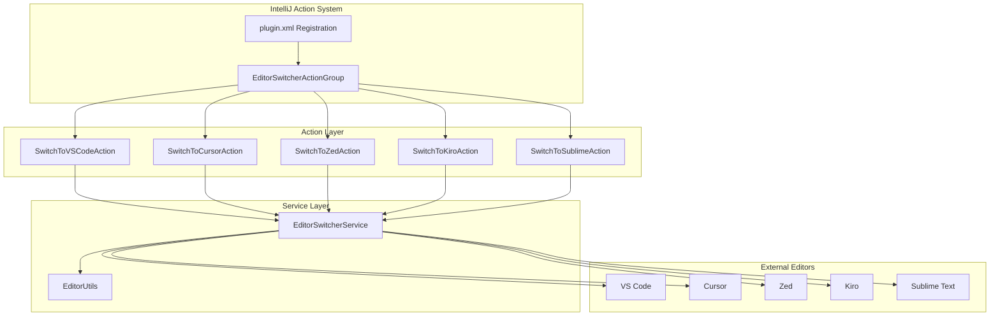
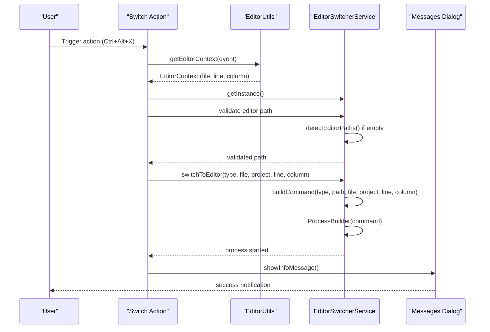
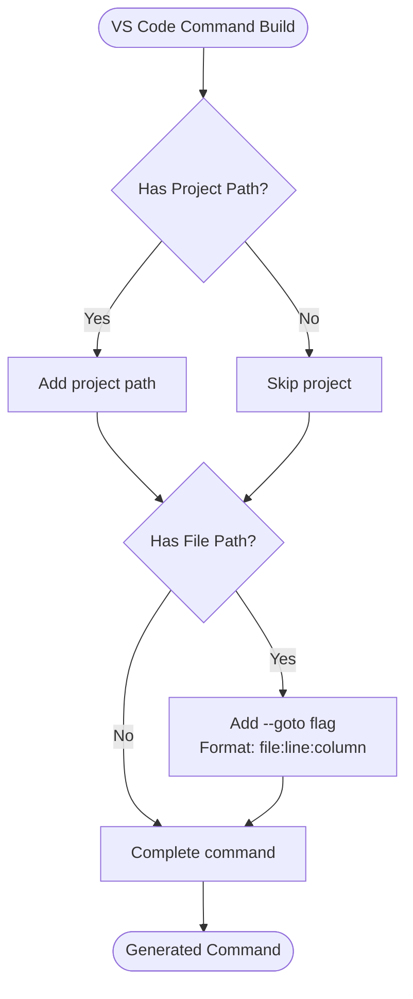
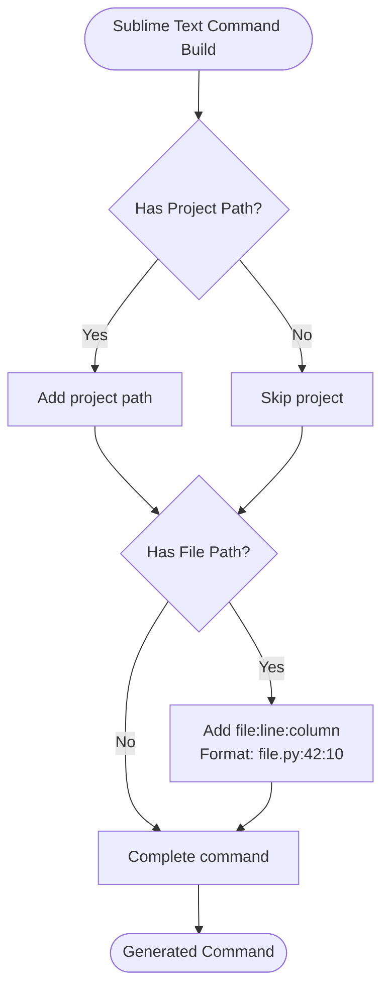
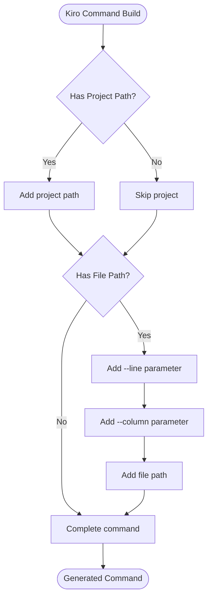
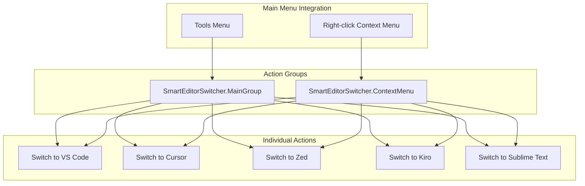
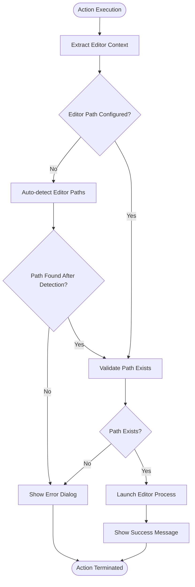
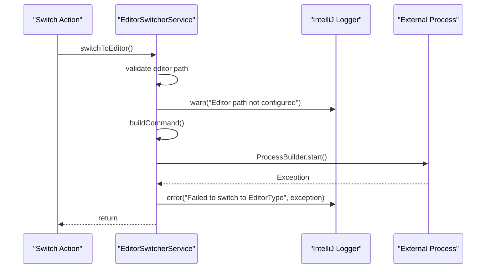

# Editor Switch Actions

<cite>
**Referenced Files in This Document**
- [SwitchToVSCodeAction.kt](file://src/main/kotlin/io/yanxxcloud/editorswitcher/actions/SwitchToVSCodeAction.kt)
- [SwitchToCursorAction.kt](file://src/main/kotlin/io/yanxxcloud/editorswitcher/actions/SwitchToCursorAction.kt)
- [SwitchToZedAction.kt](file://src/main/kotlin/io/yanxxcloud/editorswitcher/actions/SwitchToZedAction.kt)
- [SwitchToKiroAction.kt](file://src/main/kotlin/io/yanxxcloud/editorswitcher/actions/SwitchToKiroAction.kt)
- [SwitchToSublimeAction.kt](file://src/main/kotlin/io/yanxxcloud/editorswitcher/actions/SwitchToSublimeAction.kt)
- [EditorSwitcherService.kt](file://src/main/kotlin/io/yanxxcloud/editorswitcher/services/EditorSwitcherService.kt)
- [EditorUtils.kt](file://src/main/kotlin/io/yanxxcloud/editorswitcher/utils/EditorUtils.kt)
- [plugin.xml](file://src/main/resources/META-INF/plugin.xml)
- [EditorSwitcherActionGroup.kt](file://src/main/kotlin/io/yanxxcloud/editorswitcher/ui/EditorSwitcherActionGroup.kt)
</cite>

## Table of Contents
1. [Introduction](#introduction)
2. [Architecture Overview](#architecture-overview)
3. [Switch Action Implementation](#switch-action-implementation)
4. [Editor-Specific Command Construction](#editor-specific-command-construction)
5. [IntelliJ Action System Integration](#intellij-action-system-integration)
6. [Error Handling Strategies](#error-handling-strategies)
7. [Extending the System](#extending-the-system)
8. [Best Practices](#best-practices)
9. [Troubleshooting Guide](#troubleshooting-guide)
10. [Conclusion](#conclusion)

## Introduction

The Smart Editor Switcher plugin provides seamless switching capabilities between JetBrains IDEs and various external editors through a sophisticated action system. Each editor-specific switch action extends IntelliJ's `AnAction` class to deliver specialized functionality while maintaining consistency across the user interface.

The plugin supports nine major editors: VS Code, Cursor, Zed, Kiro, Sublime Text, Atom, Notepad++, Vim, and Emacs. Each action implements unique command-line construction logic tailored to the specific editor's CLI syntax and capabilities.

## Architecture Overview

The editor switch actions follow a layered architecture that separates concerns between user interface presentation, context extraction, and editor launching functionality.



**Diagram sources**
- [EditorSwitcherActionGroup.kt](file://src/main/kotlin/io/yanxxcloud/editorswitcher/ui/EditorSwitcherActionGroup.kt#L10-L35)
- [SwitchToVSCodeAction.kt](file://src/main/kotlin/io/yanxxcloud/editorswitcher/actions/SwitchToVSCodeAction.kt#L1-L46)
- [EditorSwitcherService.kt](file://src/main/kotlin/io/yanxxcloud/editorswitcher/services/EditorSwitcherService.kt#L1-L268)

## Switch Action Implementation

Each editor-specific switch action follows a consistent implementation pattern built upon IntelliJ's `AnAction` base class. The actions share common structural elements while implementing editor-specific logic.

### Common Implementation Pattern

All switch actions implement the same fundamental workflow:



**Diagram sources**
- [SwitchToVSCodeAction.kt](file://src/main/kotlin/io/yanxxcloud/editorswitcher/actions/SwitchToVSCodeAction.kt#L10-L40)
- [EditorUtils.kt](file://src/main/kotlin/io/yanxxcloud/editorswitcher/utils/EditorUtils.kt#L15-L44)
- [EditorSwitcherService.kt](file://src/main/kotlin/io/yanxxcloud/editorswitcher/services/EditorSwitcherService.kt#L35-L60)

### Action Class Structure

Each switch action class implements two primary methods:

| Method | Purpose | Implementation Details |
|--------|---------|----------------------|
| `actionPerformed()` | Executes the main action logic | Extracts context, validates editor path, invokes service |
| `update()` | Controls action availability | Enables/disables based on project context |

**Section sources**
- [SwitchToVSCodeAction.kt](file://src/main/kotlin/io/yanxxcloud/editorswitcher/actions/SwitchToVSCodeAction.kt#L8-L46)
- [SwitchToCursorAction.kt](file://src/main/kotlin/io/yanxxcloud/editorswitcher/actions/SwitchToCursorAction.kt#L8-L46)
- [SwitchToZedAction.kt](file://src/main/kotlin/io/yanxxcloud/editorswitcher/actions/SwitchToZedAction.kt#L8-L46)
- [SwitchToKiroAction.kt](file://src/main/kotlin/io/yanxxcloud/editorswitcher/actions/SwitchToKiroAction.kt#L8-L46)
- [SwitchToSublimeAction.kt](file://src/main/kotlin/io/yanxxcloud/editorswitcher/actions/SwitchToSublimeAction.kt#L8-L46)

## Editor-Specific Command Construction

The plugin implements sophisticated command-line construction logic that adapts to each editor's unique CLI syntax and capabilities. The `buildCommand` method in `EditorSwitcherService` handles the complex task of translating common parameters into editor-specific commands.

### Command Construction Patterns

Different editors require distinct command-line argument patterns:

| Editor | CLI Pattern | Example Command | Key Features |
|--------|-------------|-----------------|--------------|
| **VS Code** | `code [--goto file:line:column] [project]` | `code --goto file.py:42:10 /project/path` | Supports goto syntax with line/column |
| **Cursor** | `cursor [--goto file:line:column] [project]` | `cursor --goto file.py:42:10 /project/path` | Similar to VS Code but different binary |
| **Zed** | `zed [project] file:line:column` | `zed /project/path file.py:42:10` | Project-first, then file with coordinates |
| **Kiro** | `kiro [project] [--line line --column column] file` | `kiro /project/path --line 42 --column 10 file.py` | Separate line/column parameters |
| **Sublime Text** | `subl [project] file:line:column` | `subl /project/path file.py:42:10` | Colon-separated coordinates |

### VS Code Specific Implementation

VS Code uses the `-g` flag pattern for goto functionality:



**Diagram sources**
- [EditorSwitcherService.kt](file://src/main/kotlin/io/yanxxcloud/editorswitcher/services/EditorSwitcherService.kt#L65-L75)

### Sublime Text Specific Implementation

Sublime Text uses colon-separated coordinates in a single argument:



**Diagram sources**
- [EditorSwitcherService.kt](file://src/main/kotlin/io/yanxxcloud/editorswitcher/services/EditorSwitcherService.kt#L85-L90)

### Kiro Specific Implementation

Kiro requires separate line and column parameters:



**Diagram sources**
- [EditorSwitcherService.kt](file://src/main/kotlin/io/yanxxcloud/editorswitcher/services/EditorSwitcherService.kt#L55-L65)

**Section sources**
- [EditorSwitcherService.kt](file://src/main/kotlin/io/yanxxcloud/editorswitcher/services/EditorSwitcherService.kt#L55-L120)

## IntelliJ Action System Integration

The editor switch actions integrate seamlessly with IntelliJ's action system through XML registration and keyboard shortcut assignment. This integration ensures consistent user experience across all supported editors.

### Action Registration in plugin.xml

The plugin.xml file defines all editor switch actions with their respective keyboard shortcuts and menu placements:

| Action ID | Keyboard Shortcut | Target Editor | Menu Placement |
|-----------|------------------|---------------|----------------|
| `SmartEditorSwitcher.SwitchToVSCode` | `Ctrl+Alt+V` | VS Code | Tools Menu |
| `SmartEditorSwitcher.SwitchToCursor` | `Ctrl+Alt+C` | Cursor | Tools Menu |
| `SmartEditorSwitcher.SwitchToZed` | `Ctrl+Alt+Z` | Zed | Tools Menu |
| `SmartEditorSwitcher.SwitchToKiro` | `Ctrl+Alt+K` | Kiro | Tools Menu |
| `SmartEditorSwitcher.SwitchToSublime` | `Ctrl+Alt+S` | Sublime Text | Tools Menu |

### Action Group Organization

The actions are organized in a hierarchical structure that provides both menu access and quick access through the status bar widget:



**Diagram sources**
- [plugin.xml](file://src/main/resources/META-INF/plugin.xml#L65-L116)
- [EditorSwitcherActionGroup.kt](file://src/main/kotlin/io/yanxxcloud/editorswitcher/ui/EditorSwitcherActionGroup.kt#L10-L35)

### Status Bar Widget Integration

The plugin provides a convenient status bar widget that allows quick switching between editors without navigating through menus:

**Section sources**
- [plugin.xml](file://src/main/resources/META-INF/plugin.xml#L65-L116)
- [EditorSwitcherActionGroup.kt](file://src/main/kotlin/io/yanxxcloud/editorswitcher/ui/EditorSwitcherActionGroup.kt#L10-L35)

## Error Handling Strategies

The plugin implements comprehensive error handling to manage scenarios where editors are not found, fail to launch, or encounter other runtime issues.

### Path Validation and Auto-Detection

Each action performs path validation before attempting to launch an editor:



**Diagram sources**
- [SwitchToVSCodeAction.kt](file://src/main/kotlin/io/yanxxcloud/editorswitcher/actions/SwitchToVSCodeAction.kt#L12-L30)
- [EditorSwitcherService.kt](file://src/main/kotlin/io/yanxxcloud/editorswitcher/services/EditorSwitcherService.kt#L35-L60)

### Error Message Patterns

The plugin uses consistent error messaging patterns:

| Error Type | Message Format | Example |
|------------|----------------|---------|
| **Path Not Configured** | `"Editor 名称 路径未配置。请在 Settings > Tools > Smart Editor Switcher 中配置路径。"` | "VS Code 路径未配置..." |
| **Path Not Found** | `"Editor 名称 路径未找到，请检查配置。"` | "Kiro 路径未找到..." |
| **Launch Failure** | `"无法启动 Editor 名称，请检查路径和权限。"` | "无法启动 Zed..." |

### Logging and Diagnostics

The service implements comprehensive logging for debugging and monitoring:



**Diagram sources**
- [EditorSwitcherService.kt](file://src/main/kotlin/io/yanxxcloud/editorswitcher/services/EditorSwitcherService.kt#L45-L60)

**Section sources**
- [SwitchToVSCodeAction.kt](file://src/main/kotlin/io/yanxxcloud/editorswitcher/actions/SwitchToVSCodeAction.kt#L12-L30)
- [EditorSwitcherService.kt](file://src/main/kotlin/io/yanxxcloud/editorswitcher/services/EditorSwitcherService.kt#L35-L60)

## Extending the System

The plugin architecture supports easy extension with new editor actions while maintaining consistency in user experience and implementation patterns.

### Adding New Editor Actions

To add support for a new editor, follow these steps:

1. **Define Editor Type Enum Value**
   ```kotlin
   enum class EditorType {
       KIRO, VSCODE, SUBLIME, ATOM, NOTEPADPP, VIM, EMACS, CURSOR, ZED, NEW_EDITOR
   }
   ```

2. **Create Switch Action Class**
   ```kotlin
   class SwitchToNewEditorAction : AnAction() {
       override fun actionPerformed(e: AnActionEvent) {
           val context = EditorUtils.getEditorContext(e)
           val service = EditorSwitcherService.getInstance()
           
           if (service.newEditorPath.isEmpty()) {
               service.detectEditorPaths()
               if (service.newEditorPath.isEmpty()) {
                   Messages.showErrorDialog(context.project, "New Editor 路径未配置...", "Smart Editor Switcher")
                   return
               }
           }
           
           service.switchToEditor(
               EditorType.NEW_EDITOR, 
               context.filePath, 
               context.projectPath, 
               context.line, 
               context.column
           )
       }
       
       override fun update(e: AnActionEvent) {
           e.presentation.isEnabledAndVisible = e.project != null
       }
   }
   ```

3. **Extend Command Building Logic**
   ```kotlin
   private fun buildCommand(editorType: EditorType, editorPath: String, ...) = when (editorType) {
       EditorType.NEW_EDITOR -> {
           val command = mutableListOf(editorPath)
           // Add editor-specific command construction logic
           command
       }
       // ... other cases
   }
   ```

4. **Update Plugin XML Registration**
   ```xml
   <action id="SmartEditorSwitcher.SwitchToNewEditor" 
           class="io.yanxxcloud.editorswitcher.actions.SwitchToNewEditorAction" 
           text="Switch to New Editor" 
           description="Switch current file to New Editor">
       <keyboard-shortcut keymap="$default" first-keystroke="ctrl alt N"/>
   </action>
   ```

### Consistency Guidelines

Maintain consistency across all editor actions:

| Aspect | Requirement | Implementation Notes |
|--------|-------------|---------------------|
| **Error Messages** | Localized, consistent format | Use the same pattern as existing actions |
| **Success Notifications** | Informative, localized | Include line/column information |
| **Path Validation** | Comprehensive checking | Always check path existence before launching |
| **Keyboard Shortcuts** | Unique, logical assignment | Follow the Ctrl+Alt+X pattern |
| **UI Presentation** | Descriptive text | Use emoji prefixes for visual identification |

**Section sources**
- [EditorSwitcherService.kt](file://src/main/kotlin/io/yanxxcloud/editorswitcher/services/EditorSwitcherService.kt#L265-L268)
- [plugin.xml](file://src/main/resources/META-INF/plugin.xml#L65-L116)

## Best Practices

### User Experience Guidelines

1. **Immediate Feedback**: Always provide immediate feedback through dialog messages
2. **Consistent Error Handling**: Use standardized error message patterns
3. **Path Validation**: Validate editor paths before attempting to launch
4. **Context Preservation**: Maintain cursor position and project context
5. **Keyboard Shortcuts**: Assign intuitive and unique shortcuts

### Technical Implementation Standards

1. **Service Layer Usage**: Always use `EditorSwitcherService` for editor operations
2. **Context Extraction**: Utilize `EditorUtils.getEditorContext()` for consistent context extraction
3. **Exception Handling**: Wrap editor launching in try-catch blocks
4. **Logging**: Use IntelliJ's logging framework for debugging
5. **Resource Management**: Properly handle process resources

### Performance Considerations

1. **Lazy Initialization**: Detect editor paths only when needed
2. **Process Management**: Ensure external processes are properly managed
3. **UI Responsiveness**: Perform long-running operations asynchronously
4. **Memory Efficiency**: Minimize object creation in frequently called methods

## Troubleshooting Guide

### Common Issues and Solutions

| Issue | Symptoms | Solution |
|-------|----------|----------|
| **Editor Not Found** | Error dialog about missing path | Configure editor path in Settings > Tools > Smart Editor Switcher |
| **Path Detection Failure** | Auto-detection doesn't find editor | Manually configure the editor path |
| **Launch Failure** | Editor doesn't open after clicking | Check file permissions and path validity |
| **Incorrect Line/Column** | Editor opens but cursor not positioned | Verify editor supports goto functionality |
| **Keyboard Shortcut Not Working** | Shortcut doesn't trigger action | Check for conflicts in IntelliJ keymap settings |

### Diagnostic Steps

1. **Verify Editor Installation**: Ensure the target editor is properly installed
2. **Check Path Configuration**: Validate the editor path in plugin settings
3. **Test Manual Launch**: Try launching the editor manually from terminal
4. **Review Logs**: Check IntelliJ's log files for error messages
5. **Reset Configuration**: Clear plugin settings and reconfigure

### Debug Information Collection

When reporting issues, provide:

- IntelliJ IDEA version and build number
- Operating system and version
- Editor version and installation path
- Plugin version and installation method
- Relevant log entries from IntelliJ's log files

## Conclusion

The Smart Editor Switcher plugin demonstrates sophisticated integration with IntelliJ's action system while providing flexible, extensible functionality for switching between JetBrains IDEs and external editors. The consistent implementation pattern across all editor actions ensures maintainable code and predictable user experience.

Key strengths of the implementation include:

- **Modular Design**: Clear separation between action logic, service operations, and UI presentation
- **Extensibility**: Well-defined patterns for adding new editor support
- **Robust Error Handling**: Comprehensive validation and user-friendly error messages
- **IntelliJ Integration**: Seamless integration with IntelliJ's action system and keyboard shortcuts
- **Cross-Platform Support**: Automatic path detection for multiple operating systems

The plugin serves as an excellent example of how to extend IntelliJ IDEA functionality while maintaining high standards for code quality, user experience, and maintainability. Future enhancements can be implemented following established patterns, ensuring continued consistency and reliability.