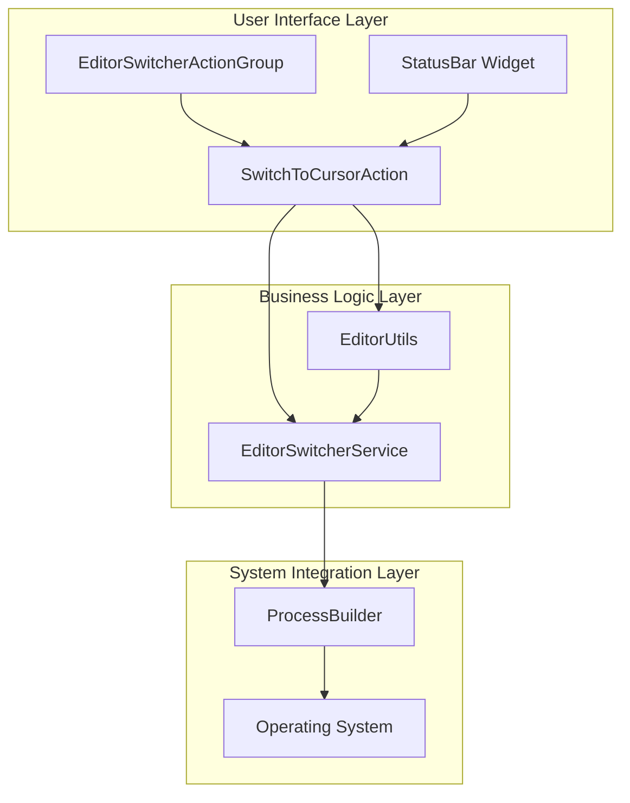
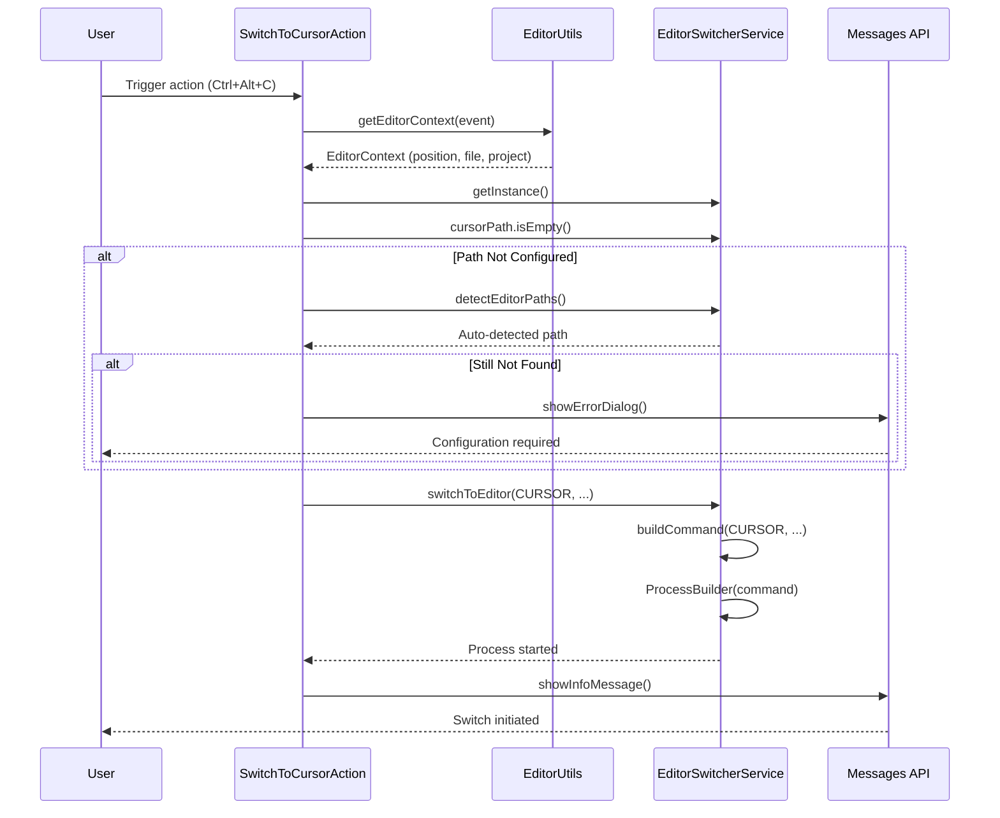
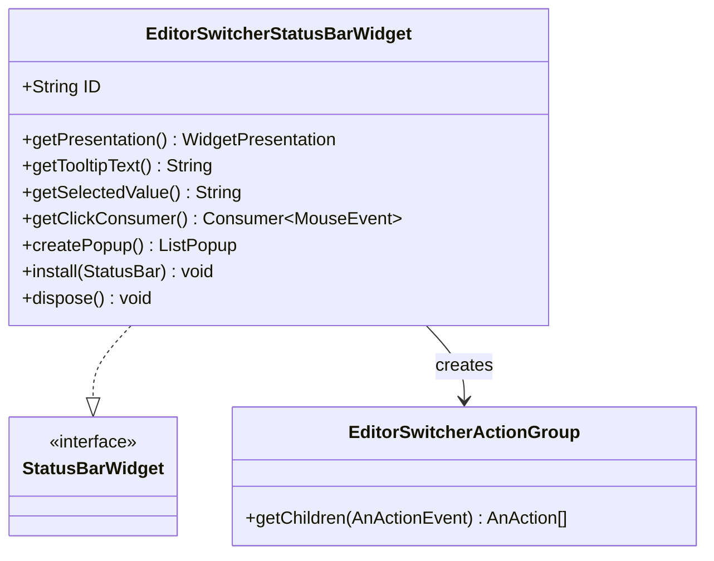
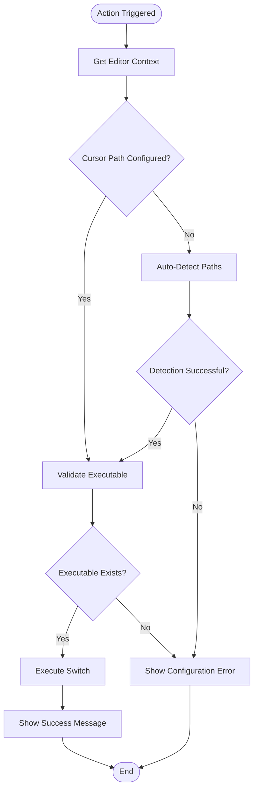

# Switch to Cursor Action

<cite>
**Referenced Files in This Document**
- [SwitchToCursorAction.kt](file://src/main/kotlin/io/yanxxcloud/editorswitcher/actions/SwitchToCursorAction.kt)
- [EditorSwitcherService.kt](file://src/main/kotlin/io/yanxxcloud/editorswitcher/services/EditorSwitcherService.kt)
- [EditorUtils.kt](file://src/main/kotlin/io/yanxxcloud/editorswitcher/utils/EditorUtils.kt)
- [plugin.xml](file://src/main/resources/META-INF/plugin.xml)
- [EditorSwitcherActionGroup.kt](file://src/main/kotlin/io/yanxxcloud/editorswitcher/ui/EditorSwitcherActionGroup.kt)
- [EditorSwitcherStatusBarWidget.kt](file://src/main/kotlin/io/yanxxcloud/editorswitcher/ui/EditorSwitcherStatusBarWidget.kt)
- [EditorSwitcherStatusBarWidgetFactory.kt](file://src/main/kotlin/io/yanxxcloud/editorswitcher/ui/EditorSwitcherStatusBarWidgetFactory.kt)
</cite>

## Table of Contents
1. [Introduction](#introduction)
2. [Architecture Overview](#architecture-overview)
3. [Core Implementation](#core-implementation)
4. [Integration Components](#integration-components)
5. [User Interface Integration](#user-interface-integration)
6. [Error Handling and Fallback Mechanisms](#error-handling-and-fallback-mechanisms)
7. [Usage Examples](#usage-examples)
8. [Common Issues and Troubleshooting](#common-issues-and-troubleshooting)
9. [Extending the Action](#extending-the-action)
10. [Performance Considerations](#performance-considerations)
11. [Conclusion](#conclusion)

## Introduction

The SwitchToCursorAction class is a specialized IntelliJ Platform action that enables seamless transition from JetBrains IDEs to the Cursor AI-powered editor while preserving cursor position and file context. This action serves as a bridge between the JetBrains ecosystem and the modern AI-driven editing environment, maintaining developer productivity during editor switches.

The action implements sophisticated context preservation mechanisms, intelligent path detection, and comprehensive error handling to ensure reliable operation across different operating systems and installation scenarios.

## Architecture Overview

The SwitchToCursorAction integrates with a multi-layered architecture that separates concerns between user interface, business logic, and system integration:



**Diagram sources**
- [SwitchToCursorAction.kt](file://src/main/kotlin/io/yanxxcloud/editorswitcher/actions/SwitchToCursorAction.kt#L1-L46)
- [EditorSwitcherService.kt](file://src/main/kotlin/io/yanxxcloud/editorswitcher/services/EditorSwitcherService.kt#L1-L268)
- [EditorUtils.kt](file://src/main/kotlin/io/yanxxcloud/editorswitcher/utils/EditorUtils.kt#L1-L45)

## Core Implementation

### Action Execution Flow

The SwitchToCursorAction follows a structured execution pattern that ensures reliable editor switching:



**Diagram sources**
- [SwitchToCursorAction.kt](file://src/main/kotlin/io/yanxxcloud/editorswitcher/actions/SwitchToCursorAction.kt#L8-L40)
- [EditorUtils.kt](file://src/main/kotlin/io/yanxxcloud/editorswitcher/utils/EditorUtils.kt#L15-L44)
- [EditorSwitcherService.kt](file://src/main/kotlin/io/yanxxcloud/editorswitcher/services/EditorSwitcherService.kt#L37-L62)

### Context Retrieval and Validation

The action begins by extracting comprehensive editor context through the EditorUtils utility:

**Section sources**
- [SwitchToCursorAction.kt](file://src/main/kotlin/io/yanxxcloud/editorswitcher/actions/SwitchToCursorAction.kt#L8-L12)
- [EditorUtils.kt](file://src/main/kotlin/io/yanxxcloud/editorswitcher/utils/EditorUtils.kt#L15-L44)

The context includes:
- Current project information and base path
- Active file path and virtual file reference
- Precise cursor position (line and column numbers)
- Project context for maintaining workspace awareness

### Path Configuration and Auto-Detection

The action implements a robust fallback mechanism for path configuration:

**Section sources**
- [SwitchToCursorAction.kt](file://src/main/kotlin/io/yanxxcloud/editorswitcher/actions/SwitchToCursorAction.kt#L13-L22)
- [EditorSwitcherService.kt](file://src/main/kotlin/io/yanxxcloud/editorswitcher/services/EditorSwitcherService.kt#L64-L85)

The auto-detection process examines predefined paths for the Cursor executable across different operating systems:
- macOS: `/Applications/Cursor.app/Contents/Resources/app/bin/cursor`
- Linux: `/usr/local/bin/cursor`, `/opt/cursor/cursor`
- Windows: `%USERPROFILE%\AppData\Local\Programs\cursor\Cursor.exe`

### Command Construction and Execution

Once the path is validated, the service constructs the appropriate command-line invocation:

**Section sources**
- [EditorSwitcherService.kt](file://src/main/kotlin/io/yanxxcloud/editorswitcher/services/EditorSwitcherService.kt#L87-L252)

The Cursor-specific command construction includes:
- Project path specification when available
- File path with goto parameter for precise positioning
- Line and column coordinates for cursor restoration

## Integration Components

### Menu Integration

The action is seamlessly integrated into the JetBrains IDE menu system:

**Section sources**
- [plugin.xml](file://src/main/resources/META-INF/plugin.xml#L75-L85)

Menu placement occurs under the Tools > Switch Editor submenu, providing intuitive access alongside other editor switching options. The action appears with a distinctive icon (🎯) and descriptive text ("Switch to Cursor").

### Keyboard Shortcut Configuration

The action defines a default keyboard shortcut that aligns with the plugin's naming convention:

**Section sources**
- [plugin.xml](file://src/main/resources/META-INF/plugin.xml#L80-L82)

Default shortcut: `Ctrl+Alt+C` (consistent with other editor actions in the suite)

### Right-Click Context Menu

The action participates in the right-click context menu system, enabling quick switching from file and project views:

**Section sources**
- [plugin.xml](file://src/main/resources/META-INF/plugin.xml#L92-L98)

## User Interface Integration

### Status Bar Widget

The plugin includes a sophisticated status bar widget that provides quick access to all editor switching actions:



**Diagram sources**
- [EditorSwitcherStatusBarWidget.kt](file://src/main/kotlin/io/yanxxcloud/editorswitcher/ui/EditorSwitcherStatusBarWidget.kt#L10-L55)
- [EditorSwitcherActionGroup.kt](file://src/main/kotlin/io/yanxxcloud/editorswitcher/ui/EditorSwitcherActionGroup.kt#L8-L35)

**Section sources**
- [EditorSwitcherStatusBarWidget.kt](file://src/main/kotlin/io/yanxxcloud/editorswitcher/ui/EditorSwitcherStatusBarWidget.kt#L10-L55)
- [EditorSwitcherStatusBarWidgetFactory.kt](file://src/main/kotlin/io/yanxxcloud/editorswitcher/ui/EditorSwitcherStatusBarWidgetFactory.kt#L1-L25)

The status bar widget provides:
- Clickable interface for quick action access
- Popup menu with all available editor switching options
- Visual indication of the current plugin state
- Integration with the IDE's status bar lifecycle

### Action Group Organization

The action is organized within a comprehensive action group that maintains consistent presentation across different UI contexts:

**Section sources**
- [EditorSwitcherActionGroup.kt](file://src/main/kotlin/io/yanxxcloud/editorswitcher/ui/EditorSwitcherActionGroup.kt#L10-L35)

Each action in the group receives customized presentation attributes:
- Icon representation (🎯 for Cursor)
- Descriptive text in user's preferred language
- Tooltip information for accessibility

## Error Handling and Fallback Mechanisms

### Path Configuration Validation

The action implements multi-tier validation to handle various failure scenarios:



**Diagram sources**
- [SwitchToCursorAction.kt](file://src/main/kotlin/io/yanxxcloud/editorswitcher/actions/SwitchToCursorAction.kt#L13-L22)

### User Feedback Mechanisms

The action provides comprehensive user feedback through the JetBrains Messages API:

**Section sources**
- [SwitchToCursorAction.kt](file://src/main/kotlin/io/yanxxcloud/editorswitcher/actions/SwitchToCursorAction.kt#L18-L22)
- [SwitchToCursorAction.kt](file://src/main/kotlin/io/yanxxcloud/editorswitcher/actions/SwitchToCursorAction.kt#L38-L40)

Feedback includes:
- Error dialogs with clear instructions for path configuration
- Information messages confirming successful initiation
- Context-aware messaging that includes cursor position details

### Process Execution Monitoring

The underlying service layer implements robust error handling for process execution:

**Section sources**
- [EditorSwitcherService.kt](file://src/main/kotlin/io/yanxxcloud/editorswitcher/services/EditorSwitcherService.kt#L54-L62)

The service captures and logs exceptions during process creation, providing diagnostic information for troubleshooting.

## Usage Examples

### Basic Editor Switching

The most common usage scenario involves switching from a JetBrains IDE to Cursor with preserved context:

**Example Scenario 1: File-Level Switching**
- Current position: `main.py` at line 42, column 15
- Project context: Active Python Django project
- Action: Press `Ctrl+Alt+C`
- Result: Cursor opens with file positioned at line 42, column 15

**Example Scenario 2: Project-Level Switching**
- Current position: No active file
- Project context: Java Spring Boot application
- Action: Select "Switch to Cursor" from Tools menu
- Result: Cursor opens with project root directory loaded

### Advanced Context Preservation

The action maintains sophisticated context information:

**Section sources**
- [EditorUtils.kt](file://src/main/kotlin/io/yanxxcloud/editorswitcher/utils/EditorUtils.kt#L15-L44)

Context preservation includes:
- Absolute file paths for cross-platform compatibility
- Logical line and column positions converted to 1-based indexing
- Project base paths for workspace restoration
- Virtual file references for IDE integration

## Common Issues and Troubleshooting

### Path Configuration Errors

**Issue**: "Cursor 路径未配置" error message appears
**Cause**: Cursor executable path not set in plugin configuration
**Solution**: 
1. Navigate to Settings > Tools > Smart Editor Switcher
2. Configure Cursor path manually or use auto-detection
3. Verify path exists and is executable

**Issue**: Auto-detection fails to locate Cursor installation
**Cause**: Non-standard installation location or permission issues
**Solution**:
1. Manually specify the path to `cursor` executable
2. Ensure executable permissions are set (`chmod +x`)
3. Verify installation integrity

### Operating System Compatibility

**Windows Issues**:
- Path resolution may fail due to environment variable expansion
- Solution: Use absolute paths or verify `%USERPROFILE%` expansion

**macOS Issues**:
- Gatekeeper restrictions may prevent execution
- Solution: Allow in Security & Privacy settings or use `spctl --master-disable`

**Linux Issues**:
- Missing dependencies may cause execution failures
- Solution: Install required libraries or use package manager

### Performance Considerations

**Startup Latency**:
- First execution may be slower due to path detection
- Subsequent executions benefit from cached configurations
- Solution: Configure paths during initial setup

**Resource Usage**:
- Process creation overhead is minimal
- Memory footprint remains constant
- Solution: Monitor system resources during development

## Extending the Action

### Adding Cursor-Specific CLI Flags

Developers can enhance the action by adding Cursor-specific command-line arguments:

**Section sources**
- [EditorSwitcherService.kt](file://src/main/kotlin/io/yanxxcloud/editorswitcher/services/EditorSwitcherService.kt#L87-L252)

Current Cursor command structure:
```kotlin
// Example: cursor /project/path --goto /file/path:line:column
val command = mutableListOf(editorPath)
if (projectPath != null) {
    command.add(projectPath)
    filePath?.let { 
        command.addAll(listOf("--goto", "$it:$line:$column")) 
    }
} else {
    filePath?.let { 
        command.addAll(listOf("--goto", "$it:$line:$column")) 
    }
}
```

**Enhancement Opportunities**:
- Add workspace-specific configuration flags
- Implement AI assistant integration parameters
- Support Cursor's experimental features
- Enable custom theme and preference synchronization

### Customization Patterns

The action follows established IntelliJ Platform patterns for extensibility:

**Section sources**
- [SwitchToCursorAction.kt](file://src/main/kotlin/io/yanxxcloud/editorswitcher/actions/SwitchToCursorAction.kt#L1-L46)

Extension points include:
- Action subclassing for specialized behaviors
- Service layer modifications for new editor types
- Utility function enhancements for additional context
- UI component customization for improved user experience

### Plugin Architecture Benefits

The modular design enables easy extension:

**Section sources**
- [EditorSwitcherService.kt](file://src/main/kotlin/io/yanxxcloud/editorswitcher/services/EditorSwitcherService.kt#L264-L267)

New editor support requires:
1. Adding editor type to the enum
2. Implementing detection logic
3. Creating command construction logic
4. Updating UI integration points

## Performance Considerations

### Execution Efficiency

The action is designed for optimal performance:

**Memory Management**:
- Minimal object allocation during execution
- Efficient string concatenation for command building
- Proper resource cleanup for process handles

**Execution Speed**:
- Lazy evaluation of path detection
- Cached service instances through ApplicationManager
- Asynchronous process creation

### Scalability Factors

**Concurrent Usage**:
- Thread-safe service implementation
- Immutable context data structures
- Atomic state updates

**Resource Utilization**:
- Low CPU overhead during idle periods
- Minimal memory footprint
- Efficient logging with configurable verbosity

## Conclusion

The SwitchToCursorAction represents a sophisticated integration between JetBrains IDEs and modern AI-powered editing environments. Its implementation demonstrates best practices for IntelliJ Platform plugin development, including comprehensive context preservation, robust error handling, and seamless user experience integration.

The action's architecture supports extensibility for future editor types while maintaining backward compatibility and performance standards. The combination of automated path detection, intelligent fallback mechanisms, and user-friendly feedback creates a reliable foundation for developer productivity enhancement.

Key strengths of the implementation include:
- Seamless context preservation across editor boundaries
- Comprehensive error handling with user-friendly feedback
- Flexible architecture supporting multiple editor types
- Intuitive user interface integration
- Robust cross-platform compatibility

Future enhancements could include AI-assisted context analysis, real-time collaboration features, and expanded Cursor-specific functionality, building upon the solid foundation established by this action.