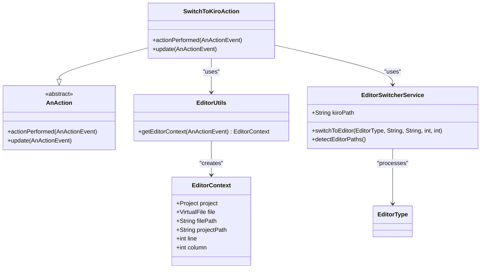
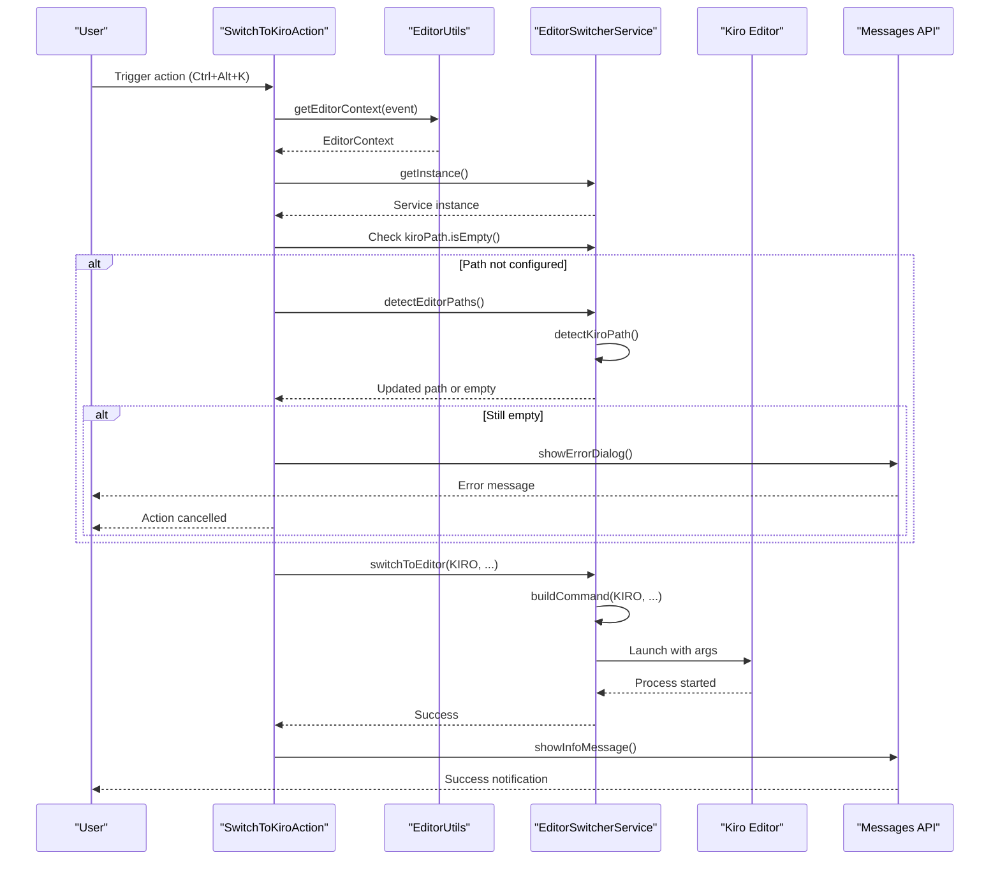
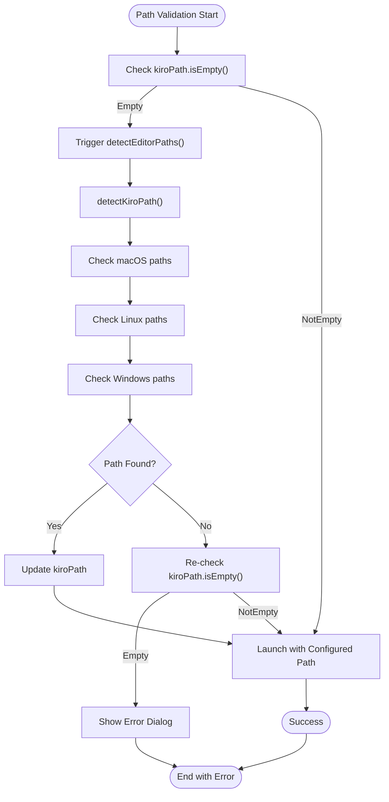
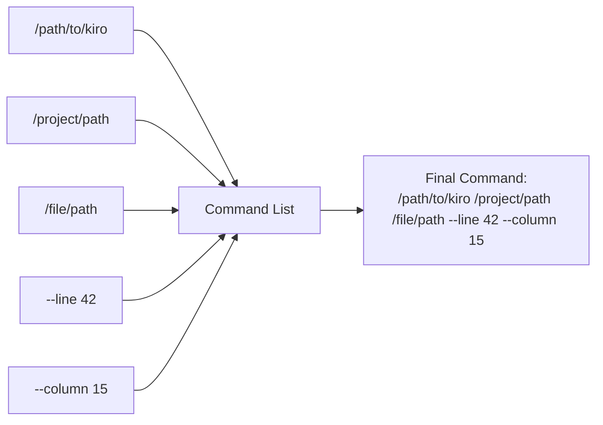

# Switch to Kiro Action

<cite>
**Referenced Files in This Document**
- [SwitchToKiroAction.kt](file://src/main/kotlin/io/yanxxcloud/editorswitcher/actions/SwitchToKiroAction.kt)
- [EditorSwitcherService.kt](file://src/main/kotlin/io/yanxxcloud/editorswitcher/services/EditorSwitcherService.kt)
- [EditorUtils.kt](file://src/main/kotlin/io/yanxxcloud/editorswitcher/utils/EditorUtils.kt)
- [plugin.xml](file://src/main/resources/META-INF/plugin.xml)
- [SmartEditorSwitcherConfigurable.kt](file://src/main/kotlin/io/yanxxcloud/editorswitcher/settings/SmartEditorSwitcherConfigurable.kt)
- [EditorSwitcherActionGroup.kt](file://src/main/kotlin/io/yanxxcloud/editorswitcher/ui/EditorSwitcherActionGroup.kt)
</cite>

## Table of Contents
1. [Introduction](#introduction)
2. [Action Architecture](#action-architecture)
3. [Core Implementation Details](#core-implementation-details)
4. [Context Retrieval System](#context-retrieval-system)
5. [Path Validation and Auto-Detection](#path-validation-and-auto-detection)
6. [User Feedback System](#user-feedback-system)
7. [Integration with Unified Switching Mechanism](#integration-with-unified-switching-mechanism)
8. [Action Registration and Configuration](#action-registration-and-configuration)
9. [Platform-Specific Considerations](#platform-specific-considerations)
10. [Troubleshooting Guide](#troubleshooting-guide)
11. [Extending Functionality](#extending-functionality)
12. [Best Practices](#best-practices)

## Introduction

The SwitchToKiroAction class is a specialized IntelliJ Platform action that enables seamless switching from JetBrains IDEs to the Kiro editor while maintaining cursor position and file context. This action serves as part of a comprehensive editor switching ecosystem that supports multiple popular editors including VS Code, Sublime Text, and others.

The action implements intelligent context preservation by capturing the current file, project path, and cursor position, then launching the Kiro editor with appropriate command-line arguments to restore the exact editing state. This functionality is particularly valuable for developers who prefer Kiro's AI-driven editing capabilities while working within the JetBrains IDE ecosystem.

## Action Architecture

The SwitchToKiroAction follows the standard IntelliJ Platform action pattern, inheriting from `AnAction` and implementing the required lifecycle methods. The architecture demonstrates clean separation of concerns with dedicated utility classes handling context retrieval and service layer management.



**Diagram sources**
- [SwitchToKiroAction.kt](file://src/main/kotlin/io/yanxxcloud/editorswitcher/actions/SwitchToKiroAction.kt#L10-L45)
- [EditorUtils.kt](file://src/main/kotlin/io/yanxxcloud/editorswitcher/utils/EditorUtils.kt#L10-L44)
- [EditorSwitcherService.kt](file://src/main/kotlin/io/yanxxcloud/editorswitcher/services/EditorSwitcherService.kt#L15-L267)

**Section sources**
- [SwitchToKiroAction.kt](file://src/main/kotlin/io/yanxxcloud/editorswitcher/actions/SwitchToKiroAction.kt#L1-L46)

## Core Implementation Details

The `actionPerformed` method represents the heart of the SwitchToKiroAction, orchestrating the complete workflow from context capture to editor launch. The implementation follows a structured approach with clear error handling and user feedback mechanisms.

### Method Execution Flow

The action execution begins with context extraction through the EditorUtils utility, followed by path validation and auto-detection if necessary. The service layer handles the actual editor switching with comprehensive error handling and logging.



**Diagram sources**
- [SwitchToKiroAction.kt](file://src/main/kotlin/io/yanxxcloud/editorswitcher/actions/SwitchToKiroAction.kt#L12-L42)
- [EditorUtils.kt](file://src/main/kotlin/io/yanxxcloud/editorswitcher/utils/EditorUtils.kt#L15-L44)
- [EditorSwitcherService.kt](file://src/main/kotlin/io/yanxxcloud/editorswitcher/services/EditorSwitcherService.kt#L35-L50)

### Key Implementation Patterns

The action demonstrates several important design patterns:

1. **Null Safety**: Comprehensive null checks ensure robust operation across different project states
2. **Error Handling**: Graceful degradation when Kiro is not configured or detected
3. **Resource Management**: Proper cleanup and resource handling through the IntelliJ Platform lifecycle
4. **Localization Support**: Chinese error messages with contextual help for users

**Section sources**
- [SwitchToKiroAction.kt](file://src/main/kotlin/io/yanxxcloud/editorswitcher/actions/SwitchToKiroAction.kt#L12-L42)

## Context Retrieval System

The EditorUtils module provides sophisticated context retrieval capabilities, capturing essential information needed for seamless editor switching. The system extracts file metadata, project information, and cursor position with precision.

### Context Data Structure

The EditorContext data class encapsulates all necessary information for editor switching:

| Property | Type | Description | Usage |
|----------|------|-------------|-------|
| project | Project? | Current IntelliJ project | Used for UI feedback and context isolation |
| file | VirtualFile? | Current opened file | Provides file metadata and path information |
| filePath | String? | Absolute file path | Passed as argument to target editor |
| projectPath | String? | Project base directory | Used for relative path resolution |
| line | Int | Current cursor line (1-based) | Preserves editing position |
| column | Int | Current cursor column (1-based) | Preserves horizontal position |

### Cursor Position Calculation

The context retrieval system converts internal 0-based logical positions to 1-based coordinates commonly used by editors, ensuring accurate positioning in the target editor environment.

**Section sources**
- [EditorUtils.kt](file://src/main/kotlin/io/yanxxcloud/editorswitcher/utils/EditorUtils.kt#L15-L44)

## Path Validation and Auto-Detection

The action implements a two-tier validation system combining user configuration with automatic detection. This approach ensures reliability while providing flexibility for different installation scenarios.

### Validation Hierarchy

1. **User Configuration Check**: First attempt to use the configured Kiro path
2. **Auto-Detection Fallback**: If not configured, trigger automatic path detection
3. **Final Validation**: Re-check path after detection attempt
4. **Error Reporting**: Inform user if path remains undetectable

### Auto-Detection Algorithm

The auto-detection mechanism employs a platform-aware approach, checking predefined paths for each supported operating system:



**Diagram sources**
- [SwitchToKiroAction.kt](file://src/main/kotlin/io/yanxxcloud/editorswitcher/actions/SwitchToKiroAction.kt#L15-L25)
- [EditorSwitcherService.kt](file://src/main/kotlin/io/yanxxcloud/editorswitcher/services/EditorSwitcherService.kt#L139-L179)

**Section sources**
- [SwitchToKiroAction.kt](file://src/main/kotlin/io/yanxxcloud/editorswitcher/actions/SwitchToKiroAction.kt#L15-L25)
- [EditorSwitcherService.kt](file://src/main/kotlin/io/yanxxcloud/editorswitcher/services/EditorSwitcherService.kt#L139-L179)

## User Feedback System

The action leverages IntelliJ's Messages API to provide comprehensive user feedback throughout the switching process. The feedback system operates in multiple modes to handle different scenarios effectively.

### Feedback Categories

1. **Success Notifications**: Inform users when switching is successful
2. **Error Messages**: Clearly communicate configuration issues
3. **Progress Indicators**: Show ongoing operations during path detection
4. **Helpful Guidance**: Provide actionable next steps for common issues

### Message Localization

The error messages are localized in Chinese to support Chinese-speaking users, with clear instructions on how to resolve configuration issues. The messages include specific guidance pointing to the configuration interface.

### Message Types and Usage

| Message Type | Purpose | Example Content | Trigger Condition |
|--------------|---------|-----------------|-------------------|
| Info Message | Successful switching | "正在切换到 Kiro 编辑器..." | After successful launch |
| Error Dialog | Configuration issues | "Kiro 编辑器路径未配置..." | When path detection fails |
| Warning | Pending operations | "正在检测编辑器路径..." | During auto-detection |

**Section sources**
- [SwitchToKiroAction.kt](file://src/main/kotlin/io/yanxxcloud/editorswitcher/actions/SwitchToKiroAction.kt#L26-L42)

## Integration with Unified Switching Mechanism

The SwitchToKiroAction seamlessly integrates with the broader editor switching infrastructure through the EditorSwitcherService, which centralizes command construction and process management.

### Service Layer Integration

The action delegates the actual switching operation to the service layer, which handles:

1. **Command Construction**: Building appropriate command-line arguments for Kiro
2. **Process Management**: Launching the editor process with proper parameters
3. **Logging and Monitoring**: Comprehensive logging for debugging and monitoring
4. **Error Handling**: Centralized error management and reporting

### Command Line Arguments

The service constructs Kiro-specific command arguments that preserve cursor position:



**Diagram sources**
- [EditorSwitcherService.kt](file://src/main/kotlin/io/yanxxcloud/editorswitcher/services/EditorSwitcherService.kt#L52-L70)

### Editor Type Enumeration

The action uses the EditorType.KIRO constant to ensure type safety and enable centralized command construction in the service layer. This approach maintains consistency across all editor switching actions.

**Section sources**
- [SwitchToKiroAction.kt](file://src/main/kotlin/io/yanxxcloud/editorswitcher/actions/SwitchToKiroAction.kt#L35-L42)
- [EditorSwitcherService.kt](file://src/main/kotlin/io/yanxxcloud/editorswitcher/services/EditorSwitcherService.kt#L52-L70)

## Action Registration and Configuration

The action is registered in the IntelliJ Platform through the plugin.xml configuration, making it accessible through multiple UI entry points and keyboard shortcuts.

### Plugin XML Configuration

The action registration includes comprehensive metadata for UI integration:

- **Menu Placement**: Added to the Tools menu as the last item
- **Keyboard Shortcut**: Ctrl+Alt+K (default binding)
- **Icon and Description**: Rich metadata for UI presentation
- **Group Integration**: Part of the SmartEditorSwitcher.MainGroup

### Menu Integration Points

The action appears in multiple locations within the IntelliJ interface:

1. **Tools Menu**: Direct access through the main Tools menu
2. **Context Menu**: Right-click menu in file and project views
3. **Action Group**: Integrated with the unified editor switching group
4. **Status Bar Widget**: Accessible through the status bar interface

### Configuration Interface

Users can configure the Kiro path through the Settings dialog, with real-time validation and auto-detection capabilities. The configuration system supports both manual entry and automatic path discovery.

**Section sources**
- [plugin.xml](file://src/main/resources/META-INF/plugin.xml#L60-L85)
- [SmartEditorSwitcherConfigurable.kt](file://src/main/kotlin/io/yanxxcloud/editorswitcher/settings/SmartEditorSwitcherConfigurable.kt#L10-L55)

## Platform-Specific Considerations

The action handles platform differences transparently through the auto-detection mechanism and platform-aware path construction.

### Windows Platform

- **Installation Paths**: Standard Program Files locations
- **Executable Format**: .exe extension
- **Path Separators**: Backslash (\) separators
- **Environment Variables**: Support for %USERNAME% expansion

### macOS Platform

- **Application Bundle**: .app bundle structure
- **Executable Location**: Contents/MacOS subdirectory
- **Permissions**: Requires executable permissions
- **Sandboxing**: May be affected by macOS security restrictions

### Linux Platform

- **Package Managers**: Support for various package installations
- **Standard Locations**: /usr/local/bin, /opt directories
- **Permissions**: Unix-style permission handling
- **Desktop Environments**: Integration with desktop environments

### Cross-Platform Compatibility

The action ensures cross-platform compatibility through:

1. **Path Normalization**: Consistent path handling across platforms
2. **Executable Detection**: Platform-specific executable identification
3. **Permission Checking**: Appropriate permission validation
4. **Fallback Mechanisms**: Graceful degradation when platform-specific features are unavailable

**Section sources**
- [EditorSwitcherService.kt](file://src/main/kotlin/io/yanxxcloud/editorswitcher/services/EditorSwitcherService.kt#L170-L179)

## Troubleshooting Guide

Common issues and their solutions for the SwitchToKiroAction implementation.

### Configuration Issues

**Problem**: "Kiro 编辑器路径未配置" error message
**Solution**: 
1. Open Settings → Tools → Smart Editor Switcher
2. Configure the Kiro executable path manually
3. Click "自动检测路径" (Auto-detect Paths)
4. Verify the path is correctly detected and saved

**Problem**: Kiro launches but doesn't open the current file
**Solution**:
1. Verify the file path is correctly captured (check the error message)
2. Ensure Kiro supports the --line and --column parameters
3. Check file permissions and accessibility
4. Try opening a different file to isolate the issue

### Path Detection Failures

**Problem**: Auto-detection doesn't find Kiro installation
**Solution**:
1. Manually specify the installation path
2. Verify Kiro is properly installed
3. Check if Kiro is installed in non-standard locations
4. Contact support for custom installation scenarios

### Launch Failures

**Problem**: Kiro fails to launch despite successful path detection
**Solution**:
1. Test the Kiro executable directly from terminal/command prompt
2. Check for missing dependencies or libraries
3. Verify system permissions and security settings
4. Review IntelliJ Platform logs for detailed error information

### Performance Issues

**Problem**: Delayed response when switching to Kiro
**Solution**:
1. Optimize Kiro startup configuration
2. Reduce the number of open projects in the IDE
3. Check system resource availability
4. Consider using lightweight alternatives for frequent switching

## Extending Functionality

The action architecture supports extension for enhanced functionality through several mechanisms.

### Additional CLI Options

Developers can extend the action by adding custom command-line arguments:

```kotlin
// Example extension pattern
private fun buildExtendedKiroCommand(editorPath: String, filePath: String?, projectPath: String?, line: Int, column: Int): List<String> {
    val command = mutableListOf(editorPath)
    projectPath?.let { command.add(it) }
    filePath?.let { 
        command.add(it)
        command.addAll(listOf("--line", line.toString(), "--column", column.toString()))
        // Add custom options here
        command.addAll(listOf("--theme", "dark", "--font-size", "14"))
    }
    return command
}
```

### Custom Parameter Support

The service layer can be extended to support editor-specific parameters:

1. **Theme Configuration**: Pass theme preferences to Kiro
2. **Font Settings**: Configure font family and size
3. **Window Management**: Control window positioning and sizing
4. **Plugin Integration**: Enable specific Kiro plugins

### Advanced Error Handling

Enhanced error handling can be implemented for specific scenarios:

1. **Network Dependencies**: Handle network-based Kiro features
2. **Cloud Sync**: Manage cloud synchronization conflicts
3. **License Validation**: Handle licensing requirements
4. **Version Compatibility**: Manage version-specific features

### Integration Points

The action provides several integration points for extending functionality:

1. **Pre-launch Hooks**: Custom logic before launching Kiro
2. **Post-launch Monitoring**: Track Kiro session metrics
3. **Configuration Validation**: Enhanced path validation
4. **User Experience Improvements**: Progress indicators and feedback

## Best Practices

Guidelines for optimal implementation and usage of the SwitchToKiroAction.

### Development Best Practices

1. **Error Handling**: Implement comprehensive error handling for all failure scenarios
2. **Logging**: Use appropriate logging levels for debugging and monitoring
3. **Testing**: Thoroughly test across different platforms and configurations
4. **Documentation**: Maintain clear documentation for configuration and troubleshooting

### User Experience Guidelines

1. **Feedback Timing**: Provide immediate feedback for user actions
2. **Error Clarity**: Use clear, actionable error messages
3. **Progress Indication**: Show progress for long-running operations
4. **Help Resources**: Provide easy access to documentation and support

### Performance Optimization

1. **Lazy Loading**: Load resources only when needed
2. **Caching**: Cache frequently accessed information
3. **Async Operations**: Perform blocking operations asynchronously
4. **Resource Cleanup**: Properly manage system resources

### Security Considerations

1. **Path Validation**: Validate all file paths before execution
2. **Permission Checks**: Verify necessary permissions
3. **Input Sanitization**: Sanitize all user inputs
4. **Secure Defaults**: Use secure default configurations

The SwitchToKiroAction represents a well-designed, robust solution for seamless editor switching within the IntelliJ Platform ecosystem. Its implementation demonstrates best practices in action development, user experience design, and cross-platform compatibility while providing reliable functionality for developers transitioning between JetBrains IDEs and the Kiro editor.