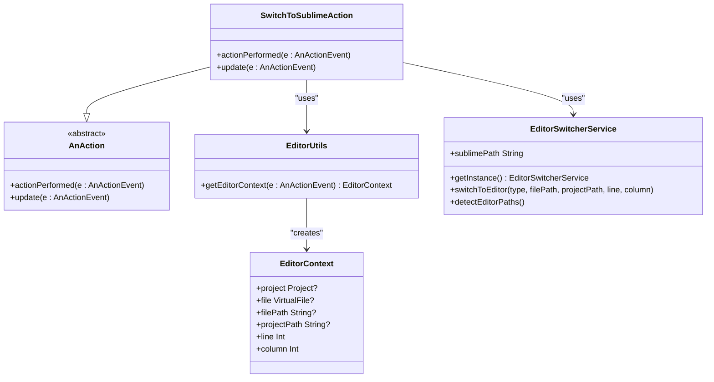
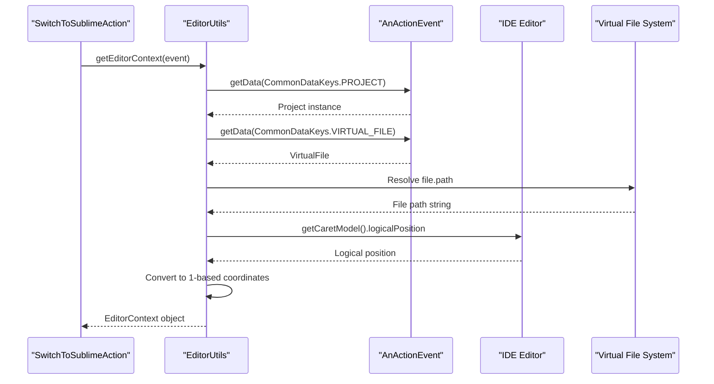
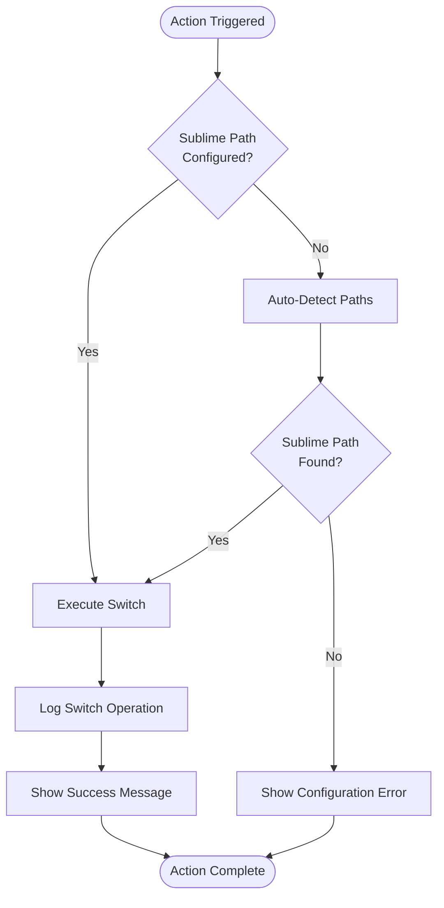
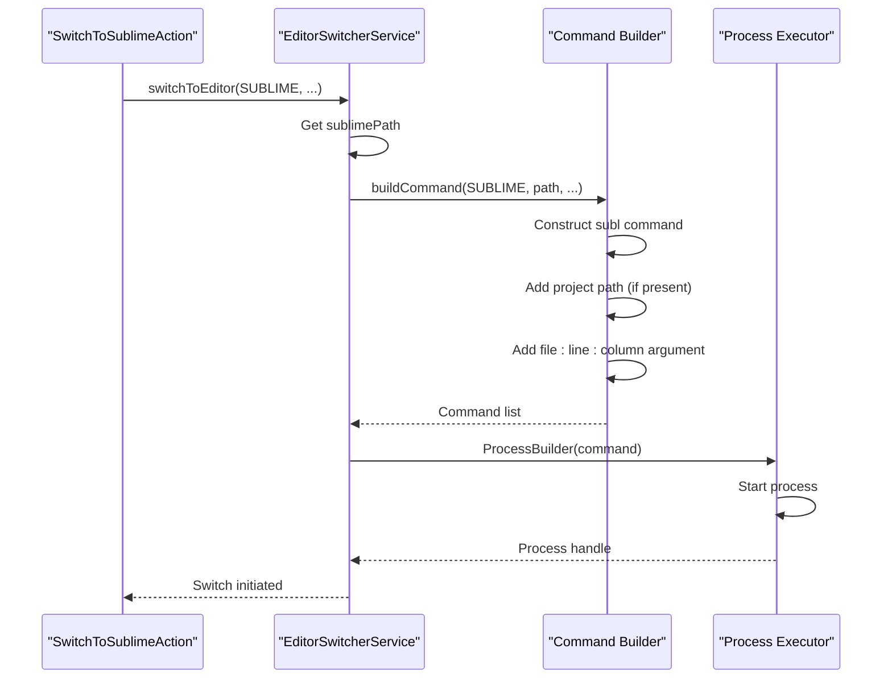
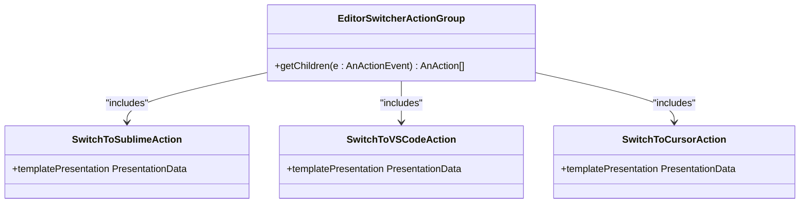
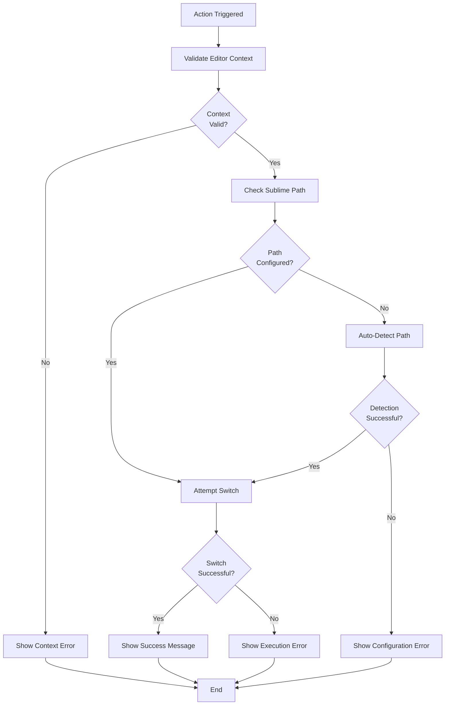

# Switch to Sublime Text Action

<cite>
**Referenced Files in This Document**
- [SwitchToSublimeAction.kt](file://src/main/kotlin/io/yanxxcloud/editorswitcher/actions/SwitchToSublimeAction.kt)
- [EditorSwitcherService.kt](file://src/main/kotlin/io/yanxxcloud/editorswitcher/services/EditorSwitcherService.kt)
- [EditorUtils.kt](file://src/main/kotlin/io/yanxxcloud/editorswitcher/utils/EditorUtils.kt)
- [plugin.xml](file://src/main/resources/META-INF/plugin.xml)
- [EditorSwitcherActionGroup.kt](file://src/main/kotlin/io/yanxxcloud/editorswitcher/ui/EditorSwitcherActionGroup.kt)
- [SmartEditorSwitcherConfigurable.kt](file://src/main/kotlin/io/yanxxcloud/editorswitcher/settings/SmartEditorSwitcherConfigurable.kt)
- [SwitchToVSCodeAction.kt](file://src/main/kotlin/io/yanxxcloud/editorswitcher/actions/SwitchToVSCodeAction.kt)
</cite>

## Table of Contents
1. [Introduction](#introduction)
2. [Action Implementation Overview](#action-implementation-overview)
3. [Context Extraction with EditorUtils](#context-extraction-with-editorutils)
4. [Path Validation and Auto-Detection](#path-validation-and-auto-detection)
5. [Core Switching Mechanism](#core-switching-mechanism)
6. [Integration Points](#integration-points)
7. [Error Handling Flow](#error-handling-flow)
8. [Platform-Specific Considerations](#platform-specific-considerations)
9. [Advanced Usage and Customization](#advanced-usage-and-customization)
10. [Troubleshooting Guide](#troubleshooting-guide)
11. [Best Practices](#best-practices)

## Introduction

The SwitchToSublimeAction class is a specialized IntelliJ Platform action that enables seamless transitions from JetBrains IDEs to Sublime Text while preserving the current editing context. This action serves as part of the Smart Editor Switcher plugin ecosystem, providing intelligent cursor positioning and project context maintenance across different development environments.

The action implements a sophisticated workflow that extracts the current editor state, validates Sublime Text installation, builds platform-appropriate command-line arguments, and executes the switch operation with comprehensive error handling and user feedback mechanisms.

## Action Implementation Overview

The SwitchToSublimeAction follows the standard IntelliJ Platform action pattern, extending the AnAction base class and implementing two primary lifecycle methods: `actionPerformed()` and `update()`.



**Diagram sources**
- [SwitchToSublimeAction.kt](file://src/main/kotlin/io/yanxxcloud/editorswitcher/actions/SwitchToSublimeAction.kt#L10-L45)
- [EditorUtils.kt](file://src/main/kotlin/io/yanxxcloud/editorswitcher/utils/EditorUtils.kt#L10-L44)
- [EditorSwitcherService.kt](file://src/main/kotlin/io/yanxxcloud/editorswitcher/services/EditorSwitcherService.kt#L15-L267)

**Section sources**
- [SwitchToSublimeAction.kt](file://src/main/kotlin/io/yanxxcloud/editorswitcher/actions/SwitchToSublimeAction.kt#L10-L45)

## Context Extraction with EditorUtils

The action begins by leveraging the EditorUtils utility to extract comprehensive editing context from the current IntelliJ Platform action event. This context includes the active project, current file, cursor position, and project root path.

### Context Information Extraction

The EditorUtils.getEditorContext() method performs several critical operations:

1. **Project Context Retrieval**: Extracts the current project from the action event
2. **File Context Acquisition**: Obtains the currently edited virtual file
3. **Path Resolution**: Resolves both file and project paths for cross-platform compatibility
4. **Cursor Position Detection**: Captures the current caret position with 1-based indexing



**Diagram sources**
- [EditorUtils.kt](file://src/main/kotlin/io/yanxxcloud/editorswitcher/utils/EditorUtils.kt#L15-L44)

The extracted context provides essential information for Sublime Text's command-line interface, including:
- **File Path**: Full path to the currently edited file
- **Project Path**: Root directory of the current project
- **Line Number**: Current cursor position (1-based)
- **Column Number**: Current column position (1-based)

**Section sources**
- [EditorUtils.kt](file://src/main/kotlin/io/yanxxcloud/editorswitcher/utils/EditorUtils.kt#L15-L44)

## Path Validation and Auto-Detection

The action implements a robust validation mechanism that ensures Sublime Text is properly configured before attempting to switch. This multi-stage process includes initial path checking, automatic detection, and user notification for configuration.

### Validation Workflow



**Diagram sources**
- [SwitchToSublimeAction.kt](file://src/main/kotlin/io/yanxxcloud/editorswitcher/actions/SwitchToSublimeAction.kt#L12-L32)

### Auto-Detection Process

When the Sublime Text path is not configured, the action triggers the EditorSwitcherService's auto-detection mechanism. This process examines platform-specific installation locations:

**Windows Locations:**
- `C:\Program Files\Sublime Text\subl.exe`
- `C:\Program Files (x86)\Sublime Text\subl.exe`

**macOS Locations:**
- `/Applications/Sublime Text.app/Contents/SharedSupport/bin/subl`
- `/usr/local/bin/subl`

**Linux Locations:**
- `/opt/sublime_text/sublime_text`
- `/usr/local/bin/subl`

The detection algorithm uses the Java File API to verify path existence and returns the first valid path found, or an empty string if no installation is detected.

**Section sources**
- [SwitchToSublimeAction.kt](file://src/main/kotlin/io/yanxxcloud/editorswitcher/actions/SwitchToSublimeAction.kt#L12-L32)
- [EditorSwitcherService.kt](file://src/main/kotlin/io/yanxxcloud/editorswitcher/services/EditorSwitcherService.kt#L125-L135)

## Core Switching Mechanism

The switching operation leverages the EditorSwitcherService's unified command-building and execution framework. For Sublime Text, this involves constructing a specific command-line argument format that preserves cursor position and project context.

### Command Construction for Sublime Text

Sublime Text uses a distinctive command-line syntax that differs from other editors in the ecosystem. The service builds commands using the following pattern:

```
subl [project_path] [file_path]:line:column
```

Where:
- **project_path**: Optional project root directory
- **file_path**: Full path to the target file
- **line**: Target line number (1-based)
- **column**: Target column number (1-based)



**Diagram sources**
- [EditorSwitcherService.kt](file://src/main/kotlin/io/yanxxcloud/editorswitcher/services/EditorSwitcherService.kt#L44-L250)

### Execution and Logging

The service employs robust error handling during process execution, logging both successful switches and failures for debugging purposes. The logging includes the constructed command for troubleshooting.

**Section sources**
- [EditorSwitcherService.kt](file://src/main/kotlin/io/yanxxcloud/editorswitcher/services/EditorSwitcherService.kt#L44-L62)
- [EditorSwitcherService.kt](file://src/main/kotlin/io/yanxxcloud/editorswitcher/services/EditorSwitcherService.kt#L100-L110)

## Integration Points

The SwitchToSublimeAction integrates seamlessly with the IntelliJ Platform through multiple UI entry points, providing users with flexible access methods.

### Plugin Registration in plugin.xml

The action is registered as part of the SmartEditorSwitcher.MainGroup, making it accessible through the Tools menu and providing a standardized keyboard shortcut.

| Integration Point | Description | Shortcut |
|-------------------|-------------|----------|
| **Tools Menu** | Primary access through Tools → Switch Editor | N/A |
| **Right-Click Menu** | Available in file and project views | N/A |
| **Status Bar Widget** | Quick access from bottom status bar | N/A |
| **Keyboard Shortcut** | Global shortcut for rapid switching | Ctrl+Alt+S |

### UI Component Integration

The action participates in the EditorSwitcherActionGroup, which provides a unified interface for all supported editors. This group maintains consistent presentation and behavior across different editor types.



**Diagram sources**
- [EditorSwitcherActionGroup.kt](file://src/main/kotlin/io/yanxxcloud/editorswitcher/ui/EditorSwitcherActionGroup.kt#L10-L35)

**Section sources**
- [plugin.xml](file://src/main/resources/META-INF/plugin.xml#L65-L90)
- [EditorSwitcherActionGroup.kt](file://src/main/kotlin/io/yanxxcloud/editorswitcher/ui/EditorSwitcherActionGroup.kt#L10-L35)

## Error Handling Flow

The action implements comprehensive error handling that guides users through configuration issues and provides meaningful feedback for troubleshooting.

### Error Handling Stages



**Diagram sources**
- [SwitchToSublimeAction.kt](file://src/main/kotlin/io/yanxxcloud/editorswitcher/actions/SwitchToSublimeAction.kt#L12-L32)

### User Feedback Mechanisms

The action provides multiple levels of user feedback:

1. **Context Validation**: Ensures the action can operate within the current IDE state
2. **Path Configuration**: Guides users to configure Sublime Text paths
3. **Auto-Detection**: Attempts to resolve missing configurations automatically
4. **Success Confirmation**: Provides positive feedback when switching succeeds
5. **Error Reporting**: Offers detailed error messages for troubleshooting

**Section sources**
- [SwitchToSublimeAction.kt](file://src/main/kotlin/io/yanxxcloud/editorswitcher/actions/SwitchToSublimeAction.kt#L18-L32)

## Platform-Specific Considerations

The action handles platform differences transparently, ensuring consistent behavior across Windows, macOS, and Linux environments.

### Cross-Platform Path Handling

The EditorSwitcherService manages platform-specific path resolution through:

- **Path Separators**: Automatic conversion between forward and backward slashes
- **Executable Extensions**: Platform-appropriate file extensions (.exe on Windows)
- **Installation Locations**: Predefined search paths for each operating system
- **Environment Variables**: Support for PATH environment variable differences

### Sublime Text CLI Behavior

Sublime Text's command-line interface exhibits specific behaviors that the action accommodates:

- **Argument Format**: Uses colon-separated line:column notation
- **Project Opening**: Supports opening projects alongside individual files
- **Working Directory**: Maintains appropriate current directory for execution
- **Process Management**: Handles subprocess creation and monitoring

**Section sources**
- [EditorSwitcherService.kt](file://src/main/kotlin/io/yanxxcloud/editorswitcher/services/EditorSwitcherService.kt#L125-L135)

## Advanced Usage and Customization

For advanced users and developers, the action provides extension points and customization options that accommodate diverse workflow requirements.

### Custom Launch Commands

While the action uses the standard Sublime Text CLI syntax, developers can extend the EditorSwitcherService to support custom launch configurations:

```kotlin
// Example extension pattern for custom Sublime Text launches
fun switchWithCustomArgs(filePath: String?, projectPath: String?, line: Int, column: Int) {
    val service = EditorSwitcherService.getInstance()
    val command = listOf(
        service.sublimePath,
        "--custom-flag",
        "--line=$line",
        "--column=$column",
        filePath
    ).filterNotNull()
    
    // Custom process execution logic
}
```

### Integration with Other Actions

The action follows the same patterns as other editor actions in the plugin, ensuring consistency:

- **Error Handling**: Similar to SwitchToVSCodeAction and other editor actions
- **Context Extraction**: Utilizes the same EditorUtils.getEditorContext() method
- **Service Integration**: Leverages the same EditorSwitcherService singleton
- **User Feedback**: Provides consistent message dialogs and logging

**Section sources**
- [SwitchToVSCodeAction.kt](file://src/main/kotlin/io/yanxxcloud/editorswitcher/actions/SwitchToVSCodeAction.kt#L12-L45)

## Troubleshooting Guide

Common issues and their solutions when using the SwitchToSublimeAction.

### Sublime Text Not Found

**Symptoms:**
- Error dialog: "Sublime Text 路径未配置"
- Action fails silently
- No switch occurs

**Solutions:**
1. **Manual Configuration**: Navigate to Settings → Tools → Smart Editor Switcher and set the Sublime Text path
2. **Auto-Detection**: Click the "自动检测路径" button in the settings panel
3. **Verify Installation**: Ensure Sublime Text is properly installed and accessible

### PATH Environment Issues

**Symptoms:**
- Auto-detection fails despite Sublime Text being installed
- Manual path works but auto-detection doesn't

**Solutions:**
1. **Check PATH Variable**: Verify Sublime Text is in system PATH
2. **Use Absolute Path**: Configure the exact installation path manually
3. **Environment Refresh**: Restart IDE after PATH changes

### Command-Line Syntax Issues

**Symptoms:**
- Sublime Text opens but doesn't navigate to correct file/position
- Incorrect file opens or wrong cursor position

**Solutions:**
1. **Verify CLI Version**: Ensure Sublime Text supports the required CLI syntax
2. **Check Arguments**: Review the constructed command in logs
3. **Test Manually**: Try the command manually in terminal

### Performance Considerations

**Optimization Tips:**
- **Pre-configure Paths**: Set all editor paths in settings to avoid runtime detection
- **Minimize Context Changes**: Reduce unnecessary context extraction overhead
- **Monitor Logs**: Use IDE logs to identify performance bottlenecks

**Section sources**
- [EditorSwitcherService.kt](file://src/main/kotlin/io/yanxxcloud/editorswitcher/services/EditorSwitcherService.kt#L125-L135)

## Best Practices

### For Users

1. **Configure Early**: Set up all editor paths in the plugin settings before first use
2. **Use Auto-Detection**: Rely on the auto-detection feature for initial setup
3. **Keep Updated**: Regularly check for plugin updates to maintain compatibility
4. **Backup Settings**: Export plugin settings before major IDE updates

### For Developers

1. **Follow Patterns**: Maintain consistency with other editor actions
2. **Handle Edge Cases**: Implement robust error handling for all scenarios
3. **Log Appropriately**: Provide useful logging for debugging and support
4. **Test Thoroughly**: Verify functionality across all supported platforms

### Maintenance Guidelines

The SwitchToSublimeAction demonstrates best practices for IntelliJ Platform plugin development:

- **Separation of Concerns**: Clear separation between UI actions and business logic
- **Error Resilience**: Comprehensive error handling and user feedback
- **Platform Abstraction**: Transparent handling of platform differences
- **Extensibility**: Design that accommodates future editor additions

**Section sources**
- [SwitchToSublimeAction.kt](file://src/main/kotlin/io/yanxxcloud/editorswitcher/actions/SwitchToSublimeAction.kt#L10-L45)
- [EditorSwitcherService.kt](file://src/main/kotlin/io/yanxxcloud/editorswitcher/services/EditorSwitcherService.kt#L15-L267)