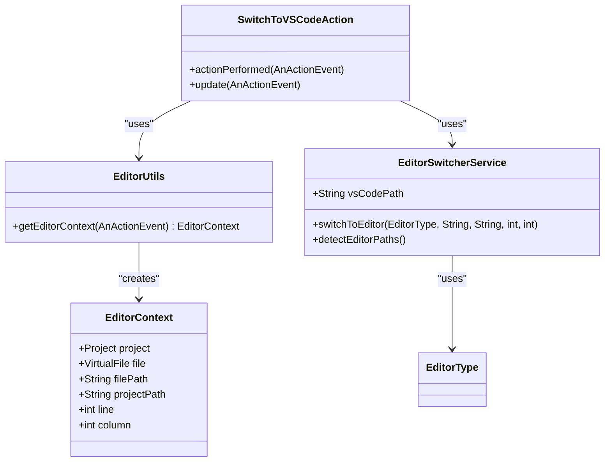
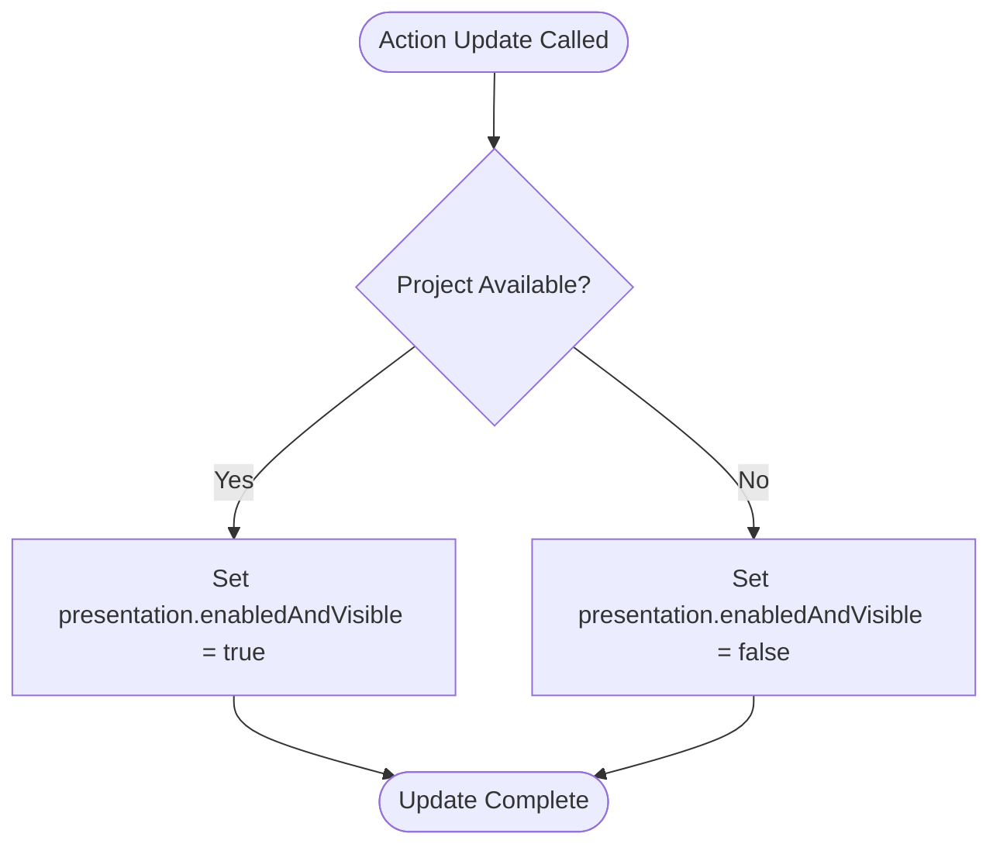
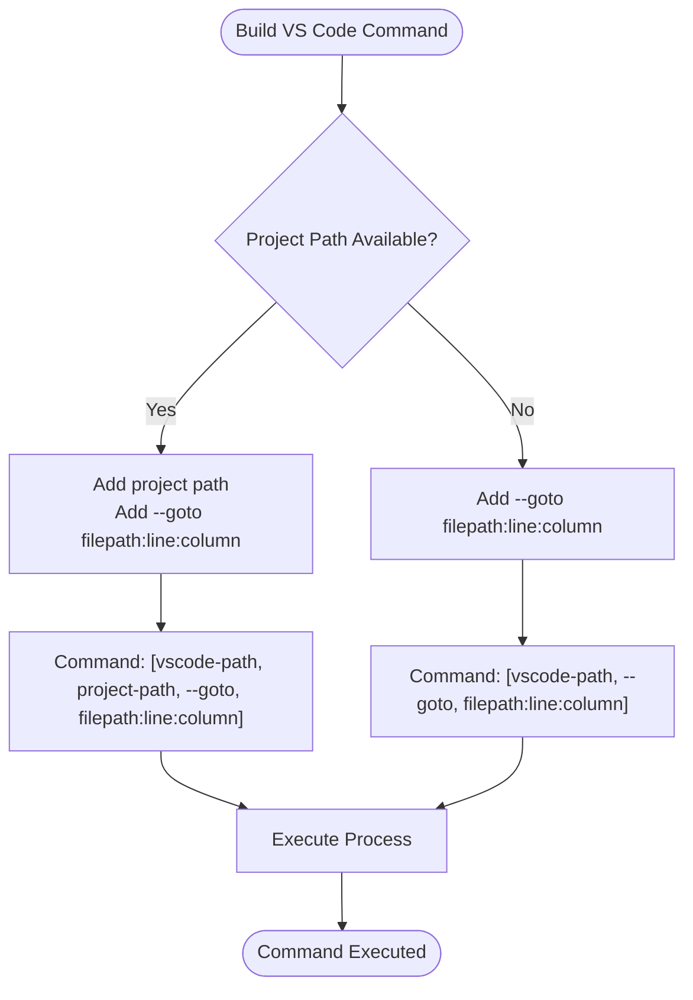

# Switch to VS Code Action

<cite>
**Referenced Files in This Document**
- [SwitchToVSCodeAction.kt](file://src/main/kotlin/io/yanxxcloud/editorswitcher/actions/SwitchToVSCodeAction.kt)
- [EditorSwitcherService.kt](file://src/main/kotlin/io/yanxxcloud/editorswitcher/services/EditorSwitcherService.kt)
- [EditorUtils.kt](file://src/main/kotlin/io/yanxxcloud/editorswitcher/utils/EditorUtils.kt)
- [plugin.xml](file://src/main/resources/META-INF/plugin.xml)
- [SmartEditorSwitcherConfigurable.kt](file://src/main/kotlin/io/yanxxcloud/editorswitcher/settings/SmartEditorSwitcherConfigurable.kt)
</cite>

## Table of Contents
1. [Introduction](#introduction)
2. [Class Architecture](#class-architecture)
3. [Core Implementation](#core-implementation)
4. [Integration Points](#integration-points)
5. [Command-Line Invocation Pattern](#command-line-invocation-pattern)
6. [Error Handling and User Feedback](#error-handling-and-user-feedback)
7. [Configuration Management](#configuration-management)
8. [Troubleshooting Guide](#troubleshooting-guide)
9. [Customization Options](#customization-options)
10. [Best Practices](#best-practices)

## Introduction

The SwitchToVSCodeAction class is a specialized IntelliJ Platform AnAction implementation that enables seamless switching from JetBrains IDEs to Visual Studio Code while preserving the current editing context. This action serves as a bridge between the IntelliJ ecosystem and VS Code, maintaining file positions, cursor locations, and project contexts during the transition.

The action integrates with the EditorUtils utility for context extraction, leverages the EditorSwitcherService for cross-editor communication, and utilizes IntelliJ's Messages API for user feedback. It implements a sophisticated command-line invocation pattern specifically designed for VS Code's CLI interface, particularly utilizing the `-g/--goto` flag for precise file navigation.

## Class Architecture

The SwitchToVSCodeAction follows a layered architecture pattern that separates concerns across multiple components:



**Diagram sources**
- [SwitchToVSCodeAction.kt](file://src/main/kotlin/io/yanxxcloud/editorswitcher/actions/SwitchToVSCodeAction.kt#L1-L46)
- [EditorUtils.kt](file://src/main/kotlin/io/yanxxcloud/editorswitcher/utils/EditorUtils.kt#L1-L45)
- [EditorSwitcherService.kt](file://src/main/kotlin/io/yanxxcloud/editorswitcher/services/EditorSwitcherService.kt#L1-L268)

**Section sources**
- [SwitchToVSCodeAction.kt](file://src/main/kotlin/io/yanxxcloud/editorswitcher/actions/SwitchToVSCodeAction.kt#L1-L46)
- [EditorUtils.kt](file://src/main/kotlin/io/yanxxcloud/editorswitcher/utils/EditorUtils.kt#L1-L45)
- [EditorSwitcherService.kt](file://src/main/kotlin/io/yanxxcloud/editorswitcher/services/EditorSwitcherService.kt#L1-L268)

## Core Implementation

### actionPerformed Method Implementation

The actionPerformed method orchestrates the complete workflow for switching to VS Code:

```mermaid
sequenceDiagram
participant User as "User"
participant Action as "SwitchToVSCodeAction"
participant Utils as "EditorUtils"
participant Service as "EditorSwitcherService"
participant VSCode as "VS Code Process"
User->>Action : Trigger action (Ctrl+Alt+V)
Action->>Utils : getEditorContext(event)
Utils-->>Action : EditorContext (file, line, column, project)
Action->>Service : getInstance()
Service-->>Action : Service instance
Action->>Service : check vsCodePath
alt VS Code path not configured
Action->>Service : detectEditorPaths()
Service-->>Action : Updated paths
Action->>Action : check vsCodePath again
alt Still not configured
Action->>User : Show error dialog
Note over User : "VS Code 路径未配置"
Exit
end
end
Action->>Service : switchToEditor(VSCODE, filePath, projectPath, line, column)
Service->>Service : buildCommand(VSCODE, path, filePath, projectPath, line, column)
Service->>VSCode : ProcessBuilder(command)
VSCode-->>Service : Process started
Service-->>Action : Execution complete
Action->>User : Show info dialog
Note over User : "正在切换到 VS Code..."
```

**Diagram sources**
- [SwitchToVSCodeAction.kt](file://src/main/kotlin/io/yanxxcloud/editorswitcher/actions/SwitchToVSCodeAction.kt#L8-L35)
- [EditorUtils.kt](file://src/main/kotlin/io/yanxxcloud/editorswitcher/utils/EditorUtils.kt#L15-L44)
- [EditorSwitcherService.kt](file://src/main/kotlin/io/yanxxcloud/editorswitcher/services/EditorSwitcherService.kt#L37-L62)

### update Method Implementation

The update method implements visibility and availability logic:



**Diagram sources**
- [SwitchToVSCodeAction.kt](file://src/main/kotlin/io/yanxxcloud/editorswitcher/actions/SwitchToVSCodeAction.kt#L37-L40)

**Section sources**
- [SwitchToVSCodeAction.kt](file://src/main/kotlin/io/yanxxcloud/editorswitcher/actions/SwitchToVSCodeAction.kt#L8-L40)

## Integration Points

### Plugin Registration

The action is registered in the plugin.xml configuration with specific metadata:

| Attribute | Value | Description |
|-----------|-------|-------------|
| id | SmartEditorSwitcher.SwitchToVSCode | Unique identifier |
| class | io.yanxxcloud.editorswitcher.actions.SwitchToVSCodeAction | Implementation class |
| text | Switch to VS Code | Display text in menus |
| description | Switch current file to VS Code | Tooltip description |
| keystroke | Ctrl+Alt+V | Default keyboard shortcut |

### Right-Click Menu Integration

The action participates in the right-click context menu system, appearing in both file and project view contexts. This integration allows users to quickly switch editors without navigating through menu hierarchies.

### Status Bar Widget Integration

While not directly implemented in the action itself, the action integrates with the status bar widget system for quick access through the bottom toolbar interface.

**Section sources**
- [plugin.xml](file://src/main/resources/META-INF/plugin.xml#L67-L72)

## Command-Line Invocation Pattern

### VS Code Specific Command Construction

The EditorSwitcherService constructs the VS Code command using a sophisticated pattern that handles both project-based and standalone file opening scenarios:



**Diagram sources**
- [EditorSwitcherService.kt](file://src/main/kotlin/io/yanxxcloud/editorswitcher/services/EditorSwitcherService.kt#L75-L85)

### Command Line Arguments

The VS Code invocation uses the following argument pattern:
- **Primary Argument**: VS Code executable path
- **Optional Project Argument**: Project directory (when available)
- **Navigation Flag**: `--goto` followed by `filepath:line:column`

This pattern ensures VS Code opens with precise cursor positioning and maintains the project context when available.

**Section sources**
- [EditorSwitcherService.kt](file://src/main/kotlin/io/yanxxcloud/editorswitcher/services/EditorSwitcherService.kt#L75-L85)

## Error Handling and User Feedback

### Path Configuration Validation

The action implements a two-tier validation approach:

1. **Initial Check**: Verify if VS Code path is configured
2. **Fallback Detection**: Attempt automatic path detection
3. **Final Validation**: Re-check after detection attempt

### User Feedback Mechanisms

The implementation utilizes IntelliJ's Messages API for comprehensive user communication:

| Scenario | Message Type | Content |
|----------|--------------|---------|
| Path Not Configured | Error Dialog | "VS Code 路径未配置。请在 Settings > Tools > Smart Editor Switcher 中配置路径。" |
| Successful Switch | Information Dialog | "正在切换到 VS Code... (行: {line}, 列: {column})" |

### Graceful Degradation

When VS Code fails to launch, the system logs the error but continues operation without crashing the IDE. This ensures the plugin remains functional even when external applications are unavailable.

**Section sources**
- [SwitchToVSCodeAction.kt](file://src/main/kotlin/io/yanxxcloud/editorswitcher/actions/SwitchToVSCodeAction.kt#L12-L35)

## Configuration Management

### Automatic Path Detection

The EditorSwitcherService implements intelligent path detection for VS Code across multiple platforms:

| Platform | Priority 1 | Priority 2 | Priority 3 |
|----------|------------|------------|------------|
| macOS | `/Applications/Visual Studio Code.app/Contents/Resources/app/bin/code` | `/usr/local/bin/code` | `/opt/visual-studio-code/bin/code` |
| Windows | `C:\Program Files\Microsoft VS Code\bin\code.cmd` | `C:\Program Files (x86)\Microsoft VS Code\bin\code.cmd` | N/A |
| Linux | `/usr/local/bin/code` | `/opt/visual-studio-code/bin/code` | N/A |

### Manual Configuration Interface

Users can manually configure the VS Code path through the Settings interface:
- Navigate to `Settings → Tools → Smart Editor Switcher`
- Locate the VS Code path field
- Enter the absolute path to the VS Code executable
- Click "Apply" to save configuration

### Configuration Persistence

The service implements persistent state management using IntelliJ's component system, ensuring configuration survives IDE restarts and updates.

**Section sources**
- [EditorSwitcherService.kt](file://src/main/kotlin/io/yanxxcloud/editorswitcher/services/EditorSwitcherService.kt#L155-L165)
- [SmartEditorSwitcherConfigurable.kt](file://src/main/kotlin/io/yanxxcloud/editorswitcher/settings/SmartEditorSwitcherConfigurable.kt#L1-L56)

## Troubleshooting Guide

### Common Issues and Solutions

#### VS Code Not Launching

**Symptoms**: Action executes but VS Code doesn't open
**Causes**:
- Incorrect executable path configuration
- VS Code installation corrupted
- Missing dependencies

**Solutions**:
1. Verify VS Code path in Settings
2. Test path manually in terminal
3. Reinstall VS Code if necessary
4. Check system PATH variables

#### Incorrect File Navigation

**Symptoms**: VS Code opens but not at correct file/position
**Causes**:
- File path resolution issues
- Line/column coordinate mismatches
- Project context problems

**Solutions**:
1. Ensure file is saved before switching
2. Verify file exists at reported path
3. Check project structure alignment
4. Test with simpler file paths

#### Performance Issues

**Symptoms**: Delayed response or hanging
**Causes**:
- Large project initialization
- Network drive access
- Resource-intensive extensions

**Solutions**:
1. Close unnecessary projects
2. Disable resource-heavy extensions temporarily
3. Monitor system resources
4. Consider VS Code performance settings

### Debug Information

The service logs detailed debug information including:
- Command construction parameters
- Process execution status
- Error stack traces
- Path detection results

Enable debug logging through IntelliJ's diagnostic tools for detailed troubleshooting.

## Customization Options

### Launch Arguments Modification

While the current implementation uses the standardized `--goto` flag, the service architecture allows for customization:

```kotlin
// Example of potential customization
private fun buildCustomVSCodeCommand(editorPath: String, filePath: String?, projectPath: String?, line: Int, column: Int): List<String> {
    val command = mutableListOf(editorPath)
    
    // Custom argument pattern for different VS Code versions
    if (projectPath != null) {
        command.add(projectPath)
        command.add("--new-window") // Force new window
    }
    
    filePath?.let {
        command.addAll(listOf("--goto", "$it:$line:$column"))
    }
    
    return command
}
```

### Alternative Navigation Methods

For VS Code installations that don't support the `--goto` flag, alternative approaches could be implemented:
- Using `--file-uri` with URI-encoded paths
- Employing extension-based solutions
- Leveraging VS Code's REST API for programmatic control

### Platform-Specific Optimizations

The path detection system can be extended for:
- VS Code Insiders builds
- Portable installations
- Custom installation locations
- Multi-version coexistence scenarios

## Best Practices

### Development Guidelines

1. **Context Preservation**: Always extract complete editor context before initiating switches
2. **Error Handling**: Implement comprehensive error checking and user feedback
3. **Resource Management**: Properly handle process lifecycle and cleanup
4. **Configuration Validation**: Validate paths and configurations before execution

### User Experience Recommendations

1. **Immediate Feedback**: Provide instant visual confirmation of action initiation
2. **Progress Indication**: Show loading indicators for long-running operations
3. **Error Recovery**: Offer clear guidance for resolving configuration issues
4. **Documentation**: Maintain comprehensive help and troubleshooting resources

### Maintenance Considerations

1. **Version Compatibility**: Test with multiple VS Code versions
2. **Platform Support**: Ensure cross-platform functionality
3. **Performance Monitoring**: Track execution times and resource usage
4. **User Feedback**: Collect and analyze user reports for continuous improvement

The SwitchToVSCodeAction demonstrates sophisticated integration between IntelliJ Platform APIs and external application management, providing users with seamless cross-editor workflow capabilities while maintaining robust error handling and user experience standards.