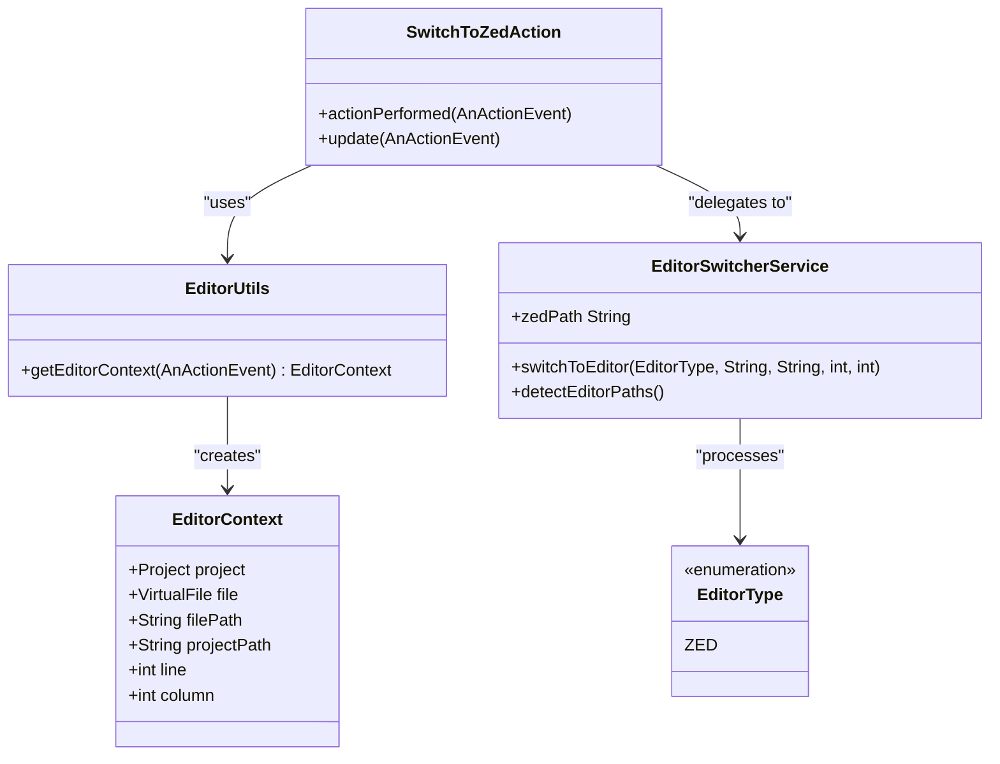
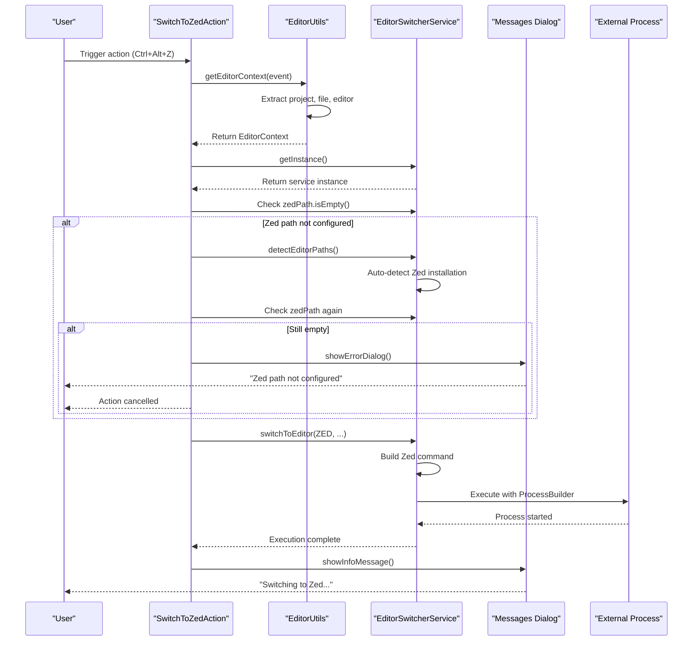
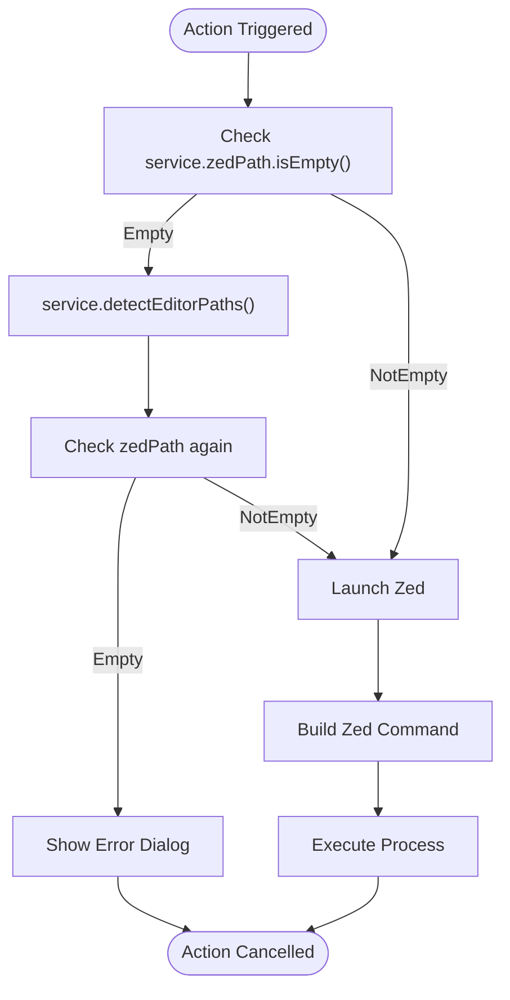
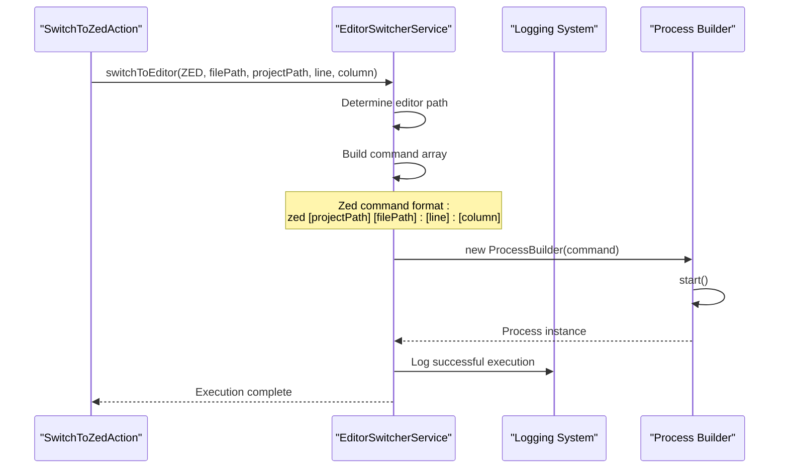

# Switch to Zed Action

<cite>
**Referenced Files in This Document**
- [SwitchToZedAction.kt](file://src/main/kotlin/io/yanxxcloud/editorswitcher/actions/SwitchToZedAction.kt)
- [EditorSwitcherService.kt](file://src/main/kotlin/io/yanxxcloud/editorswitcher/services/EditorSwitcherService.kt)
- [EditorUtils.kt](file://src/main/kotlin/io/yanxxcloud/editorswitcher/utils/EditorUtils.kt)
- [plugin.xml](file://src/main/resources/META-INF/plugin.xml)
- [SmartEditorSwitcherConfigurable.kt](file://src/main/kotlin/io/yanxxcloud/editorswitcher/settings/SmartEditorSwitcherConfigurable.kt)
- [SmartEditorSwitcherSettingsComponent.kt](file://src/main/kotlin/io/yanxxcloud/editorswitcher/settings/SmartEditorSwitcherSettingsComponent.kt)
- [SwitchToVSCodeAction.kt](file://src/main/kotlin/io/yanxxcloud/editorswitcher/actions/SwitchToVSCodeAction.kt)
</cite>

## Table of Contents
1. [Introduction](#introduction)
2. [Action Architecture](#action-architecture)
3. [Action Lifecycle](#action-lifecycle)
4. [Context Extraction](#context-extraction)
5. [Path Validation and Detection](#path-validation-and-detection)
6. [Error Handling Workflow](#error-handling-workflow)
7. [Service Delegation](#service-delegation)
8. [Integration Details](#integration-details)
9. [Troubleshooting Guide](#troubleshooting-guide)
10. [Customization Options](#customization-options)
11. [Code Examples](#code-examples)

## Introduction

The SwitchToZedAction class is a specialized IntelliJ Platform action that enables seamless switching from JetBrains IDEs to the Zed editor while preserving context information such as file paths, cursor positions, and project contexts. This action serves as part of the Smart Editor Switcher plugin ecosystem, providing intelligent editor switching capabilities with precise context restoration.

The action follows the standard IntelliJ Platform action pattern, extending `AnAction` and implementing both the `actionPerformed` and `update` methods to handle user interactions and visibility controls respectively. It integrates deeply with the plugin's service layer to manage editor configurations and execution commands.

## Action Architecture

The SwitchToZedAction follows a layered architecture pattern typical of IntelliJ Platform plugins, consisting of several key components:



**Diagram sources**
- [SwitchToZedAction.kt](file://src/main/kotlin/io/yanxxcloud/editorswitcher/actions/SwitchToZedAction.kt#L8-L45)
- [EditorUtils.kt](file://src/main/kotlin/io/yanxxcloud/editorswitcher/utils/EditorUtils.kt#L10-L44)
- [EditorSwitcherService.kt](file://src/main/kotlin/io/yanxxcloud/editorswitcher/services/EditorSwitcherService.kt#L35-L62)

**Section sources**
- [SwitchToZedAction.kt](file://src/main/kotlin/io/yanxxcloud/editorswitcher/actions/SwitchToZedAction.kt#L1-L46)

## Action Lifecycle

The SwitchToZedAction operates through a well-defined lifecycle that ensures proper context extraction, validation, and execution:



**Diagram sources**
- [SwitchToZedAction.kt](file://src/main/kotlin/io/yanxxcloud/editorswitcher/actions/SwitchToZedAction.kt#L10-L40)
- [EditorUtils.kt](file://src/main/kotlin/io/yanxxcloud/editorswitcher/utils/EditorUtils.kt#L15-L44)
- [EditorSwitcherService.kt](file://src/main/kotlin/io/yanxxcloud/editorswitcher/services/EditorSwitcherService.kt#L35-L62)

**Section sources**
- [SwitchToZedAction.kt](file://src/main/kotlin/io/yanxxcloud/editorswitcher/actions/SwitchToZedAction.kt#L10-L45)

## Context Extraction

The action begins by extracting comprehensive context information using the EditorUtils.getEditorContext method. This context includes:

### Context Components

| Component | Type | Description | Purpose |
|-----------|------|-------------|---------|
| `project` | Project | Current IntelliJ project | Used for UI feedback and project-relative operations |
| `file` | VirtualFile | Currently opened file | Provides file metadata and path information |
| `filePath` | String | Absolute file path | Passed to Zed as target file |
| `projectPath` | String | Project base directory | Used for workspace context preservation |
| `line` | Int | Current cursor line (1-based) | Preserves editing position |
| `column` | Int | Current cursor column (1-based) | Preserves exact cursor placement |

### Context Extraction Process

The context extraction follows a structured approach:

1. **Project Context**: Retrieves the current project from the action event
2. **File Context**: Extracts the currently opened file using `CommonDataKeys.VIRTUAL_FILE`
3. **Editor Context**: Obtains the current editor instance for cursor position
4. **Position Calculation**: Converts logical positions to 1-based coordinates
5. **Path Resolution**: Determines absolute file and project paths

**Section sources**
- [EditorUtils.kt](file://src/main/kotlin/io/yanxxcloud/editorswitcher/utils/EditorUtils.kt#L15-L44)

## Path Validation and Detection

The action implements a robust path validation mechanism that ensures Zed is properly configured before attempting to launch:

### Validation Workflow



**Diagram sources**
- [SwitchToZedAction.kt](file://src/main/kotlin/io/yanxxcloud/editorswitcher/actions/SwitchToZedAction.kt#L13-L25)

### Automatic Path Detection

The system attempts to automatically detect Zed installations across multiple platforms:

| Platform | Possible Paths | Notes |
|----------|----------------|-------|
| macOS | `/Applications/Zed.app/Contents/MacOS/zed` | Standard app bundle location |
| macOS | `/usr/local/bin/zed` | Homebrew installation |
| macOS | `/opt/zed/zed` | Alternative installation |
| Windows | `C:\Program Files\Zed\zed.exe` | Standard Windows installation |
| Windows | `%USERPROFILE%\AppData\Local\Programs\Zed\zed.exe` | User-specific installation |

**Section sources**
- [EditorSwitcherService.kt](file://src/main/kotlin/io/yanxxcloud/editorswitcher/services/EditorSwitcherService.kt#L253-L260)

## Error Handling Workflow

The action implements a comprehensive error handling strategy that provides clear feedback to users when Zed cannot be launched:

### Error Handling Stages

1. **Initial Validation**: Checks if Zed path is configured
2. **Automatic Detection**: Attempts to auto-detect Zed installation
3. **User Notification**: Provides clear error messages with actionable guidance
4. **Graceful Degradation**: Prevents action execution when conditions aren't met

### Error Message Content

When Zed path detection fails, the system displays a standardized error dialog with:
- **Message**: "Zed 路径未配置。请在 Settings > Tools > Smart Editor Switcher 中配置路径。"
- **Title**: "Smart Editor Switcher"
- **Action**: Redirects users to the plugin's configuration interface

### UI Feedback Mechanism

The action provides immediate visual feedback through IntelliJ's message dialog system:
- **Error Dialog**: Red alert indicating configuration issue
- **Information Dialog**: Confirmation when switching successfully
- **Project Context**: All dialogs are bound to the current project for proper UI integration

**Section sources**
- [SwitchToZedAction.kt](file://src/main/kotlin/io/yanxxcloud/editorswitcher/actions/SwitchToZedAction.kt#L16-L25)

## Service Delegation

The action delegates the actual editor switching operation to the EditorSwitcherService, which handles the complex task of building and executing the appropriate command:

### Service Interaction Pattern



**Diagram sources**
- [EditorSwitcherService.kt](file://src/main/kotlin/io/yanxxcloud/editorswitcher/services/EditorSwitcherService.kt#L35-L62)

### Zed-Specific Command Building

The EditorSwitcherService constructs Zed-specific commands using the following syntax:

```
zed [projectPath] [filePath]:[line]:[column]
```

This command format ensures:
- **Project Context**: Opens Zed with the correct workspace
- **File Targeting**: Opens the specific file being edited
- **Position Precision**: Places the cursor at the exact line and column

**Section sources**
- [EditorSwitcherService.kt](file://src/main/kotlin/io/yanxxcloud/editorswitcher/services/EditorSwitcherService.kt#L150-L170)

## Integration Details

The SwitchToZedAction integrates seamlessly with the IntelliJ Platform through multiple mechanisms:

### Plugin Registration

The action is registered in the plugin.xml configuration file with specific attributes:

| Attribute | Value | Purpose |
|-----------|-------|---------|
| `id` | `SmartEditorSwitcher.SwitchToZed` | Unique identifier |
| `class` | `io.yanxxcloud.editorswitcher.actions.SwitchToZedAction` | Implementation class |
| `text` | `Switch to Zed` | Display text in menus |
| `description` | `Switch current file to Zed` | Tooltip and help text |
| `first-keystroke` | `ctrl alt Z` | Default keyboard shortcut |

### Visibility Control

The action implements visibility rules through the `update` method:

```kotlin
override fun update(e: AnActionEvent) {
    e.presentation.isEnabledAndVisible = e.project != null
}
```

This ensures the action is only available when:
- A project is open in the IDE
- The action can access project context
- Proper editor context is available

### Menu Integration

The action appears in multiple locations within the IntelliJ interface:
- **Tools Menu**: Under the "Switch Editor" group
- **Right-click Menus**: In both file explorer and editor popup menus
- **Status Bar Widget**: Available through the plugin's status bar integration

**Section sources**
- [plugin.xml](file://src/main/resources/META-INF/plugin.xml#L77-L83)
- [SwitchToZedAction.kt](file://src/main/kotlin/io/yanxxcloud/editorswitcher/actions/SwitchToZedAction.kt#L42-L45)

## Troubleshooting Guide

### Common Issues and Solutions

#### Zed Not Launching on macOS

**Problem**: Zed fails to launch despite being installed on macOS.

**Causes and Solutions**:
1. **Incorrect Path Detection**: The automatic detection may not find Zed in non-standard locations
   - Solution: Manually configure the path in Settings → Tools → Smart Editor Switcher
   - Verify path: `/Applications/Zed.app/Contents/MacOS/zed`

2. **Security Restrictions**: macOS Gatekeeper may block unsigned applications
   - Solution: Right-click the Zed.app and select "Open" to bypass restrictions
   - Alternatively, sign the application or adjust security settings

3. **Missing Dependencies**: Zed may depend on system libraries not available
   - Solution: Install Xcode command line tools: `xcode-select --install`

#### Zed Not Launching on Linux

**Problem**: Zed executable not found or fails to start on Linux systems.

**Causes and Solutions**:
1. **Executable Permissions**: The Zed binary may lack execute permissions
   - Solution: `chmod +x /path/to/zed`
   - Verify with: `ls -la /path/to/zed`

2. **Missing Runtime Libraries**: Zed may require system libraries not present
   - Solution: Install required dependencies (check Zed documentation)
   - Common missing packages: libgtk-3-dev, libwebkit2gtk-4.0-dev

3. **Incorrect Executable Name**: Some distributions use different executable names
   - Solution: Configure custom path in plugin settings
   - Example: `/usr/bin/zed-editor` or `/opt/zed/zed`

#### General Troubleshooting Steps

1. **Verify Installation**: Confirm Zed is properly installed and functional
2. **Check Path Configuration**: Validate the configured path in plugin settings
3. **Test Manual Launch**: Try launching Zed manually from terminal
4. **Review Logs**: Check IntelliJ IDEA logs for error messages
5. **Plugin Updates**: Ensure both Zed and the plugin are updated to latest versions

### Diagnostic Information

When reporting issues, provide:
- IntelliJ IDEA version and build number
- Operating system and version
- Zed editor version
- Plugin version
- Error messages from IntelliJ logs
- Manual launch test results

**Section sources**
- [EditorSwitcherService.kt](file://src/main/kotlin/io/yanxxcloud/editorswitcher/services/EditorSwitcherService.kt#L253-L260)

## Customization Options

### Workspace-Specific Behavior

The plugin supports customization of launch behavior through several mechanisms:

#### Custom Command Configuration

While the plugin provides built-in support for Zed's CLI syntax, advanced users can customize the launch command:

1. **Path Modification**: Change the Zed executable path for different versions
2. **Additional Arguments**: Add custom arguments for specific workflows
3. **Environment Variables**: Configure environment-specific settings

#### Configuration Persistence

All customizations are persisted through IntelliJ's persistent state system:
- **File Location**: `SmartEditorSwitcher.xml` in IntelliJ configuration directory
- **Format**: XML-based configuration storage
- **Backup**: Automatically backed up with IntelliJ settings

### Advanced Customization

For power users requiring specialized behavior:

1. **Custom Editor Types**: Extend the EditorType enumeration for new editors
2. **Command Builders**: Override the command building logic for custom syntax
3. **Path Detection**: Implement custom detection algorithms for unique environments

**Section sources**
- [EditorSwitcherService.kt](file://src/main/kotlin/io/yanxxcloud/editorswitcher/services/EditorSwitcherService.kt#L15-L30)

## Code Examples

### Basic Action Implementation

The SwitchToZedAction demonstrates the standard IntelliJ Platform action pattern:

```kotlin
// Action class structure (source path: [SwitchToZedAction.kt](file://src/main/kotlin/io/yanxxcloud/editorswitcher/actions/SwitchToZedAction.kt#L8-L45))
class SwitchToZedAction : AnAction() {
    override fun actionPerformed(e: AnActionEvent) {
        // Context extraction and validation logic
    }
    
    override fun update(e: AnActionEvent) {
        // Visibility control logic
    }
}
```

### Service Layer Integration

The service layer provides the core functionality for editor switching:

```kotlin
// Service method signature (source path: [EditorSwitcherService.kt](file://src/main/kotlin/io/yanxxcloud/editorswitcher/services/EditorSwitcherService.kt#L35-L62))
fun switchToEditor(
    editorType: EditorType, 
    filePath: String?, 
    projectPath: String?, 
    line: Int = 1, 
    column: Int = 1
)
```

### Context Extraction Pattern

The context extraction follows a reusable pattern used across all editor actions:

```kotlin
// Context extraction implementation (source path: [EditorUtils.kt](file://src/main/kotlin/io/yanxxcloud/editorswitcher/utils/EditorUtils.kt#L15-L44))
fun getEditorContext(e: AnActionEvent): EditorContext {
    // Extract project, file, editor, and position information
    // Convert logical positions to 1-based coordinates
    // Return structured context object
}
```

### Error Handling Pattern

The error handling follows IntelliJ's recommended patterns:

```kotlin
// Error handling implementation (source path: [SwitchToZedAction.kt](file://src/main/kotlin/io/yanxxcloud/editorswitcher/actions/SwitchToZedAction.kt#L16-L25))
if (service.zedPath.isEmpty()) {
    service.detectEditorPaths()
    if (service.zedPath.isEmpty()) {
        Messages.showErrorDialog(
            context.project,
            "Zed 路径未配置。请在 Settings > Tools > Smart Editor Switcher 中配置路径。",
            "Smart Editor Switcher"
        )
        return
    }
}
```

**Section sources**
- [SwitchToZedAction.kt](file://src/main/kotlin/io/yanxxcloud/editorswitcher/actions/SwitchToZedAction.kt#L10-L45)
- [EditorSwitcherService.kt](file://src/main/kotlin/io/yanxxcloud/editorswitcher/services/EditorSwitcherService.kt#L35-L62)
- [EditorUtils.kt](file://src/main/kotlin/io/yanxxcloud/editorswitcher/utils/EditorUtils.kt#L15-L44)