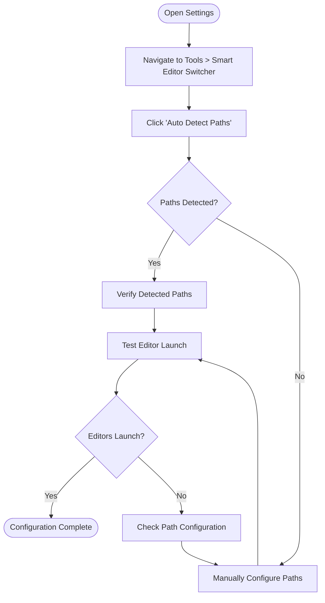
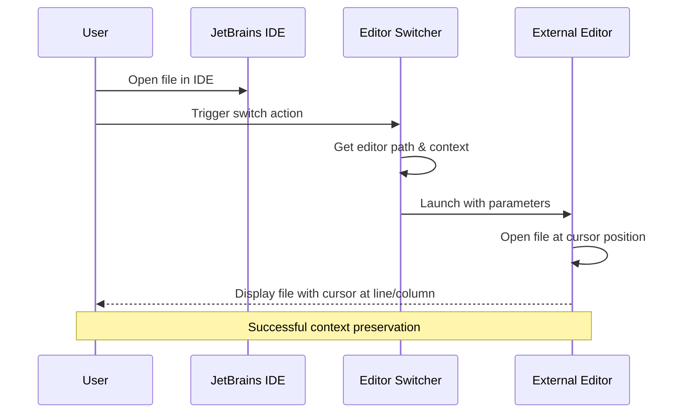
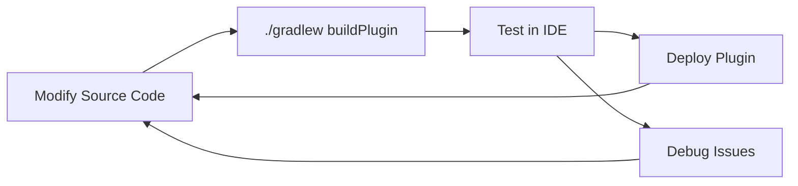

# Installation and Setup

<cite>
**Referenced Files in This Document**
- [INSTALL.md](file://INSTALL.md)
- [build.gradle.kts](file://build.gradle.kts)
- [README.md](file://README.md)
- [plugin.xml](file://src/main/resources/META-INF/plugin.xml)
- [SmartEditorSwitcherConfigurable.kt](file://src/main/kotlin/io/yanxxcloud/editorswitcher/settings/SmartEditorSwitcherConfigurable.kt)
- [EditorUtils.kt](file://src/main/kotlin/io/yanxxcloud/editorswitcher/utils/EditorUtils.kt)
- [EditorSwitcherService.kt](file://src/main/kotlin/io/yanxxcloud/editorswitcher/services/EditorSwitcherService.kt)
- [SmartEditorSwitcherSettingsComponent.kt](file://src/main/kotlin/io/yanxxcloud/editorswitcher/settings/SmartEditorSwitcherSettingsComponent.kt)
- [gradle.properties](file://gradle.properties)
- [build.sh](file://build.sh)
</cite>

## Table of Contents
1. [Introduction](#introduction)
2. [System Requirements](#system-requirements)
3. [Installation Methods](#installation-methods)
4. [Configuration Steps](#configuration-steps)
5. [Editor Path Configuration](#editor-path-configuration)
6. [Verification and Testing](#verification-and-testing)
7. [Common Issues and Troubleshooting](#common-issues-and-troubleshooting)
8. [Development Setup](#development-setup)
9. [Advanced Configuration](#advanced-configuration)

## Introduction

The Smart Editor Switcher is a professional JetBrains IDE plugin that enables seamless transitions between JetBrains IDEs and popular external editors. This plugin maintains intelligent cursor positioning and preserves project context when switching between editors, supporting VS Code, Cursor, Zed, Kiro, Sublime Text, and other mainstream editors.

The plugin provides multiple installation methods to accommodate different user preferences and environments, from automated plugin marketplace installations to manual file-based deployments.

## System Requirements

### IDE Compatibility
- **Supported IDE Versions**: 2023.2 (Build 232) through 2025.2 (Build 252.*)
- **Compatible IDEs**: IntelliJ IDEA, PyCharm, WebStorm, PhpStorm, CLion, GoLand, and all JetBrains IDE products
- **Platform Support**: Windows, macOS, and Linux

### Technical Requirements
- **Java Version**: Java 17 or higher
- **Memory**: Minimum 512MB RAM for plugin operation
- **Disk Space**: Approximately 10MB for plugin installation

### Supported Editors
The plugin supports the following editors with automatic path detection:
- **VS Code**: Microsoft Visual Studio Code
- **Cursor**: AI-powered code editor
- **Zed**: High-performance code editor
- **Kiro**: AI-driven modern editor
- **Sublime Text**: Lightweight text editor
- **Atom**: GitHub open-source editor
- **Notepad++**: Windows text editor
- **Vim/Emacs**: Classic terminal-based editors

**Section sources**
- [build.gradle.kts](file://build.gradle.kts#L32-L34)
- [plugin.xml](file://src/main/resources/META-INF/plugin.xml#L54-L55)
- [gradle.properties](file://gradle.properties#L10-L12)

## Installation Methods

### Method 1: Install from JetBrains Plugin Marketplace

This is the recommended installation method for most users, providing automatic updates and simplified management.

#### Step-by-Step Installation

1. **Open JetBrains IDE**
   - Launch your preferred JetBrains IDE (IntelliJ IDEA, PyCharm, WebStorm, etc.)

2. **Access Plugin Settings**
   - Navigate to `File` > `Settings` (Windows/Linux) or `IntelliJ IDEA` > `Preferences` (macOS)
   - Select `Plugins` from the left sidebar

3. **Install from Marketplace**
   - Click the `Marketplace` tab at the top of the Plugins window
   - Search for "Smart Editor Switcher" in the search bar
   - Locate the plugin in the search results and click `Install`

4. **Restart IDE**
   - After installation completes, restart your IDE to activate the plugin
   - The plugin will automatically appear in the Tools menu

#### Advantages of Marketplace Installation
- Automatic updates when new versions are released
- Simplified uninstallation process
- Verified compatibility with your IDE version
- Access to user reviews and ratings

### Method 2: Install from Disk (Manual Installation)

This method provides greater control over the installation process and is useful for development or offline environments.

#### Prerequisites
- Download the plugin ZIP file from the official repository or build it locally
- Ensure you have the correct plugin version compatible with your IDE

#### Installation Process

1. **Locate Plugin Distribution**
   - The built plugin file is located at: `build/distributions/editor-switcher-1.0-SNAPSHOT.zip`
   - This file contains the compiled plugin ready for installation

2. **Access Plugin Settings**
   - Open your JetBrains IDE
   - Navigate to `File` > `Settings` > `Plugins`

3. **Install from Disk**
   - Click the gear icon ⚙️ in the upper-right corner of the Plugins window
   - Select `Install Plugin from Disk...`
   - Browse to locate the downloaded plugin ZIP file
   - Select the file and click `OK`

4. **Complete Installation**
   - Restart your IDE to activate the plugin
   - Verify installation by checking for the plugin in the Tools menu

#### Manual Installation Directory Paths

**macOS**
- Plugin directory: `~/Library/Application Support/JetBrains/[IDE]/plugins/`
- Example: `~/Library/Application Support/JetBrains/IntelliJIdea2024.2/plugins/`

**Windows**
- Plugin directory: `%APPDATA%\JetBrains\[IDE]\plugins\`
- Example: `%APPDATA%\JetBrains\IntelliJIdea2024.2\plugins\`

**Linux**
- Plugin directory: `~/.local/share/JetBrains/[IDE]/plugins/`
- Example: `~/.local/share/JetBrains/IntelliJIdea2024.2/plugins/`

#### Uninstalling Manually Installed Plugins

1. Close your JetBrains IDE
2. Navigate to the appropriate plugin directory for your operating system
3. Delete the plugin folder (usually named `editor-switcher`)
4. Restart your IDE

**Section sources**
- [INSTALL.md](file://INSTALL.md#L15-L35)
- [build.gradle.kts](file://build.gradle.kts#L1-L48)

## Configuration Steps

After successful installation, configure the plugin to work with your preferred editors.

### Accessing Configuration Settings

1. **Open Settings/Preferences**
   - Navigate to `File` > `Settings` (Windows/Linux) or `IntelliJ IDEA` > `Preferences` (macOS)

2. **Navigate to Editor Switcher Settings**
   - Expand the `Tools` section in the left sidebar
   - Select `Smart Editor Switcher` from the submenu

3. **Configuration Interface**
   - The settings panel displays configurable paths for each supported editor
   - Includes automatic path detection functionality

### Initial Configuration Workflow



**Diagram sources**
- [SmartEditorSwitcherSettingsComponent.kt](file://src/main/kotlin/io/yanxxcloud/editorswitcher/settings/SmartEditorSwitcherSettingsComponent.kt#L144-L164)
- [EditorSwitcherService.kt](file://src/main/kotlin/io/yanxxcloud/editorswitcher/services/EditorSwitcherService.kt#L139-L179)

**Section sources**
- [SmartEditorSwitcherConfigurable.kt](file://src/main/kotlin/io/yanxxcloud/editorswitcher/settings/SmartEditorSwitcherConfigurable.kt#L1-L56)
- [SmartEditorSwitcherSettingsComponent.kt](file://src/main/kotlin/io/yanxxcloud/editorswitcher/settings/SmartEditorSwitcherSettingsComponent.kt#L1-L39)

## Editor Path Configuration

Configure the executable paths for each supported editor to enable seamless switching functionality.

### Automatic Path Detection

The plugin includes intelligent path detection that automatically locates installed editors:

1. **Click "Auto Detect Paths"**
   - Located at the bottom of the Smart Editor Switcher settings panel
   - Scans common installation directories for supported editors

2. **Detection Results**
   - Successfully detected paths are automatically populated in the configuration fields
   - Undetected editors remain empty for manual configuration

### Manual Path Configuration

For editors not detected automatically or custom installations, manually configure the paths:

#### VS Code Configuration

**macOS**
```
/Applications/Visual Studio Code.app/Contents/Resources/app/bin/code
```

**Windows**
```
C:\Program Files\Microsoft VS Code\bin\code.cmd
```

**Linux**
```
/usr/bin/code
```

#### Kiro Configuration

**macOS**
```
/Applications/Kiro.app/Contents/MacOS/Kiro
```

**Windows**
```
C:\Program Files\Kiro\Kiro.exe
```

**Linux**
```
/usr/local/bin/kiro
```

#### Sublime Text Configuration

**macOS**
```
/Applications/Sublime Text.app/Contents/SharedSupport/bin/subl
```

**Windows**
```
C:\Program Files\Sublime Text\subl.exe
```

**Linux**
```
/usr/bin/subl
```

#### Additional Editor Configurations

**Cursor**
```
/Applications/Cursor.app/Contents/Resources/app/bin/cursor  # macOS
/usr/local/bin/cursor                     # Linux
C:\Program Files\Cursor\Cursor.exe        # Windows
```

**Zed**
```
/Applications/Zed.app/Contents/MacOS/zed   # macOS
/usr/local/bin/zed                       # Linux
C:\Program Files\Zed\zed.exe             # Windows
```

**Vim**
```
/usr/bin/vim                              # Linux/macOS
C:\Program Files\Vim\vim90\vim.exe       # Windows
```

**Emacs**
```
/Applications/Emacs.app/Contents/MacOS/Emacs  # macOS
/usr/local/bin/emacs                      # Linux
C:\Program Files\Emacs\bin\emacs.exe      # Windows
```

### Path Validation and Testing

After configuring paths:

1. **Save Configuration**
   - Click `Apply` or `OK` to save your settings
   - The plugin validates paths during this process

2. **Test Editor Launch**
   - Try switching to each configured editor using the plugin shortcuts
   - Verify that editors launch correctly with the current file open

3. **Handle Path Errors**
   - If an editor fails to launch, verify the path is correct
   - Ensure the editor executable has proper permissions
   - Check for spaces in the path and handle accordingly

**Section sources**
- [EditorSwitcherService.kt](file://src/main/kotlin/io/yanxxcloud/editorswitcher/services/EditorSwitcherService.kt#L179-L267)
- [SmartEditorSwitcherSettingsComponent.kt](file://src/main/kotlin/io/yanxxcloud/editorswitcher/settings/SmartEditorSwitcherSettingsComponent.kt#L86-L118)

## Verification and Testing

Ensure the plugin is properly installed and configured through systematic verification steps.

### Installation Verification

#### Plugin Appearance Check
1. **Tools Menu Integration**
   - Navigate to `Tools` > `Switch Editor`
   - Verify the menu contains entries for all configured editors
   - Check for right-click context menu options in file explorer

2. **Status Bar Widget**
   - Look for the plugin status bar widget in the bottom-right corner
   - Click the widget to access quick switching options

3. **Keyboard Shortcuts**
   - Test all keyboard shortcuts:
     - `Ctrl+Alt+K` → Switch to Kiro
     - `Ctrl+Alt+V` → Switch to VS Code
     - `Ctrl+Alt+S` → Switch to Sublime Text
     - `Ctrl+Alt+C` → Switch to Cursor
     - `Ctrl+Alt+Z` → Switch to Zed

#### Functional Testing



**Diagram sources**
- [EditorUtils.kt](file://src/main/kotlin/io/yanxxcloud/editorswitcher/utils/EditorUtils.kt#L15-L44)
- [EditorSwitcherService.kt](file://src/main/kotlin/io/yanxxcloud/editorswitcher/services/EditorSwitcherService.kt#L30-L50)

### Context Preservation Testing

1. **Cursor Position Verification**
   - Open a file in your JetBrains IDE
   - Place the cursor at a specific line and column
   - Switch to an external editor using the plugin
   - Verify the external editor opens the file with the cursor at the same position

2. **Project Context Testing**
   - Open a project in your JetBrains IDE
   - Switch to an external editor
   - Verify the external editor maintains the project context
   - Test with different file types and project structures

3. **Multiple File Testing**
   - Open several files in different tabs
   - Switch between editors with different files open
   - Verify the correct file and cursor position are maintained

### Performance Verification

1. **Launch Speed Testing**
   - Measure the time from plugin activation to external editor startup
   - Ensure response times are under 2 seconds for typical setups

2. **Resource Usage Monitoring**
   - Monitor IDE memory usage during editor switching
   - Verify minimal impact on IDE performance

3. **Concurrent Operations**
   - Test switching between multiple editors rapidly
   - Verify stability under concurrent operations

**Section sources**
- [plugin.xml](file://src/main/resources/META-INF/plugin.xml#L57-L70)
- [EditorUtils.kt](file://src/main/kotlin/io/yanxxcloud/editorswitcher/utils/EditorUtils.kt#L1-L45)

## Common Issues and Troubleshooting

Address frequent problems encountered during installation and configuration.

### Path Configuration Issues

#### Incorrect Editor Paths
**Problem**: Editors fail to launch despite correct installation
**Solution**:
1. Verify the executable path is correct
2. Check file permissions for the editor executable
3. Test the path manually by running it from the command line
4. Use the "Auto Detect Paths" feature to find correct locations

#### Permission Errors
**Problem**: "Permission denied" or "Access denied" errors when launching editors
**Solution**:
1. **macOS**: Run `chmod +x /path/to/editor` to make the executable file executable
2. **Windows**: Right-click the executable, select Properties, and check "Unblock" if present
3. **Linux**: Ensure the executable has proper permissions with `chmod +x /path/to/editor`

#### Spaces in File Paths
**Problem**: Editors fail to launch when paths contain spaces
**Solution**:
1. **Automatic Handling**: The plugin automatically handles quoted paths for most editors
2. **Manual Verification**: Ensure paths with spaces are properly quoted in the configuration
3. **Alternative Paths**: Use alternative installation paths without spaces if issues persist

### IDE Compatibility Issues

#### Unsupported IDE Version
**Problem**: Plugin fails to install or crashes with older/newer IDE versions
**Solution**:
1. **Check Compatibility**: Verify your IDE version is between 2023.2 (Build 232) and 2025.2 (Build 252.*)
2. **Update IDE**: Upgrade to a compatible IDE version
3. **Use Compatible Plugin**: Download a plugin version matching your IDE

#### Plugin Conflicts
**Problem**: Other plugins interfere with Smart Editor Switcher functionality
**Solution**:
1. Disable conflicting plugins temporarily
2. Check IDE logs for conflict-related errors
3. Report conflicts to plugin developers with detailed error information

### Performance and Stability Issues

#### Slow Editor Launches
**Problem**: External editors take too long to start after plugin activation
**Solution**:
1. **Optimize Editor Startup**: Reduce startup options in external editors
2. **Check System Resources**: Ensure adequate CPU and memory availability
3. **Network Connectivity**: Verify no network-dependent operations slow down launches

#### Memory Leaks
**Problem**: IDE memory usage increases over time with plugin usage
**Solution**:
1. **Update Plugin**: Install the latest plugin version
2. **Monitor Usage**: Track memory usage patterns
3. **Report Issues**: Document memory usage trends for developer review

### Debugging and Diagnostics

#### Enabling Debug Logging
1. **Access Log Settings**: Navigate to `Help` > `Show Log in Explorer/Finder`
2. **Review Logs**: Check IDE log files for plugin-related errors
3. **Error Patterns**: Look for specific error messages related to editor launching

#### Resetting Configuration
1. **Backup Current Settings**: Export current configuration if needed
2. **Reset to Defaults**: Remove custom paths and use auto-detection
3. **Reconfigure**: Manually set paths after reset

#### Contact Support
When issues persist:
1. **Gather Information**: Collect IDE version, plugin version, and error messages
2. **Check Issues**: Search existing GitHub issues for similar problems
3. **Report Bug**: Submit detailed bug reports with reproduction steps

**Section sources**
- [EditorSwitcherService.kt](file://src/main/kotlin/io/yanxxcloud/editorswitcher/services/EditorSwitcherService.kt#L50-L65)
- [INSTALL.md](file://INSTALL.md#L50-L69)

## Development Setup

For developers who want to modify or contribute to the plugin.

### Prerequisites for Development

#### Required Software
- **Java Development Kit**: JDK 17 or higher
- **Git**: Version control system
- **Gradle**: Build automation tool (included with wrapper)
- **JetBrains IDE**: For testing plugin development

#### Environment Setup

1. **Clone Repository**
   ```bash
   git clone https://github.com/yanxxcloud/smart-editor-switcher.git
   cd smart-editor-switcher
   ```

2. **Set Java Environment**
   - The project includes a build script that sets Java 17 environment
   - Alternatively, set `JAVA_HOME` to point to JDK 17 installation

3. **Verify Setup**
   ```bash
   ./gradlew --version
   # Should show Gradle version 8.14+ and Java 17
   ```

### Building the Plugin

#### Standard Build Process
```bash
# Clean previous builds
./gradlew clean

# Build the plugin distribution
./gradlew buildPlugin

# The plugin ZIP will be created at:
# build/distributions/editor-switcher-1.0-SNAPSHOT.zip
```

#### Development Workflow


**Diagram sources**
- [build.gradle.kts](file://build.gradle.kts#L1-L48)
- [build.sh](file://build.sh#L1-L7)

#### Running Development Sandbox
```bash
# Start IDE with plugin loaded
./gradlew runIde

# This creates a sandbox environment for testing
# Changes to source code trigger automatic reload
```

#### Testing and Quality Assurance
```bash
# Run unit tests (if available)
./gradlew test

# Verify plugin structure and compatibility
./gradlew verifyPlugin
```

### Plugin Development Guidelines

#### Code Structure
- **Actions**: Located in `src/main/kotlin/io/yanxxcloud/editorswitcher/actions/`
- **Services**: Business logic in `src/main/kotlin/io/yanxxcloud/editorswitcher/services/`
- **UI Components**: Settings and interface in `src/main/kotlin/io/yanxxcloud/editorswitcher/settings/`
- **Utilities**: Helper functions in `src/main/kotlin/io/yanxxcloud/editorswitcher/utils/`

#### Configuration Management
- **Persistent State**: Use `PersistentStateComponent` for settings storage
- **XML Configuration**: Define plugin metadata in `src/main/resources/META-INF/plugin.xml`
- **Version Management**: Update version in `gradle.properties` for releases

#### Testing Strategies
1. **Unit Testing**: Test individual components in isolation
2. **Integration Testing**: Verify plugin functionality within IDE
3. **Cross-Platform Testing**: Test on Windows, macOS, and Linux
4. **IDE Compatibility**: Test across supported IDE versions

**Section sources**
- [build.gradle.kts](file://build.gradle.kts#L1-L48)
- [gradle.properties](file://gradle.properties#L1-L34)
- [INSTALL.md](file://INSTALL.md#L66-L69)

## Advanced Configuration

Optimize plugin performance and customize behavior for specialized use cases.

### Custom Editor Integration

#### Adding New Editors
To support additional editors beyond the built-in list:

1. **Extend EditorType Enum**
   ```kotlin
   enum class EditorType {
       KIRO, VSCODE, SUBLIME, ATOM, NOTEPADPP, VIM, EMACS, CURSOR, ZED,
       NEW_EDITOR  // Add new editor type
   }
   ```

2. **Update Path Detection**
   ```kotlin
   private fun detectNewEditorPath(): String {
       val possiblePaths = listOf(
           "/custom/path/to/new-editor",
           "C:\\Custom\\Path\\To\\NewEditor.exe"
       )
       return possiblePaths.firstOrNull { File(it).exists() } ?: ""
   }
   ```

3. **Add Command Building Logic**
   ```kotlin
   EditorType.NEW_EDITOR -> {
       listOf("/path/to/new-editor", filePath)
   }
   ```

#### Custom Command Arguments
Different editors may require specific argument formats:

```kotlin
private fun buildCommand(editorType: EditorType, editorPath: String, ...) = when (editorType) {
    EditorType.CUSTOM -> {
        val command = mutableListOf(editorPath)
        // Add custom arguments based on editor requirements
        command
    }
}
```

### Performance Optimization

#### Memory Management
- **Lazy Loading**: Load editor configurations only when needed
- **Resource Cleanup**: Properly dispose of UI components and file handles
- **Caching**: Cache frequently accessed editor paths and metadata

#### Launch Optimization
- **Parallel Detection**: Detect multiple editor paths concurrently
- **Async Operations**: Perform path detection without blocking the UI thread
- **Fallback Mechanisms**: Provide alternative launch methods when primary fails

### Multi-Environment Configuration

#### Team Development Setup
For teams using different editor preferences:

1. **Shared Configuration**: Use version control for common editor paths
2. **Environment Variables**: Support editor paths through environment variables
3. **Conditional Loading**: Load different configurations based on user profiles

#### CI/CD Integration
Automate plugin testing and deployment:

```bash
# Automated testing pipeline
./gradlew clean buildPlugin test verifyPlugin
```

### Security Considerations

#### Path Validation
- **Sanitize Inputs**: Validate editor paths to prevent injection attacks
- **Permission Checks**: Verify executable permissions before launching
- **Safe Defaults**: Provide secure fallback paths for common editors

#### External Process Security
- **Process Isolation**: Launch external editors in isolated processes
- **Argument Sanitization**: Escape special characters in file paths and arguments
- **Timeout Handling**: Implement timeouts for external process launches

**Section sources**
- [EditorSwitcherService.kt](file://src/main/kotlin/io/yanxxcloud/editorswitcher/services/EditorSwitcherService.kt#L1-L268)
- [SmartEditorSwitcherSettingsComponent.kt](file://src/main/kotlin/io/yanxxcloud/editorswitcher/settings/SmartEditorSwitcherSettingsComponent.kt#L1-L164)