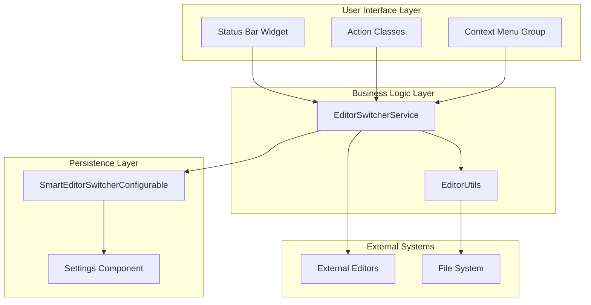
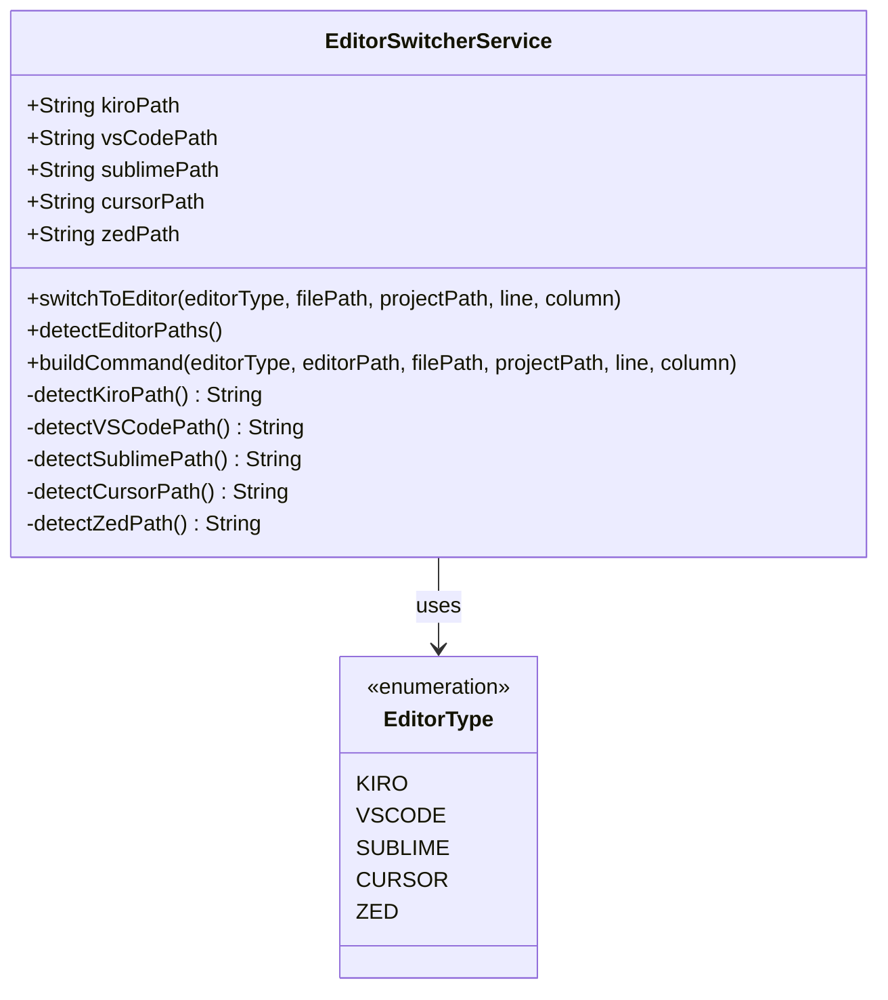
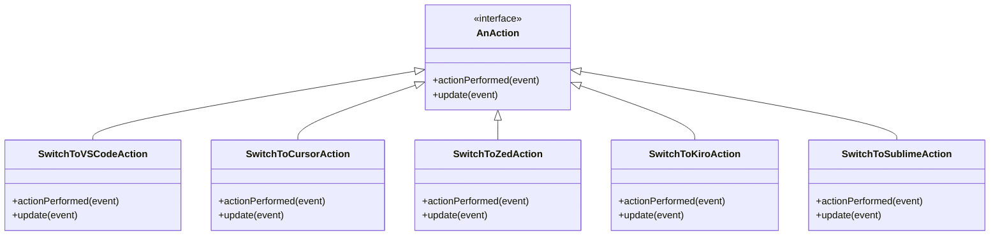
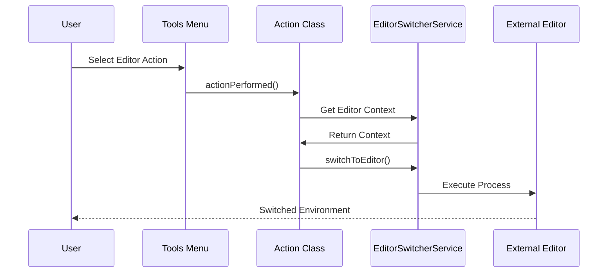
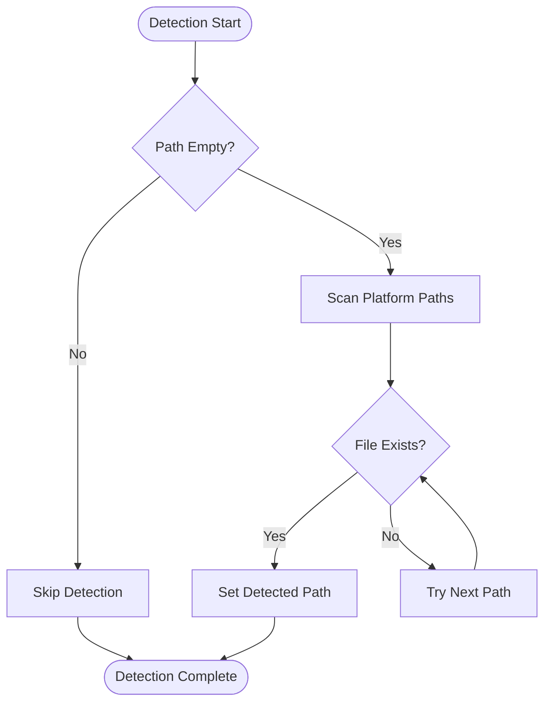
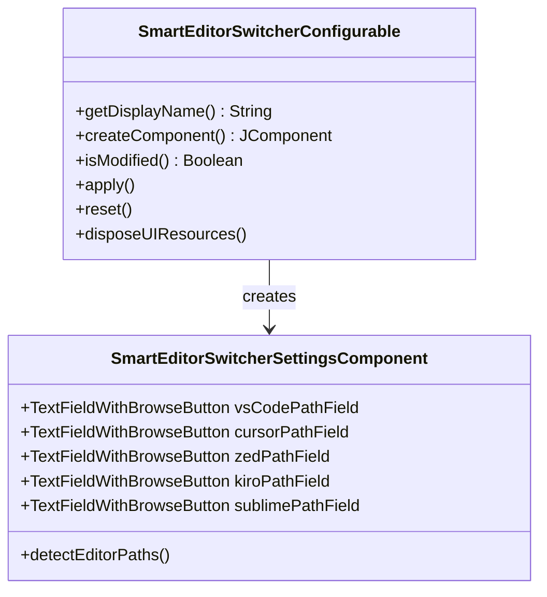

# Smart Editor Switcher Plugin - Project Overview

<cite>
**Referenced Files in This Document**
- [README.md](file://README.md)
- [plugin.xml](file://src/main/resources/META-INF/plugin.xml)
- [EditorSwitcherService.kt](file://src/main/kotlin/io/yanxxcloud/editorswitcher/services/EditorSwitcherService.kt)
- [EditorUtils.kt](file://src/main/kotlin/io/yanxxcloud/editorswitcher/utils/EditorUtils.kt)
- [SmartEditorSwitcherConfigurable.kt](file://src/main/kotlin/io/yanxxcloud/editorswitcher/settings/SmartEditorSwitcherConfigurable.kt)
- [SmartEditorSwitcherSettingsComponent.kt](file://src/main/kotlin/io/yanxxcloud/editorswitcher/settings/SmartEditorSwitcherSettingsComponent.kt)
- [EditorSwitcherStatusBarWidgetFactory.kt](file://src/main/kotlin/io/yanxxcloud/editorswitcher/ui/EditorSwitcherStatusBarWidgetFactory.kt)
- [EditorSwitcherStatusBarWidget.kt](file://src/main/kotlin/io/yanxxcloud/editorswitcher/ui/EditorSwitcherStatusBarWidget.kt)
- [EditorSwitcherActionGroup.kt](file://src/main/kotlin/io/yanxxcloud/editorswitcher/ui/EditorSwitcherActionGroup.kt)
- [SwitchToVSCodeAction.kt](file://src/main/kotlin/io/yanxxcloud/editorswitcher/actions/SwitchToVSCodeAction.kt)
- [SwitchToCursorAction.kt](file://src/main/kotlin/io/yanxxcloud/editorswitcher/actions/SwitchToCursorAction.kt)
- [SwitchToZedAction.kt](file://src/main/kotlin/io/yanxxcloud/editorswitcher/actions/SwitchToZedAction.kt)
- [SwitchToKiroAction.kt](file://src/main/kotlin/io/yanxxcloud/editorswitcher/actions/SwitchToKiroAction.kt)
- [SwitchToSublimeAction.kt](file://src/main/kotlin/io/yanxxcloud/editorswitcher/actions/SwitchToSublimeAction.kt)
- [build.gradle.kts](file://build.gradle.kts)
- [INSTALL.md](file://INSTALL.md)
</cite>

## Table of Contents
1. [Introduction](#introduction)
2. [Problem Statement and Solution](#problem-statement-and-solution)
3. [Supported Editors](#supported-editors)
4. [Architecture Overview](#architecture-overview)
5. [Core Components](#core-components)
6. [Integration with IntelliJ Platform](#integration-with-intellij-platform)
7. [User Interface Components](#user-interface-components)
8. [Technical Implementation Details](#technical-implementation-details)
9. [Configuration and Settings](#configuration-and-settings)
10. [Usage Examples](#usage-examples)
11. [Cross-Platform Support](#cross-platform-support)
12. [Development and Build Process](#development-and-build-process)
13. [Conclusion](#conclusion)

## Introduction

The Smart Editor Switcher is a professional JetBrains IDE plugin designed to enable seamless transitions between JetBrains IDEs and external mainstream editors. This plugin addresses the common developer pain point of maintaining context continuity when switching between development environments, particularly when working with specialized editors that offer unique features not available in JetBrains IDEs.

As modern development workflows often involve using multiple tools simultaneously, this plugin provides intelligent context preservation, ensuring that developers can switch between editors without losing their place in the codebase. The solution combines smart cursor positioning with automatic project context transfer, making the transition feel instantaneous and natural.

**Section sources**
- [README.md](file://README.md#L1-L75)
- [plugin.xml](file://src/main/resources/META-INF/plugin.xml#L1-L117)

## Problem Statement and Solution

### The Challenge
Developers frequently encounter situations where they need to switch between different editing environments:
- JetBrains IDEs for comprehensive development features
- Specialized editors for specific tasks (code review, documentation, etc.)
- Different editors for different project types or personal preferences

The traditional approach to switching editors involves manually opening files in the new environment, potentially losing cursor position, file context, and project structure. This results in productivity loss and context switching overhead.

### The Smart Solution
The Smart Editor Switcher plugin solves this problem through several key innovations:

1. **Intelligent Context Extraction**: Automatically captures current cursor position, file path, and project context
2. **Seamless Integration**: Provides multiple access points (keyboard shortcuts, right-click menus, status bar)
3. **Cross-Platform Compatibility**: Works across Windows, macOS, and Linux systems
4. **Automatic Path Detection**: Intelligently locates installed editors without manual configuration
5. **Persistent State Management**: Maintains editor configurations across IDE sessions

**Section sources**
- [README.md](file://README.md#L3-L15)
- [EditorUtils.kt](file://src/main/kotlin/io/yanxxcloud/editorswitcher/utils/EditorUtils.kt#L1-L45)

## Supported Editors

The plugin provides comprehensive support for a wide range of popular editors, each with optimized command-line arguments for optimal context preservation:

| Editor | Type | Platform Support | Key Features |
|--------|------|------------------|--------------|
| **VS Code** | General Purpose | Windows, macOS, Linux | IntelliSense, Extensions, Git Integration |
| **Cursor** | AI-Powered | Windows, macOS, Linux | AI Code Completion, Advanced Suggestions |
| **Zed** | High-Performance | Windows, macOS, Linux | Blazing Fast, Modern Architecture |
| **Kiro** | AI-Driven | Windows, macOS, Linux | AI Assistance, Smart Features |
| **Sublime Text** | Lightweight | Windows, macOS, Linux | Speed, Minimalist Design |
| **Atom** | GitHub Open Source | Windows, macOS, Linux | Extensible, Community Driven |
| **Notepad++** | Windows Native | Windows | Lightweight, Windows Integration |
| **Vim/Emacs** | Classic Editors | Cross-Platform | Terminal Integration, Extensibility |

**Section sources**
- [plugin.xml](file://src/main/resources/META-INF/plugin.xml#L30-L45)
- [EditorSwitcherService.kt](file://src/main/kotlin/io/yanxxcloud/editorswitcher/services/EditorSwitcherService.kt#L260-L268)

## Architecture Overview

The Smart Editor Switcher follows a modular, layered architecture with clear separation of concerns between presentation, business logic, and persistence layers.

**Diagram sources**
- [EditorSwitcherService.kt](file://src/main/kotlin/io/yanxxcloud/editorswitcher/services/EditorSwitcherService.kt#L1-L268)
- [EditorSwitcherStatusBarWidget.kt](file://src/main/kotlin/io/yanxxcloud/editorswitcher/ui/EditorSwitcherStatusBarWidget.kt#L1-L56)
- [SmartEditorSwitcherConfigurable.kt](file://src/main/kotlin/io/yanxxcloud/editorswitcher/settings/SmartEditorSwitcherConfigurable.kt#L1-L56)

### Architectural Principles

1. **Separation of Concerns**: Clear boundaries between UI, business logic, and persistence
2. **Single Responsibility**: Each component has a focused, well-defined purpose
3. **Dependency Injection**: Services are accessed through the IntelliJ platform's service manager
4. **Immutable State**: Configuration data is managed through persistent state components
5. **Extensible Design**: New editors can be added by extending the EditorType enumeration

**Section sources**
- [EditorSwitcherService.kt](file://src/main/kotlin/io/yanxxcloud/editorswitcher/services/EditorSwitcherService.kt#L10-L30)
- [SmartEditorSwitcherConfigurable.kt](file://src/main/kotlin/io/yanxxcloud/editorswitcher/settings/SmartEditorSwitcherConfigurable.kt#L1-L10)

## Core Components

### EditorSwitcherService

The central orchestrator of the plugin's functionality, responsible for:
- Managing editor paths and configurations
- Executing process switching commands
- Detecting installed editors automatically
- Maintaining persistent state across IDE sessions

Key responsibilities include:
- **Path Management**: Storing and retrieving executable paths for each supported editor
- **Command Building**: Constructing appropriate command-line arguments for each editor type
- **Process Execution**: Launching external editors with preserved context
- **Auto-Detection**: Scanning system paths for installed editors

**Diagram sources**
- [EditorSwitcherService.kt](file://src/main/kotlin/io/yanxxcloud/editorswitcher/services/EditorSwitcherService.kt#L10-L50)
- [EditorSwitcherService.kt](file://src/main/kotlin/io/yanxxcloud/editorswitcher/services/EditorSwitcherService.kt#L260-L268)

**Section sources**
- [EditorSwitcherService.kt](file://src/main/kotlin/io/yanxxcloud/editorswitcher/services/EditorSwitcherService.kt#L1-L268)

### EditorUtils

Provides context extraction capabilities, capturing essential information for seamless switching:

- **Project Context**: Current project base path and workspace information
- **File Context**: Active file path and virtual file reference
- **Cursor Position**: Precise line and column coordinates (1-based indexing)
- **Editor State**: Current editor selection and caret model information

The utility ensures consistent context capture across all action implementations, maintaining reliability and accuracy in the switching process.

**Section sources**
- [EditorUtils.kt](file://src/main/kotlin/io/yanxxcloud/editorswitcher/utils/EditorUtils.kt#L1-L45)

### Action Classes

Each supported editor has a dedicated action class that implements the `AnAction` interface:

**Diagram sources**
- [SwitchToVSCodeAction.kt](file://src/main/kotlin/io/yanxxcloud/editorswitcher/actions/SwitchToVSCodeAction.kt#L1-L46)
- [SwitchToCursorAction.kt](file://src/main/kotlin/io/yanxxcloud/editorswitcher/actions/SwitchToCursorAction.kt#L1-L46)
- [SwitchToZedAction.kt](file://src/main/kotlin/io/yanxxcloud/editorswitcher/actions/SwitchToZedAction.kt#L1-L46)
- [SwitchToKiroAction.kt](file://src/main/kotlin/io/yanxxcloud/editorswitcher/actions/SwitchToKiroAction.kt#L1-L46)
- [SwitchToSublimeAction.kt](file://src/main/kotlin/io/yanxxcloud/editorswitcher/actions/SwitchToSublimeAction.kt#L1-L46)

**Section sources**
- [SwitchToVSCodeAction.kt](file://src/main/kotlin/io/yanxxcloud/editorswitcher/actions/SwitchToVSCodeAction.kt#L1-L46)
- [SwitchToCursorAction.kt](file://src/main/kotlin/io/yanxxcloud/editorswitcher/actions/SwitchToCursorAction.kt#L1-L46)
- [SwitchToZedAction.kt](file://src/main/kotlin/io/yanxxcloud/editorswitcher/actions/SwitchToZedAction.kt#L1-L46)
- [SwitchToKiroAction.kt](file://src/main/kotlin/io/yanxxcloud/editorswitcher/actions/SwitchToKiroAction.kt#L1-L46)
- [SwitchToSublimeAction.kt](file://src/main/kotlin/io/yanxxcloud/editorswitcher/actions/SwitchToSublimeAction.kt#L1-L46)

## Integration with IntelliJ Platform

### Action System Integration

The plugin integrates seamlessly with IntelliJ's action system through the `plugin.xml` configuration:

**Diagram sources**
- [plugin.xml](file://src/main/resources/META-INF/plugin.xml#L50-L90)
- [SwitchToVSCodeAction.kt](file://src/main/kotlin/io/yanxxcloud/editorswitcher/actions/SwitchToVSCodeAction.kt#L10-L40)

### Status Bar Widget Factory Pattern

The plugin implements the IntelliJ Platform's status bar widget factory pattern for quick access:

- **Factory Registration**: Declared in `plugin.xml` with proper ordering
- **Widget Creation**: Dynamic creation based on project context
- **Popup Integration**: Context-sensitive popup menu with all editor options
- **Lifecycle Management**: Proper initialization and disposal of widgets

**Section sources**
- [plugin.xml](file://src/main/resources/META-INF/plugin.xml#L40-L50)
- [EditorSwitcherStatusBarWidgetFactory.kt](file://src/main/kotlin/io/yanxxcloud/editorswitcher/ui/EditorSwitcherStatusBarWidgetFactory.kt#L1-L25)
- [EditorSwitcherStatusBarWidget.kt](file://src/main/kotlin/io/yanxxcloud/editorswitcher/ui/EditorSwitcherStatusBarWidget.kt#L1-L56)

## User Interface Components

### Status Bar Widget

The status bar widget provides immediate access to all supported editors through a dropdown menu:

- **Quick Access**: Click the widget to open a popup with all editor options
- **Visual Feedback**: Displays current editor selection
- **Context Sensitivity**: Available only when a project is open
- **Custom Styling**: Integrated with IntelliJ's status bar theming

### Context Menu Integration

Right-click menu integration allows for quick switching directly from file and project views:

- **File Level**: Right-click on any file to switch to the selected editor
- **Project Level**: Right-click on project nodes for project-wide switching
- **Consistent Experience**: Same functionality as menu and shortcut access

### Action Group Organization

The action group organizes editor options in a logical hierarchy:

- **Main Editors**: VS Code, Cursor, Zed (primary workflow editors)
- **Specialized Editors**: Kiro, Sublime Text (specialized use cases)
- **Visual Separation**: Clear grouping with separators for easy navigation

**Section sources**
- [EditorSwitcherStatusBarWidget.kt](file://src/main/kotlin/io/yanxxcloud/editorswitcher/ui/EditorSwitcherStatusBarWidget.kt#L1-L56)
- [EditorSwitcherActionGroup.kt](file://src/main/kotlin/io/yanxxcloud/editorswitcher/ui/EditorSwitcherActionGroup.kt#L1-L36)

## Technical Implementation Details

### Command Line Argument Construction

Each editor receives specially crafted command-line arguments optimized for context preservation:

| Editor | Command Pattern | Context Preservation |
|--------|----------------|---------------------|
| **VS Code** | `code [--goto file:line:column] [project-path]` | File path, cursor position, project context |
| **Cursor** | `cursor [--goto file:line:column] [project-path]` | Similar to VS Code, AI-aware |
| **Zed** | `zed [project-path] file:line:column` | File path, cursor position |
| **Kiro** | `kiro [project-path] --line line --column column` | Line/column precision |
| **Sublime Text** | `subl [project-path] file:line:column` | File path, cursor position |
| **Notepad++** | `notepad++.exe -nline -ccolumn file` | Line/column with native syntax |

### Auto-Detection Algorithm

The auto-detection system uses platform-appropriate path resolution:

**Diagram sources**
- [EditorSwitcherService.kt](file://src/main/kotlin/io/yanxxcloud/editorswitcher/services/EditorSwitcherService.kt#L100-L150)

### Error Handling and Validation

The plugin implements robust error handling:

- **Path Validation**: Checks for executable permissions and accessibility
- **Fallback Mechanisms**: Automatic re-detection if initial detection fails
- **User Feedback**: Clear error messages with actionable guidance
- **Logging**: Comprehensive logging for debugging and troubleshooting

**Section sources**
- [EditorSwitcherService.kt](file://src/main/kotlin/io/yanxxcloud/editorswitcher/services/EditorSwitcherService.kt#L40-L80)
- [SwitchToVSCodeAction.kt](file://src/main/kotlin/io/yanxxcloud/editorswitcher/actions/SwitchToVSCodeAction.kt#L15-L35)

## Configuration and Settings

### Persistent State Management

The plugin maintains configuration persistence through IntelliJ's state management system:

- **XML Storage**: Configuration stored in `SmartEditorSwitcher.xml`
- **Automatic Backup**: Integrated with IntelliJ's backup mechanisms
- **Migration Support**: Handles configuration updates across plugin versions
- **Default Values**: Safe defaults prevent configuration corruption

### Settings Component Architecture

The settings interface provides intuitive configuration management:

**Diagram sources**
- [SmartEditorSwitcherConfigurable.kt](file://src/main/kotlin/io/yanxxcloud/editorswitcher/settings/SmartEditorSwitcherConfigurable.kt#L1-L56)
- [SmartEditorSwitcherSettingsComponent.kt](file://src/main/kotlin/io/yanxxcloud/editorswitcher/settings/SmartEditorSwitcherSettingsComponent.kt#L1-L165)

### Auto-Detection Feature

The auto-detection feature simplifies initial setup:

- **Platform Awareness**: Uses OS-appropriate path resolution
- **Multiple Locations**: Checks common installation directories
- **Environment Variables**: Respects system PATH and custom locations
- **User Override**: Allows manual path specification when auto-detection fails

**Section sources**
- [SmartEditorSwitcherConfigurable.kt](file://src/main/kotlin/io/yanxxcloud/editorswitcher/settings/SmartEditorSwitcherConfigurable.kt#L1-L56)
- [SmartEditorSwitcherSettingsComponent.kt](file://src/main/kotlin/io/yanxxcloud/editorswitcher/settings/SmartEditorSwitcherSettingsComponent.kt#L1-L165)

## Usage Examples

### Keyboard Shortcuts

The plugin provides five dedicated keyboard shortcuts for rapid switching:

| Shortcut | Target Editor | Use Case |
|----------|---------------|----------|
| `Ctrl+Alt+V` | VS Code | General development, extensions |
| `Ctrl+Alt+C` | Cursor | AI-assisted coding, suggestions |
| `Ctrl+Alt+Z` | Zed | Performance-critical editing |
| `Ctrl+Alt+K` | Kiro | AI-driven development |
| `Ctrl+Alt+S` | Sublime Text | Lightweight editing, distraction-free |

### Menu-Based Access

Access through the Tools menu provides a discoverable interface:

1. Navigate to `Tools` > `Switch Editor`
2. Select desired editor from the submenu
3. Context is automatically preserved and transferred

### Status Bar Quick Access

Click the status bar widget for instant access to all editors:

1. Locate the Smart Editor Switcher widget in the status bar
2. Click the widget to open the editor selection popup
3. Select desired editor for immediate switching

### Right-Click Menu Integration

Direct file switching from context menus:

1. Right-click on any file in the project tree
2. Select `Open with External Editor` > desired editor
3. File opens in external editor with current cursor position

**Section sources**
- [README.md](file://README.md#L16-L30)
- [plugin.xml](file://src/main/resources/META-INF/plugin.xml#L50-L90)

## Cross-Platform Support

### Platform-Specific Path Resolution

The plugin handles cross-platform differences transparently:

#### Windows
- Registry-based editor detection
- Program Files directory scanning
- User-specific installation paths
- `.exe` extension handling

#### macOS
- Application bundle detection (`*.app` directories)
- Homebrew package manager support
- `/Applications` directory scanning
- Universal binary compatibility

#### Linux
- Package manager integration
- `/usr/bin` and `/usr/local/bin` scanning
- Flatpak and Snap package support
- Custom installation directory detection

### File System Integration

The plugin respects platform-specific file system conventions:

- **Path Separators**: Automatic conversion between forward and backward slashes
- **Permission Handling**: Appropriate permission checking and error reporting
- **Case Sensitivity**: Respect for case-sensitive file systems
- **Symbolic Links**: Proper resolution of symlinked installations

**Section sources**
- [EditorSwitcherService.kt](file://src/main/kotlin/io/yanxxcloud/editorswitcher/services/EditorSwitcherService.kt#L150-L260)

## Development and Build Process

### Build Configuration

The project uses Gradle with the IntelliJ Plugin SDK for building and distribution:

- **Kotlin Version**: 2.0.21 with JVM 17 compatibility
- **IntelliJ Platform**: Targeting 2024.2.4 with compatibility from 2023.2+
- **Plugin Metadata**: Comprehensive plugin.xml configuration
- **Signing and Publishing**: Automated signing and marketplace publishing

### Development Workflow

1. **Source Code**: Kotlin-based implementation with IntelliJ Platform APIs
2. **Testing**: Unit tests for core functionality and edge cases
3. **Building**: Gradle tasks for compilation, packaging, and distribution
4. **Debugging**: IntelliJ IDEA plugin development mode support
5. **Distribution**: Marketplace submission and manual installation options

### Project Structure

The codebase follows IntelliJ Platform conventions:

- **Main Source**: `src/main/kotlin/` with proper package organization
- **Resources**: `src/main/resources/` for plugin metadata and icons
- **Test Resources**: Separate test source structure
- **Build Artifacts**: Generated in `build/` directory

**Section sources**
- [build.gradle.kts](file://build.gradle.kts#L1-L48)
- [INSTALL.md](file://INSTALL.md#L1-L70)

## Conclusion

The Smart Editor Switcher plugin represents a sophisticated solution to a common developer workflow challenge. Through its modular architecture, comprehensive editor support, and seamless integration with the IntelliJ Platform, it provides a professional-grade tool for context-preserving editor switching.

### Key Strengths

1. **Comprehensive Editor Support**: Covers the full spectrum of modern development editors
2. **Intelligent Context Preservation**: Maintains cursor position, file paths, and project structure
3. **Seamless Integration**: Works naturally within the IntelliJ ecosystem
4. **Cross-Platform Compatibility**: Robust support across Windows, macOS, and Linux
5. **Developer-Friendly**: Clean API design and extensive documentation

### Future Enhancement Opportunities

The plugin's architecture supports future enhancements such as:
- Additional editor integrations
- Cloud-based context synchronization
- AI-powered editor recommendations
- Enhanced telemetry and analytics
- Collaborative editing features

The Smart Editor Switcher plugin demonstrates how thoughtful engineering can solve real-world developer challenges, improving productivity while maintaining the flexibility needed for diverse development workflows.