# Smart Editor Switcher Plugin - Technical Architecture

<cite>
**Referenced Files in This Document**
- [plugin.xml](file://src/main/resources/META-INF/plugin.xml)
- [EditorSwitcherService.kt](file://src/main/kotlin/io/yanxxcloud/editorswitcher/services/EditorSwitcherService.kt)
- [SmartEditorSwitcherConfigurable.kt](file://src/main/kotlin/io/yanxxcloud/editorswitcher/settings/SmartEditorSwitcherConfigurable.kt)
- [EditorSwitcherStatusBarWidget.kt](file://src/main/kotlin/io/yanxxcloud/editorswitcher/ui/EditorSwitcherStatusBarWidget.kt)
- [EditorSwitcherStatusBarWidgetFactory.kt](file://src/main/kotlin/io/yanxxcloud/editorswitcher/ui/EditorSwitcherStatusBarWidgetFactory.kt)
- [EditorSwitcherActionGroup.kt](file://src/main/kotlin/io/yanxxcloud/editorswitcher/ui/EditorSwitcherActionGroup.kt)
- [SwitchToVSCodeAction.kt](file://src/main/kotlin/io/yanxxcloud/editorswitcher/actions/SwitchToVSCodeAction.kt)
- [SwitchToCursorAction.kt](file://src/main/kotlin/io/yanxxcloud/editorswitcher/actions/SwitchToCursorAction.kt)
- [EditorUtils.kt](file://src/main/kotlin/io/yanxxcloud/editorswitcher/utils/EditorUtils.kt)
- [SmartEditorSwitcherSettingsComponent.kt](file://src/main/kotlin/io/yanxxcloud/editorswitcher/settings/SmartEditorSwitcherSettingsComponent.kt)
- [build.gradle.kts](file://build.gradle.kts)
- [gradle.properties](file://gradle.properties)
</cite>

## Table of Contents
1. [Introduction](#introduction)
2. [Architecture Overview](#architecture-overview)
3. [Core Components](#core-components)
4. [Design Patterns Implementation](#design-patterns-implementation)
5. [Component Interactions](#component-interactions)
6. [Integration Points](#integration-points)
7. [Technical Decisions](#technical-decisions)
8. [Cross-Cutting Concerns](#cross-cutting-concerns)
9. [Infrastructure Requirements](#infrastructure-requirements)
10. [Deployment Topology](#deployment-topology)
11. [Conclusion](#conclusion)

## Introduction

The Smart Editor Switcher plugin is a sophisticated IntelliJ Platform plugin that enables seamless transitions between JetBrains IDEs and external code editors. Built using Kotlin and targeting Java 17, the plugin demonstrates advanced architectural patterns while maintaining compatibility across IntelliJ Platform builds 232-252.*.

The plugin architecture follows IntelliJ Platform conventions, implementing a layered approach with clear separation of concerns across service, action, UI, and configuration layers. The design emphasizes extensibility, maintainability, and user experience through intelligent cursor positioning and project context preservation.

## Architecture Overview

The Smart Editor Switcher plugin follows a modular architecture pattern that aligns with IntelliJ Platform best practices. The system is organized into distinct layers that handle different aspects of editor switching functionality.

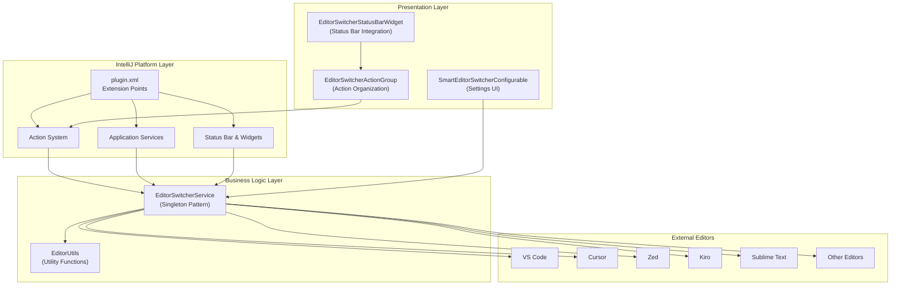

**Diagram sources**
- [plugin.xml](file://src/main/resources/META-INF/plugin.xml#L30-L60)
- [EditorSwitcherService.kt](file://src/main/kotlin/io/yanxxcloud/editorswitcher/services/EditorSwitcherService.kt#L10-L30)
- [EditorSwitcherStatusBarWidget.kt](file://src/main/kotlin/io/yanxxcloud/editorswitcher/ui/EditorSwitcherStatusBarWidget.kt#L10-L25)

**Section sources**
- [plugin.xml](file://src/main/resources/META-INF/plugin.xml#L1-L117)
- [EditorSwitcherService.kt](file://src/main/kotlin/io/yanxxcloud/editorswitcher/services/EditorSwitcherService.kt#L1-L268)

## Core Components

### Service Layer - EditorSwitcherService

The service layer represents the core business logic of the plugin, implementing the Singleton pattern through IntelliJ's application service mechanism. This central service manages editor configurations, executes switching operations, and maintains persistent state.

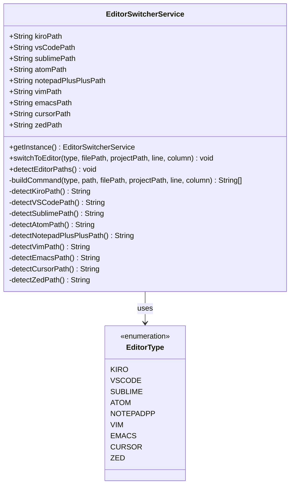

**Diagram sources**
- [EditorSwitcherService.kt](file://src/main/kotlin/io/yanxxcloud/editorswitcher/services/EditorSwitcherService.kt#L10-L50)
- [EditorSwitcherService.kt](file://src/main/kotlin/io/yanxxcloud/editorswitcher/services/EditorSwitcherService.kt#L260-L268)

The service implements several key responsibilities:
- **Configuration Management**: Maintains editor executable paths with automatic detection capabilities
- **Command Construction**: Builds platform-specific command-line arguments for each editor type
- **Process Execution**: Launches external editors with proper context preservation
- **State Persistence**: Implements IntelliJ's PersistentStateComponent interface for configuration storage

**Section sources**
- [EditorSwitcherService.kt](file://src/main/kotlin/io/yanxxcloud/editorswitcher/services/EditorSwitcherService.kt#L1-L268)

### Action System - SwitchTo*Actions

The action system provides multiple entry points for editor switching, each implementing the Command pattern to encapsulate switching logic. These actions serve as discrete commands that can be triggered through various UI mechanisms.

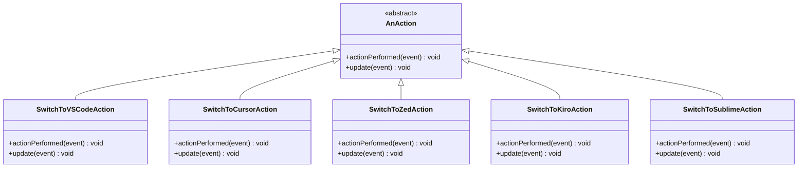

**Diagram sources**
- [SwitchToVSCodeAction.kt](file://src/main/kotlin/io/yanxxcloud/editorswitcher/actions/SwitchToVSCodeAction.kt#L10-L20)
- [SwitchToCursorAction.kt](file://src/main/kotlin/io/yanxxcloud/editorswitcher/actions/SwitchToCursorAction.kt#L10-L20)

Each action follows a consistent pattern:
1. **Context Extraction**: Uses EditorUtils to gather current file and cursor position
2. **Validation**: Checks if the target editor is configured
3. **Execution**: Delegates to the service layer for actual switching
4. **Feedback**: Provides user notifications about the operation status

**Section sources**
- [SwitchToVSCodeAction.kt](file://src/main/kotlin/io/yanxxcloud/editorswitcher/actions/SwitchToVSCodeAction.kt#L1-L46)
- [SwitchToCursorAction.kt](file://src/main/kotlin/io/yanxxcloud/editorswitcher/actions/SwitchToCursorAction.kt#L1-L46)

### Settings Integration - SmartEditorSwitcherConfigurable

The settings component provides a comprehensive configuration interface for managing editor paths and plugin preferences. It implements IntelliJ's Configurable interface to integrate seamlessly with the IDE's settings system.

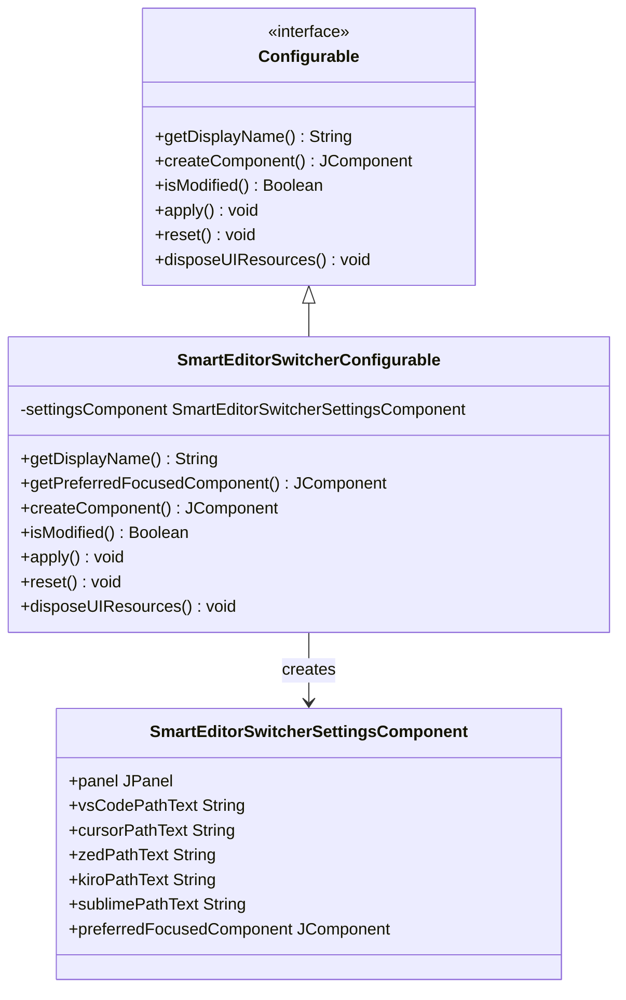

**Diagram sources**
- [SmartEditorSwitcherConfigurable.kt](file://src/main/kotlin/io/yanxxcloud/editorswitcher/settings/SmartEditorSwitcherConfigurable.kt#L7-L20)
- [SmartEditorSwitcherSettingsComponent.kt](file://src/main/kotlin/io/yanxxcloud/editorswitcher/settings/SmartEditorSwitcherSettingsComponent.kt#L10-L30)

**Section sources**
- [SmartEditorSwitcherConfigurable.kt](file://src/main/kotlin/io/yanxxcloud/editorswitcher/settings/SmartEditorSwitcherConfigurable.kt#L1-L56)
- [SmartEditorSwitcherSettingsComponent.kt](file://src/main/kotlin/io/yanxxcloud/editorswitcher/settings/SmartEditorSwitcherSettingsComponent.kt#L1-L165)

### UI Integration - Status Bar Widget

The status bar widget provides immediate access to editor switching functionality through the IntelliJ IDE's status bar. It implements a factory pattern for widget creation and integrates with IntelliJ's status bar system.

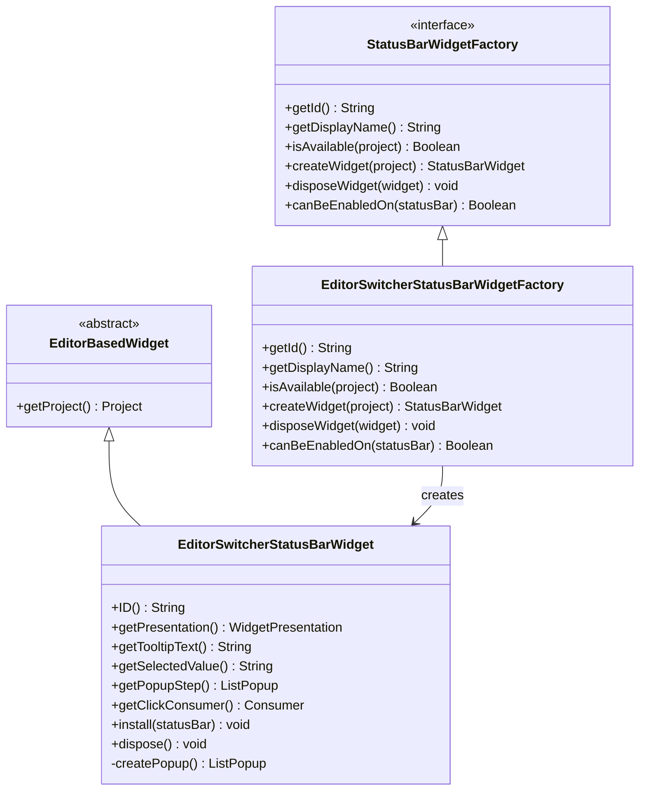

**Diagram sources**
- [EditorSwitcherStatusBarWidgetFactory.kt](file://src/main/kotlin/io/yanxxcloud/editorswitcher/ui/EditorSwitcherStatusBarWidgetFactory.kt#L8-L20)
- [EditorSwitcherStatusBarWidget.kt](file://src/main/kotlin/io/yanxxcloud/editorswitcher/ui/EditorSwitcherStatusBarWidget.kt#L10-L30)

**Section sources**
- [EditorSwitcherStatusBarWidgetFactory.kt](file://src/main/kotlin/io/yanxxcloud/editorswitcher/ui/EditorSwitcherStatusBarWidgetFactory.kt#L1-L25)
- [EditorSwitcherStatusBarWidget.kt](file://src/main/kotlin/io/yanxxcloud/editorswitcher/ui/EditorSwitcherStatusBarWidget.kt#L1-L56)

## Design Patterns Implementation

### Singleton Pattern via IntelliJ Application Service

The EditorSwitcherService implements the Singleton pattern through IntelliJ's application service mechanism, ensuring a single instance across the IDE session while leveraging IntelliJ's lifecycle management.

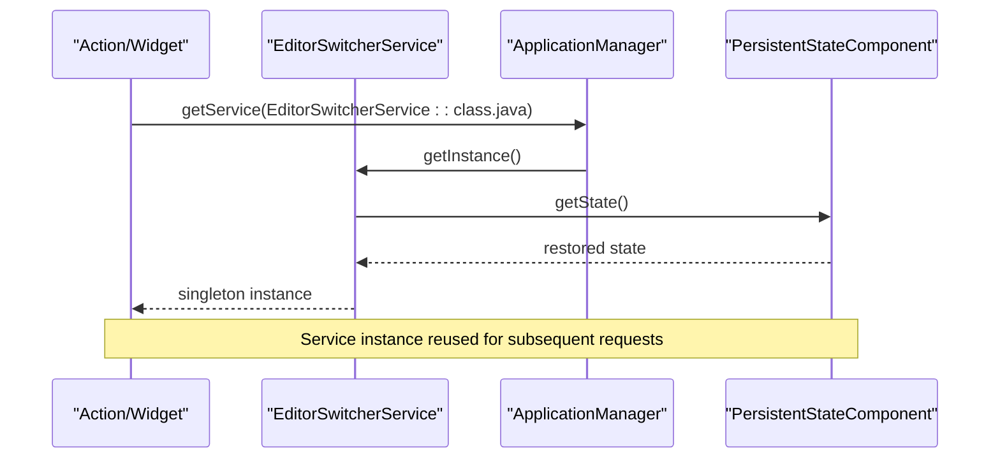

**Diagram sources**
- [EditorSwitcherService.kt](file://src/main/kotlin/io/yanxxcloud/editorswitcher/services/EditorSwitcherService.kt#L25-L30)

### Command Pattern for Actions

Each SwitchTo*Action implements the Command pattern, encapsulating the switching operation as a discrete command that can be executed through various triggers.

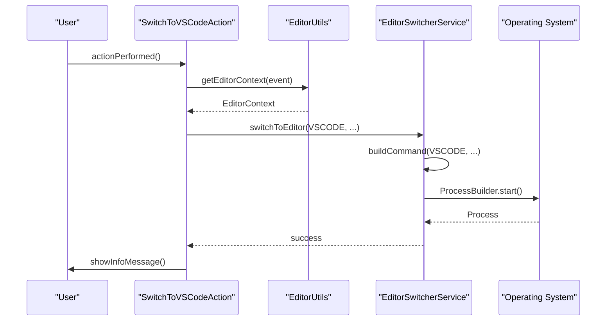

**Diagram sources**
- [SwitchToVSCodeAction.kt](file://src/main/kotlin/io/yanxxcloud/editorswitcher/actions/SwitchToVSCodeAction.kt#L10-L40)
- [EditorUtils.kt](file://src/main/kotlin/io/yanxxcloud/editorswitcher/utils/EditorUtils.kt#L15-L45)

### Factory Pattern for UI Components

The status bar widget factory implements the Factory pattern, creating appropriate widget instances based on the project context and availability requirements.

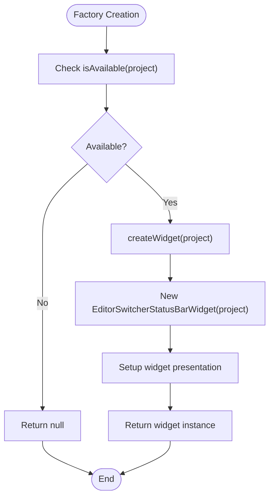

**Diagram sources**
- [EditorSwitcherStatusBarWidgetFactory.kt](file://src/main/kotlin/io/yanxxcloud/editorswitcher/ui/EditorSwitcherStatusBarWidgetFactory.kt#L15-L25)

### Dependency Injection through getInstance()

The plugin extensively uses IntelliJ's dependency injection mechanism through the getInstance() pattern, allowing loose coupling between components while maintaining access to shared services.

**Section sources**
- [EditorSwitcherService.kt](file://src/main/kotlin/io/yanxxcloud/editorswitcher/services/EditorSwitcherService.kt#L25-L30)
- [SwitchToVSCodeAction.kt](file://src/main/kotlin/io/yanxxcloud/editorswitcher/actions/SwitchToVSCodeAction.kt#L15-L20)

## Component Interactions

### User Input Propagation Flow

The system handles user input through multiple pathways, each following a consistent data flow pattern that ensures proper context preservation and error handling.

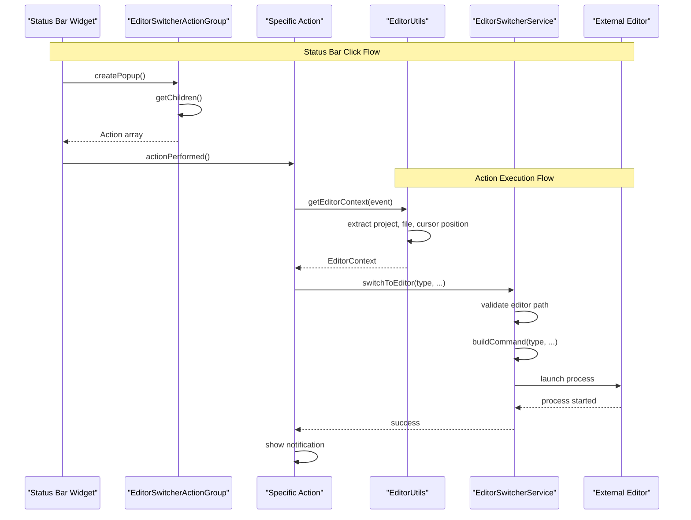

**Diagram sources**
- [EditorSwitcherStatusBarWidget.kt](file://src/main/kotlin/io/yanxxcloud/editorswitcher/ui/EditorSwitcherStatusBarWidget.kt#L30-L50)
- [EditorSwitcherActionGroup.kt](file://src/main/kotlin/io/yanxxcloud/editorswitcher/ui/EditorSwitcherActionGroup.kt#L10-L35)
- [SwitchToVSCodeAction.kt](file://src/main/kotlin/io/yanxxcloud/editorswitcher/actions/SwitchToVSCodeAction.kt#L10-L45)

### Configuration Synchronization

The settings system maintains synchronization between the UI component and the service layer, ensuring configuration changes are immediately reflected in switching operations.

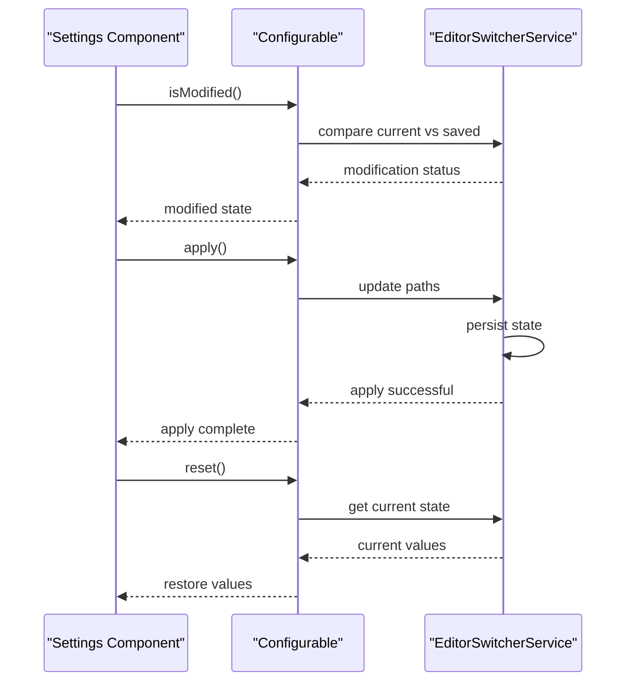

**Diagram sources**
- [SmartEditorSwitcherConfigurable.kt](file://src/main/kotlin/io/yanxxcloud/editorswitcher/settings/SmartEditorSwitcherConfigurable.kt#L20-L50)

**Section sources**
- [EditorSwitcherStatusBarWidget.kt](file://src/main/kotlin/io/yanxxcloud/editorswitcher/ui/EditorSwitcherStatusBarWidget.kt#L30-L56)
- [EditorSwitcherActionGroup.kt](file://src/main/kotlin/io/yanxxcloud/editorswitcher/ui/EditorSwitcherActionGroup.kt#L1-L36)
- [SmartEditorSwitcherConfigurable.kt](file://src/main/kotlin/io/yanxxcloud/editorswitcher/settings/SmartEditorSwitcherConfigurable.kt#L1-L56)

## Integration Points

### plugin.xml Extension Points

The plugin.xml defines all integration points with the IntelliJ Platform, establishing the plugin's presence and capabilities within the IDE ecosystem.

| Extension Point | Implementation | Purpose |
|----------------|---------------|---------|
| `applicationConfigurable` | `SmartEditorSwitcherConfigurable` | Settings UI integration |
| `applicationService` | `EditorSwitcherService` | Core service registration |
| `statusBarWidgetFactory` | `EditorSwitcherStatusBarWidgetFactory` | Status bar integration |
| `action` | Various SwitchTo*Action classes | Keyboard shortcut and menu integration |

### Action Group Organization

The plugin organizes actions into logical groups for menu presentation and keyboard shortcut assignment:

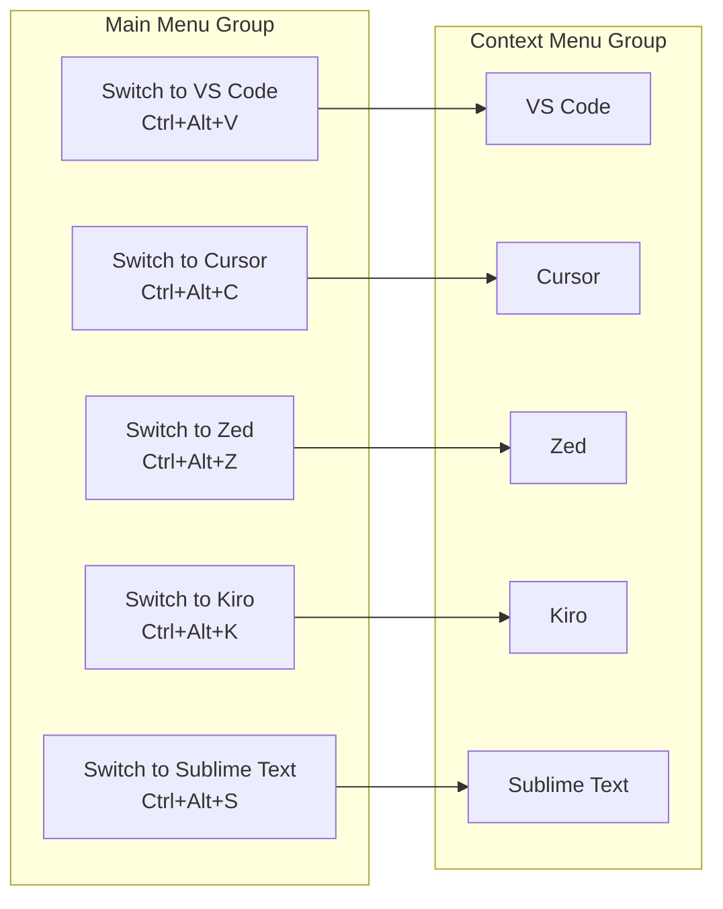

**Diagram sources**
- [plugin.xml](file://src/main/resources/META-INF/plugin.xml#L60-L100)

**Section sources**
- [plugin.xml](file://src/main/resources/META-INF/plugin.xml#L30-L117)

## Technical Decisions

### Kotlin Development Choice

The plugin is developed entirely in Kotlin, leveraging modern language features and seamless interoperability with Java-based IntelliJ Platform APIs. This decision provides:

- **Type Safety**: Compile-time null safety and type inference
- **Concise Syntax**: Reduced boilerplate compared to Java
- **Functional Programming**: First-class support for functional constructs
- **IDE Integration**: Excellent support in IntelliJ IDEA itself

### Java 17 Targeting

The plugin targets Java 17 (JDK 17) for several strategic reasons:

- **Long-term Support**: Java 17 is an LTS version with extended support
- **Performance**: Modern JVM optimizations and garbage collection improvements
- **Security**: Active security updates and bug fixes
- **Compatibility**: Broad platform support across operating systems

### IntelliJ Platform Compatibility

The plugin supports IntelliJ Platform builds 232-252.*, representing a balanced approach:

- **Modern Features**: Access to recent IntelliJ Platform enhancements
- **Broad Compatibility**: Coverage of multiple major IDE releases
- **Future-proofing**: Preparation for upcoming platform versions
- **Stability**: Well-tested compatibility range

**Section sources**
- [build.gradle.kts](file://build.gradle.kts#L1-L48)
- [gradle.properties](file://gradle.properties#L1-L34)

## Cross-Cutting Concerns

### Configuration Persistence

The plugin implements robust configuration persistence through IntelliJ's PersistentStateComponent interface, ensuring settings survive IDE restarts and provide reliable user experience.

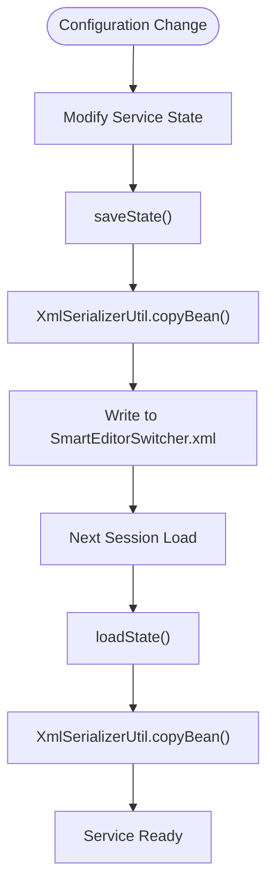

**Diagram sources**
- [EditorSwitcherService.kt](file://src/main/kotlin/io/yanxxcloud/editorswitcher/services/EditorSwitcherService.kt#L30-L40)

### Error Logging and Diagnostics

The plugin implements comprehensive error logging using IntelliJ's diagnostic framework, providing visibility into switching operations and troubleshooting capabilities.

### Cross-Platform Compatibility

The plugin handles cross-platform differences through:

- **Path Normalization**: Platform-appropriate path handling for Windows, macOS, and Linux
- **Executable Detection**: Automatic detection of editor installations across platforms
- **Command Line Arguments**: Platform-specific argument construction for each editor

**Section sources**
- [EditorSwitcherService.kt](file://src/main/kotlin/io/yanxxcloud/editorswitcher/services/EditorSwitcherService.kt#L45-L50)

## Infrastructure Requirements

### Development Environment

The plugin development requires:

- **IntelliJ IDEA**: Ultimate or Community edition with Kotlin plugin
- **JDK 17**: Java Development Kit 17 or later
- **Gradle**: Version 8.14 or compatible
- **Kotlin**: Version 2.0.21 or compatible

### Build System Configuration

The Gradle build system provides:

- **Multi-platform Support**: Automatic handling of platform-specific compilation
- **Plugin Signing**: Automated signing for distribution
- **Version Management**: Semantic versioning with build number compatibility
- **Testing Integration**: Built-in testing framework support

### Runtime Requirements

The plugin operates within IntelliJ Platform runtime with:

- **Memory**: Minimal memory footprint, typical for IntelliJ plugins
- **Disk Space**: Small installation footprint with configuration persistence
- **Network**: No network requirements for basic functionality
- **Permissions**: Standard file system access for editor detection

**Section sources**
- [build.gradle.kts](file://build.gradle.kts#L10-L30)
- [gradle.properties](file://gradle.properties#L10-L20)

## Deployment Topology

### JetBrains Marketplace Distribution

The plugin is distributed through JetBrains Marketplace with automated deployment pipeline:

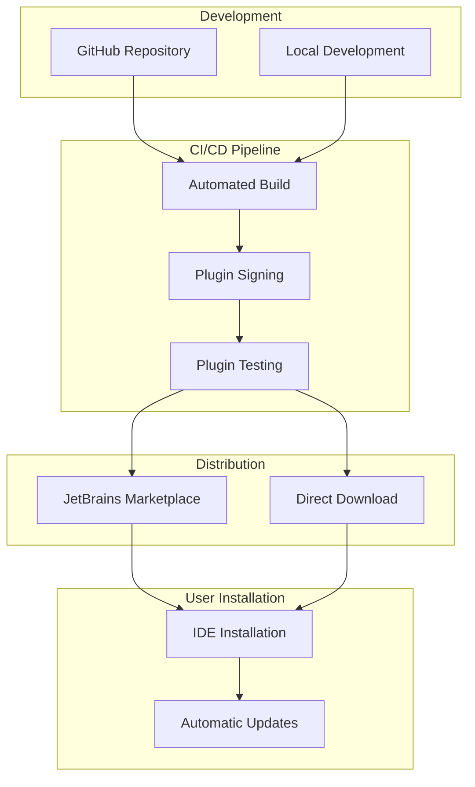

### Release Management

The plugin follows semantic versioning with automated release management:

- **Version Control**: Git-based version tracking with annotated tags
- **Release Notes**: Comprehensive changelog generation
- **Automated Publishing**: CI/CD pipeline for marketplace submission
- **Backward Compatibility**: Careful version compatibility matrix maintenance

**Section sources**
- [build.gradle.kts](file://build.gradle.kts#L35-L45)
- [gradle.properties](file://gradle.properties#L3-L5)

## Conclusion

The Smart Editor Switcher plugin demonstrates sophisticated architectural design principles applied to IntelliJ Platform plugin development. Through careful implementation of design patterns, adherence to platform conventions, and consideration of cross-cutting concerns, the plugin provides a robust and extensible solution for editor switching functionality.

Key architectural strengths include:

- **Modular Design**: Clear separation of concerns across service, action, UI, and configuration layers
- **Pattern Implementation**: Effective use of Singleton, Command, Factory, and Dependency Injection patterns
- **Platform Integration**: Seamless integration with IntelliJ Platform extension points and APIs
- **User Experience**: Consistent and intuitive interaction patterns across multiple access methods
- **Maintainability**: Clean code structure and comprehensive error handling

The plugin serves as an excellent example of how to leverage IntelliJ Platform capabilities while maintaining code quality, performance, and user satisfaction. Its architecture supports future enhancements and adaptations to evolving platform requirements while preserving backward compatibility and user experience.