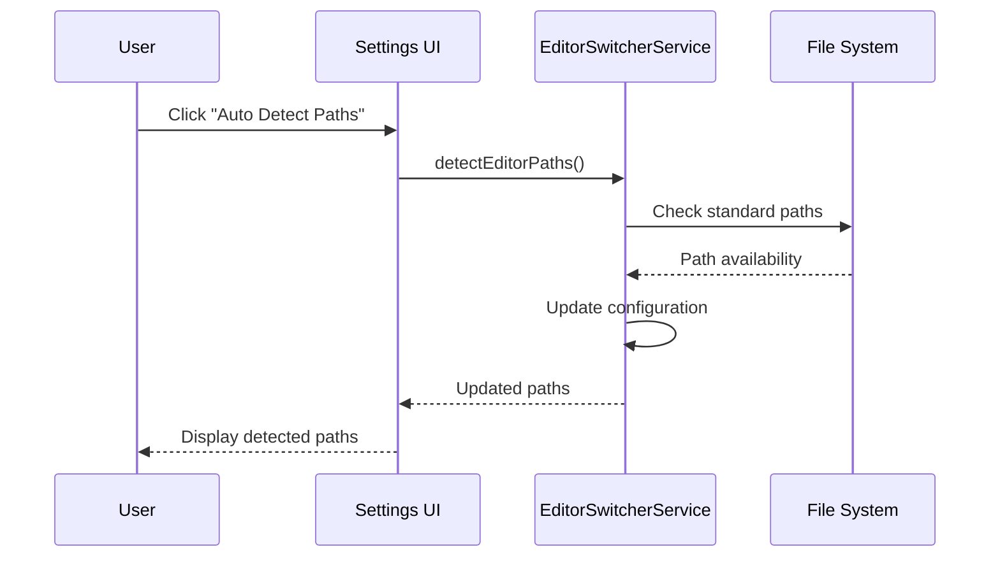
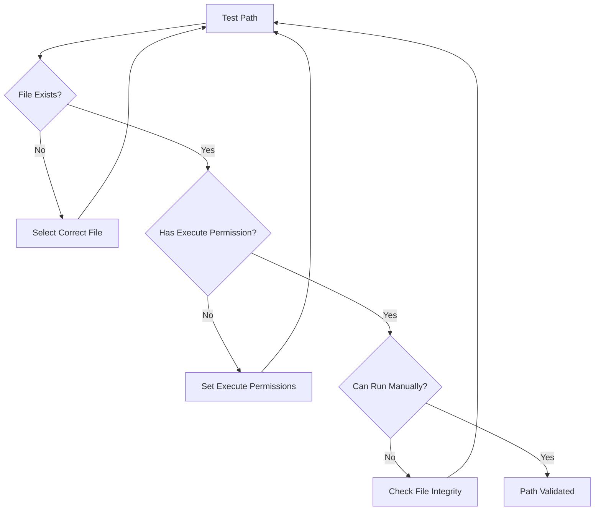
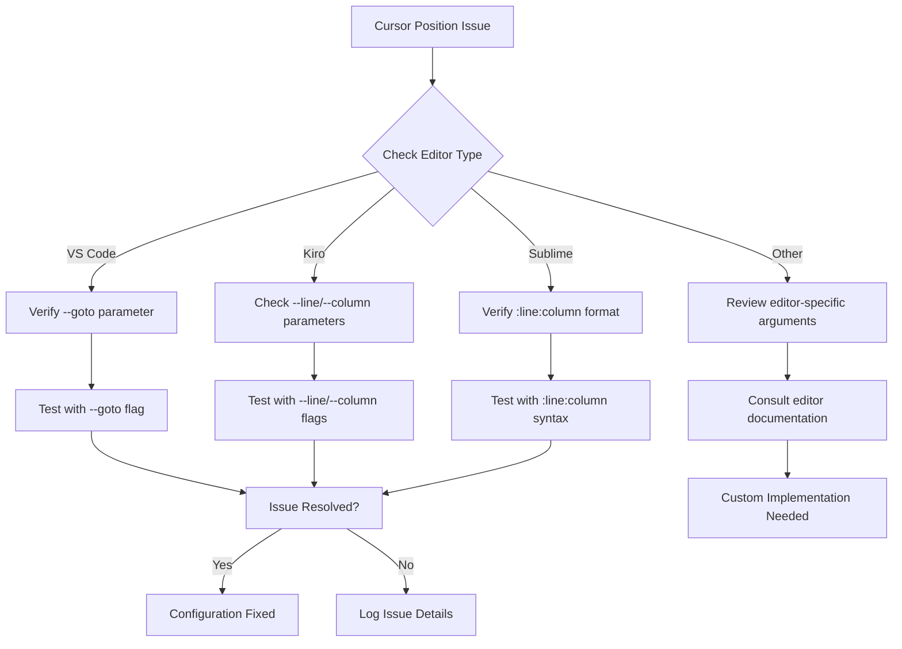
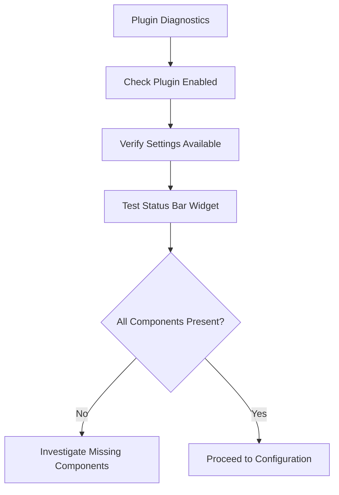

# Smart Editor Switcher Troubleshooting Guide

<cite>
**Referenced Files in This Document**
- [INSTALL.md](file://INSTALL.md)
- [README.md](file://README.md)
- [plugin.xml](file://bin/main/META-INF/plugin.xml)
- [EditorSwitcherService.kt](file://src/main/kotlin/io/yanxxcloud/editorswitcher/services/EditorSwitcherService.kt)
- [EditorUtils.kt](file://src/main/kotlin/io/yanxxcloud/editorswitcher/utils/EditorUtils.kt)
- [SmartEditorSwitcherConfigurable.kt](file://src/main/kotlin/io/yanxxcloud/editorswitcher/settings/SmartEditorSwitcherConfigurable.kt)
- [SmartEditorSwitcherSettingsComponent.kt](file://src/main/kotlin/io/yanxxcloud/editorswitcher/settings/SmartEditorSwitcherSettingsComponent.kt)
- [EditorSwitcherStatusBarWidget.kt](file://src/main/kotlin/io/yanxxcloud/editorswitcher/ui/EditorSwitcherStatusBarWidget.kt)
- [EditorSwitcherStatusBarWidgetFactory.kt](file://src/main/kotlin/io/yanxxcloud/editorswitcher/ui/EditorSwitcherStatusBarWidgetFactory.kt)
- [SwitchToVSCodeAction.kt](file://src/main/kotlin/io/yanxxcloud/editorswitcher/actions/SwitchToVSCodeAction.kt)
- [build.gradle.kts](file://build.gradle.kts)
</cite>

## Table of Contents
1. [Introduction](#introduction)
2. [Installation Issues](#installation-issues)
3. [Configuration Problems](#configuration-problems)
4. [Runtime Issues](#runtime-issues)
5. [Diagnostic Procedures](#diagnostic-procedures)
6. [Common Error Scenarios](#common-error-scenarios)
7. [Developer Debugging](#developer-debugging)
8. [Platform-Specific Solutions](#platform-specific-solutions)
9. [Performance Considerations](#performance-considerations)
10. [FAQ](#faq)

## Introduction

The Smart Editor Switcher plugin enables seamless transitions between JetBrains IDEs and external editors like VS Code, Kiro, Sublime Text, and others. This troubleshooting guide addresses common issues encountered during installation, configuration, and runtime operation, providing step-by-step solutions for each problem category.

## Installation Issues

### Plugin Not Loading

**Symptoms:**
- Plugin doesn't appear in Settings/Plugins list
- Status bar widget missing
- Actions not available in menus

**Diagnosis Steps:**

1. **Verify Plugin Installation**
   ```mermaid
flowchart TD
A["Check Plugin Directory"] --> B{"Plugin in IDE Plugins?"}
B --> |No| C["Reinstall Plugin"]
B --> |Yes| D["Check IDE Logs"]
C --> E["Restart IDE"]
D --> F{"Errors Found?"}
F --> |Yes| G["Fix Error Causes"]
F --> |No| H["Check Plugin Compatibility"]
G --> E
H --> I["Update IDE/Plugin"]
E --> J["Verify Plugin Loaded"]
```

2. **Check IDE Compatibility**
   - Verify IDE version (232-252.* supported)
   - Confirm Java 17+ requirement
   - Ensure compatible JetBrains IDE type

**Solutions:**

| Issue | Cause | Solution |
|-------|-------|----------|
| Plugin not visible | Incorrect installation method | Use Settings → Plugins → Install Plugin from Disk... |
| Status bar widget missing | Plugin not enabled | Enable plugin in Settings → Plugins → Installed tab |
| Actions unavailable | Plugin not loaded | Restart IDE after installation |

### Plugin Installation Methods

**Method 1: Marketplace Installation**
- Download from JetBrains Marketplace
- Automatic dependency resolution
- Automatic updates

**Method 2: Manual Installation**
- Download ZIP file from releases
- Extract to IDE plugins directory
- Verify file permissions

**Section sources**
- [INSTALL.md](file://INSTALL.md#L15-L30)
- [plugin.xml](file://bin/main/META-INF/plugin.xml#L35-L40)

## Configuration Problems

### Editor Paths Not Detected

**Symptoms:**
- "Editor path not configured" error messages
- Auto-detection fails to find installed editors
- Manual path configuration required

**Diagnostic Procedure:**



**Detection Logic:**

The plugin attempts to locate editors using predefined paths for each platform:

| Editor | macOS Path | Windows Path | Linux Path |
|--------|------------|--------------|------------|
| VS Code | `/Applications/Visual Studio Code.app/Contents/Resources/app/bin/code` | `C:\Program Files\Microsoft VS Code\bin\code.cmd` | `/usr/local/bin/code` |
| Kiro | `/Applications/Kiro.app/Contents/MacOS/Kiro` | `C:\Program Files\Kiro\Kiro.exe` | `/usr/local/bin/kiro` |
| Sublime Text | `/Applications/Sublime Text.app/Contents/SharedSupport/bin/subl` | `C:\Program Files\Sublime Text\subl.exe` | `/usr/local/bin/subl` |
| Cursor | `/Applications/Cursor.app/Contents/Resources/app/bin/cursor` | `C:\Program Files\Cursor\Cursor.exe` | `/usr/local/bin/cursor` |
| Zed | `/Applications/Zed.app/Contents/MacOS/zed` | `C:\Program Files\Zed\zed.exe` | `/usr/local/bin/zed` |

**Manual Path Configuration:**

1. Navigate to `Settings → Tools → Smart Editor Switcher`
2. Select editor type in UI
3. Browse to executable file using file chooser
4. Verify path validity by testing command execution

**Section sources**
- [EditorSwitcherService.kt](file://src/main/kotlin/io/yanxxcloud/editorswitcher/services/EditorSwitcherService.kt#L139-L179)
- [SmartEditorSwitcherSettingsComponent.kt](file://src/main/kotlin/io/yanxxcloud/editorswitcher/settings/SmartEditorSwitcherSettingsComponent.kt#L155-L165)

### Path Configuration Issues

**Common Path Problems:**

1. **Spaces in Paths**: Use quotes around paths containing spaces
2. **Incorrect Executable**: Verify the selected file is the actual executable
3. **Permissions**: Ensure executable has proper permissions
4. **Relative vs Absolute Paths**: Use absolute paths only

**Validation Steps:**



**Section sources**
- [SmartEditorSwitcherSettingsComponent.kt](file://src/main/kotlin/io/yanxxcloud/editorswitcher/settings/SmartEditorSwitcherSettingsComponent.kt#L35-L85)

## Runtime Issues

### Editors Not Launching

**Symptoms:**
- No response when clicking menu/action
- Error messages about failed launches
- Process not started warnings

**Root Causes:**

1. **Missing Executable**: Path configured but file doesn't exist
2. **Permission Denied**: Insufficient permissions to execute
3. **Invalid Arguments**: Malformed command line parameters
4. **Environment Issues**: Missing dependencies or environment variables

**Debugging Commands:**

Test editor launch manually to diagnose issues:

| Platform | Test Command |
|----------|--------------|
| macOS | `"/path/to/editor" "/path/to/project"` |
| Windows | `"C:\path\to\editor.exe" "C:\path\to\project"` |
| Linux | `"/path/to/editor" "/path/to/project"` |

**Section sources**
- [EditorSwitcherService.kt](file://src/main/kotlin/io/yanxxcloud/editorswitcher/services/EditorSwitcherService.kt#L32-L62)

### Cursor Position Not Preserved

**Symptoms:**
- Editor opens but cursor at wrong position
- File opened but not at specific line/column
- Project context lost during switch

**Diagnostic Approach:**



**Editor-Specific Argument Formats:**

| Editor | Argument Format | Example |
|--------|----------------|---------|
| VS Code | `--goto file:line:column` | `--goto main.js:42:15` |
| Kiro | `--line LINE --column COLUMN` | `--line 42 --column 15` |
| Sublime Text | `file:line:column` | `main.js:42:15` |
| Atom | `file:line:column` | `main.js:42:15` |
| Notepad++ | `-nLINE -cCOLUMN file` | `-n42 -c15 main.js` |

**Section sources**
- [EditorSwitcherService.kt](file://src/main/kotlin/io/yanxxcloud/editorswitcher/services/EditorSwitcherService.kt#L64-L138)

### Status Bar Widget Issues

**Symptoms:**
- Status bar widget not appearing
- Clicking widget has no effect
- Widget shows incorrect information

**Verification Steps:**

1. **Check Widget Registration**
   - Verify plugin.xml declares status bar widget
   - Confirm factory registration in extensions

2. **Test Widget Functionality**
   - Click widget to show popup menu
   - Verify action group displays correctly
   - Check for error messages

**Section sources**
- [EditorSwitcherStatusBarWidget.kt](file://src/main/kotlin/io/yanxxcloud/editorswitcher/ui/EditorSwitcherStatusBarWidget.kt#L15-L55)
- [EditorSwitcherStatusBarWidgetFactory.kt](file://src/main/kotlin/io/yanxxcloud/editorswitcher/ui/EditorSwitcherStatusBarWidgetFactory.kt#L10-L24)

## Diagnostic Procedures

### Step-by-Step Troubleshooting

**Phase 1: Basic Verification**


**Phase 2: Configuration Validation**
1. **Path Verification**
   - Test each editor path manually
   - Check file existence and permissions
   - Validate executable integrity

2. **Action Testing**
   - Test keyboard shortcuts
   - Verify menu actions
   - Check right-click context menu

**Phase 3: Runtime Testing**
1. **Basic Functionality**
   - Switch to each configured editor
   - Verify cursor position preservation
   - Test project context passing

2. **Advanced Scenarios**
   - Test with various file types
   - Try with different project structures
   - Verify cross-platform compatibility

### Log Analysis

**Enable Verbose Logging:**
- Access IDE logs through Help → Show Log in Explorer/Finder
- Look for entries with "Smart Editor Switcher" prefix
- Monitor log level for warning/error messages

**Key Log Patterns:**

| Pattern | Meaning | Action Required |
|---------|---------|----------------|
| "Editor path not configured" | Missing path configuration | Configure editor path |
| "Failed to switch to X" | Launch failure | Check executable and permissions |
| "Switched to X" | Successful operation | Normal functioning |

**Section sources**
- [EditorSwitcherService.kt](file://src/main/kotlin/io/yanxxcloud/editorswitcher/services/EditorSwitcherService.kt#L50-L62)

## Common Error Scenarios

### Keyboard Shortcut Conflicts

**Problem:** Other plugins or IDE shortcuts override Smart Editor Switcher keys

**Resolution Steps:**

1. **Check Current Assignments**
   - Navigate to Settings → Keymap
   - Search for "Smart Editor Switcher" actions
   - Identify conflicting shortcuts

2. **Resolve Conflicts**
   - Reassign plugin shortcuts
   - Remove conflicting assignments
   - Create custom keymap group

**Default Shortcut Assignments:**

| Action | Default Shortcut | Alternative |
|--------|------------------|-------------|
| Switch to VS Code | Ctrl+Alt+V | Ctrl+Shift+V |
| Switch to Cursor | Ctrl+Alt+C | Ctrl+Shift+C |
| Switch to Zed | Ctrl+Alt+Z | Ctrl+Shift+Z |
| Switch to Kiro | Ctrl+Alt+K | Ctrl+Shift+K |
| Switch to Sublime | Ctrl+Alt+S | Ctrl+Shift+S |

### Permission Issues

**File System Permissions:**

**macOS/Linux:**
```bash
# Check permissions
ls -la /path/to/editor

# Fix permissions if needed
chmod +x /path/to/editor
```

**Windows:**
- Right-click executable
- Properties → Security tab
- Ensure "Read & Execute" permission

### Environment Variable Problems

**Common Issues:**
- PATH not including editor directory
- Missing runtime dependencies
- Conflicting library versions

**Solutions:**
1. Add editor directory to system PATH
2. Install required runtime libraries
3. Use absolute paths to avoid PATH issues

## Developer Debugging

### Enabling Development Mode

**Using runIde Task:**
```bash
# Build plugin
./gradlew buildPlugin

# Run in development mode
./gradlew runIde
```

**Debug Configuration:**
- Set breakpoints in EditorSwitcherService
- Monitor command building process
- Trace execution flow through actions

### Logging Configuration

**Enable Debug Logging:**
- Modify plugin.xml to increase log level
- Add custom logging statements for specific scenarios
- Use IDE's built-in logging framework

**Custom Debug Information:**
```kotlin
// Add to service methods for debugging
thisLogger().debug("Debug information: $variable")
```

**Section sources**
- [build.gradle.kts](file://build.gradle.kts#L15-L25)

### Testing Custom Implementations

**Adding New Editors:**
1. Define new EditorType enum value
2. Implement detection logic in EditorSwitcherService
3. Add command building logic for new editor
4. Create corresponding action classes

**Testing Methodology:**
- Unit tests for path detection
- Integration tests for command execution
- Manual testing with various scenarios

## Platform-Specific Solutions

### macOS Issues

**Common Problems:**
- Gatekeeper blocking executables
- Permission restrictions
- App bundle structure differences

**Solutions:**
```bash
# Allow blocked applications
sudo spctl --master-disable
# Or use Gatekeeper bypass for specific app
xattr -d com.apple.quarantine /Applications/Editor.app
```

### Windows Issues

**Common Problems:**
- Antivirus interference
- UAC permission prompts
- Path quoting issues

**Solutions:**
- Add editor to antivirus exceptions
- Run IDE as administrator if needed
- Use proper path quoting in configuration

### Linux Issues

**Common Problems:**
- Missing runtime dependencies
- Desktop environment integration
- Package manager installations

**Solutions:**
```bash
# Install missing dependencies
sudo apt-get install libgtk-3-0 libasound2

# Check executable permissions
chmod +x /usr/bin/editor
```

## Performance Considerations

### Startup Impact

**Minimize Plugin Overhead:**
- Lazy loading of editor configurations
- Efficient path detection algorithms
- Optimized command building

### Memory Usage

**Monitor Resource Consumption:**
- Track editor process creation
- Monitor memory usage during switches
- Optimize logging verbosity

### Execution Speed

**Optimization Strategies:**
- Pre-cache editor paths
- Minimize file system operations
- Use efficient string concatenation

## FAQ

### Q: Why does the plugin say "Editor path not configured"?
**A:** The plugin couldn't find the editor executable. Use the "Auto Detect Paths" button or manually configure the path in Settings → Tools → Smart Editor Switcher.

### Q: How do I fix cursor position not being preserved?
**A:** Verify the editor supports the required command-line arguments. Test the command manually and adjust the plugin's argument format if necessary.

### Q: Can I use this plugin with my custom editor?
**A:** Yes, but you'll need to modify the plugin source code to add support for your editor's command-line interface.

### Q: Why aren't keyboard shortcuts working?
**A:** Check for conflicts in Settings → Keymap. You may need to reassign shortcuts or disable conflicting assignments.

### Q: How do I uninstall the plugin?
**A:** Go to Settings → Plugins → Installed tab, select Smart Editor Switcher, and click the Uninstall button.

**Section sources**
- [SwitchToVSCodeAction.kt](file://src/main/kotlin/io/yanxxcloud/editorswitcher/actions/SwitchToVSCodeAction.kt#L15-L30)
- [INSTALL.md](file://INSTALL.md#L50-L70)