# EditorSwitcherActionGroup UI Component Documentation

<cite>
**Referenced Files in This Document**
- [EditorSwitcherActionGroup.kt](file://src/main/kotlin/io/yanxxcloud/editorswitcher/ui/EditorSwitcherActionGroup.kt)
- [SwitchToVSCodeAction.kt](file://src/main/kotlin/io/yanxxcloud/editorswitcher/actions/SwitchToVSCodeAction.kt)
- [SwitchToCursorAction.kt](file://src/main/kotlin/io/yanxxcloud/editorswitcher/actions/SwitchToCursorAction.kt)
- [SwitchToZedAction.kt](file://src/main/kotlin/io/yanxxcloud/editorswitcher/actions/SwitchToZedAction.kt)
- [SwitchToKiroAction.kt](file://src/main/kotlin/io/yanxxcloud/editorswitcher/actions/SwitchToKiroAction.kt)
- [SwitchToSublimeAction.kt](file://src/main/kotlin/io/yanxxcloud/editorswitcher/actions/SwitchToSublimeAction.kt)
- [plugin.xml](file://src/main/resources/META-INF/plugin.xml)
- [EditorSwitcherService.kt](file://src/main/kotlin/io/yanxxcloud/editorswitcher/services/EditorSwitcherService.kt)
- [EditorUtils.kt](file://src/main/kotlin/io/yanxxcloud/editorswitcher/utils/EditorUtils.kt)
- [EditorSwitcherStatusBarWidget.kt](file://src/main/kotlin/io/yanxxcloud/editorswitcher/ui/EditorSwitcherStatusBarWidget.kt)
</cite>

## Table of Contents
1. [Introduction](#introduction)
2. [Architecture Overview](#architecture-overview)
3. [Core Component Analysis](#core-component-analysis)
4. [Action Group Implementation](#action-group-implementation)
5. [Integration with IntelliJ Platform](#integration-with-intellij-platform)
6. [Internationalization and Accessibility](#internationalization-and-accessibility)
7. [Performance Considerations](#performance-considerations)
8. [Developer Extension Guide](#developer-extension-guide)
9. [Troubleshooting and Best Practices](#troubleshooting-and-best-practices)
10. [Conclusion](#conclusion)

## Introduction

The EditorSwitcherActionGroup is a sophisticated UI component that serves as the central hub for organizing and presenting all editor switching actions within the JetBrains IDE ecosystem. This component extends IntelliJ's ActionGroup framework to create a cohesive menu structure that provides seamless access to multiple external editors including VS Code, Cursor, Zed, Kiro, and Sublime Text.

The component plays a crucial role in the Smart Editor Switcher plugin by dynamically building a list of AnAction instances with localized text, descriptions, and visual indicators. It integrates deeply with IntelliJ's action system to support keyboard shortcuts, mouse interactions, and contextual menu access patterns.

## Architecture Overview

The EditorSwitcherActionGroup operates within a layered architecture that separates concerns between UI presentation, business logic, and external editor communication:


**Diagram sources**
- [EditorSwitcherActionGroup.kt](file://src/main/kotlin/io/yanxxcloud/editorswitcher/ui/EditorSwitcherActionGroup.kt#L1-L36)
- [EditorSwitcherStatusBarWidget.kt](file://src/main/kotlin/io/yanxxcloud/editorswitcher/ui/EditorSwitcherStatusBarWidget.kt#L1-L56)

## Core Component Analysis

### EditorSwitcherActionGroup Class Structure

The EditorSwitcherActionGroup extends IntelliJ's ActionGroup base class to provide a dynamic menu structure for editor switching:


**Diagram sources**
- [EditorSwitcherActionGroup.kt](file://src/main/kotlin/io/yanxxcloud/editorswitcher/ui/EditorSwitcherActionGroup.kt#L8-L35)
- [SwitchToVSCodeAction.kt](file://src/main/kotlin/io/yanxxcloud/editorswitcher/actions/SwitchToVSCodeAction.kt#L9-L45)

**Section sources**
- [EditorSwitcherActionGroup.kt](file://src/main/kotlin/io/yanxxcloud/editorswitcher/ui/EditorSwitcherActionGroup.kt#L1-L36)

## Action Group Implementation

### Dynamic Action Creation

The EditorSwitcherActionGroup implements a factory pattern for creating AnAction instances with specific presentation properties:

```mermaid
sequenceDiagram
participant Client as "IntelliJ Platform"
participant ASG as "EditorSwitcherActionGroup"
participant SA as "Specific Action"
participant ESS as "EditorSwitcherService"
participant EU as "EditorUtils"
Client->>ASG : getChildren(event)
ASG->>SA : new SwitchToVSCodeAction()
ASG->>SA : apply { templatePresentation.text = "📘 VS Code" }
ASG->>SA : apply { templatePresentation.description = "切换到 VS Code" }
ASG-->>Client : Array of configured actions
Note over Client,EU : When action is triggered
Client->>SA : actionPerformed(event)
SA->>EU : getEditorContext(event)
EU-->>SA : EditorContext
SA->>ESS : switchToEditor(type, context)
ESS->>ESS : buildCommand(editorType, path, ...)
ESS->>ESS : executeProcess(command)
ESS-->>SA : success/failure
SA-->>Client : action completion
```



**Diagram sources**
- [EditorSwitcherActionGroup.kt](file://src/main/kotlin/io/yanxxcloud/editorswitcher/ui/EditorSwitcherActionGroup.kt#L10-L35)
- [SwitchToVSCodeAction.kt](file://src/main/kotlin/io/yanxxcloud/editorswitcher/actions/SwitchToVSCodeAction.kt#L11-L45)

### Icon Usage and Visual Grouping

The component employs Unicode emoji icons to provide immediate visual recognition of different editors:

| Editor | Icon | Purpose |
|--------|------|---------|
| VS Code | 📘 | Book emoji representing code editing |
| Cursor | 🎯 | Target emoji indicating precision |
| Zed | ⚡ | Lightning bolt representing speed |
| Kiro | 🚀 | Rocket emoji indicating AI capabilities |
| Sublime Text | 🎨 | Paint palette representing creativity |

The separator placement creates logical visual grouping:
- First group: Traditional editors (VS Code, Cursor, Zed)
- Second group: Modern/AI editors (Kiro, Sublime Text)

**Section sources**
- [EditorSwitcherActionGroup.kt](file://src/main/kotlin/io/yanxxcloud/editorswitcher/ui/EditorSwitcherActionGroup.kt#L11-L35)

## Integration with IntelliJ Platform

### Plugin.xml Configuration

The EditorSwitcherActionGroup integrates seamlessly with IntelliJ's action system through comprehensive plugin.xml configuration:


**Diagram sources**
- [plugin.xml](file://src/main/resources/META-INF/plugin.xml#L45-L116)

### Keyboard Shortcut Support

Each action supports customizable keyboard shortcuts through IntelliJ's keymap system:

| Action ID | Keyboard Shortcut | Description |
|-----------|------------------|-------------|
| SmartEditorSwitcher.SwitchToVSCode | Ctrl+Alt+V | Switch to VS Code |
| SmartEditorSwitcher.SwitchToCursor | Ctrl+Alt+C | Switch to Cursor |
| SmartEditorSwitcher.SwitchToZed | Ctrl+Alt+Z | Switch to Zed |
| SmartEditorSwitcher.SwitchToKiro | Ctrl+Alt+K | Switch to Kiro |
| SmartEditorSwitcher.SwitchToSublime | Ctrl+Alt+S | Switch to Sublime Text |

**Section sources**
- [plugin.xml](file://src/main/resources/META-INF/plugin.xml#L45-L116)

## Internationalization and Accessibility

### Localized Text Implementation

The component uses Chinese localization for accessibility while maintaining clear visual indicators:

```kotlin
// Example from SwitchToVSCodeAction
templatePresentation.text = "📘 VS Code"
templatePresentation.description = "切换到 VS Code"
```

### Accessibility Compliance Considerations

1. **Visual Indicators**: Unicode emojis provide immediate visual recognition
2. **Descriptive Text**: Clear descriptions help screen readers and users
3. **Consistent Patterns**: Uniform presentation across all actions
4. **Keyboard Navigation**: Full keyboard accessibility support

### Internationalization Strategy

While currently localized to Chinese, the architecture supports easy extension to other languages:

- Text and descriptions are stored as presentation properties
- No hardcoded language-specific logic
- Easy replacement of localized strings
- Consistent pattern for adding new language support

**Section sources**
- [EditorSwitcherActionGroup.kt](file://src/main/kotlin/io/yanxxcloud/editorswitcher/ui/EditorSwitcherActionGroup.kt#L11-L35)

## Performance Considerations

### Lazy Instantiation Benefits

The EditorSwitcherActionGroup implements efficient lazy instantiation patterns:


### Memory Footprint Analysis

1. **Action Instances**: Each AnAction instance consumes minimal memory (~100-200 bytes)
2. **String Storage**: Localized text and descriptions use interned strings
3. **Icon Resources**: Unicode emojis consume negligible memory
4. **Separator Objects**: Singleton pattern ensures single instance

### Performance Optimization Strategies

- **Singleton Separators**: `Separator.getInstance()` ensures single instance
- **Lazy Loading**: Actions created only when menu is opened
- **Efficient String Handling**: Minimal string allocation during initialization
- **Minimal Dependencies**: Direct references to action implementations

**Section sources**
- [EditorSwitcherActionGroup.kt](file://src/main/kotlin/io/yanxxcloud/editorswitcher/ui/EditorSwitcherActionGroup.kt#L10-L35)

## Developer Extension Guide

### Adding New Editor Support

To extend the plugin with new editors, follow these steps:

1. **Create Action Class**: Implement AnAction for new editor
2. **Add to Action Group**: Reference in EditorSwitcherActionGroup
3. **Update Plugin Configuration**: Add keyboard shortcuts and menu entries
4. **Implement Service Integration**: Add path detection and command building

### Extension Pattern Example


### Best Practices for Extensions

1. **Consistent Naming**: Follow established naming conventions
2. **Proper Localization**: Provide localized text and descriptions
3. **Error Handling**: Implement robust error handling for missing installations
4. **Path Detection**: Add automatic path detection for common installation locations
5. **Command Building**: Support intelligent command construction with file positioning

**Section sources**
- [EditorSwitcherActionGroup.kt](file://src/main/kotlin/io/yanxxcloud/editorswitcher/ui/EditorSwitcherActionGroup.kt#L10-L35)
- [EditorSwitcherService.kt](file://src/main/kotlin/io/yanxxcloud/editorswitcher/services/EditorSwitcherService.kt#L130-L267)

## Troubleshooting and Best Practices

### Common Issues and Solutions

| Issue | Cause | Solution |
|-------|-------|---------|
| Actions Not Appearing | Missing plugin registration | Verify plugin.xml configuration |
| Incorrect Icons | Encoding issues | Ensure UTF-8 encoding for emoji |
| Keyboard Shortcuts Not Working | Conflicting keymaps | Check IntelliJ keymap settings |
| Path Detection Failures | Missing editor installations | Implement fallback detection |

### Performance Monitoring

Monitor these metrics for optimal performance:
- Menu opening latency
- Memory usage during action creation
- Command execution timing
- Error rates for editor switching

### Maintenance Guidelines

1. **Regular Testing**: Test with different editor versions
2. **Path Updates**: Keep detection logic current with new installations
3. **Localization Updates**: Maintain accurate translations
4. **Platform Compatibility**: Test across different IDE versions

**Section sources**
- [EditorSwitcherService.kt](file://src/main/kotlin/io/yanxxcloud/editorswitcher/services/EditorSwitcherService.kt#L130-L267)
- [EditorUtils.kt](file://src/main/kotlin/io/yanxxcloud/editorswitcher/utils/EditorUtils.kt#L15-L44)

## Conclusion

The EditorSwitcherActionGroup represents a sophisticated implementation of IntelliJ's ActionGroup framework, providing seamless integration between JetBrains IDEs and external editors. Its design emphasizes performance, maintainability, and extensibility while delivering a polished user experience.

Key strengths include:
- **Dynamic Action Creation**: Efficient lazy instantiation with minimal memory footprint
- **Visual Clarity**: Effective use of Unicode emojis for immediate recognition
- **Platform Integration**: Deep integration with IntelliJ's action system and UI frameworks
- **Extensible Architecture**: Clean separation of concerns enabling easy addition of new editors
- **Accessibility Support**: Comprehensive internationalization and accessibility considerations

The component serves as an excellent example of how to leverage IntelliJ's extensibility framework to create powerful, user-friendly integrations that enhance developer productivity across different development environments.