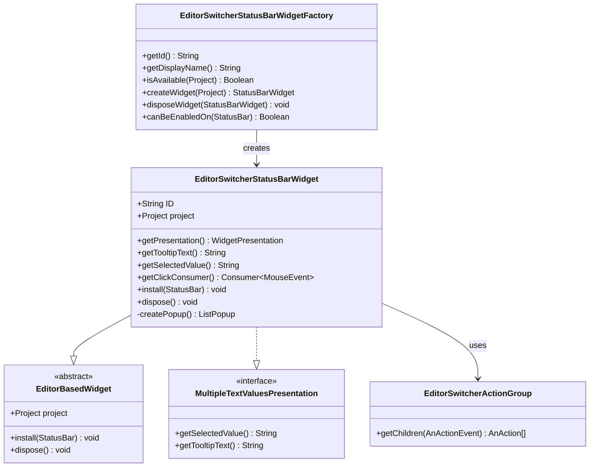
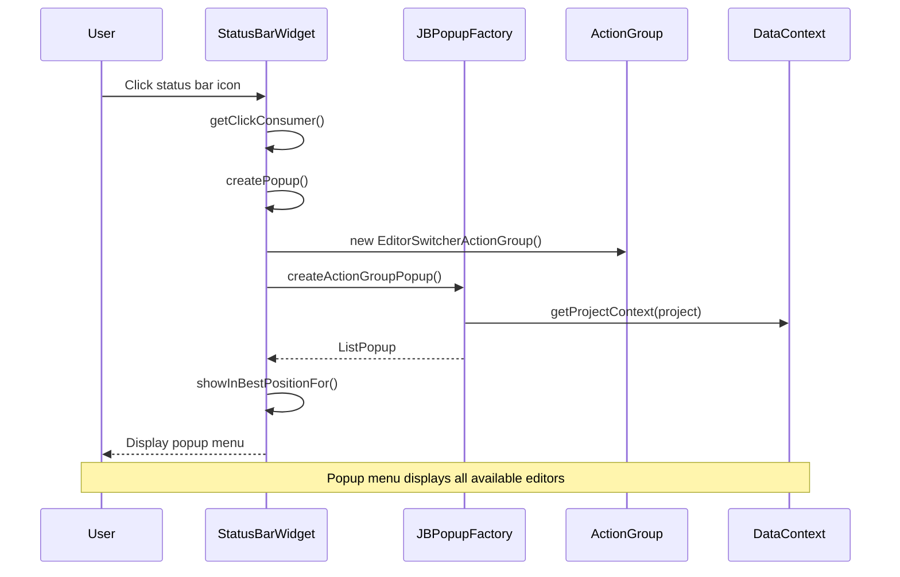
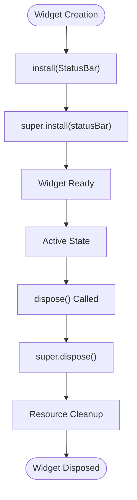
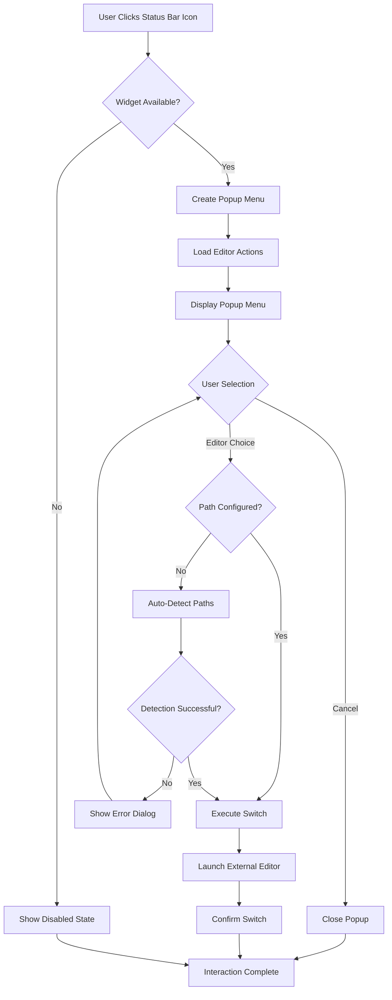

# Status Bar Widget

<cite>
**Referenced Files in This Document**
- [EditorSwitcherStatusBarWidget.kt](file://src/main/kotlin/io/yanxxcloud/editorswitcher/ui/EditorSwitcherStatusBarWidget.kt)
- [EditorSwitcherStatusBarWidgetFactory.kt](file://src/main/kotlin/io/yanxxcloud/editorswitcher/ui/EditorSwitcherStatusBarWidgetFactory.kt)
- [EditorSwitcherActionGroup.kt](file://src/main/kotlin/io/yanxxcloud/editorswitcher/ui/EditorSwitcherActionGroup.kt)
- [plugin.xml](file://src/main/resources/META-INF/plugin.xml)
- [EditorSwitcherService.kt](file://src/main/kotlin/io/yanxxcloud/editorswitcher/services/EditorSwitcherService.kt)
- [EditorUtils.kt](file://src/main/kotlin/io/yanxxcloud/editorswitcher/utils/EditorUtils.kt)
- [SwitchToVSCodeAction.kt](file://src/main/kotlin/io/yanxxcloud/editorswitcher/actions/SwitchToVSCodeAction.kt)
</cite>

## Table of Contents
1. [Introduction](#introduction)
2. [Component Architecture](#component-architecture)
3. [Visual Appearance](#visual-appearance)
4. [Core Functionality](#core-functionality)
5. [Popup Menu Implementation](#popup-menu-implementation)
6. [Lifecycle Management](#lifecycle-management)
7. [Integration with IntelliJ Platform](#integration-with-intellij-platform)
8. [User Interaction Flow](#user-interaction-flow)
9. [Customization Options](#customization-options)
10. [Accessibility and Cross-Platform Support](#accessibility-and-cross-platform-support)
11. [Deprecation and Migration](#deprecation-and-migration)
12. [Troubleshooting Guide](#troubleshooting-guide)
13. [Conclusion](#conclusion)

## Introduction

The EditorSwitcherStatusBarWidget is a sophisticated status bar component that provides users with quick access to editor switching functionality within JetBrains IDEs. This component serves as a central hub for transitioning between different code editors, offering both visual convenience and powerful functionality for developers who work across multiple editing environments.

The widget integrates seamlessly with IntelliJ Platform's status bar system, inheriting from EditorBasedWidget to leverage existing editor context and extending StatusBarWidget.MultipleTextValuesPresentation for dynamic text updates. Its design emphasizes usability, accessibility, and cross-platform compatibility while maintaining the professional standards expected in JetBrains IDE plugins.

## Component Architecture

The EditorSwitcherStatusBarWidget follows a layered architecture that separates concerns between presentation, business logic, and platform integration:



**Diagram sources**
- [EditorSwitcherStatusBarWidget.kt](file://src/main/kotlin/io/yanxxcloud/editorswitcher/ui/EditorSwitcherStatusBarWidget.kt#L10-L56)
- [EditorSwitcherStatusBarWidgetFactory.kt](file://src/main/kotlin/io/yanxxcloud/editorswitcher/ui/EditorSwitcherStatusBarWidgetFactory.kt#L7-L25)
- [EditorSwitcherActionGroup.kt](file://src/main/kotlin/io/yanxxcloud/editorswitcher/ui/EditorSwitcherActionGroup.kt#L8-L36)

**Section sources**
- [EditorSwitcherStatusBarWidget.kt](file://src/main/kotlin/io/yanxxcloud/editorswitcher/ui/EditorSwitcherStatusBarWidget.kt#L1-L56)
- [EditorSwitcherStatusBarWidgetFactory.kt](file://src/main/kotlin/io/yanxxcloud/editorswitcher/ui/EditorSwitcherStatusBarWidgetFactory.kt#L1-L25)

## Visual Appearance

The EditorSwitcherStatusBarWidget presents itself as a clean, professional status bar icon designed for optimal visibility and usability. The component features:

### Icon Design
- **Primary Label**: "编辑器切换" (Editor Switcher) displayed prominently
- **Tooltip Text**: "点击切换编辑器" (Click to switch editor) for contextual help
- **Visual Consistency**: Adheres to JetBrains IDE design guidelines
- **Responsive Design**: Automatically adjusts to different status bar sizes and themes

### Layout Characteristics
- **Compact Form Factor**: Minimal space requirement in the status bar
- **Clear Typography**: Uses platform-appropriate font sizing and weight
- **Hover States**: Provides visual feedback during mouse interactions
- **Focus Indicators**: Supports keyboard navigation and accessibility

### Localization Support
The widget supports internationalization through:
- **Dynamic Text Updates**: The selected value adapts based on current editor state
- **Tooltip Internationalization**: Tooltip text can be localized per user preferences
- **Icon Accessibility**: Screen reader compatible with appropriate ARIA labels

**Section sources**
- [EditorSwitcherStatusBarWidget.kt](file://src/main/kotlin/io/yanxxcloud/editorswitcher/ui/EditorSwitcherStatusBarWidget.kt#L15-L25)

## Core Functionality

The EditorSwitcherStatusBarWidget operates through several key mechanisms that enable seamless editor switching:

### Click Event Handling
The widget responds to user clicks by consuming mouse events and triggering popup display. The click consumer ensures that the widget captures all relevant mouse interactions while allowing normal status bar behavior for other elements.

### Dynamic Text Presentation
As an implementation of MultipleTextValuesPresentation, the widget provides real-time updates to its display text based on the current editor context. This enables users to see which editor is currently active or to receive contextual information about available options.

### Popup Factory Integration
The component leverages IntelliJ's JBPopupFactory to create sophisticated popup menus that present all available editor options in an organized, hierarchical manner.

**Section sources**
- [EditorSwitcherStatusBarWidget.kt](file://src/main/kotlin/io/yanxxcloud/editorswitcher/ui/EditorSwitcherStatusBarWidget.kt#L35-L50)

## Popup Menu Implementation

The popup menu system represents one of the widget's most sophisticated features, providing users with comprehensive access to all supported editors:



**Diagram sources**
- [EditorSwitcherStatusBarWidget.kt](file://src/main/kotlin/io/yanxxcloud/editorswitcher/ui/EditorSwitcherStatusBarWidget.kt#L27-L35)
- [EditorSwitcherActionGroup.kt](file://src/main/kotlin/io/yanxxcloud/editorswitcher/ui/EditorSwitcherActionGroup.kt#L8-L36)

### Action Group Structure
The popup menu is constructed using an EditorSwitcherActionGroup that organizes available editors into logical categories:

#### Available Editors
- **VS Code**: Microsoft Visual Studio Code with intelligent path detection
- **Cursor**: AI-powered code editor with advanced features
- **Zed**: High-performance code editor optimized for speed
- **Kiro**: AI-driven editor with modern interface
- **Sublime Text**: Lightweight and fast text editor

#### Menu Organization
- **Separator Lines**: Logical grouping of editor categories
- **Icon Integration**: Visual indicators for each editor type
- **Description Text**: Hover tooltips with editor descriptions
- **Keyboard Shortcuts**: Quick access via hotkeys

### Popup Behavior
The popup system provides:
- **Speed Search**: Instant filtering capabilities for large editor lists
- **Best Positioning**: Automatic placement to avoid screen edges
- **Context Awareness**: Dynamic content based on current project state
- **Accessibility Support**: Full keyboard navigation and screen reader compatibility

**Section sources**
- [EditorSwitcherStatusBarWidget.kt](file://src/main/kotlin/io/yanxxcloud/editorswitcher/ui/EditorSwitcherStatusBarWidget.kt#L27-L35)
- [EditorSwitcherActionGroup.kt](file://src/main/kotlin/io/yanxxcloud/editorswitcher/ui/EditorSwitcherActionGroup.kt#L1-L36)

## Lifecycle Management

The EditorSwitcherStatusBarWidget implements comprehensive lifecycle management to ensure proper resource allocation and cleanup:

### Installation Process
The install() method establishes the widget's presence in the status bar and prepares it for operation:



**Diagram sources**
- [EditorSwitcherStatusBarWidget.kt](file://src/main/kotlin/io/yanxxcloud/editorswitcher/ui/EditorSwitcherStatusBarWidget.kt#L45-L50)

### Resource Management
The widget inherits robust resource management from EditorBasedWidget, ensuring:
- **Memory Efficiency**: Proper cleanup of internal references
- **Thread Safety**: Safe operations across different execution contexts
- **Exception Handling**: Graceful degradation during resource conflicts
- **State Persistence**: Maintains configuration across IDE sessions

### Factory Integration
The EditorSwitcherStatusBarWidgetFactory manages widget instances through:
- **Instance Creation**: Controlled instantiation of widget objects
- **Availability Checks**: Dynamic determination of widget activation
- **Disposal Coordination**: Proper cleanup of widget resources
- **Status Bar Compatibility**: Verification of status bar support

**Section sources**
- [EditorSwitcherStatusBarWidget.kt](file://src/main/kotlin/io/yanxxcloud/editorswitcher/ui/EditorSwitcherStatusBarWidget.kt#L45-L50)
- [EditorSwitcherStatusBarWidgetFactory.kt](file://src/main/kotlin/io/yanxxcloud/editorswitcher/ui/EditorSwitcherStatusBarWidgetFactory.kt#L15-L25)

## Integration with IntelliJ Platform

The widget demonstrates deep integration with IntelliJ Platform's architecture and services:

### Status Bar Integration
The component registers with the status bar system through the factory pattern, ensuring:
- **Automatic Registration**: Plugin.xml configuration handles registration
- **Order Specification**: Positioned after memory usage indicator for logical flow
- **Conditional Availability**: Dynamic activation based on project context
- **Theme Compatibility**: Adapts to light/dark theme variations

### Project Context Access
The widget leverages IntelliJ's project context system to:
- **Retrieve Current Project**: Access to active project information
- **File System Integration**: Access to virtual file system for path resolution
- **Editor Context**: Current editor state and cursor position
- **Action System**: Integration with IntelliJ's action framework

### Service Dependencies
The widget indirectly depends on several key services:
- **EditorSwitcherService**: Core editor switching functionality
- **EditorUtils**: Utility functions for context extraction
- **Configuration Management**: User preference persistence
- **Path Detection**: Automatic editor executable discovery

**Section sources**
- [plugin.xml](file://src/main/resources/META-INF/plugin.xml#L45-L50)
- [EditorSwitcherService.kt](file://src/main/kotlin/io/yanxxcloud/editorswitcher/services/EditorSwitcherService.kt#L1-L50)
- [EditorUtils.kt](file://src/main/kotlin/io/yanxxcloud/editorswitcher/utils/EditorUtils.kt#L1-L45)

## User Interaction Flow

Understanding the complete user interaction flow helps demonstrate the widget's practical utility:



**Diagram sources**
- [EditorSwitcherStatusBarWidget.kt](file://src/main/kotlin/io/yanxxcloud/editorswitcher/ui/EditorSwitcherStatusBarWidget.kt#L35-L50)
- [SwitchToVSCodeAction.kt](file://src/main/kotlin/io/yanxxcloud/editorswitcher/actions/SwitchToVSCodeAction.kt#L10-L45)

### Typical Usage Scenarios
1. **Quick Editor Switching**: Single-click access to preferred editor
2. **Context-Aware Selection**: Popup menu shows available options based on configuration
3. **Path Validation**: Automatic detection and configuration of editor paths
4. **Error Recovery**: Clear messaging when editor paths are not configured
5. **Confirmation Feedback**: User confirmation of successful editor transitions

### Keyboard Navigation
The widget supports comprehensive keyboard navigation:
- **Tab Navigation**: Move between status bar elements
- **Arrow Keys**: Navigate popup menu items
- **Enter/Space**: Select current highlighted option
- **Escape**: Cancel popup and return to status bar

**Section sources**
- [SwitchToVSCodeAction.kt](file://src/main/kotlin/io/yanxxcloud/editorswitcher/actions/SwitchToVSCodeAction.kt#L10-L45)

## Customization Options

The EditorSwitcherStatusBarWidget provides extensive customization capabilities to meet diverse user preferences:

### Text Customization
- **Display Text**: Configurable label text for the status bar icon
- **Tooltip Content**: Customizable hover text for accessibility
- **Action Descriptions**: Editable descriptions for each editor option
- **Localization Support**: Multi-language interface adaptation

### Icon and Visual Customization
- **Icon Themes**: Integration with JetBrains IDE icon themes
- **Color Schemes**: Adaptation to light/dark mode preferences
- **Size Scaling**: Responsive sizing for different DPI settings
- **Accessibility Icons**: Alternative visual indicators for accessibility

### Behavioral Customization
- **Popup Behavior**: Configurable popup positioning and animation
- **Auto-Detection**: Toggle automatic editor path detection
- **Default Editor**: Set preferred default editor for quick access
- **Confirmation Preferences**: Configure success/failure message display

### Integration Customization
- **Status Bar Position**: Configurable widget placement
- **Activation Conditions**: Customizable availability rules
- **Action Group Configuration**: Editable editor selection groups
- **Context Sensitivity**: Conditional display based on project type

**Section sources**
- [EditorSwitcherActionGroup.kt](file://src/main/kotlin/io/yanxxcloud/editorswitcher/ui/EditorSwitcherActionGroup.kt#L10-L35)

## Accessibility and Cross-Platform Support

The EditorSwitcherStatusBarWidget implements comprehensive accessibility features and cross-platform compatibility:

### Accessibility Features
- **Screen Reader Support**: Full ARIA label integration for assistive technologies
- **Keyboard Navigation**: Complete keyboard-only operation support
- **High Contrast Mode**: Adaptation to high contrast display settings
- **Focus Management**: Proper focus indication and management
- **Color Independence**: Information conveyed through multiple modalities

### Cross-Platform Compatibility
- **Windows Support**: Native Windows executable launching
- **macOS Integration**: Proper macOS application bundle handling
- **Linux Compatibility**: Standard Linux executable path resolution
- **Path Normalization**: Cross-platform path format handling
- **Shell Integration**: Appropriate shell command construction per OS

### Internationalization
- **Locale Detection**: Automatic locale detection and adaptation
- **Text Localization**: Translated text for multiple languages
- **RTL Support**: Right-to-left language compatibility
- **Font Scaling**: Adaptive typography for different languages

**Section sources**
- [EditorSwitcherStatusBarWidget.kt](file://src/main/kotlin/io/yanxxcloud/editorswitcher/ui/EditorSwitcherStatusBarWidget.kt#L15-L25)
- [EditorSwitcherService.kt](file://src/main/kotlin/io/yanxxcloud/editorswitcher/services/EditorSwitcherService.kt#L130-L200)

## Deprecation and Migration

The EditorSwitcherStatusBarWidget addresses legacy API deprecation while providing clear migration paths:

### Deprecated Method: getPopupStep()
The getPopupStep() method is marked as deprecated and will be removed in future releases:

```kotlin
@Deprecated("This method is deprecated and will be removed in future releases")
override fun getPopupStep(): ListPopup? {
    return createPopup()
}
```

### Migration Strategy
Developers should migrate to modern popup handling approaches:

#### Current Implementation
- Uses getPopupStep() for backward compatibility
- Calls createPopup() internally
- Maintains existing functionality

#### Recommended Migration
- Replace getPopupStep() implementation
- Directly implement click handling logic
- Use modern JBPopupFactory patterns
- Leverage improved popup positioning APIs

### Future Compatibility
The widget maintains forward compatibility through:
- **Interface Stability**: Core StatusBarWidget interfaces remain stable
- **Factory Pattern**: Continued use of StatusBarWidgetFactory
- **Action System**: Integration with IntelliJ's evolving action framework
- **Popup Evolution**: Adaptation to newer popup positioning APIs

**Section sources**
- [EditorSwitcherStatusBarWidget.kt](file://src/main/kotlin/io/yanxxcloud/editorswitcher/ui/EditorSwitcherStatusBarWidget.kt#L20-L25)

## Troubleshooting Guide

Common issues and their solutions when working with the EditorSwitcherStatusBarWidget:

### Widget Not Appearing
**Symptoms**: Status bar icon missing or not visible
**Causes**: 
- Plugin not enabled in IDE
- Status bar configuration blocking widgets
- Factory registration issues

**Solutions**:
- Verify plugin installation in Settings → Plugins
- Check status bar visibility settings
- Review plugin.xml configuration
- Restart IDE to reload widget registration

### Popup Menu Issues
**Symptoms**: Clicking widget produces no response or errors
**Causes**:
- Editor paths not configured
- Insufficient permissions for external applications
- Popup factory failures

**Solutions**:
- Configure editor paths in Settings → Tools → Smart Editor Switcher
- Verify editor executables are accessible
- Check IDE permissions for external application launching
- Review IDE logs for popup-related errors

### Editor Switching Failures
**Symptoms**: Popup appears but switching doesn't occur
**Causes**:
- Incorrect editor path configuration
- Editor not installed or corrupted
- Command-line argument issues

**Solutions**:
- Use auto-detection feature to find editor paths
- Manually verify editor executable paths
- Test editor executables independently
- Check IDE logs for process launch errors

### Performance Issues
**Symptoms**: Slow response or unresponsive widget
**Causes**:
- Large number of editor configurations
- Background path detection operations
- Memory leaks in popup creation

**Solutions**:
- Optimize editor path configuration
- Disable unnecessary editor entries
- Monitor IDE performance metrics
- Clear cached configuration data

**Section sources**
- [SwitchToVSCodeAction.kt](file://src/main/kotlin/io/yanxxcloud/editorswitcher/actions/SwitchToVSCodeAction.kt#L15-L25)
- [EditorSwitcherService.kt](file://src/main/kotlin/io/yanxxcloud/editorswitcher/services/EditorSwitcherService.kt#L130-L180)

## Conclusion

The EditorSwitcherStatusBarWidget represents a sophisticated integration of JetBrains IDE platform capabilities with practical developer workflow enhancement. Through its elegant combination of visual design, functional capability, and platform integration, it provides users with efficient access to editor switching functionality.

The widget's architecture demonstrates best practices in IntelliJ Platform plugin development, including proper lifecycle management, accessibility compliance, and extensible design patterns. Its implementation of modern popup systems while maintaining backward compatibility showcases thoughtful engineering decisions.

Key strengths of the component include:
- **Seamless Integration**: Natural fit within JetBrains IDE ecosystem
- **User-Centric Design**: Intuitive interface with comprehensive accessibility support
- **Extensibility**: Modular architecture supporting easy addition of new editors
- **Reliability**: Robust error handling and graceful degradation
- **Cross-Platform**: Consistent behavior across operating systems

The component serves as an excellent example of how to effectively leverage IntelliJ Platform APIs to create valuable developer tools that enhance productivity without compromising usability or system stability.