# User Interface Components

<cite>
**Referenced Files in This Document**
- [EditorSwitcherStatusBarWidget.kt](file://src/main/kotlin/io/yanxxcloud/editorswitcher/ui/EditorSwitcherStatusBarWidget.kt)
- [EditorSwitcherStatusBarWidgetFactory.kt](file://src/main/kotlin/io/yanxxcloud/editorswitcher/ui/EditorSwitcherStatusBarWidgetFactory.kt)
- [EditorSwitcherActionGroup.kt](file://src/main/kotlin/io/yanxxcloud/editorswitcher/ui/EditorSwitcherActionGroup.kt)
- [plugin.xml](file://src/main/resources/META-INF/plugin.xml)
- [EditorSwitcherService.kt](file://src/main/kotlin/io/yanxxcloud/editorswitcher/services/EditorSwitcherService.kt)
- [EditorUtils.kt](file://src/main/kotlin/io/yanxxcloud/editorswitcher/utils/EditorUtils.kt)
- [SwitchToVSCodeAction.kt](file://src/main/kotlin/io/yanxxcloud/editorswitcher/actions/SwitchToVSCodeAction.kt)
- [SmartEditorSwitcherConfigurable.kt](file://src/main/kotlin/io/yanxxcloud/editorswitcher/settings/SmartEditorSwitcherConfigurable.kt)
- [SmartEditorSwitcherSettingsComponent.kt](file://src/main/kotlin/io/yanxxcloud/editorswitcher/settings/SmartEditorSwitcherSettingsComponent.kt)
</cite>

## Table of Contents
1. [Introduction](#introduction)
2. [Status Bar Widget Architecture](#status-bar-widget-architecture)
3. [EditorSwitcherStatusBarWidget](#editorswitcherstatusbarwidget)
4. [EditorSwitcherStatusBarWidgetFactory](#editorswitcherstatusbarwidgetfactory)
5. [EditorSwitcherActionGroup](#editorswitcheractiongroup)
6. [UI Integration and Registration](#ui-integration-and-registration)
7. [User Interaction Patterns](#user-interaction-patterns)
8. [Context Retrieval and Data Flow](#context-retrieval-and-data-flow)
9. [Customization and Configuration](#customization-and-configuration)
10. [Performance Considerations](#performance-considerations)
11. [Accessibility and Theming](#accessibility-and-theming)
12. [Troubleshooting Guide](#troubleshooting-guide)

## Introduction

The Smart Editor Switcher plugin provides a sophisticated user interface system that enables seamless switching between JetBrains IDEs and external editors. The UI components are built around three core elements: the status bar widget for quick access, the action group for organized menu presentation, and the factory system for platform integration. These components work together to deliver an intuitive, efficient editing experience with intelligent context preservation and cross-platform compatibility.

## Status Bar Widget Architecture

The status bar widget system follows IntelliJ Platform's extension mechanism, providing a native integration point for user interface enhancements. The architecture consists of two primary components that work in harmony to deliver the switching functionality.

**Diagram sources**
- [EditorSwitcherStatusBarWidgetFactory.kt](file://src/main/kotlin/io/yanxxcloud/editorswitcher/ui/EditorSwitcherStatusBarWidgetFactory.kt#L1-L25)
- [EditorSwitcherStatusBarWidget.kt](file://src/main/kotlin/io/yanxxcloud/editorswitcher/ui/EditorSwitcherStatusBarWidget.kt#L1-L56)
- [EditorSwitcherActionGroup.kt](file://src/main/kotlin/io/yanxxcloud/editorswitcher/ui/EditorSwitcherActionGroup.kt#L1-L36)

## EditorSwitcherStatusBarWidget

The `EditorSwitcherStatusBarWidget` serves as the primary visual interface element, providing one-click access to editor switching functionality directly from the IntelliJ Platform's status bar. This component extends `EditorBasedWidget` and implements `StatusBarWidget.MultipleTextValuesPresentation` to integrate seamlessly with the platform's widget system.

### Visual Appearance and Behavior

The widget presents itself as a compact, clickable element in the bottom-right corner of the IDE window. Its visual characteristics include:

- **Icon Representation**: While the widget doesn't display a traditional icon, it uses the text "编辑器切换" (Editor Switch) as its primary visual indicator
- **Tooltip Information**: Hovering over the widget displays the localized tooltip "点击切换编辑器" (Click to switch editor)
- **Interactive Feedback**: Click events trigger a popup menu displaying all available editor options
- **Status Indication**: The widget reflects the current editor context through its tooltip and click behavior

### Implementation Details

The widget's core functionality revolves around its click consumer mechanism, which creates and displays a popup menu containing all available editor switching options. The popup creation process involves instantiating an `EditorSwitcherActionGroup` and configuring it with appropriate presentation options.

**Section sources**
- [EditorSwitcherStatusBarWidget.kt](file://src/main/kotlin/io/yanxxcloud/editorswitcher/ui/EditorSwitcherStatusBarWidget.kt#L1-L56)

## EditorSwitcherStatusBarWidgetFactory

The `EditorSwitcherStatusBarWidgetFactory` acts as the factory responsible for creating and managing instances of the status bar widget. This component implements the `StatusBarWidgetFactory` interface, enabling the IntelliJ Platform to discover, instantiate, and manage the widget lifecycle.

### Factory Responsibilities

The factory performs several critical functions in the widget lifecycle:

- **Widget Creation**: Instantiates new `EditorSwitcherStatusBarWidget` instances for each project
- **Availability Checking**: Determines whether the widget should be available in a given project context
- **Lifecycle Management**: Handles widget disposal and cleanup operations
- **Platform Integration**: Ensures proper registration with the IntelliJ Platform's status bar system

### Registration and Integration

The factory registers with the IntelliJ Platform through the plugin.xml configuration, specifying its role as a status bar widget factory. The registration includes ordering information (`order="after memoryUsage"`) to ensure proper placement in the status bar layout.

**Section sources**
- [EditorSwitcherStatusBarWidgetFactory.kt](file://src/main/kotlin/io/yanxxcloud/editorswitcher/ui/EditorSwitcherStatusBarWidgetFactory.kt#L1-L25)
- [plugin.xml](file://src/main/resources/META-INF/plugin.xml#L45-L47)

## EditorSwitcherActionGroup

The `EditorSwitcherActionGroup` serves as the organizational hub for all editor switching actions, providing a structured menu interface that groups related functionality together. This component extends `ActionGroup` and implements the platform's action system to deliver contextual menu functionality.

### Menu Organization

The action group organizes editor switching actions into logical categories:

```mermaid
flowchart TD
A[EditorSwitcherActionGroup] --> B[VS Code Actions]
A --> C[Cursor Actions]
A --> D[Zed Actions]
A --> E[Separator]
A --> F[Kiro Actions]
A --> G[Sublime Text Actions]
B --> B1["📘 VS Code<br/>切换到 VS Code"]
C --> C1["🎯 Cursor<br/>切换到 Cursor"]
D --> D1["⚡ Zed<br/>切换到 Zed"]
F --> F1["🚀 Kiro<br/>切换到 Kiro 编辑器"]
G --> G1["🎨 Sublime Text<br/>切换到 Sublime Text"]
```

**Diagram sources**
- [EditorSwitcherActionGroup.kt](file://src/main/kotlin/io/yanxxcloud/editorswitcher/ui/EditorSwitcherActionGroup.kt#L10-L30)

### Action Presentation

Each action within the group receives customized presentation attributes:
- **Text Labels**: Localized display names with Unicode emoji indicators
- **Descriptions**: Tooltips providing additional context about each editor
- **Visual Consistency**: Uniform presentation format across all actions

**Section sources**
- [EditorSwitcherActionGroup.kt](file://src/main/kotlin/io/yanxxcloud/editorswitcher/ui/EditorSwitcherActionGroup.kt#L1-L36)

## UI Integration and Registration

The UI components integrate with the IntelliJ Platform through a multi-layered registration system that ensures proper discovery, instantiation, and lifecycle management.

### Plugin Extension Points

The integration occurs through several key extension points defined in plugin.xml:

| Extension Point | Purpose | Implementation |
|----------------|---------|----------------|
| `statusBarWidgetFactory` | Registers the status bar widget factory | `EditorSwitcherStatusBarWidgetFactory` |
| `applicationConfigurable` | Provides configuration interface | `SmartEditorSwitcherConfigurable` |
| `action` | Defines individual editor switching actions | Various action classes |

### Widget Lifecycle Management

The widget lifecycle follows a well-defined pattern:

**Diagram sources**
- [EditorSwitcherStatusBarWidgetFactory.kt](file://src/main/kotlin/io/yanxxcloud/editorswitcher/ui/EditorSwitcherStatusBarWidgetFactory.kt#L15-L20)
- [EditorSwitcherStatusBarWidget.kt](file://src/main/kotlin/io/yanxxcloud/editorswitcher/ui/EditorSwitcherStatusBarWidget.kt#L45-L50)

**Section sources**
- [plugin.xml](file://src/main/resources/META-INF/plugin.xml#L45-L50)

## User Interaction Patterns

The UI components support multiple interaction patterns, providing flexibility for different user preferences and workflow requirements.

### Mouse-Based Interactions

**Status Bar Widget Interaction**:
1. **Hover**: Display tooltip "点击切换编辑器"
2. **Click**: Open popup menu with all editor options
3. **Select**: Choose desired editor from menu
4. **Execute**: Trigger editor switching with context preservation

**Right-Click Context Menus**:
1. **File Context**: Right-click on file in editor or project view
2. **Menu Display**: Show "Open with External Editor" submenu
3. **Selection**: Choose target editor from context menu
4. **Execution**: Immediate editor switching

### Keyboard Shortcut Support

The plugin provides comprehensive keyboard shortcut support:

| Shortcut | Action | Target Editor |
|----------|--------|---------------|
| `Ctrl+Alt+V` | Switch Editor | VS Code |
| `Ctrl+Alt+C` | Switch Editor | Cursor |
| `Ctrl+Alt+Z` | Switch Editor | Zed |
| `Ctrl+Alt+K` | Switch Editor | Kiro |
| `Ctrl+Alt+S` | Switch Editor | Sublime Text |

### Interactive Workflow Example

**Diagram sources**
- [EditorSwitcherStatusBarWidget.kt](file://src/main/kotlin/io/yanxxcloud/editorswitcher/ui/EditorSwitcherStatusBarWidget.kt#L35-L45)
- [SwitchToVSCodeAction.kt](file://src/main/kotlin/io/yanxxcloud/editorswitcher/actions/SwitchToVSCodeAction.kt#L10-L35)

**Section sources**
- [plugin.xml](file://src/main/resources/META-INF/plugin.xml#L60-L85)

## Context Retrieval and Data Flow

The UI components rely on sophisticated context retrieval mechanisms to preserve user state during editor switching operations. The `EditorUtils` module provides the foundation for this functionality.

### Context Data Structure

The `EditorContext` data class encapsulates all necessary information for editor switching:

| Property | Type | Description | Usage |
|----------|------|-------------|-------|
| `project` | `Project?` | Current IntelliJ project | Project context preservation |
| `file` | `VirtualFile?` | Current opened file | File-specific operations |
| `filePath` | `String?` | Absolute file path | External editor file opening |
| `projectPath` | `String?` | Project base path | Working directory setting |
| `line` | `Int` | Current line number | Cursor positioning |
| `column` | `Int` | Current column number | Precise cursor location |

### Data Flow Architecture

**Diagram sources**
- [EditorUtils.kt](file://src/main/kotlin/io/yanxxcloud/editorswitcher/utils/EditorUtils.kt#L15-L40)
- [EditorSwitcherService.kt](file://src/main/kotlin/io/yanxxcloud/editorswitcher/services/EditorSwitcherService.kt#L35-L50)

### Cross-Editor Compatibility

The context preservation system handles different editor command-line argument formats:

| Editor | Argument Format | Example |
|--------|----------------|---------|
| VS Code | `--goto filepath:line:column` | `code --goto main.js:42:15` |
| Cursor | `--goto filepath:line:column` | `cursor --goto main.py:10:5` |
| Zed | `filepath:line:column` | `zed main.rs:100:20` |
| Kiro | `--line N --column M` | `kiro project/ --line 50 --column 10` |
| Sublime | `filepath:line:column` | `subl project/main.cpp:25:8` |

**Section sources**
- [EditorUtils.kt](file://src/main/kotlin/io/yanxxcloud/editorswitcher/utils/EditorUtils.kt#L1-L45)
- [EditorSwitcherService.kt](file://src/main/kotlin/io/yanxxcloud/editorswitcher/services/EditorSwitcherService.kt#L50-L150)

## Customization and Configuration

The plugin provides extensive customization options through its configuration system, allowing users to tailor the UI behavior to their preferences and workflow requirements.

### Configuration Interface

The configuration system is built around the `SmartEditorSwitcherConfigurable` and `SmartEditorSwitcherSettingsComponent` classes, providing a comprehensive settings interface:

**Diagram sources**
- [SmartEditorSwitcherConfigurable.kt](file://src/main/kotlin/io/yanxxcloud/editorswitcher/settings/SmartEditorSwitcherConfigurable.kt#L1-L56)
- [SmartEditorSwitcherSettingsComponent.kt](file://src/main/kotlin/io/yanxxcloud/editorswitcher/settings/SmartEditorSwitcherSettingsComponent.kt#L1-L165)

### Widget Visibility Settings

The plugin supports various visibility and behavior customization options:

| Setting Category | Options | Description |
|-----------------|---------|-------------|
| **Status Bar** | Widget visibility toggle | Enable/disable status bar widget |
| **Menu Behavior** | Popup delay, search aid | Configure popup menu appearance |
| **Keyboard Shortcuts** | Customizable bindings | Modify default shortcut keys |
| **Editor Paths** | Manual/automatic detection | Configure editor executable paths |

### Accessibility Compliance

The UI components incorporate accessibility features:

- **Screen Reader Support**: Proper labeling and description for all interactive elements
- **Keyboard Navigation**: Full keyboard accessibility for all menu operations
- **High Contrast Support**: Compatible with system-wide accessibility themes
- **Focus Management**: Logical tab order and focus indication

**Section sources**
- [SmartEditorSwitcherConfigurable.kt](file://src/main/kotlin/io/yanxxcloud/editorswitcher/settings/SmartEditorSwitcherConfigurable.kt#L1-L56)
- [SmartEditorSwitcherSettingsComponent.kt](file://src/main/kotlin/io/yanxxcloud/editorswitcher/settings/SmartEditorSwitcherSettingsComponent.kt#L1-L165)

## Performance Considerations

The UI components are designed with performance efficiency in mind, implementing several optimization strategies to minimize resource consumption and maximize responsiveness.

### Lazy Loading Implementation

The widget system employs lazy loading principles:

- **Factory Pattern**: Widgets are instantiated only when needed
- **Popup Creation**: Popup menus are generated on-demand
- **Context Retrieval**: Editor context is fetched only during actual switching operations
- **Resource Cleanup**: Automatic disposal of widget resources when not in use

### Memory Efficiency Strategies

Several memory optimization techniques are employed:

### Performance Metrics

| Operation | Time Complexity | Space Complexity | Optimization Strategy |
|-----------|----------------|------------------|---------------------|
| Widget Creation | O(1) | O(1) | Singleton pattern |
| Popup Generation | O(n) | O(n) | Lazy instantiation |
| Context Retrieval | O(1) | O(1) | Cached data structures |
| Path Detection | O(m) | O(m) | Background scanning |

### Scalability Considerations

The architecture scales efficiently with:
- **Multiple Projects**: Independent widget instances per project
- **Large File Sets**: Efficient context extraction for large projects
- **Frequent Switching**: Optimized command building and execution
- **Background Operations**: Non-blocking path detection and validation

**Section sources**
- [EditorSwitcherStatusBarWidget.kt](file://src/main/kotlin/io/yanxxcloud/editorswitcher/ui/EditorSwitcherStatusBarWidget.kt#L45-L56)
- [EditorSwitcherService.kt](file://src/main/kotlin/io/yanxxcloud/editorswitcher/services/EditorSwitcherService.kt#L150-L200)

## Accessibility and Theming

The UI components are designed with comprehensive accessibility support and theming compatibility to ensure optimal user experience across different environments and user needs.

### Cross-Platform Consistency

The theming system ensures consistent appearance across different operating systems:

- **Platform Adaptation**: Native look and feel integration
- **Color Scheme Support**: Automatic adaptation to dark/light themes
- **Font Scaling**: Responsive typography for different DPI settings
- **Icon Rendering**: Vector graphics for crisp display at any scale

### Accessibility Features

The plugin incorporates multiple accessibility enhancements:

| Feature | Implementation | Benefit |
|---------|---------------|---------|
| **Screen Reader Support** | Proper ARIA labels and descriptions | Visually impaired users |
| **Keyboard Navigation** | Full keyboard operability | Motor impairment support |
| **High Contrast Mode** | Theme-aware color selection | Low vision assistance |
| **Focus Indicators** | Clear visual focus highlighting | Navigation clarity |
| **Tooltip Localization** | Multi-language tooltip support | International users |

### Theme Integration

The UI components integrate with IntelliJ Platform's theme system:

### Responsive Design Elements

The components adapt to various screen configurations:
- **Dynamic Layout**: Flexible widget sizing based on available space
- **Adaptive Menus**: Context-sensitive menu layouts
- **Touch-Friendly Targets**: Minimum touch target sizes for mobile devices
- **DPI Awareness**: High-resolution display support

**Section sources**
- [EditorSwitcherStatusBarWidget.kt](file://src/main/kotlin/io/yanxxcloud/editorswitcher/ui/EditorSwitcherStatusBarWidget.kt#L25-L35)
- [EditorSwitcherActionGroup.kt](file://src/main/kotlin/io/yanxxcloud/editorswitcher/ui/EditorSwitcherActionGroup.kt#L10-L30)

## Troubleshooting Guide

This section provides solutions for common issues encountered with the UI components, helping users resolve problems quickly and efficiently.

### Common Issues and Solutions

**Widget Not Appearing in Status Bar**:
- Verify plugin installation and activation
- Check status bar visibility settings
- Confirm factory registration in plugin.xml
- Restart IDE to refresh widget registry

**Popup Menu Not Displaying Correctly**:
- Ensure proper action group configuration
- Check popup factory settings
- Verify project context availability
- Review action group child initialization

**Editor Path Detection Failures**:
- Manually configure editor paths in settings
- Verify executable permissions
- Check firewall and antivirus settings
- Validate path format for target operating system

**Context Preservation Issues**:
- Confirm file and project paths are accessible
- Verify editor supports command-line arguments
- Check for special characters in file paths
- Test with simple file paths first

### Diagnostic Procedures

For systematic problem resolution:

1. **Enable Debug Logging**: Check IDE logs for widget-related errors
2. **Verify Dependencies**: Ensure all required components are loaded
3. **Test Individual Components**: Isolate widget, factory, and action group issues
4. **Validate Configuration**: Check plugin.xml and settings consistency

### Performance Troubleshooting

Common performance issues and solutions:

| Issue | Symptoms | Solution |
|-------|----------|----------|
| Slow Widget Loading | Delayed status bar response | Check widget initialization code |
| Memory Leaks | Increasing memory usage | Verify proper widget disposal |
| Popup Lag | Delayed menu display | Optimize action group population |
| Context Retrieval Slow | Delayed editor switching | Profile context extraction methods |

**Section sources**
- [EditorSwitcherStatusBarWidget.kt](file://src/main/kotlin/io/yanxxcloud/editorswitcher/ui/EditorSwitcherStatusBarWidget.kt#L45-L56)
- [EditorSwitcherService.kt](file://src/main/kotlin/io/yanxxcloud/editorswitcher/services/EditorSwitcherService.kt#L150-L200)