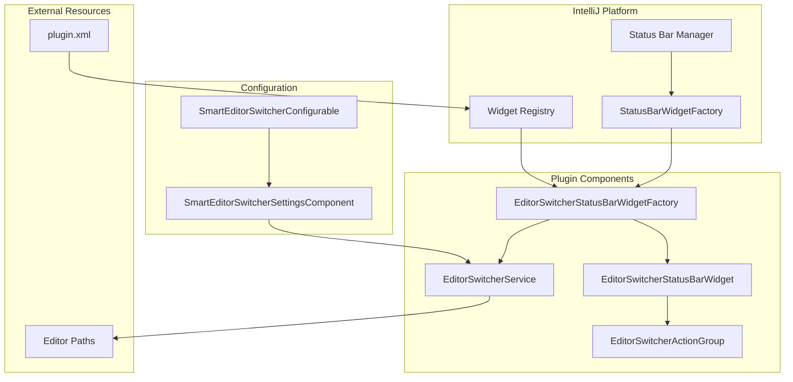
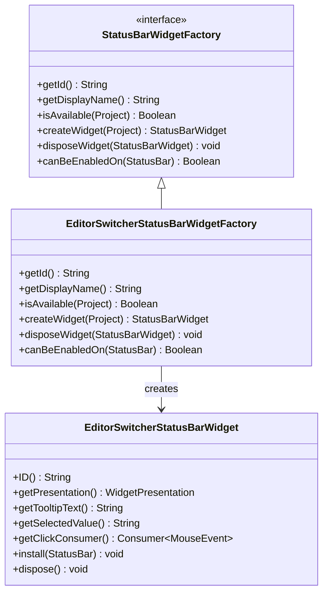
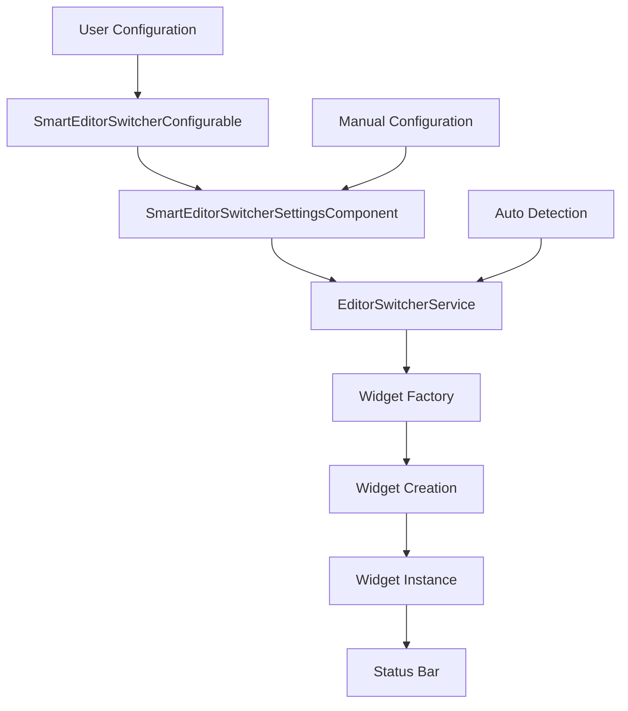
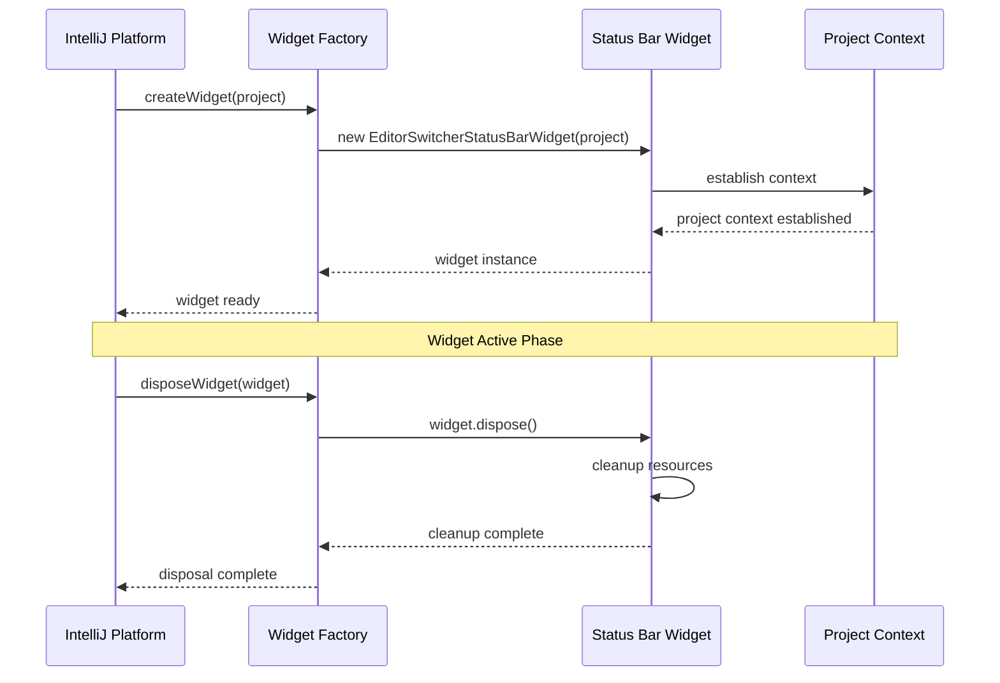

# Widget Factory

<cite>
**Referenced Files in This Document**
- [EditorSwitcherStatusBarWidgetFactory.kt](file://src/main/kotlin/io/yanxxcloud/editorswitcher/ui/EditorSwitcherStatusBarWidgetFactory.kt)
- [EditorSwitcherStatusBarWidget.kt](file://src/main/kotlin/io/yanxxcloud/editorswitcher/ui/EditorSwitcherStatusBarWidget.kt)
- [plugin.xml](file://src/main/resources/META-INF/plugin.xml)
- [EditorSwitcherActionGroup.kt](file://src/main/kotlin/io/yanxxcloud/editorswitcher/ui/EditorSwitcherActionGroup.kt)
- [EditorSwitcherService.kt](file://src/main/kotlin/io/yanxxcloud/editorswitcher/services/EditorSwitcherService.kt)
- [SmartEditorSwitcherConfigurable.kt](file://src/main/kotlin/io/yanxxcloud/editorswitcher/settings/SmartEditorSwitcherConfigurable.kt)
- [SmartEditorSwitcherSettingsComponent.kt](file://src/main/kotlin/io/yanxxcloud/editorswitcher/settings/SmartEditorSwitcherSettingsComponent.kt)
</cite>

## Table of Contents
1. [Introduction](#introduction)
2. [Architecture Overview](#architecture-overview)
3. [Core Implementation](#core-implementation)
4. [Status Bar Widget Registration](#status-bar-widget-registration)
5. [Widget Availability and Configuration](#widget-availability-and-configuration)
6. [Memory Management and Lifecycle](#memory-management-and-lifecycle)
7. [Integration Examples](#integration-examples)
8. [Best Practices](#best-practices)
9. [Troubleshooting Guide](#troubleshooting-guide)
10. [Conclusion](#conclusion)

## Introduction

The EditorSwitcherStatusBarWidgetFactory class serves as the central registration and instantiation mechanism for the Smart Editor Switcher status bar widget within the IntelliJ Platform ecosystem. This factory implements the StatusBarWidgetFactory interface to provide a seamless integration point for the status bar widget system, enabling developers to create, manage, and configure status bar widgets programmatically.

As part of the Smart Editor Switcher plugin, this factory facilitates the creation of a persistent UI element in the IDE's status bar that allows users to quickly switch between different code editors while maintaining project context and cursor positioning. The factory acts as a bridge between the IntelliJ Platform's widget management system and the plugin's specific widget implementation.

## Architecture Overview

The EditorSwitcherStatusBarWidgetFactory follows a factory pattern design that separates concerns between widget creation, lifecycle management, and availability determination. The architecture consists of several key components working in harmony:



**Diagram sources**
- [EditorSwitcherStatusBarWidgetFactory.kt](file://src/main/kotlin/io/yanxxcloud/editorswitcher/ui/EditorSwitcherStatusBarWidgetFactory.kt#L1-L25)
- [plugin.xml](file://src/main/resources/META-INF/plugin.xml#L35-L38)

The factory operates within the IntelliJ Platform's extension point system, where it registers itself as a status bar widget factory through the plugin.xml configuration. This registration establishes the widget's presence in the IDE's status bar management system and defines its initialization parameters.

## Core Implementation

### Factory Interface Implementation

The EditorSwitcherStatusBarWidgetFactory implements the StatusBarWidgetFactory interface, which defines the contract for status bar widget factories in the IntelliJ Platform. This interface provides four essential methods that control widget behavior and lifecycle:



**Diagram sources**
- [EditorSwitcherStatusBarWidgetFactory.kt](file://src/main/kotlin/io/yanxxcloud/editorswitcher/ui/EditorSwitcherStatusBarWidgetFactory.kt#L7-L24)
- [EditorSwitcherStatusBarWidget.kt](file://src/main/kotlin/io/yanxxcloud/editorswitcher/ui/EditorSwitcherStatusBarWidget.kt#L13-L55)

### Identification Methods

The factory implements two identification methods that are crucial for the IntelliJ Platform's widget management system:

#### getId() Method
The [`getId()`](file://src/main/kotlin/io/yanxxcloud/editorswitcher/ui/EditorSwitcherStatusBarWidgetFactory.kt#L9) method returns the unique identifier "SmartEditorSwitcher" for the widget. This identifier serves multiple purposes:
- **Widget Uniqueness**: Ensures the widget can be uniquely identified within the status bar manager
- **Configuration Persistence**: Used for storing and retrieving widget-specific settings
- **Lifecycle Management**: Enables proper widget replacement and updates during IDE restarts

#### getDisplayName() Method  
The [`getDisplayName()`](file://src/main/kotlin/io/yanxxcloud/editorswitcher/ui/EditorSwitcherStatusBarWidgetFactory.kt#L11) method returns "Smart Editor Switcher", which appears in the IDE's settings and configuration dialogs. This human-readable name helps users identify and configure the widget within the IntelliJ Platform's settings framework.

**Section sources**
- [EditorSwitcherStatusBarWidgetFactory.kt](file://src/main/kotlin/io/yanxxcloud/editorswitcher/ui/EditorSwitcherStatusBarWidgetFactory.kt#L9-L12)

## Status Bar Widget Registration

### Plugin.xml Configuration

The widget factory is registered through the plugin.xml file using the statusBarWidgetFactory extension point. This registration establishes the widget's presence in the IntelliJ Platform's extension system and defines its initialization parameters:

```xml
<statusBarWidgetFactory 
    id="io.yanxxcloud.editorswitcher.statusbar"
    implementation="io.yanxxcloud.editorswitcher.ui.EditorSwitcherStatusBarWidgetFactory"
    order="after memoryUsage"/>
```

The registration includes several important attributes:
- **id**: Unique identifier for the extension point
- **implementation**: Fully qualified class name of the factory implementation
- **order**: Specifies the widget's position relative to other status bar elements

### Extension Point Integration

The factory integrates with the IntelliJ Platform's extension point system, allowing the IDE to discover and instantiate the widget factory automatically during plugin loading. This integration follows the platform's conventions for extending functionality through well-defined interfaces.

**Section sources**
- [plugin.xml](file://src/main/resources/META-INF/plugin.xml#L35-L38)

## Widget Availability and Configuration

### Availability Determination

The factory implements two methods that control widget availability and enablement:

#### isAvailable() Method
The [`isAvailable()`](file://src/main/kotlin/io/yanxxcloud/editorswitcher/ui/EditorSwitcherStatusBarWidgetFactory.kt#L13) method currently returns `true` for all projects, indicating that the widget should be available regardless of the project context. This implementation provides broad accessibility but could be enhanced to support project-specific availability checks.

#### canBeEnabledOn() Method
The [`canBeEnabledOn()`](file://src/main/kotlin/io/yanxxcloud/editorswitcher/ui/EditorSwitcherStatusBarWidgetFactory.kt#L22) method returns `true` for all status bars, ensuring the widget can be enabled on any supported status bar instance. This method provides flexibility for different IDE configurations and window layouts.

### Configuration Through Settings

The widget's behavior and appearance can be influenced through the plugin's configuration system:



**Diagram sources**
- [SmartEditorSwitcherConfigurable.kt](file://src/main/kotlin/io/yanxxcloud/editorswitcher/settings/SmartEditorSwitcherConfigurable.kt#L1-L56)
- [SmartEditorSwitcherSettingsComponent.kt](file://src/main/kotlin/io/yanxxcloud/editorswitcher/settings/SmartEditorSwitcherSettingsComponent.kt#L1-L165)

The configuration system allows users to:
- Specify editor executable paths for different editors
- Enable/disable automatic path detection
- Configure keyboard shortcuts and menu integration
- Customize widget appearance and behavior

**Section sources**
- [EditorSwitcherStatusBarWidgetFactory.kt](file://src/main/kotlin/io/yanxxcloud/editorswitcher/ui/EditorSwitcherStatusBarWidgetFactory.kt#L13-L22)
- [SmartEditorSwitcherConfigurable.kt](file://src/main/kotlin/io/yanxxcloud/editorswitcher/settings/SmartEditorSwitcherConfigurable.kt#L1-L56)

## Memory Management and Lifecycle

### Widget Creation and Instantiation

The [`createWidget()`](file://src/main/kotlin/io/yanxxcloud/editorswitcher/ui/EditorSwitcherStatusBarWidgetFactory.kt#L15) method handles the instantiation of the EditorSwitcherStatusBarWidget with the current project context. This method demonstrates proper resource management by passing the project reference to the widget constructor, ensuring the widget has access to project-specific information and services.

### Disposal and Cleanup

The [`disposeWidget()`](file://src/main/kotlin/io/yanxxcloud/editorswitcher/ui/EditorSwitcherStatusBarWidgetFactory.kt#L19) method ensures proper cleanup of widget resources. It delegates the disposal responsibility to the widget itself by calling `widget.dispose()`, following the principle of least privilege and encapsulation.

### Lifecycle Management

The factory participates in the widget lifecycle through several key phases:



**Diagram sources**
- [EditorSwitcherStatusBarWidgetFactory.kt](file://src/main/kotlin/io/yanxxcloud/editorswitcher/ui/EditorSwitcherStatusBarWidgetFactory.kt#L15-L19)
- [EditorSwitcherStatusBarWidget.kt](file://src/main/kotlin/io/yanxxcloud/editorswitcher/ui/EditorSwitcherStatusBarWidget.kt#L48-L55)

**Section sources**
- [EditorSwitcherStatusBarWidgetFactory.kt](file://src/main/kotlin/io/yanxxcloud/editorswitcher/ui/EditorSwitcherStatusBarWidgetFactory.kt#L15-L19)

## Integration Examples

### Basic Widget Registration

The simplest integration example demonstrates how the factory registers with the IntelliJ Platform:

```xml
<statusBarWidgetFactory 
    id="io.yanxxcloud.editorswitcher.statusbar"
    implementation="io.yanxxcloud.editorswitcher.ui.EditorSwitcherStatusBarWidgetFactory"
    order="after memoryUsage"/>
```

This registration places the widget after the memory usage indicator in the status bar, providing a logical ordering for status bar elements.

### Advanced Configuration Options

The factory supports various configuration scenarios:

#### Conditional Availability
Future enhancements could implement conditional availability based on project type, file extensions, or user preferences:

```kotlin
override fun isAvailable(project: Project): Boolean {
    // Example: Only available for Java projects
    return project.basePath?.endsWith("java") ?: false
}
```

#### Dynamic Ordering
The factory could support dynamic ordering based on user preferences or system characteristics:

```kotlin
override fun canBeEnabledOn(statusBar: StatusBar): Boolean {
    // Example: Only enable on primary status bar
    return statusBar.componentCount > 0
}
```

### Widget Interaction Patterns

The factory enables several interaction patterns:

#### Click-to-Switch Behavior
The widget provides immediate access to editor switching through click events, bypassing the need for menu navigation.

#### Popup Menu Integration
The widget integrates with the IntelliJ Platform's popup system, providing contextual menus for editor selection.

#### Keyboard Shortcut Integration
The factory supports keyboard shortcuts through the action system, enabling rapid switching without mouse interaction.

**Section sources**
- [plugin.xml](file://src/main/resources/META-INF/plugin.xml#L35-L38)

## Best Practices

### Factory-Based UI Component Registration

When implementing StatusBarWidgetFactory classes, follow these best practices:

#### Unique Identification
Always provide a unique and descriptive ID that follows the plugin namespace convention. The ID should be stable across plugin versions to ensure proper widget persistence.

#### Descriptive Display Names
Use clear and descriptive display names that help users understand the widget's purpose. Avoid technical jargon in favor of user-friendly terminology.

#### Resource Management
Implement proper resource management by ensuring widgets are properly disposed and cleaned up during their lifecycle. Delegate disposal responsibilities appropriately.

#### Performance Considerations
Minimize the computational overhead during widget creation and disposal. Avoid heavy initialization in the factory methods to maintain responsive UI interactions.

#### Extensibility Design
Design factories to be extensible and configurable. Consider adding configuration options that allow users to customize widget behavior without requiring code changes.

### Memory Management in Long-Running Sessions

For plugins operating in long-running IDE sessions, implement robust memory management practices:

#### Weak References
Use weak references for callbacks and listeners to prevent memory leaks in long-lived widgets.

#### Event Listener Management
Properly register and unregister event listeners to prevent accumulation of unused references.

#### Resource Pooling
Consider implementing resource pooling for expensive operations like editor process spawning.

#### Garbage Collection Awareness
Design widget lifecycles to be compatible with garbage collection, avoiding circular references that could prevent cleanup.

### Testing and Validation

Implement comprehensive testing strategies for widget factories:

#### Unit Testing
Test factory methods in isolation to ensure they return expected values under various conditions.

#### Integration Testing
Validate widget creation and disposal within the IntelliJ Platform's widget management system.

#### Performance Testing
Measure widget creation and disposal performance to ensure acceptable response times.

#### Memory Leak Detection
Monitor memory usage patterns to detect potential memory leaks in long-running sessions.

## Troubleshooting Guide

### Common Issues and Solutions

#### Widget Not Appearing
**Symptoms**: Widget does not appear in the status bar despite proper registration.
**Causes**: 
- Incorrect factory registration in plugin.xml
- Factory implementation errors
- Project availability restrictions

**Solutions**:
- Verify plugin.xml registration syntax
- Check factory implementation for exceptions
- Review isAvailable() method logic

#### Widget Disappears Unexpectedly
**Symptoms**: Widget appears initially but disappears after IDE restart or project change.
**Causes**:
- Improper disposal implementation
- Project context loss
- Configuration conflicts

**Solutions**:
- Review disposeWidget() implementation
- Verify project context preservation
- Check configuration persistence

#### Performance Issues
**Symptoms**: Slow widget creation or responsiveness problems.
**Causes**:
- Heavy initialization in factory methods
- Blocking operations in widget creation
- Resource contention

**Solutions**:
- Move heavy operations to background threads
- Implement lazy initialization patterns
- Optimize resource allocation

### Debugging Strategies

#### Logging and Monitoring
Implement comprehensive logging in factory methods to track widget lifecycle events:

```kotlin
override fun createWidget(project: Project): StatusBarWidget {
    logger.info("Creating Smart Editor Switcher widget for project: ${project.name}")
    return EditorSwitcherStatusBarWidget(project)
}
```

#### Configuration Validation
Validate widget configuration before activation to catch issues early:

```kotlin
override fun isAvailable(project: Project): Boolean {
    val isValid = validateWidgetConfiguration(project)
    logger.debug("Widget availability for project ${project.name}: $isValid")
    return isValid
}
```

#### Resource Tracking
Track widget resources to identify potential leaks:

```kotlin
override fun disposeWidget(widget: StatusBarWidget) {
    try {
        widget.dispose()
        logger.info("Successfully disposed widget instance")
    } catch (e: Exception) {
        logger.error("Error disposing widget: ${e.message}", e)
    }
}
```

**Section sources**
- [EditorSwitcherStatusBarWidgetFactory.kt](file://src/main/kotlin/io/yanxxcloud/editorswitcher/ui/EditorSwitcherStatusBarWidgetFactory.kt#L15-L19)

## Conclusion

The EditorSwitcherStatusBarWidgetFactory class exemplifies best practices for implementing status bar widgets within the IntelliJ Platform ecosystem. By following the factory pattern and implementing the StatusBarWidgetFactory interface, the class provides a robust foundation for integrating custom UI components into the IDE's status bar system.

The factory's implementation demonstrates several key principles:
- **Separation of Concerns**: Clear distinction between widget creation, lifecycle management, and availability determination
- **Platform Integration**: Proper integration with IntelliJ Platform's extension system and widget management infrastructure
- **Resource Management**: Comprehensive approach to widget lifecycle management and cleanup
- **Extensibility**: Foundation for future enhancements and customization options

The factory's role extends beyond mere widget creation; it serves as a gateway for user interaction with the Smart Editor Switcher functionality, providing immediate access to editor switching capabilities through the status bar interface. This design choice enhances user productivity by reducing the cognitive load associated with navigating complex menu structures.

Future enhancements to the factory could include conditional availability based on project characteristics, dynamic ordering based on user preferences, and enhanced configuration options for widget behavior. These improvements would further solidify the factory's position as a model implementation for status bar widget factories in the IntelliJ Platform ecosystem.

The comprehensive integration with the plugin's configuration system ensures that users can customize the widget's behavior according to their workflow preferences, while the robust disposal mechanisms protect against memory leaks in long-running IDE sessions. This balance of functionality, usability, and reliability makes the EditorSwitcherStatusBarWidgetFactory a valuable reference implementation for developers seeking to integrate similar functionality into their own IntelliJ Platform plugins.